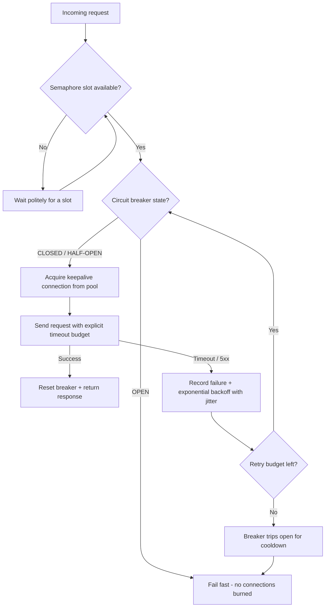

| Difficulty | Channel | Tags |
|---|---|---|
| advanced | backend | asyncio, aiohttp, concurrency |

Every day, more than 1 billion requests land on Netflix's API and fan out into several billion downstream calls — a 1:6 cascade — across dozens of services, peaking above 100,000 dependency requests per second [1]. Yet a single flawed connection pool was all it took to topple the entire API, which is how Netflix learned one of the messiest lessons in distributed systems [1]. The fix they engineered holds a hard truth for every backend developer: your connection pool is only as resilient as the story you tell it about failure. This article walks you through telling that story for aiohttp — a pool that degrades gracefully instead of collapsing.

---

> ### Real-World Case — Netflix
>
> Netflix's API receives more than 1 billion incoming calls per day, fanning out to several billion outgoing calls (a 1:6 ratio) across dozens of dependency subsystems, peaking at over 100k dependency requests per second across thousands of EC2 instances. They had a series of real production incidents where a single dependency's connection or thread pool saturated, sparking cascading failures that took down the entire API. The math was brutal: 30 dependencies each at 99.99% uptime multiplied out to only ~99.7% combined uptime — over 2 hours of downtime per month.
>
> | | |
> |---|---|
> | **Challenge** | Prevent one slow or failing downstream dependency (the 'latent connection' failure mode) from exhausting connection pools, saturating all Tomcat request threads within seconds, and cascading into an outage of the whole API. They needed a way to limit concurrent connections to each dependency and gracefully degrade the user experience when timeouts and errors occurred. |
> | **Solution** | Netflix built Hystrix / their DependencyCommand using exactly the stack in this answer: per-dependency bulkhead isolation with separate thread pools AND semaphore isolation (via tryAcquire, not blocking) to cap concurrent connections to any single service; hard network timeouts plus retries; and a circuit breaker that trips around a 50% error rate in a 10-second rolling window, then enters HALF-OPEN health-check probing before closing. When a circuit trips or a pool rejects, requests fail fast or return graceful fallbacks (stale cache, fail-silent) instead of piling up on hung connections — the same role a semaphore + circuit-breaker connection pool manager plays in asyncio/aiohttp. |
> | **Outcome** | The Netflix API sustained its 1+ billion incoming calls per day (several billion outgoing, 100k+ dependency RPS at peak) without cascading outages from single dependency failures. The Hystrix Operations wiki reports over 100+ command types, 40+ thread pools, and 10+ billion thread-isolated plus 200+ billion semaphore-isolated command executions per day. During latency incidents, fallbacks kept users on a degraded-but-working experience with no spike in 500s, and the 90th-percentile cost of the thread isolation overhead was just ~3ms. The liberty config (network timeouts + retries) let median calls finish within a 300ms budget even when a dependency hit the 99.5th percentile under retries. |
> | **Lesson** | In a high-load cascade, the counterintuitive move is to ADD capacity — Netflix learned that enlarging pool sizes, timeouts, and semaphores during an outage is 'DDOSing yourself': 100 servers x 10 connections saturated against a struggling backend just becomes 2000 connections held open when you raise the limit to 20. Size pools as a small percentage of total resources, let the circuit breaker 'release the pressure' by shedding load and fail-fast so the unhealthy dependency can recover, and if a correctly-configured circuit is rejecting, fix the root cause instead of reconfiguring it. |

---

## Hook — The 3 a.m. Page Nobody Asked For

Picture this: it is 3 a.m. and the pager lights up like a holiday tree. A single dependency — some small service nobody worried about — started answering slowly. Nothing exotic, just a database that caught a chill. Yet by the time anyone glances at the dashboard, your API's error rate has gone vertical, sockets are exhausted, and every new request queues behind a graveyard of half-dead connections. Sound familiar? If you have watched an entire API drown because one connection pool saturated, you already know this article's plot. If you have not, consider yourself lucky — because your system is exactly one slow dependency away from starring in that playbook.

## Problem — When a Firehose Becomes a Noose

At the heart of the disaster is a deceptively simple question: what happens when the thing you call is slow? Most codebases treat their HTTP client like a firehose — every request grabs a fresh connection, hammers the network, and hopes for the best. Under normal load that works. Under stress, it is how cascades begin. Every connection you hold while waiting on a sluggish downstream hostage takes a socket and a slice of memory with it [8]. When enough requests pile up, your process exhausts file descriptors, your listeners stop accepting, and healthy dependencies get caught in the collateral damage. The painful truth: you do not need a low-uptime dependency to take you down — a well-connected service with a slow p99 does the job just fine [3]. This is precisely why naive configs, like bare aiohttp.ClientSession() calls with default timeouts, are ticking time bombs in production. The real question is not whether a dependency will fail, but what your code does the moment it does.

## Real-World Case — Netflix

Netflix ran the math and the answer was not pretty. Their API sustained over 1 billion incoming calls per day, fanning out at a 1:6 ratio — several billion outbound calls — across dozens of dependency subsystems, peaking at over 100,000 dependency requests per second across thousands of EC2 instances [1]. With 30 dependencies each guaranteeing 99.99% uptime, the combined number collapses to roughly 99.7% — more than two hours of downtime every single month [1]. A single dependency's connection or thread pool could saturate, and the resulting cascading failures would drag the entire API down with it. The fix was architectural: isolate every dependency behind its own thread pool, wrap each one in a circuit breaker, and let the system fail gracefully instead of catastrophically [1]. The numbers afterwards speak for themselves — over 40 thread pools, 100+ command types, and 10+ billion thread-isolated executions per day, with the 90th-percentile overhead of isolation costing roughly 3ms, and fallbacks keeping users on a degraded-but-working experience during latency incidents with no spike in 500s [1]. Tattoo that insight somewhere visible: resilience is not about preventing failure — it is about containing it.

## Deep Dive — Semaphores, Circuit Breakers, and the Retry Paradox

Building on Netflix's isolation playbook, translating that machinery to a single aiohttp process means composing a few battle-tested primitives. The first is a semaphore — asyncio's built-in gatekeeper that caps how many requests can be in flight at once [2]. Think of it as a bouncer: when the venue is full, newcomers wait politely instead of shoving through the window. It directly prevents the socket-exhaustion spiral described earlier. Next comes the circuit breaker — the pattern Netflix popularized [4]. Instead of hammering a failing service with requests you already suspect will fail (or worse, time out slowly), the breaker trips open after a threshold of failures, and subsequent calls fail fast or route to a fallback [4]. Many developers discover that the timeout is the real enemy: an open-circuit failure is instant and cheap, while a slow timeout ties up a connection for the full budget. Then stack exponential backoff on top — retry with doubled delays plus a dash of jitter so a retry wave does not orchestrate its own thundering herd [5][6]. And finally, connection health: reuse one long-lived session with keepalive instead of rebuilding TCP handshakes for every call [3][7]. Here is the plot twist: retries and circuit breakers are natural enemies. Layered naively — infinite retries downstream of a hot circuit — retry storms can keep a breaker trip-wired forever [5]. The winning combination is a bounded retry budget, randomized jitter, and a tolerant breaker that lets a single probe through in a half-open state [4].

## Workflow — The Seven-Step Pipeline to Graceful Degradation

With the theory settled, the workflow is a loop. Each request flows through the pool as a pipeline: semaphore gate to circuit breaker check, then out over a pooled connection, with bookkeeping on the way back. When a call fails, the breaker forgives the first few slips, counts the rest, and eventually trips open — while backoff quietly buys the downstream service time to recover. Concretely, the journey looks like this. Step one: acquire a semaphore slot, which enforces the global concurrency cap. Step two: ask the circuit breaker for permission — if the circuit is open, fail fast rather than burn another connection. Step three: issue the request on a reused keepalive connection under an explicit timeout budget. Step four: on success, reset the breaker and return the response. Step five: on timeout or error status, record the failure and schedule a retry with exponential backoff plus jitter. Step six: when failures cross the threshold, the breaker trips open and traffic shifts to fail-fast or fallback. Step seven: after the cooldown, a single half-open probe tests the waters and either closes the circuit for good or reopens it for another rest. The mermaid diagram below is the visual story of that pipeline.

## Code Example — Building the Pool Manager in Python

Below is a production-flavored implementation that fuses every piece of the journey so far: a semaphore that caps concurrency, a circuit breaker that knows when to stop trying, jittered exponential backoff that keeps retry waves honest, and a long-lived session that never leaks sockets on shutdown [8][9]. The code is written to be dropped into an async service and used via async with, so the pool's lifecycle is as clean as the connections it manages.

## Lessons Learned — Battle Scars, Best Practices, and Next Steps

If this journey taught Netflix anything, it is that the mistrust of a single dependency is the most valuable investment a platform can make [1]. Here is what to keep after reading: cap everything — without a semaphore, concurrency is a roulette wheel, not a plan [2]. Make timeouts explicit — a missing timeout is not a configuration gap, it is a connection leak wearing a costume [3]. Let the breaker be ruthless — a fail-fast that returns in milliseconds beats a timeout that takes thirty seconds [4]. Give backoff a personality — jitter is not optional polish; it is what separates a graceful recovery from a self-inflicted denial-of-service [5][6]. And never skip shutdown hygiene — a dangling session pins TCP connections and quietly poisons the next deploy [8][9]. Common battle scars to avoid: treating aiohttp exception types as interchangeable (TimeoutError and ClientError need different handling), ignoring SSL context on pooled connectors, and — the classic — setting retries to infinity, which converts a small blip into a permanent outage. If this feels like a lot, you are not alone: resilience is built one boring, well-typed layer at a time.

---

## Graceful Degradation Flow

<strong>Original Interview Question</strong>

**Q:** How would you implement a connection pool manager for aiohttp that handles graceful degradation under high load and connection timeouts?

**A:** Implement a connection pool manager for aiohttp using a semaphore to limit concurrent connections, exponential backoff for retrying failed requests, and circuit breaker pattern to gracefully degrade under high load and connection timeouts.

## Conclusion

Netflix's lesson was never about fancy infrastructure — it was about containing failure before it becomes a cascade [1]. The same math that turned thirty 99.99% dependencies into more than two hours of monthly downtime runs inside your own API, one semaphore and one circuit breaker at a time. So tomorrow, do one thing: pull your HTTP client out of the default-timeout zone, cap your concurrent connections, and give every retry a budget and a dash of jitter. Resilience is not a feature you bolt on during the incident — it is a habit you bake in during the calm. Give your connections a story about failure, and your users will never have to read the horror version of it.

---

## References

1. [Netflix incident report](http://benjchristensen.com/2012/03/01/fault-tolerance-in-a-high-volume-distributed-system/) — article
2. [Python asyncio — Synchronization Primitives](https://docs.python.org/3/library/asyncio-sync.html) — documentation
3. [aiohttp ClientSession documentation](https://docs.aiohttp.org/en/stable/) — documentation
4. [Circuit breaker design pattern](https://en.wikipedia.org/wiki/Circuit_breaker_design_pattern) — documentation
5. [AWS — Error retries and exponential backoff](https://docs.aws.amazon.com/general/latest/gr/api-retries.html) — documentation
6. [Exponential backoff](https://en.wikipedia.org/wiki/Exponential_backoff) — documentation
7. [RFC 9110 — HTTP Semantics](https://datatracker.ietf.org/doc/html/rfc9110) — documentation
8. [Python asyncio documentation](https://docs.python.org/3/library/asyncio.html) — documentation
9. [Python contextlib — asynccontextmanager](https://docs.python.org/3/library/contextlib.html) — documentation

---

**Author:** Satishkumar Dhule — [GitHub](https://github.com/satishkumar-dhule) · [LinkedIn](https://linkedin.com/in/satishkumar-dhule) · [Website](https://satishkumar-dhule.github.io)
