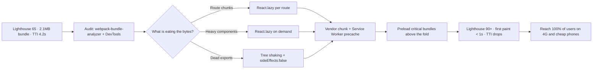

| Difficulty | Channel | Tags |
|---|---|---|
| intermediate | frontend | lighthouse, bundle, lazy-loading |

A 2.1MB JavaScript bundle, a 4.2-second Time to Interactive, and a Lighthouse score pinned at 65 — this is the quiet crisis hiding behind many 'finished' React apps. Tinder faced a sharper version of it in 2017, when reaching users in data-scarce markets like Indonesia and Brazil meant the native app simply wouldn't fit on the phones or the plans they carried. So the team shipped Tinder Online, a React + Redux progressive web app, and discovered that losing 65KB from a bundle and preloading the right chunks bought them a full extra second of user patience, a 15% drop in bounce rate, and 30% more click-throughs [1]. Their journey from slow to snappy is exactly the playbook this article walks you through — from bundle audit to first paint.

---

> ### Real-World Case — Tinder
>
> Tinder, a mobile-native dating app, wanted to reach 100% of users including those in data-scarce markets like Indonesia and Brazil, where installing the heavy native app was impractical. In 2017-18 they built "Tinder Online," a React + Redux progressive web app, and needed it to feel fast enough to preserve the core swiping experience on cheap phones and slow 4G connections.
>
> | | |
> |---|---|
> | **Challenge** | Tinder had large, monolithic JavaScript bundles that delayed boot-up of the core swiping experience. They needed to cut time-to-interactive dramatically and keep total resources tiny (around 3MB total web app footprint) while preserving a native-like UX, since the web app had to compete with a highly-polished native client users were already trained on. |
> | **Solution** | Tinder implemented route-based code splitting using React Router + React Loadable with dynamic import() and webpack magic comments, vendor chunking via CommonsChunkPlugin, and long-term caching with [chunkhash] plus a split-out webpack manifest. They used webpack-bundle-analyzer to find excess (replacing localForage with direct IndexedDB, trimming polyfills), added link preload/prefetch of critical bundles, introduced hard performance budgets (~155KB gzipped main+vendor, ~55KB async chunks, 20KB CSS) enforced in CI, precached route chunks with a Workbox service worker, and deferred non-critical work to requestIdleCallback. |
> | **Outcome** | After route-based code splitting the main bundle dropped from 166KB to 101KB and DOMContentLoaded improved from 5.46s to 4.69s. Preloading critical bundles cut load time by ~1s and first paint from ~1000ms to ~500ms. The app reached interactive in under 5 seconds on a Galaxy S7 on 4G (WebPageTest/Lighthouse), delivered the core experience at just ~10% of the native app's data cost, cut bounce rate by 15%, and lifted click-through rates by 30%. Scope hoisting alone shaved 8% off vendor parsing time and React 16 cut the vendor chunk ~7%. |
> | **Lesson** | Splitting routes and setting enforced performance budgets beats heroic one-off optimization; the biggest wins come from shipping less code on the critical path (analyze with webpack-bundle-analyzer, split by route, lazy-load the rest), and a web app that's fast and cheap on data can out-engage a native app in emerging markets — the plot twist being a native-first giant betting its growth on a PWA at 1/10th the data cost. |

---

## Hook — A Swipe Should Not Feel Like a Loading Screen

Picture this: somewhere in Jakarta, a person with a $150 phone and one bar of 4G is seconds away from abandoning your app — not because they dislike it, but because it refuses to finish loading. Sound dramatic? It is the difference between a 4.2-second Time to Interactive and a 1.9-second one. Every extra millisecond on the critical path quietly nudges people back to the app store, and here is the cruel part: a slow load fails silently. There is no error toast, no bug report, no stack trace. Users just blame your product and never come back. For Tinder, that silence was existential — the entire company strategy hinged on winning users whose devices and connections could not afford a heavyweight native install. Performance, for them, was not a nice-to-have sprint planned for Q4; it was the first impression, the activation funnel, and the retention strategy rolled into one.

## Problem — Your Bundle Isn't Too Big. It's Too Lazy.

Here is the uncomfortable truth: that 2.1MB bundle you ship did not get there by accident. Every import was justified at the time — the chart library for one dashboard, the icon set used in a single screen, the polyfills for a browser version nobody carries anymore. Individually, each one seemed harmless. Collectively, they form a monolith where the browser downloads, parses, compiles, and executes everything before rendering anything. And that is the plot twist most developers miss: download size is only half the story. JavaScript is the most expensive resource on the web because execution blocks the main thread, which directly inflates Time to Interactive [6]. In practice, most bundles spend 80% of their bytes on features users never touch during the first screen — tables below the fold, modals behind a click, analytics charts that render ten seconds after paint. The bundle isn't overweight; it is lazy in the wrong sense. It insists on loading everything eagerly and nothing on demand. The fix is to make the bundle genuinely lazy — the entire premise of what you are about to build.

## Real-World Case — Tinder

In 2017, Tinder set an audacious goal: reach 100% of potential users, including millions in data-scarce markets where installing a native app was impractical and expensive. The answer was Tinder Online, a React + Redux progressive web app built to preserve the swiping experience on cheap phones over slow 4G [1]. What happened next is a masterclass in systematic optimization. After route-based code splitting, the main bundle dropped from 166KB to 101KB and DOMContentLoaded improved from 5.46s to 4.69s. Preloading critical bundles then cut load time by roughly a full second and dropped first paint from ~1000ms to ~500ms. The app became interactive in under five seconds on a Galaxy S7 over 4G, delivering the core experience at just ~10% of the native app's data cost. The business impact followed the metrics: a 15% cut in bounce rate and a 30% lift in click-through rates [1]. Digging deeper, scope hoisting alone shaved 8% off vendor-side parsing time, and upgrading to React 16 trimmed the vendor chunk by another ~7%. The lesson here is worth repeating: none of these wins came from a single heroic rewrite — they came from measuring, splitting, preloading, and repeating, one bundle at a time.

## Deep Dive — Code Splitting, Tree Shaking, and the Art of Almost Loading

Building on Tinder's results, the natural question becomes: where exactly do your 2.1MB live, and how do you cut them without breaking everything? Start with the two dominant levers: code splitting and tree shaking. Code splitting is the practice of breaking your bundle into smaller chunks that load on demand, using React.lazy() to defer loading until a component actually renders [2] and dynamic import() as the underlying mechanism [3]. You have two main strategies, and choosing wrong costs you weeks:

## Workflow — The Six-Step Bundle Diet

This leads to a repeatable process you can run on any React codebase, and it mirrors the sequence Tinder executed. Step one: measure before you touch anything — capture a Lighthouse baseline and point webpack-bundle-analyzer at your build to see every chunk, every dependency, every surprise [4]. Step two: rank the offenders, because not all megabytes are created equal. Step three: split by route first — it gives the biggest win for the least architectural risk. Step four: split heavy components next, isolating charts, editors, and modals behind lazy boundaries. Step five: enable tree shaking properly — confirm your bundler is using ES modules and that heavy libraries declare `sideEffects: false` [10]. Step six: add the caching layer, precaching critical routes with a Service Worker and enforcing a hard budget so the bundle never quietly regrows [7]. The diagram below maps the entire pipeline, from the ugly 65-score baseline to the transformed fast-first-load state.

## Code Example — Lazy Loading in the Wild

Now for the part you came to see — the actual implementation. The code below shows production-grade route and component splitting with React.lazy() and Suspense. Three details are easy to miss: every lazy route sits inside a single Suspense boundary so the fallback appears while any chunk downloads [2]; heavy components are split at use sites, not imports; and named exports need a mental one-liner because React.lazy() expects a module with a default export [2]. Many developers think lazy loading is just 'add React.lazy everywhere' — the nuance is where you draw the boundaries and how you handle failure gracefully. Study the pattern, then steal it.

## Lessons Learned — Battle Scars From the Frontend Trenches

After the measuring, the splitting, and the preloading, a few hard-won lessons remain that no article about Lighthouse scores will tell you. First: lazy-loaded chunks can fail at runtime, and without an error boundary you ship a permanent blank screen to real users — always wrap lazy boundaries in error handling that retries or falls back. Second: over-splitting is a real disease. Too many tiny chunks turn a fast load into a waterfall of HTTP requests that feels slower than the original monolith, so preload the critical bundles rather than micro-optimizing everything [3]. Third: tree shaking looks like it works until a dependency ships CommonJS, and you only notice at review time when the bundle is mysteriously 300KB heavier again [10]. Finally, measure everything twice — Tinder's 5.46s to 4.69s DOMContentLoaded win and the 8% parsing-time shave from scope hoisting only look impressive because the team recorded them before and after [1]. Performance work without a before/after baseline is just hopeful guessing. The memorable insight to take back to your team: performance is not a build step — it is a product decision. If the first paint arrives after the user's patience, the user has already made a decision about your product.

---

## Bundle Optimization Pipeline

<strong>Original Interview Question</strong>

**Q:** You're tasked with improving a React app's Lighthouse performance score from 65 to 90+. The bundle size is 2.1MB and Time to Interactive is 4.2s. What specific steps would you take to optimize the bundle and implement lazy loading?

**A:** Implement code splitting with React.lazy() and Suspense, analyze bundle composition with webpack-bundle-analyzer to identify largest chunks, remove unused dependencies and optimize imports, add dynamic imports for heavy components and third-party libraries, implement route-based splitting for better initial load times, and utilize tree shaking with proper ES module configuration.

## Conclusion

Tinder's story proves a simple truth: performance is not a rewrite-everything event — it is a sequence of measured, boring, repeatable steps. Start tomorrow by capturing your baseline Lighthouse number, running webpack-bundle-analyzer, and splitting the biggest route. Then split the heaviest component, flip on tree shaking, and enforce a bundle budget in CI so your 90+ score is something you earn, not something you chase. Users in Jakarta, São Paulo, and everywhere else will never tell you it was the 65KB they saved — they will just swipe.

---

## References

1. [Tinder incident report](https://medium.com/@addyosmani/a-tinder-progressive-web-app-performance-case-study-78919d98ece0) — article
2. [React.lazy reference](https://react.dev/reference/react/lazy) — documentation
3. [Dynamic import() operator — MDN](https://developer.mozilla.org/en-US/docs/Web/JavaScript/Reference/Operators/import) — documentation
4. [webpack-bundle-analyzer](https://github.com/webpack-contrib/webpack-bundle-analyzer) — documentation
5. [Tree shaking — MDN Glossary](https://developer.mozilla.org/en-US/docs/Glossary/Tree_shaking) — documentation
6. [Code Splitting — webpack guides](https://webpack.js.org/guides/code-splitting/) — documentation
7. [Service Worker API — MDN](https://developer.mozilla.org/en-US/docs/Web/API/Service_Worker_API) — documentation
8. [Intersection Observer API — MDN](https://developer.mozilla.org/en-US/docs/Web/API/Intersection_Observer_API) — documentation
9. [Progressive web apps — MDN](https://developer.mozilla.org/en-US/docs/Web/Progressive_web_apps) — documentation
10. [Tree Shaking — webpack guides](https://webpack.js.org/guides/tree-shaking/) — documentation

---

**Author:** Satishkumar Dhule — [GitHub](https://github.com/satishkumar-dhule) · [LinkedIn](https://linkedin.com/in/satishkumar-dhule) · [Website](https://satishkumar-dhule.github.io)
