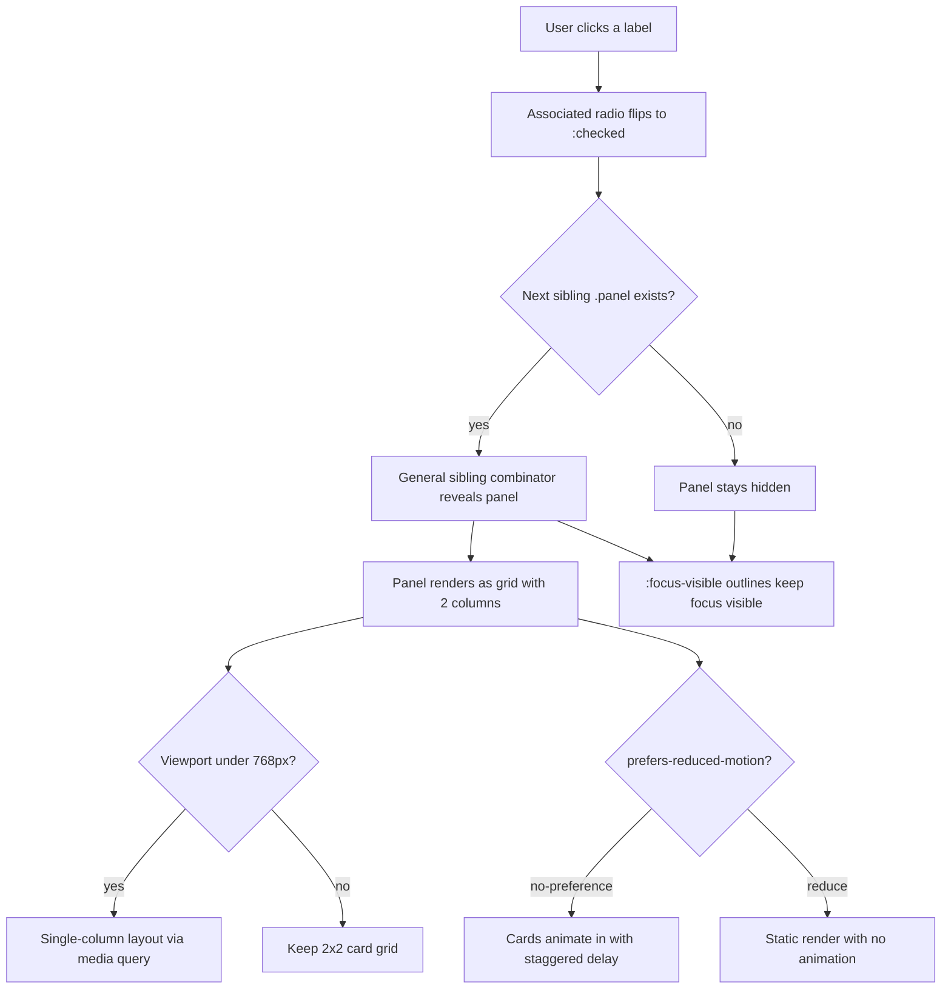

| Difficulty | Channel | Tags |
|---|---|---|
| beginner | frontend | css, flexbox, grid, animations |

In 2011, CSS-Tricks published 'Functional CSS Tabs Revisited,' a tutorial that quietly became one of the most copied CSS patterns on the internet [1]. Two decades later, its hidden-radio trick still powers tab panels on platforms where JavaScript never runs, from marketplace listings to classified ads pages. But somewhere in that article's comment section, the pattern's own accessibility claim came tumbling down: hiding radios from the keyboard is not the same as building accessible tabs [1]. This is the story of a brilliant hack, the invisible cost it carried, and how to ship the same pattern without repeating its mistakes.

---

> ### Real-World Case — CSS-Tricks (DigitalOcean)
>
> In 2011 CSS-Tricks published 'Functional CSS Tabs Revisited,' which became the canonical implementation of the CSS-only tab panel: hidden radio inputs sharing one `name`, clickable ``s, and `:checked` + sibling combinators to reveal panels with zero JavaScript. It was copied across the web for two decades (Stack Overflow answers point directly to it, and the 'You Might Not Need JavaScript' site lists it), so sites built on constrained platforms like eBay listings — which strip all JavaScript — adopted it for shipping tabs.
>
> | | |
> |---|---|
> | **Challenge** | Build a clickable tabbed interface with no page refresh and no JavaScript, without the back-button hijacking and page-jump of the `:target` approach — while remaining keyboard-accessible, since a no-JS pattern is often chosen specifically to protect usability on locked-down or low-end environments. |
> | **Solution** | Each tab is a wrapper containing a hidden radio input, a styled label, and a content panel. Radios are 'hidden' and when one is `:checked`, the adjacent-sibling selectors raise the matching label and panel above the stack (`:checked ~ label`, `:checked ~ label ~ .content`), switching panels purely with CSS. The original used `display: none` on the radios; later revisions (the 2015 'Re-Revisited' and community forks) switched to clip/position-based hiding to keep the radio in the keyboard tab order and added focus styling. |
> | **Outcome** | The pattern became the most widely reused CSS-only tab implementation on the web, but the article's own claim that it was 'accessible' collapsed in its comment section: hiding the radios with `display: none` also removes them from the keyboard focus order, so arrow-key navigation silently broke and focus outlines vanished — and community responders confirmed a fully spec-compliant tab widget (roving `tabindex`, arrow-key handling, `aria-selected`) cannot be achieved without JS, which is why real products like GitHub's Primer ship JS-backed ARIA tabs instead. |
> | **Lesson** | 'CSS-only' is not a synonym for 'accessible.' The state-carrying element must stay focusable: never `display: none` the radio (clip/position it instead), because `:focus-visible` styling is meaningless if the input can't receive focus. If you ship a radio-hack tab, you must also handle keyboard focus, `prefers-reduced-motion`, and visible focus indicators — or accept that full tab semantics still need a few lines of JavaScript. |

---

## Hook — Ever wondered why browser tabs survive a refresh but UI tabs vanish the moment JS fails?

Ever wondered why your browser tabs survive a page refresh while your design-system tabs disappear the second a JavaScript bundle fails? Here is the thing: some platforms strip JavaScript completely — think marketplace listings, classified ad pages, and HTML rendered inside emails. Yet those same platforms still need tabbed content, a tidy 2x2 card grid on desktop, and a mobile layout that refuses to collapse [2]. The solution has existed since 2011, and it leans on a form control so old it predates flexbox itself: the humble radio input [2]. Two decades of copy-paste later, that pattern is everywhere. But it carries a hidden cost that almost nobody who forked it ever noticed — and finding that cost changes the way you look at every clever CSS pattern from now on.

## Problem — The brief sounds reasonable. The constraints are not.

At first glance, the brief is unremarkable: build a tab panel for a design-system docs page with zero JavaScript. Use radio inputs to switch tabs. On desktop, render a 2x2 grid of cards under each tab; on mobile, a single column. Every card gets a fixed 16:9 image area via aspect-ratio, a title, and one short meta line. Add a subtle staggered entrance animation. Respect prefers-reduced-motion. And whatever you do, keep focus-visible outlines so keyboard users always know where they stand [5]. None of that sounds scary. Here is the moment it stops being easy: the instant you rely on :checked and sibling combinators to toggle panels [3], you have already made a quiet decision about keyboard navigation, focus management, and screen-reader experience. The efficiency you buy to survive a JS-free platform comes with an accessibility bill, and someone has to pay it. The real challenge is not building the tabs — the real challenge is knowing exactly which trade-off you are signing when you do.

## Real-World Case — CSS-Tricks (DigitalOcean)

Building on that tension, follow the pattern to its birthplace. In 2011, CSS-Tricks published 'Functional CSS Tabs Revisited,' which became the canonical implementation of the CSS-only tab panel: hidden radio inputs sharing one name attribute, clickable labels, and :checked plus sibling combinators to reveal panels with zero JavaScript [1]. The pattern spread like a meme. Stack Overflow answers pointed straight at it, the 'You Might Not Need JavaScript' site listed it as proof that tabs were pure CSS territory [11], and constrained platforms like eBay listings — which strip all JavaScript — adopted it to ship tabs at all [1]. But then the plot twisted. The article's own claim that the technique was 'accessible' collapsed in its comment section. Hiding the radios with display: none also removes them from the keyboard focus order, so arrow-key navigation silently broke and focus outlines vanished [1]. Community responders confirmed the uncomfortable truth: a fully spec-compliant tab widget — roving tabindex, arrow-key handling, aria-selected — cannot be built with CSS alone [7][8]. That is exactly why real products like GitHub's Primer ship JavaScript-backed ARIA tabs today instead of the pure-CSS classic [10]. The most famous zero-JS pattern on the web now carries an asterisk next to its name.

## Deep Dive — What the pattern does, what it silently gambles, and where the hardware ends

So how does the trick actually work under the hood? Radio inputs sharing one name attribute form a native radio group: checking one automatically unchecks the others, with absolutely no JavaScript [2]. The matching label elements give you free click targets, and the :checked pseudo-class lets CSS observe the current state of the group [2]. A general sibling combinator (`~`) then displays the panel that follows a checked radio and hides the ones that do not [3]. Consequently, the entire interactive model reduces to three primitives your browser already owns: form state, label association, and selector matching. The layout layer builds on top of that. Each panel is a Grid container with repeat(2, 1fr) producing the 2x2 card arrangement, collapsing to a single column inside a max-width 768px media query for mobile. The image area reserves its space up front with aspect-ratio: 16 / 9, which prevents the cards from jumping around as images load [4]. Entrance animations and focus styles then wrap the whole thing: staggered delays on each card, gated behind a prefers-reduced-motion: no-preference media query [6], with explicit :focus-visible outlines as the keyboard safety net [5]. Here is the trade-off table most tutorials skip — the raw comparison that decides who can use the widget:

| Capability | CSS-only radios | ARIA tabs (APG) |
|---|---|---|
| JavaScript dependency | None — works anywhere | Required |
| Arrow-key navigation | Silently broken | Roving tabindex [7] |
| Screen-reader naming | Partial, generic | Full tab/tabpanel roles [8] |
| Works on JS-stripped platforms | Yes | No |
| Focus visibility | Depends on your :focus-visible | Built in [5] |

Specifically, on a truly JS-less platform like a listing template, ARIA tabs simply are not an option — the honest move is shipping the radio pattern as a *degraded but usable fallback*, clearly documented as such [7]. Where JavaScript is allowed, the CSS pattern becomes the styling foundation and JavaScript provides the accessibility layer. Many developers discover this distinction the hard way, only after a keyboard audit.

## Workflow — Seven steps from bare radio inputs to a production-respecting tab panel

Armed with the trade-off map, the build path becomes a checklist rather than a puzzle. Step one: structure the markup as radio inputs sharing one name, each paired with a label and a sibling panel section. Step two: wire visibility with the general sibling combinator so only the panel after the checked radio renders [3]. Step three: give each panel a Grid layout with repeat(2, 1fr) for the desktop 2x2 arrangement. Step four: add the mobile media query that flips the grid to a single column under 768px. Step five: reserve each card's image area with aspect-ratio: 16 / 9 so nothing shifts on load [4]. Step six: layer in the staggered entrance animation, wrapped in prefers-reduced-motion: no-preference so motion-sensitive users get a static render [6]. Step seven: decide your enhancement path — pure CSS fallback only, or CSS foundation plus a JavaScript accessibility layer [7]. The diagram below tells the visual story: everything branches from one radio flipping to :checked, and every branch ends at the accessibility layer where focus and motion decisions live.

## Code Example — The CSS-only skeleton plus the honesty layer that fixes what CSS cannot

The CSS-only skeleton is the easy half: radios, labels, and three selectors do all the state management [2][3]. The hard half — the part the 2011 comments exposed — is restoring the keyboard behavior CSS cannot provide on its own [1]. Here is a production-minded enhancement that treats JavaScript not as the feature, but as the accessibility repair kit:

```javascript
// Graceful enhancement: add ARIA keyboard support to CSS-only radio tabs
const tabGroup = document.querySelector('.tabs');
const radios = [...tabGroup.querySelectorAll('input[type="radio"]')];
const labels = radios.map(r => tabGroup.querySelector(`label[for="${r.id}"]`));

// Roving tabindex: only the selected tab stays in the tab order [7]
radios.forEach((radio, i) => {
  labels[i].setAttribute('tabindex', radio.checked ? '0' : '-1');
  labels[i].setAttribute('role', 'tab');
  if (radio.checked) labels[i].setAttribute('aria-selected', 'true');
});

// Arrow-key navigation mirrors native radio behavior with visible focus [8]
tabGroup.addEventListener('keydown', (e) => {
  if (!['ArrowLeft', 'ArrowRight'].includes(e.key)) return;
  const current = radios.findIndex(r => r.checked);
  const next = (current + (e.key === 'ArrowRight' ? 1 : radios.length - 1)) % radios.length;
  radios[next].checked = true; // CSS then swaps the panel with zero JS
  labels.forEach((l, i) => {
    l.setAttribute('tabindex', i === next ? '0' : '-1');
    if (i === next) l.setAttribute('aria-selected', 'true');
    else l.removeAttribute('aria-selected');
  });
  labels[next].focus();
  e.preventDefault();
});
```

The script opens by collecting every radio input inside the tab group and mapping each to its partner label — the same inputs the CSS already watches. It then applies the roving tabindex pattern from the ARIA Authoring Practices Guide: one element keeps tabindex 0, all the others move to -1, so a single Tab press enters the group and the arrows do the rest [7]. The keydown listener catches ArrowLeft and ArrowRight, computes the next index with a wraparound modulus, and flips the corresponding radio's checked property. Crucially, flipping the radio is all the CSS needs — the general sibling combinator re-renders the panels instantly, so JavaScript never owns the visibility logic [3]. It only owns the focus contract: keeping aria-selected accurate, moving the outline to the active label, and preventing the default scroll behavior that would otherwise fire on every keypress. That division of labor — CSS for rendering, JavaScript for accessibility — is the reason real-world libraries ship ARIA tabs backed by scripts instead of betting the widget on selectors alone [10].

## Lessons Learned — What the two-decade-old pattern finally taught the internet

After the full journey, the takeaways land like a checklist you wish you had before the first pixel:

- A pattern's fame is not proof of its correctness. The CSS-Tricks trick was simultaneously the most reused tab implementation on the web and a silent keyboard trap [1]. Brilliant and broken can share the same file.
- Zero JavaScript on the page is not the same as accessible on the page. Accessibility is a contract with your users that no bundler-size win cancels out [7].
- Use :checked plus sibling combinators for genuine toggle UIs [2][3] — but audit the keyboard path before you claim it works, because default browser behavior will not save you.
- Write :focus-visible outlines explicitly. Resets and framework base styles strip default focus rings all the time, and the first casualty is keyboard users [5].
- Gate every single animation behind prefers-reduced-motion: no-preference. Vestibular sensitivity is a real user condition, and a staggered entrance is the exact pattern that makes it worse [6].
- Choose your mode per platform: on JS-stripped platforms, ship the radio pattern loudly labeled as a fallback; where JavaScript is allowed, add the ARIA layer and the roving tabindex [7][8].
- Reserve image space with aspect-ratio: 16 / 9 to kill layout shift before it happens; your Lighthouse scores will thank you [4].
- Test like a user who cannot see the screen: keyboard-only session, screen reader session, and prefers-reduced-motion forced on — each one surfaces a different failure [6].

If this feels overwhelming, you are not alone. The entire internet shipped the radio trick for a decade before the comment section caught up with the worst of its side effects [1]. The remedy is not abandoning clever CSS — it is wrapping every clever pattern in an honest accessibility review.

---

## CSS-Only Tab Flow



<details>
<summary><strong>Original Interview Question</strong></summary>

**Q:** Build a CSS-only tab panel for a design-system docs page. Use radio inputs to switch tabs (no JavaScript). Desktop: a 2x2 grid of cards under each tab; mobile: single column. Each card has a fixed 16:9 image area, a title, and a short meta line. Add a subtle entrance animation with a stagger and keep focus-visible outlines; ensure prefers-reduced-motion is respected?

**A:** Use a set of radio inputs with a shared `name` attribute and corresponding `` elements for each tab section. The `:checked` state of each radio controls visibility of its associated panel via adjacent sibling selectors. Each panel renders a 2×2 card grid on desktop and collapses to a single column on mobile. Cards use `aspect-ratio: 16/9` for fixed image containers, with a title and meta line below.

</details>

## Conclusion

The radio-input trick will keep shipping on JS-stripped platforms for another decade — and it should, as long as every developer treats it as a documented fallback, not a finished destination [1]. The lesson from CSS-Tricks is that the cleverest pattern in your codebase deserves the hardest questions: what does it do to the keyboard, what does it do to a screen reader, and what does it do to a user who gets dizzy from an entrance animation [6]? Tomorrow, when you reach for that zero-JS trick — and you will, because it is genuinely elegant — add one honest line to your style guide: CSS-only tabs are a graceful fallback, and where JavaScript is available, accessibility is a requirement, not an optional enhancement [7]. The web got two decades of free tabs out of this hack. Getting the next two decades right just requires asking the question the original article's comment section did.

---

## References

1. [CSS-Tricks (DigitalOcean) incident report](https://css-tricks.com/functional-css-tabs-revisited/) — blog
2. [CSS :checked pseudo-class — MDN](https://developer.mozilla.org/en-US/docs/Web/CSS/:checked) — documentation
3. [CSS Subsequent-sibling combinator — MDN](https://developer.mozilla.org/en-US/docs/Web/CSS/Subsequent-sibling_combinator) — documentation
4. [CSS aspect-ratio property — MDN](https://developer.mozilla.org/en-US/docs/Web/CSS/aspect-ratio) — documentation
5. [CSS :focus-visible pseudo-class — MDN](https://developer.mozilla.org/en-US/docs/Web/CSS/:focus-visible) — documentation
6. [prefers-reduced-motion media query — MDN](https://developer.mozilla.org/en-US/docs/Web/CSS/@media/prefers-reduced-motion) — documentation
7. [ARIA Authoring Practices Guide — Tabs pattern](https://www.w3.org/WAI/ARIA/apg/patterns/tabs/) — documentation
8. [ARIA tab role — MDN](https://developer.mozilla.org/en-US/docs/Web/Accessibility/ARIA/Roles/tab_role) — documentation
9. [Cascading Style Sheets — Wikipedia](https://en.wikipedia.org/wiki/CSS) — documentation
10. [GitHub Primer (react) — component library with ARIA-backed tabs](https://github.com/primer/react) — documentation
11. [You Might Not Need JavaScript — CSS-only tabs listing](https://youmightnotneedjs.com/) — blog

---

**Author:** Satishkumar Dhule — [GitHub](https://github.com/satishkumar-dhule) · [LinkedIn](https://linkedin.com/in/satishkumar-dhule) · [Website](https://satishkumar-dhule.github.io)
