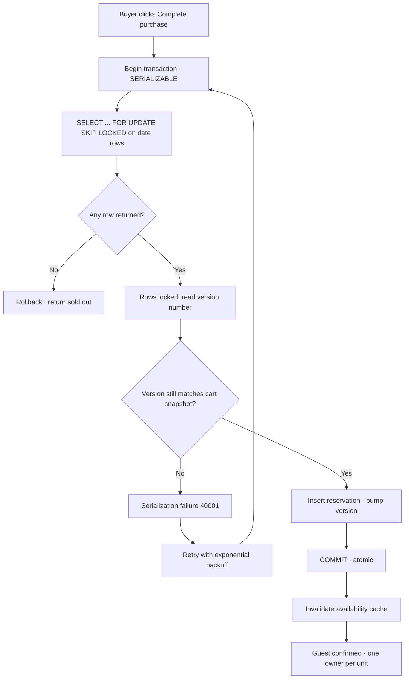

| Difficulty | Channel | Tags |
|---|---|---|
| intermediate | database | acid, isolation-levels, mvcc |

In the same millisecond three buyers click 'Complete purchase' on the last unit of a best-selling sneaker, someone has to lose. For Shopify — which powers 14% of U.S. ecommerce and hit a record $5.1 million in sales per minute at its Black Friday 2025 peak — that race unfolds thousands of times a second [1]. Get it wrong one way and two people own the same sneaker: order cancellations, apology emails, refunds. Get it wrong the other way and the merchant quietly loses a sale it should have made. This is the hidden battlefield where transaction isolation, MVCC, and row-level locks decide everything — and it is the exact problem you will face the day a booking system you build meets two guests who both desperately want the same property.

---

> ### Real-World Case — Shopify
>
> When a buyer clicks 'Complete purchase', Shopify must guarantee the item is still available. Get it wrong one way and two buyers purchase the same last unit — forcing order cancellations, apology emails, and refunds. Get it wrong the other way and the merchant loses a sale. At Shopify's scale (14% of U.S. ecommerce, $5.1M in sales per minute at Black Friday 2025 peak, 11% YoY increase) either failure compounds fast.
>
> | | |
> |---|---|
> | **Challenge** | Prevent overselling (the ecommerce version of double-booking) under massive concurrent checkout traffic while keeping ACID guarantees between reservations and the inventory ledger. Their old Redis-based reservation system used DECR/INCR on a quantity key, but reserve and claim spanned two systems (Redis + MySQL) that couldn't be wrapped in one atomic step — allowing overselling (item sold but never deducted) or underselling (item deducted but still marked reserved). |
> | **Solution** | Moved reservations into MySQL alongside the inventory ledger. Instead of one row per item with a quantity column, they used one row per sellable unit in a bounded pool (capped at 1,000 rows per item/location) with SELECT ... FOR UPDATE SKIP LOCKED so concurrent transactions grab available rows without waiting on locked ones. Key tuning: a composite primary key (shop_id, inventory_item_id, inventory_group_id, id) cut two row locks per reservation to one; READ COMMITTED isolation avoided the gap/'supremum' locks that blocked pool replenishment; consistent lock ordering eliminated deadlocks; subsequent checkout-path cleanup removed 50% of reads and 33% of transactions on the primary database. |
> | **Outcome** | Hit their high-throughput targets during peak 2025 traffic — during high-volume flash sales, writer CPU stayed under 50% and reader CPU under 16% with headroom. Zero oversells and no lost reservations, validated first in 'shadow mode' (dual-writing to Redis and MySQL) before a gradual pod-by-pod cutover. |
> | **Lesson** | The real bottleneck wasn't row-lock contention or slow queries — it was connection-pool exhaustion in unrelated checkout code. After weeks optimizing locks, per-caller attribution (tagging SQL with /* conn_tag:checkout_completion */ and aggregating at the ProxySQL layer) revealed the truth. The plot twist: observe the full path before blaming the engine, and your existing database can often handle workloads you'd assume need Redis or Kafka. |

---

## Hook — Sold out to two guests at once

Picture your Airbnb-style checkout. A couple in Chicago is about to pay for that cabin in the mountains. Meanwhile, 600 miles away, another couple is staring at the exact same listing, finger hovering over the same button. Your database holds a single row that says the property is available for Friday night. Both transactions read that row. Both see 'available'. Both commit. Congratulations — you just sold the same cabin to two different families. Sound far-fetched? Every developer who has built an inventory, ticketing, or booking system recognizes this moment. The stakes are asymmetric: a double booking triggers refunds, customer service fires, and a trust hole in your platform; being too conservative triggers phantom unavailability that silently bleeds revenue. Either failure compounds quietly at scale, which is why the teams guarding these systems treat a single row of data like a vault door [1].

## Problem — The race you can't see

The naive implementation is a check-then-act: `SELECT` if the date is free, then `INSERT` a booking. Between those two statements, your whole world changes. Another transaction can slip in, book the same date, and commit before you do. This is the classic lost-update problem, and database isolation exists precisely to stop it [6]. Here is the uncomfortable truth many developers discover too late: default isolation levels do not protect you from double bookings. They stop dirty reads and half-visible writes, but phantom rows — the ones representing the exact night you're trying to reserve — can still appear between your reads. Meanwhile, raising isolation to SERIALIZABLE on every query tanks throughput and provokes deadlocks [3]. So the constraints pull in opposite directions: correctness demands you serialize conflicting writes, while availability demands you let thousands of buyers race through checkout simultaneously. The answer is not choosing one extreme, but choosing precisely *where* you serialize, and that is a smaller, sharper decision than most people expect [7].

## Real-World Case — Shopify's oversell protection

Nobody has stress-tested this problem quite like Shopify. The platform processed a record $5.1 million in sales per minute at Black Friday 2025 peak — an 11% increase over the prior year — and every one of those transactions touches inventory [1]. Their oversell protection system reserves items the moment payment starts and claims them once payment succeeds. For years that ran on Redis with a simple `DECR` on a quantity key. Redis handled concurrency fine, but here is the plot twist: reservations lived in Redis while the inventory ledger lived in MySQL, and those two systems could not be wrapped in a single atomic step. That split caused both overselling and underselling bugs — the exact two failure modes described above. Shopify's fix was counterintuitive: move reservations *back* into MySQL using `SKIP LOCKED` and a one-row-per-unit design, inspired by 37signals' database-backed job queue [1]. The hardest lesson, however, was that the real bottleneck was neither queries nor locks. It was connection usage in checkout code nobody had instrumented — cleanup removed 50% of reads and 33% of transactions from the primary, and during high-volume flash sales writer CPU stayed under 50% and reader CPU under 16% [1]. Zero oversells, validated first in shadow mode with dual-writes, then a gradual pod-by-pod cutover.

## Deep Dive — Isolation levels, MVCC, and the art of locking

Building on Shopify's story, the core toolkit breaks into three layered tools you pick based on the hotness of the data. First, MVCC is what lets thousands of buyers read availability simultaneously without blocking each other: instead of locking rows for reads, the database keeps multiple versions of each row, and each transaction reads a consistent snapshot [5]. Second, isolation levels decide how strong the guarantees around those snapshots are [2]. For critical booking operations, SERIALIZABLE ensures the concurrent transactions behave as if they ran one at a time — buyable proof that a double booking cannot commit [6]. Third, and most surgical, are row-level locks: `SELECT ... FOR UPDATE` takes an exclusive lock on exactly the rows you're about to change, and `SKIP LOCKED` tells the engine to skip already-locked rows and grab the next available one instead of waiting [8]. Here is the real tradeoff table most tutorials skip:

## Workflow — The booking transaction flow

Once the isolation level and locking strategy are chosen, the booking itself is a short, opinionated sequence — and the sequence is the design. Observe the diagram below, your double-booking defense in miniature: the transaction begins, locks the candidate date rows with `FOR UPDATE SKIP LOCKED`, and only then checks whether anything is truly available. If a row is genuinely left, an optimistic version check confirms nothing changed since the guest started, the reservation is inserted, and the commit makes it durable in one atomic step. Failures — serialization conflicts or deadlocks — loop back to the top through retry with exponential backoff, never corrupting state [10]. The order of these steps is not incidental: locking happens *before* validation, so two concurrent bookings cannot both pass the availability check, and the version bump guarantees a lost update is detected rather than silently applied [4].

## Workflow — the reserve/commit dance

Walking through the flow highlighted above, there are four beats worth memorizing. First, the transaction must wrap every step so a crash anywhere rolls back everything — atomicity is the floor, not a suggestion [3]. Second, `SKIP LOCKED` is what keeps a hot property from becoming a convoy: waiting buyers don't pile onto one locked row, they slide past to whatever is left, and only one replenishment transaction refills the pool under lock, avoiding a thundering herd [1]. Third, the optimistic version check converts invisible races into explicit, retryable failures — a pattern that costs almost nothing on quiet data and saves the system when a flash sale hits [4]. Fourth, commit early and keep transactions short; PostgreSQL's own guidance warns that long open transactions holding row locks is the gateway to deadlocks and idle-in-transaction sessions [8]. Keep the critical section tiny, and everything around it stays fast.

## Code Example — Locking the last available night

This is the pattern implemented the way a production booking service would run it, using psycopg2 against Postgres. It combines row-level locking with an optimistic version check and retry logic:

## Lessons Learned — Design decisions that survived production

After the crash course, here is the collected battle-scar wisdom worth carrying into your own systems. First, serialize at the row, not the table: row-level `FOR UPDATE SKIP LOCKED` buys you correctness with a fraction of the contention cost of table locks, and it is what let Shopify keep hot inventory flowing without queueing [1][8]. Second, consistency of lock ordering is a deadlock vaccine: if reserve and claim paths touch tables in different orders, you will get circular waits; standardize the order and the cycles vanish [8]. Third, the bottleneck is rarely where you're looking: Shopify chased query and lock optimization for weeks before discovering the real throttle was connection hold time in unrelated checkout code — instrument the full path, tag your SQL by business process, and look at connection attribution side by side with CPU [1]. Fourth, retries are not optional: at SERIALIZABLE, serialization failures are a feature, so build exponential backoff in from day one and treat 40001 as normal traffic [2]. And fifth, measure in shadow mode before you flip the switch — dual-write to the new and old systems first, compare outcomes, then cut over pod by pod with a kill switch [1]. 💡 If a property is a permanent hot spot, add a circuit breaker and cache availability with aggressive invalidation on every successful booking. ⚠️ And never hold a transaction open while waiting on user input — that is the classic idle-in-transaction deadlock factory [8].

---

## Double-Booking Defense Flow

<strong>Original Interview Question</strong>

**Q:** You're building a booking system for Airbnb where multiple users can reserve the same property simultaneously. How would you design the transaction handling to prevent double bookings while maintaining high availability?

**A:** Use SERIALIZABLE isolation with optimistic concurrency control. Implement row-level locks on property availability tables, use MVCC snapshot reads for checking availability, and apply application-level validation to ensure atomic booking operations.

## Conclusion

Back to that cabin in the mountains: the difference between one happy family and two furious ones is a handful of SQL keywords and one integer column. Shopify proved the pattern at $5.1M per minute by keeping the reserve transaction tiny, row-scoped, version-checked, and retryable — and by finding that the real bottleneck was connection hygiene, not lock logic [1]. What should you do differently tomorrow? Audit your hot-path transactions: shrink the critical section, standardize lock ordering, add version columns where you rely on check-then-act, and make serialization failures first-class citizens your code retries with backoff. Leave your team with this memorable line: a booking system is not about making transactions fast — it is about making them safe neighbors to everything else sharing the database. Correct locks are cheap. Double bookings are not.

---

## References

1. [Shopify incident report](https://shopify.engineering/scaling-inventory-reservations) — blog
2. [PostgreSQL Documentation — Transaction Isolation](https://www.postgresql.org/docs/current/transaction-iso.html) — documentation
3. [ACID — Atomicity, Consistency, Isolation, Durability](https://en.wikipedia.org/wiki/ACID) — documentation
4. [Optimistic Concurrency Control](https://en.wikipedia.org/wiki/Optimistic_concurrency_control) — documentation
5. [Multiversion Concurrency Control (MVCC)](https://en.wikipedia.org/wiki/Multiversion_concurrency_control) — documentation
6. [Isolation (database systems) — isolation levels](https://en.wikipedia.org/wiki/Isolation_(database_systems)) — documentation
7. [PostgreSQL Documentation — SELECT (FOR UPDATE / SKIP LOCKED)](https://www.postgresql.org/docs/current/sql-select.html) — documentation
8. [PostgreSQL Documentation — Explicit Locking](https://www.postgresql.org/docs/current/explicit-locking.html) — documentation
9. [PostgreSQL Documentation — Transactions](https://www.postgresql.org/docs/current/tutorial-transactions.html) — documentation
10. [PostgreSQL Documentation — Concurrency Control overview](https://www.postgresql.org/docs/current/mvcc-intro.html) — documentation

---

**Author:** Satishkumar Dhule — [GitHub](https://github.com/satishkumar-dhule) · [LinkedIn](https://linkedin.com/in/satishkumar-dhule) · [Website](https://satishkumar-dhule.github.io)
