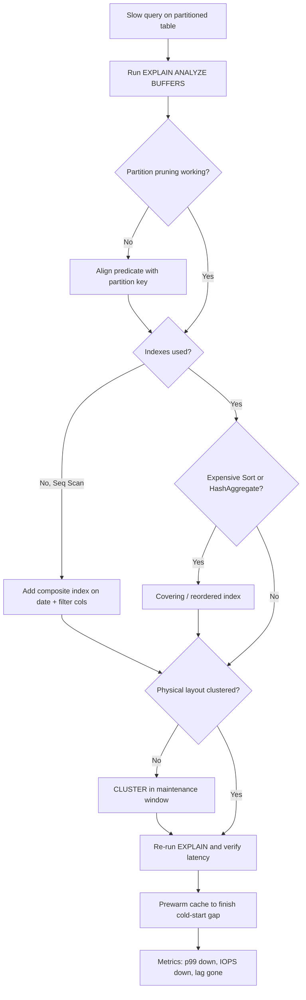

| Difficulty | Channel | Tags |
|---|---|---|
| intermediate | database | explain, query-plan, partitioning |

In a cramped machine room, a single query that should have returned in milliseconds is chewing through 100 million rows while a pager starts to buzz. That is roughly the nightmare CoinGecko woke up to when its hourly crypto price table ballooned past 1TB over eight years, pushing queries past 30 seconds and tripping daily IOPS alerts [1]. By the time the team closed this chapter — a migration to monthly range partitions — their p99 latency had dropped 86%, from 4.13s to 578ms. The medicine they swallowed is the same routine developers use when any partitioned table stops behaving, and it begins with one word: EXPLAIN.

---

> ### Real-World Case — CoinGecko
>
> CoinGecko's hourly crypto price table grew past 1TB over 8 years, causing 30+ second queries, daily IOPS alerts, degrading Apdex scores, and replica lag. Scrambling to fix it before summertime traffic spikes hit their SLO/SLA commitments, they migrated the giant table to monthly range partitions by timestamp.
>
> | | |
> |---|---|
> | **Challenge** | Even after partitioning a 1TB+ PostgreSQL table by date, some date-range queries were still slow. Diagnosing via EXPLAIN showed the culprit wasn't partitioning itself — it was queries that lacked a date lower bound (e.g. 'created_at > ?'), which defeated partition pruning and forced scans of every partition, including pre-created empty future partitions. |
> | **Solution** | CoinGecko range-partitioned the table by month (each query touches at most 4 partitions), migrated 8 years of data via foreign data wrappers to avoid IOPS saturation, prewarmed partitions with pg_prewarm, and then fixed the regression queries by adding the missing lower date bound and removing the over-created future partitions — exactly the EXPLAIN-driven pruning checks the interview answer describes. |
> | **Outcome** | p99 response time dropped 86% from 4.13s to 578ms, IOPS reduced by 20% (multiplied across multiple replicas for cost savings), and replica lag disappeared immediately after the switch. Partitioned table prewarm took 3 hours vs 10 hours for the original, with 6-8x query speedup. |
> | **Lesson** | Partitioning by date only helps if your queries actually let the planner prune partitions. One open-ended query without a lower date bound scanned all partitions and was strictly WORSE after partitioning — the same query that ran fine on the unpartitioned table. Always verify partition pruning in the EXPLAIN plan and keep future partition creation minimal, or you'll trade one bottleneck for another. |

---

## Hook — When Your Query Jogs and No One Warned You

Ever wondered why a table that is already partitioned can still answer a simple date-range filter as if it were hauling a sled through gravel? Many developers discover this the hard way: the query is instant on staging, the same query crawls in production, and nobody changed a single line of SQL. The gap between "partitioned" and "fast" is exactly where this story lives. The stakes go far beyond one sluggish dashboard — when a table absorbs close to a million rows a day, two or three bad plans can decide whether a team hits its SLO or spends an entire summer explaining an Apdex collapse. Here is the uncomfortable truth worth holding onto: partitioning hands you the keys to a sports car, but you still have to drive.

## Problem — The 1TB Elephant in the Database Room

A partitioned table is a promise, not a guarantee. Declarative partitioning divides a giant table into smaller physical pieces so a query that filters on the partition key needs to touch only the relevant slices [2]. The catch is that pruning works only when the optimizer can prove which partitions matter, and when the scans inside the survivors are efficient on their own. A 100M-row table, eight years of accumulated history, and a hot access pattern of date-plus-status form a perfect ambush: even with flawless pruning, a sequential scan and a sort that runs to the very end can butcher the plan. Sound familiar? This is precisely the failure fingerprint CoinGecko saw as replica lag started creeping upward and Apdex scores began to sag [1]. The pain is shared across companies with event logs, sensor readings, and anything else that only ever grows — append-only tables are where partitioning promises the most and surprises the hardest.

## Real-World Case — CoinGecko: Racing a 30-Second Query Before Summer

Here is the plot twist: slicing the table into monthly ranges was only the opening move. None of those wins stick unless the queries inside each partition actually prune, scan efficiently, and avoid burning cycles on sorts. The routine that gets a team to that outcome — and the same reasoning interviewers probe when they hand someone a 100M-row partitioned table and ask why a date-range query is slow — is the heart of the rest of this post.

## Deep Dive — Reading EXPLAIN Like a Detective, Not a Tourist

The nuance that surprises most developers: adding an index is not the end of the story. Column order inside the index decides whether the planner can use it at all. This is the kind of subtlety that separates a plan that hums from a plan that limps [9].

## Workflow — A Six-Step Routine From Panic to Prewarm

⚠️ **Watch Out:** running CREATE INDEX without CONCURRENTLY on a production table takes a lock that blocks writes. The overnight CLI hero who "fixed" the index at 3pm is usually the same person who explains the incident to the CEO at 3:15pm [4]. After a bulk load, run ANALYZE — the planner cannot fix what the statistics never knew.

## Code Example — The Three-Command Rescue Mission

Here is what each piece accomplishes. Step 1 is pure investigation: EXPLAIN (ANALYZE, BUFFERS) replaces the planner's estimates with what actually happened — real row counts, buffers touched, and wall-clock time [3]. Step 2 is the structural fix: a composite index on (event_date, status) lets the planner walk the date range and filter status in a single pass, exactly matching the WHERE clause [4]. Step 3 is verification, because a fix you cannot measure was never a fix. Step 4 is the optional physical optimization: CLUSTER rewrites the heap so rows on disk follow index order, cutting page reads dramatically for range-heavy workloads [5]. The tradeoff is real — it locks the table — so treat it as a surgical procedure, not a daily habit. This is the sequence that turns 4-second latency into 578ms territory, and it is the answer the interviewer wanted all along.

## Lessons Learned — What the Incident Taught Your Team and What to Do Tomorrow

So what should change tomorrow? Add EXPLAIN (ANALYZE, BUFFERS) to your debugging habit, audit your hottest partitioned table for pruning and sorts, and if it has grown into a giant append-only slab, plan the monthly partition migration before the pager plans it for you.

---

## Query Diagnosis Flow

<strong>Original Interview Question</strong>

**Q:** You have a PostgreSQL table with 100M rows partitioned by date. A query filtering on a specific date range is still slow. What would you check in the EXPLAIN plan and how would you optimize it?

**A:** Check partition pruning effectiveness, index utilization patterns, and expensive sort operations. Create composite indexes on (date, filtered_columns) and evaluate clustering strategies for optimal data access.

## Conclusion

The 30-second query that could have sunk CoinGecko's summer became a 578ms afterthought — not because partitioning is magic, but because the physical layout finally matched the access pattern [1]. When a query that should feel instant decides to go for a jog, resist the urge to throw more CPU at it. Run the plan, audit the pruning, mind the sort, and let the evidence decide. Your Apdex score will thank you — and so will the engineer who gets paged next summer.

---

## References

1. [CoinGecko incident report](https://amree.dev/2025/06/13/scaling-postgresql-performance-with-table-partitioning/) — article
2. [PostgreSQL documentation: Table partitioning](https://www.postgresql.org/docs/current/ddl-partitioning.html) — documentation
3. [PostgreSQL documentation: Using EXPLAIN](https://www.postgresql.org/docs/current/using-explain.html) — documentation
4. [PostgreSQL documentation: CREATE INDEX](https://www.postgresql.org/docs/current/sql-createindex.html) — documentation
5. [PostgreSQL documentation: CLUSTER](https://www.postgresql.org/docs/current/sql-cluster.html) — documentation
6. [PostgreSQL documentation: Index types and strategies](https://www.postgresql.org/docs/current/indexes-types.html) — documentation
7. [PostgreSQL documentation: Planner statistics](https://www.postgresql.org/docs/current/planner-stats.html) — documentation
8. [PostgreSQL documentation: Query planner configuration](https://www.postgresql.org/docs/current/runtime-config-query.html) — documentation
9. [The Internals of PostgreSQL: Query processing and planner](https://www.interdb.jp/pg/) — blog
10. [pg_partman: PostgreSQL partition management extension](https://github.com/pgpartman/pg_partman) — documentation

---

**Author:** Satishkumar Dhule — [GitHub](https://github.com/satishkumar-dhule) · [LinkedIn](https://linkedin.com/in/satishkumar-dhule) · [Website](https://satishkumar-dhule.github.io)
