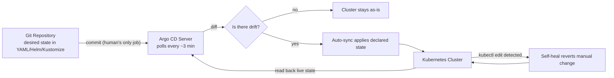

| Difficulty | Channel | Tags |
|---|---|---|
| beginner | devops | argocd, flux, declarative |

In 2018, Intuit — the company behind TurboTax and QuickBooks — watched its Kubernetes migration grind to a halt. Hundreds of microservices needed to ship, but existing tools like Spinnaker simply could not deliver declarative, Git-based deployments fast enough. So their DevOps team decided to build their own tool from scratch instead of buying one [1]. That bet became Argo CD, a CNCF project now running in roughly 60% of Kubernetes clusters and managing over 2,300 applications at Intuit alone. This is the story of why they did it — and how you can capture the same superpower for your own clusters.

---

> ### Real-World Case — Intuit
>
> In 2018, Intuit (makers of TurboTax and QuickBooks) was migrating hundreds of microservices to Kubernetes across a fleet of clusters. Their DevOps team found that existing CD tools like Spinnaker couldn't deliver declarative, Git-based deployments fast enough, so they decided to build their own tool from scratch instead of buying one.
>
> | | |
> |---|---|
> | **Challenge** | Intuit had no purpose-built enterprise tool for GitOps on Kubernetes. They needed a way to let hundreds of application teams safely deploy microservices to production without becoming Kubernetes experts, while keeping Git as the single source of truth and enforcing auditability. Their first naive implementation of a GitOps controller only worked for a couple of clusters and a few dozen applications before hitting performance walls (Git repository cloning and manifest generation became bottlenecked). |
> | **Solution** | Intuit built ArgoCD to close the loop: a Kubernetes-native controller that continuously reconciles live cluster state against the desired state declared in Git, supporting auto-sync, self-healing against drift, and manifest generation via YAML, Helm, Kustomize and Jsonnet. When it broke at scale (even small change to a mono-repo invalidated caches for hundreds of apps, causing CPU and memory spikes and OOM kills), they redesigned the application controller, added sharded controller replicas, parallelism limits, and webhook-based cache invalidation, then open-sourced the whole project. |
> | **Outcome** | ArgoCD became the de facto standard GitOps tool (a CNCF graduated project running in ~60% of Kubernetes clusters per the 2025 CNCF end-user survey). Intuit runs one Argo CD instance managing roughly 2,300 applications across 26 clusters with manifests stored in 500 Git repositories, letting hundreds of application teams deploy without running their own tooling or needing deep Kubernetes knowledge. |
> | **Lesson** | When the desired state is declared in Git and a controller continuously reconciles it, teams gain self-healing, auditability, instant rollbacks, and config-drift elimination — but real-world scale changes everything: even the tool that invented this pattern had to redesign its controller once it grew past dozens of applications. |

---

## Hook — One Instance. 2,300 Applications. The Deploy That Couldn't Wait.

Every platform hits a moment of truth. For the Intuit DevOps team in 2018, that moment came when their delivery tooling simply could not keep up: hundreds of microservices were landing in Kubernetes, and existing tools like Spinnaker proved too slow and too imperative to scale [1]. Today, a single Argo CD instance keeps roughly 2,300 applications in sync across 26 Kubernetes clusters, pulling desired state from more than 500 Git repositories. Sound like a different universe from your setup? Here is the plot twist: the mechanics are exactly what you would build. The same loop that powers Intuit — a Git repository, a controller, and a reconciliation cycle — fits inside your cluster today. This guide walks through that loop, the declarative philosophy behind it, and the battle scars you will collect along the way.

## Problem — The 2 AM kubectl Drift Fog

Most teams do not fail at deploying; they fail at keeping deploys honest. You run kubectl apply, the pod comes up green, and everyone moves on. Then two weeks later, someone hand-edits a Deployment with kubectl edit, someone else scales a replica count through the dashboard, and suddenly the cluster no longer matches the repository [5]. That is configuration drift, and it is the quiet killer of microservice reliability.

The stakes are concrete: a team of a dozen engineers can ship dozens of manual changes in a single day, and every one of them is a hole in the audit trail. When something breaks at 2 AM, your rollback becomes archaeology — digging through shell history instead of reverting a commit. Consequently, the real question becomes: what if the cluster were forced to match Git, instead of your hoping it would?

## Real-World Case — Intuit and the Birth of Argo CD

When Intuit began migrating hundreds of microservices to Kubernetes, they hit a wall. Their existing continuous delivery tooling could not deliver declarative, Git-based deployments fast enough, so the DevOps team decided to build their own tool from scratch instead of buying one [1]. What started as an internal solution grew into Argo CD, which became a graduated CNCF project and, per the 2025 CNCF end-user survey, now runs in roughly 60% of Kubernetes clusters [10].

But the proof point is in Intuit's own numbers: one Argo CD instance manages around 2,300 applications across 26 clusters, with manifests stored in 500 Git repositories. The punchline is not the scale, though — it is that hundreds of application teams deploy every day without running their own tooling and without needing deep Kubernetes knowledge [1]. That is the transformation GitOps promises, delivered at enterprise scale.

## Deep Dive — Declarative vs Imperative and the Loop That Never Sleeps

The difference between declarative and imperative is not jargon — it is the difference between telling the cluster what you want and telling it which buttons to push. The imperative approach means kubectl run, kubectl edit, and kubectl scale: a sequence of direct changes that bypass version control entirely [5]. It works great until it does not — manual changes leave no audit trail, every environment drifts in its own direction, and rollbacks require remembering every step you took. The declarative approach flips the model: you define the entire desired state — YAML manifests, Helm charts, or Kustomize overlays — in Git, and a controller continuously reconciles reality toward that state [4][6][8][9].

Building on this, Argo CD is built around three dials. The Application CRD names the Git source and target cluster — the contract between repository and runtime. Auto-sync polls the repository at a configurable interval, typically one to five minutes, and applies whatever changed. Self-healing watches the live cluster and reverts any manual drift that sneaks past the sync. Many developers think self-healing is a luxury; it is the entire point. A Git revert becomes a rollback, a Git PR becomes a deployment, and the audit log writes itself.

However, there is a real trade-off, and pretending otherwise is how teams get burned:

| Capability | Declarative (Argo CD) | Imperative (kubectl) |
|---|---|---|
| Source of truth | Git repository [4] | Kubernetes API / shell history |
| Audit trail | Built-in via commits | None unless you log everything |
| Rollback | git revert + auto-sync | Manual re-apply, error-prone |
| Collaboration | Review before merge [1] | Change happens with no gate |
| Drift risk | Low — self-healing reverts it | High — every env drifts [6] |

Here is the counterintuitive insight: the declarative model makes humans slower — every change must pass through Git — yet teams deploy faster, because the slow part was never the apply. It was the aftermath.

## Workflow — From Git Commit to Live Cluster in Five Steps

Here is the journey a change takes inside a GitOps setup. The diagram below visualizes the reconcile loop that never sleeps.

**1. Commit** — A developer merges a manifest change into the Git repository. This is the only step a human performs.

**2. Detect** — Argo CD's Application controller polls the repository URL, typically every three minutes, looking for new commits [2].

**3. Diff** — The controller compares the declared state in Git against the live state in the cluster. Anything different is drift.

**4. Sync** — When drift is detected, auto-sync applies the difference, and pruning removes objects that Git no longer defines.

**5. Reconcile** — Self-healing keeps watch; any kubectl edit that violates the declared state is silently reverted, bringing the cluster back to compliance.

Every step is idempotent, which means running it a thousand times yields the same result. That property is what turns deployment from a high-wire act into a conveyor belt. One warning before you flip the switch: enable auto-sync before self-heal and pruning, and you will quickly learn why the ordering matters — more on that in the lessons below.

## Code Example — Bootstrapping the Loop

Here is a production-style bootstrap: install Argo CD, declare an Application that binds a Git repo to a cluster namespace, and let the reconcile loop take over [2]. The full script with line-by-line commentary lives in the code example below.

## Lessons Learned — The Battle Scars of GitOps

If this feels overwhelming, you are not alone — every GitOps adopter earns the same scars. First, do not enable self-heal and prune on day one. Argo CD's prune deletes any resource absent from Git, so experienced teams start with auto-sync alone, watch a few cycles, and only turn on pruning once the repository inventory is trustworthy. Second, treat the Git repo as sacred: force-pushing to the branch Argo CD tracks is how rollbacks quietly vanish. Third, secrets do not belong in plain-text manifests — pair your cluster with a sealed-secret or external-secrets flow, or the Git history turns into a data breach.

Finally, name the big lever: automatic rollbacks. Because a git revert triggers a sync, you can undo a bad release faster than a human can reach a terminal. Many teams also compare Argo CD with Flux before committing — both are excellent, and the choice often comes down to ecosystem fit [7].

The one insight to carry back to your team: GitOps does not make deploys faster by making humans faster. It makes them faster by making the system honest — and a system that cannot drift cannot surprise you.

---

## GitOps Reconcile Loop

<strong>Original Interview Question</strong>

**Q:** You're setting up GitOps for a microservices deployment. How would you configure ArgoCD to automatically sync changes from your Git repository to Kubernetes, and what's the difference between declarative and imperative approaches in this context?

**A:** I'd configure ArgoCD by setting up a Git repository containing Kubernetes manifests or Helm charts, creating an Application CRD that points to the Git repository, enabling auto-sync with a health check interval of 3 minutes, and implementing self-healing to automatically revert any manual changes. The declarative approach involves defining the desired state in Git through YAML manifests, Helm charts, or Kustomize configurations, where ArgoCD continuously reconciles the actual state with the desired state. In contrast, the imperative approach uses kubectl commands to make direct changes to the cluster, bypassing the Git repository as the single source of truth.

## Conclusion

The journey started in 2018 with an internal experiment at Intuit and ends, for you, with something far smaller: a repository, a controller, and a loop that refuses to let the cluster lie [1]. One company bet on declarative delivery and ended up running 2,300 applications with a single reconciler across 26 clusters [10]. The same bet, scaled down to a single service, costs you one Application manifest and a few minutes of patience. Tomorrow, pick one workload you manage with kubectl, push its manifests to Git, and let Argo CD take over the watching. The cluster will thank you — mostly by staying boring. And as any veteran engineer knows, boring infrastructure is the best kind of infrastructure.

---

## References

1. [Intuit incident report](https://www.cncf.io/blog/2022/01/27/unveil-the-secret-ingredients-of-continuous-delivery-at-enterprise-scale-with-argo-cd) — article
2. [Argo CD — GitHub Repository](https://github.com/argoproj/argo-cd) — documentation
3. [GitOps — Wikipedia](https://en.wikipedia.org/wiki/GitOps) — documentation
4. [Declarative Management of Kubernetes Objects Using Configuration Files](https://kubernetes.io/docs/tasks/manage-kubernetes-objects/declarative-config/) — documentation
5. [Managing Kubernetes Objects Using Imperative Commands](https://kubernetes.io/docs/tasks/manage-kubernetes-objects/imperative-command/) — documentation
6. [Imperative Management of Kubernetes Objects Using Configuration Files](https://kubernetes.io/docs/tasks/manage-kubernetes-objects/imperative-config/) — documentation
7. [Flux v2 — GitHub Repository](https://github.com/fluxcd/flux2) — documentation
8. [Kustomize — GitHub Repository](https://github.com/kubernetes-sigs/kustomize) — documentation
9. [Helm Documentation](https://helm.sh/docs/) — documentation
10. [CNCF — Argo CD Project](https://www.cncf.io/projects/argo-cd/) — documentation

---

**Author:** Satishkumar Dhule — [GitHub](https://github.com/satishkumar-dhule) · [LinkedIn](https://linkedin.com/in/satishkumar-dhule) · [Website](https://satishkumar-dhule.github.io)
