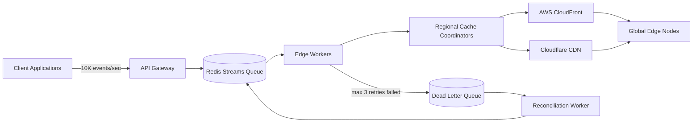

| Difficulty | Channel | Tags |
|---|---|---|
| intermediate | system-design | edge, caching, purging |

For the better part of a decade, Cloudflare's cache purge system worked exactly as designed — until it couldn't. By the time their engineers faced the metrics, global purge latency had drifted to roughly 1.57 seconds at P50, and the Quicksilver KV store holding purge keys was eating disk space that should have been caching customer content [1]. The rebuild didn't just shave milliseconds; it dropped purge latency to under 150ms across all 330+ cities, making the network purge 'by the time you blink.' That story is the roadmap for the challenge every platform eventually hits: how do you guarantee content propagation across the globe in under five seconds while absorbing 10,000 invalidations per second?

---

> ### Real-World Case — Cloudflare
>
> After a decade of growth, Cloudflare's cache purge system—built on centralized 'core' data centers that fanned requests out to the rest of the network—started hitting hard scalability limits. Global purge latency had drifted to ~1.57s (P50), and the Quicksilver KV store used to hold purge keys consumed disk space that should have been caching customer content.
>
> | | |
> |---|---|
> | **Challenge** | How to invalidate cached content across hundreds of independent data centers (330+ cities, 120+ countries) quickly and consistently, while keeping purge throughput high and storage costs from eating cache capacity. Buffering and batching (Kafka queues) bought runway but made latency worse—more traffic meant more operational cost, tightly coupled. |
> | **Solution** | They built 'coreless purge': ripped out the central coordinator entirely. A request now lands at the nearest edge data center, is handled by a Cloudflare Worker + Durable Object queue, and propagates peer-to-peer between data centers instead of through a core. Last-mile fan-out was pushed into a new per-machine service, CacheDB (Rust on RocksDB), which indexes cached files on each disk and issues 'active' purges immediately rather than lazy-deleting later. Cache proxies also consult CacheDB's pending queue on every hit, so stale content is blocked the instant a purge arrives—even mid-deletion. |
> | **Outcome** | Global purge latency dropped from ~1.57s to under 150ms at P50 (a 90.5% improvement) across all 330+ cities, with regional p50s down 78-89%; the network now purges 'by the time you blink.' CacheDB's active purge cut storage requirements 10x by eliminating lazy-purge buildup, freeing space, improving cache hit ratios, and enabling tag/hostname/prefix purging to be offered to all plan tiers instead of just Enterprise. |
> | **Lesson** | When a broadcast system saturates, don't scale the coordinator—delete it. The old fix (more queues, bigger batching) only traded latency for throughput. The winning move was decentralizing the hot path so every node can ingest and propagate purges, and pairing it with per-machine indexing so content can be actively removed instead of lazily marked-and-deferred. |

---

## Hook — The purge that outgrew its architecture

Ever wondered why 'cache invalidation' shares the podium with 'naming things' as one of the two hardest problems in computer science? Here is the thing though — it stops being a joke the moment 'eventually consistent' stops being acceptable. Picture this: a pricing change that fails to reach every edge location for ten seconds is a pricing error multiplied by millions of requests. A revoked access token lingering in a CDN cache for a full minute isn't a bug; it's a breach waiting for a pen test. The stakes are why engineers whisper phrases like 'five-second SLA' with a straight face, and why the architecture behind that promise carries more weight than the fifteen-person meeting that made it.

## Problem — Why a 'purge button' is a distributed transaction in disguise

Here is the uncomfortable starting point: most developers assume purging a CDN cache is a single API call. You POST to a purge endpoint, the CDN clears its copy, done. That assumption is exactly what breaks at scale. A purge is really a coordinated message delivery to hundreds of edge locations, each with its own copy of your content — and each needs the same message, reliably, without duplicates, in near real time. The brutal math: fanning out a 'drop this object' command costs as much message volume as caching the content in the first place. Meanwhile, the request rate is relentless — a broken deploy, a bad A/B test, or a hot release can throw ten thousand invalidations per second at the system. You might think shrinking the TTL solves everything, but it does not: dynamic content flows through edge caches precisely because it is too hot to hit origin on every request. That tension — freshness versus performance — is the problem a purge system exists to resolve, and it is why the naive answer doesn't survive first contact with production traffic.

## Real-World Case — Cloudflare: a decade of growth, one hard ceiling

No company illustrates this better than Cloudflare, which ran a purge system that quietly stopped scaling. The design was centralized from day one: 'core' data centers received purge requests and fanned them out to the rest of the network. As the network ballooned past 330 cities, global purge latency drifted to roughly 1.57 seconds at P50 — a number that becomes unacceptable the second your brand is speed [1]. Worse, the Quicksilver KV store used to hold purge keys consumed disk space that should have been reserved for caching customer content, a growing tax on every single request [1]. Their engineers didn't tune knobs; they rebuilt the system from the ground up, pushing coordination out to the edge by relocating purge state into a purpose-built distributed cache called CacheDB [1]. The results read like a vendor demo reel: global purge latency dropped from ~1.57s to under 150ms at P50 — a 90.5 percent improvement — with regional P50s down 78–89 percent, and the network now purges 'by the time you blink' [1]. CacheDB's active purge cut storage requirements tenfold by eliminating lazy-purge buildup, which freed space, improved cache hit ratios, and let Cloudflare offer tag, hostname, and prefix purging to every plan tier instead of reserving them for Enterprise [1]. That is not an infrastructure footnote — it is the proof that edge-first design is the only viable path to a genuine five-second SLA.

## Deep Dive — Queue, edge coordination, batching, and the 2-second safety net

Building on Cloudflare's lesson, the architecture you need looks less like a fan-out from a single core and more like a distributed pipeline with four moving parts. First, an invalidation queue decouples the tsunami of incoming requests from the work of actually purging. Redis Streams fit naturally here because consumer groups let many workers consume the same event stream without double-processing, and the stream itself acts as a durable buffer against worker crashes [4]. Second, edge workers — Cloudflare Workers, for example — read from that queue and coordinate with regional cache coordinators, so no single region becomes the bottleneck and there is no centralized point of failure [3]. Third, purging to the providers is a batch affair, not a per-object affair: CloudFront invalidations are individually metered and freely submitting hundreds of single-object requests bleeds money, whereas batching up to provider limits — CloudFront allows invalidation batches of up to 3,000 paths, while the Cloudflare purge API accepts URL patterns and wildcards in one call — cuts API volume and cost by up to 90 percent [2][3]. Fourth, and here is the plot twist: the aggressive two-second TTL does half the work for you. Cache-Control: max-age=2, must-revalidate means even a purge message that gets delayed has only a two-second window in which stale content can be served, effectively converting the strict purge into a safety net rather than the only line of defense [5][6]. The trade-offs are real: shorter TTLs raise origin traffic, strict ordering means you need a queue rather than fire-and-forget pub/sub, and provider APIs cap batch sizes and rate-limit concurrent invalidations. Pick your NFRs first, then let them dictate the pipeline.

## Workflow — From client request to 'purged by the time you blink'

Here is how the whole pipeline moves, end to end. Trace the journey in the diagram below: an invalidation event enters through the API Gateway, gets sequenced in the Redis Streams queue, fans out through edge workers and regional coordinators, and finally lands at the CDN providers — with a dead-letter branch for anything that survives three retries.

[diagram]

Step by step:
1. The client posts an invalidation — a path pattern, tag, or hostname — to the API Gateway.
2. The Gateway validates it and appends the event to a Redis Streams consumer group.
3. Edge workers pull events in batches and dispatch them to regional cache coordinators.
4. Coordinators batch-purge CloudFront and Cloudflare in parallel.
5. Success is acknowledged; failures retry with exponential backoff plus jitter [7].
6. After three retries, events drop into a dead-letter queue for reconciliation rather than vanishing [8].
7. A reconciliation loop sweeps edge locations and re-pushes anything that missed the window.

The elegant part is belt-and-braces: the pipeline guarantees propagation in under five seconds, while the two-second TTL independently guarantees eventual correctness if a message stalls anywhere in between. Even a perfectly executed purge only needs to be 'probably fast'; the TTL is what makes it 'definitely correct.'

## Code Example — A purge worker that survives real traffic

The heart of the system is the worker that reads invalidation events and pushes them to the CDN providers with batched calls, retries, and a failure escape hatch. Here is a production-flavored version of that worker:

## Lessons Learned — Battle scars and the rules that survive contact

After snapping all the pieces together, three lessons stand out — each one paid for in late-night pages somewhere.

- **Design for partial failure, not perfection.** A distributed purge will occasionally lose a message. That is why the dead-letter queue and circuit breaker matter more than any latency optimization: fail fast after five consecutive failures, park the stragglers, and reconcile [8].
- **Batching is not a micro-optimization; it is a 90 percent cost reduction.** Per-object invalidation requests are the single most expensive habit teams adopt. Aggressive batch limits against CloudFront's 3,000-path batches and Cloudflare's wildcard patterns turn a bill that scales with error rates into a near-flat line [2][3].
- **The cache layer and the purge system must be designed together.** A two-second TTL plus must-revalidate converts purge from a correctness mechanism into a latency accelerant [5][6]. If your team treats TTL and invalidation as separate concerns, stale content will leak through the cracks anyway.
- **Centralized control planes at edge scale are a trap.** Cloudflare's entire rebuild was motivated by a core-and-spoke model that no longer scaled [1]. Push coordination to the edge, move the state off general-purpose storage, and let the regions talk to each other.

🎯 **Key Point:** Batching, backoff-with-jitter, and a dead-letter path turn a fragile 'purge button' into a system that now genuinely purges 'by the time you blink.'

⚠️ **Watch Out:** Forgetting jitter on retries creates a thundering herd that can take down your own purge queue during the exact incident you are trying to fix [7].

🔥 **Hot Take:** If your purge architecture has a single central coordinator, you have not built a purge system — you have built an outage waiting to fan out along with the purge.

---

## Cache Purge Pipeline

<strong>Original Interview Question</strong>

**Q:** How would you design a multi-region CDN cache purging system that guarantees content propagation within 5 seconds while handling 10,000 concurrent invalidations per second?

**A:** Implement Cloudflare API + AWS CloudFront with distributed invalidation queue, edge compute coordination, and 2-second TTL. Use batch invalidation, exponential backoff, and regional cache headers for 5-second SLA.

## Conclusion

Cloudflare's decade-long climb — from 1.57 seconds to under 150 milliseconds at P50 — is the same journey every growing platform takes, just compressed into one very public story [1]. The moral: do not bolt batching onto a centralized purge design and call it a day. Decouple with a durable queue, coordinate from the edge, batch every provider call, retry with jitter, park the failures where reconciliation can find them, and let a two-second TTL carry the correctness guarantee as your safety net. Tomorrow, audit your own purge path: is there a dead-letter queue? Do retries have jitter? Does your TTL buy you forgiveness when the pipeline hiccups? The five-second promise is not about being lucky — it is about being designed to survive being slow. Fix those three things, and your edges can start purging 'by the time you blink' too.

---

## References

1. [Cloudflare incident report: Instant Purge](https://blog.cloudflare.com/instant-purge/) — article
2. [AWS CloudFront — Invalidating files (Invalidations)](https://docs.aws.amazon.com/AmazonCloudFront/latest/DeveloperGuide/Invalidation.html) — documentation
3. [Cloudflare API — Purge cache](https://developers.cloudflare.com/api/operations/zone-purge) — documentation
4. [Redis Streams documentation](https://redis.io/docs/latest/develop/data-types/streams/) — documentation
5. [MDN — Cache-Control HTTP header](https://developer.mozilla.org/en-US/docs/Web/HTTP/Headers/Cache-Control) — documentation
6. [RFC 9111 — HTTP Caching](https://datatracker.ietf.org/doc/html/rfc9111) — documentation
7. [AWS — Error retries and exponential backoff](https://docs.aws.amazon.com/general/latest/gr/api-retries.html) — documentation
8. [Azure Architecture Center — Circuit Breaker pattern](https://learn.microsoft.com/en-us/azure/architecture/patterns/circuit-breaker) — documentation
9. [Cloudflare — How to purge cache](https://developers.cloudflare.com/cache/how-to/purge-cache/) — documentation

---

**Author:** Satishkumar Dhule — [GitHub](https://github.com/satishkumar-dhule) · [LinkedIn](https://linkedin.com/in/satishkumar-dhule) · [Website](https://satishkumar-dhule.github.io)
