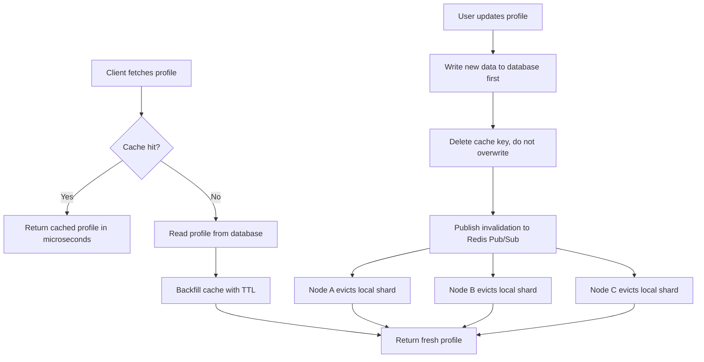

| Difficulty | Channel | Tags |
|---|---|---|
| beginner | backend | redis, memcached, cache-invalidation |

In late 2011, Twitter users began noticing something deeply unsettling: profile changes they made would silently reverse days later — no error, no warning, just erased. For roughly two months, tens of support tickets piled up while engineers had no visibility into the root cause [1]. The culprit turned out to be something almost everyone underestimates: cache invalidation, the topic most system design guides compress into a single sentence. This is the story of how Twitter learned that lesson the hard way, and what it means for every developer building a user profile service today.

---

> ### Real-World Case — Twitter
>
> In late 2011, Twitter users who changed their username, screen name, or password found their changes silently reverted days later. For roughly two months, tens of support tickets piled up while engineers had no visibility into the cause. Popular users were found cached in up to six different cache shards simultaneously instead of one, with roughly 0.2% of cached user records out of sync with the database.
>
> | | |
> |---|---|
> | **Challenge** | Twitter's user profile data was cached in distributed memcached clusters, but cache invalidation was unreliable: independent client routing decisions ejected unresponsive shards, keys had multiple live copies across shards, and a client could write a stale cached profile back to the database. The profile service had no instrumentation to detect where staleness originated. |
> | **Solution** | After instrumenting the Rails app to track cache inconsistency and ejection paths, engineers added retry logic before ejecting hosts and kept data flowing to the right shard, but a deeper cause emerged: packet loss correlated with incoming packet rate (CPU0 at 65-70% soft IRQ), traced to a BIOS/BMC firmware health check that froze kernels every 20h40m, plus unfixed kernel config. Fixes included IRQ affinity distribution, a BIOS roll-forward, host reboot staggering, and the eventual architectural change to a cache that tolerates partitions without becoming inconsistent. |
> | **Outcome** | The stale-profile reversion bug took roughly two months to fully fix and required the kernel and hardware-engineering teams, and a follow-on cache-architecture redesign took about two more years. The incident was one of six cache-attributed SEV-0 outages documented over Twitter's decade of major cache incidents; for a long stretch, cache was the #1 source of site outages. |
> | **Lesson** | Distributed cache invalidation is only as safe as your failure handling: multiple redundant copies of a key defeat invalidation, client ejection/retry policies can create fatal feedback loops, and stale writes can flow back to the source-of-truth database. Diagnosing 'stale profile data' can also lead all the way down to hardware firmware, so visibility and low-level systems understanding are non-negotiable. |

---

## Hook — the silent reversion

It was late 2011 when Twitter users started reporting something that sounded impossible: their profile changes would stick for a few days, then quietly reverse themselves. A freshly chosen username. A newly rotated password. Gone — reverted, as if the edit had never happened. No error message, no notification, just silence. Tens of support tickets piled up over about two months while engineers stared at logs that looked perfectly healthy [1]. Sound familiar? If you have not yet met the cache bug that bites in the dark, you will. This is the story of how cache invalidation — the most underestimated topic in backend engineering — quietly became the number one source of outages at one of the busiest platforms on the planet.

## Problem — stale data is invisible

Here is the thing few developers admit: caching is the easiest performance win you will ever get, and the hardest one to keep honest. A cache is a fast, temporary store sitting between your service and your database, so hot data gets served in microseconds instead of milliseconds [2]. That speed feels like cheating — right up until the day the copy goes stale. That single, inevitable moment of staleness is the cache invalidation problem: keeping a fast replica in sync with the source of truth after every write. The stakes are brutal. Serve a stale profile and old emails get accepted, permissions start disagreeing with each other, passwords quietly reset themselves. Worse, the bigger the service, the more nodes hold copies of the same key — and every one of those copies is a place where old data can survive unnoticed. Many developers discover the hard way that 'invalidate on write' is easy to say and notoriously hard to get right across multiple servers. If you have ever watched a user complain that an update 'didn't take,' you already know this story from the wrong side.

## Real-World Case — Twitter's two-month mystery

Enter Twitter, late 2011. The profile service cached heavily accessed profiles to keep latency low, and when users changed a username or password, the service expected fresh data to flow through. Instead, popular users were found cached in up to six different cache shards simultaneously — one username scattered across a half-dozen fragments — while roughly 0.2% of cached user records sat silently out of sync with the database [1]. That 0.2% is the plot twist. Because the corrupt copies were a tiny minority, most requests returned perfectly and the dashboards looked healthy, which is exactly why engineers had almost no visibility into the cause for two months [1]. The eventual fix required the kernel and hardware-engineering teams and took about two months itself; the follow-on cache-architecture redesign consumed roughly two more years [1]. This was not a mechanical failure. It was a systems-design failure with a username attached, and it explains why cache remained the number one source of site outages for so long [1].

## Deep Dive — write-through, TTLs, and the Redis vs Memcached trade-off

Building on Twitter's war story, break the problem into genuine mechanics. Teams bounce between three caching patterns, and each one hides a trap. Cache-aside (lazy loading) fills the cache on a read miss and is the most common starting pattern. Write-through updates the cache on every write so reads rarely miss. Write-behind defers database writes, trading durability for speed — a deal you should only accept when losing a few writes is acceptable [7]. Many developers assume overwriting the cached key on every update keeps things fresh. Actually, deletion beats overwriting: delete is idempotent, it never produces partially updated records, and it risks zero inconsistency if a delete races an ongoing write [5]. Moreover, every cached entry needs a TTL as a backstop — for profiles, a 5-to-30-minute window is the sweet spot that bounds how long stale data can live even when everything else fails [5]. Now the storage engine. Redis ships pub/sub channels so any node can broadcast 'key X is dead' and every peer evicts it in real time [6]. Memcached has no such mechanism; invalidating across nodes means manual coordination [4]. Compare them straight up:

## Workflow — from user click to every-node-clean

With those trade-offs on the table, trace a full update cycle from user click to clean caches everywhere. The diagram below captures the entire flow in one picture — follow each branch and no copy gets a chance to go stale. First, a user edits their profile and the write lands in the API layer. Second, persist the new value to the database before touching anything else — the database is the source of truth, not the cache. Third, delete the cache key; deletion is idempotent and removes the bad copy outright instead of racing to replace it. Fourth, publish an invalidation event on a pub/sub channel so every node holding a local shard evicts the key simultaneously [6]. Fifth, on the next read, a cache miss triggers a backfill with a TTL, so the fresh copy carries a built-in expiry [5]. Finally, watch the metrics — hit ratio, staleness probes, shard drift — because Twitter proved that invisibility, not corruption, is the real enemy [1]. Trace through the flow: reads hit the cache, misses fall to the database, updates persist first and then fan out an eviction. That ordering is the entire secret.

## Code Example — write-through with pub/sub in Python

Now make it concrete. This is a production-shaped Python snippet using redis-py that implements the workflow end to end: a read path with on-miss backfill, a write path that persists, deletes, and broadcasts, and a subscriber loop that keeps every node honest. The pattern is deliberately boring — boring patterns are the ones that survive incidents.

## Lessons Learned — from two-month mystery to boring pattern

Every expensive lesson from Twitter's two-month bug has a cheap version you can adopt tomorrow. First: delete, do not overwrite — idempotent eviction is your friend. Second: wrap every cache entry in a TTL; five to thirty minutes for profiles is a sane baseline, and a TTL is a safety net, not a strategy [5]. Third: design for multiple nodes from day one; if two servers can serve the same key, either plan pub/sub fan-out or versioned keys now [6]. Fourth: instrument your cache like production code — monitor hit rates and build staleness probes, because Twitter's failure was fundamentally a visibility failure [1]. Fifth: pick your engine by invalidation complexity, not by hype — Redis when invalidation logic is rich and you need durability [3], Memcached when you just need raw, lean throughput [9]. The pattern that survived Twitter's decade of cache incidents is boring on purpose: database first, delete on write, broadcast the invalidation, TTL everything, and watch the graphs [1]. Boring patterns survive incidents. Flashy ones generate post-mortems.

---

## Cache Invalidation Flow

<strong>Original Interview Question</strong>

**Q:** You're building a user profile service that caches frequently accessed profiles. How would you implement cache invalidation when a user updates their profile, and what trade-offs would you consider between Redis and Memcached?

**A:** Implement write-through caching with TTL-based expiration. On profile update, invalidate the cache by deleting the key and writing new data to both the database and cache. Redis offers pub/sub for automatic distributed invalidation, while Memcached requires manual coordination across nodes.

## Conclusion

The journey ends where it began: a user watching their own profile roll back in front of them. Twitter's silent reversions took two years of architecture work to fully exorcise, and the trigger was nothing more than a cache copy drifting 0.2% out of sync [1]. The winning recipe — write-through writes, delete-on-invalidate, pub/sub fan-out, TTLs on everything, and hard metrics — fits in any codebase at any scale. So run the audit tomorrow: where is your profile cached, who else holds a copy, and what happens the instant a user hits save? A cache that cannot be invalidated is not a performance win; it is a time bomb wearing a speed hat.

---

## References

1. [Twitter incident report](https://danluu.com/cache-incidents) — article
2. [Cache (computing) — Wikipedia](https://en.wikipedia.org/wiki/Cache_(computing)) — article
3. [Redis — Wikipedia](https://en.wikipedia.org/wiki/Redis) — article
4. [Memcached — Wikipedia](https://en.wikipedia.org/wiki/Memcached) — article
5. [Redis EXPIRE command reference](https://redis.io/docs/latest/commands/expire/) — documentation
6. [Redis Pub/Sub documentation](https://redis.io/docs/latest/develop/interact/pubsub/) — documentation
7. [RFC 9111 — HTTP Caching](https://datatracker.ietf.org/doc/html/rfc9111) — documentation
8. [MDN — HTTP caching](https://developer.mozilla.org/en-US/docs/Web/HTTP/Caching) — documentation
9. [AWS ElastiCache — Memcached overview](https://docs.aws.amazon.com/AmazonElastiCache/latest/memcached/WhatIs.html) — documentation
10. [Memcached source repository on GitHub](https://github.com/memcached/memcached) — documentation

---

**Author:** Satishkumar Dhule — [GitHub](https://github.com/satishkumar-dhule) · [LinkedIn](https://linkedin.com/in/satishkumar-dhule) · [Website](https://satishkumar-dhule.github.io)
