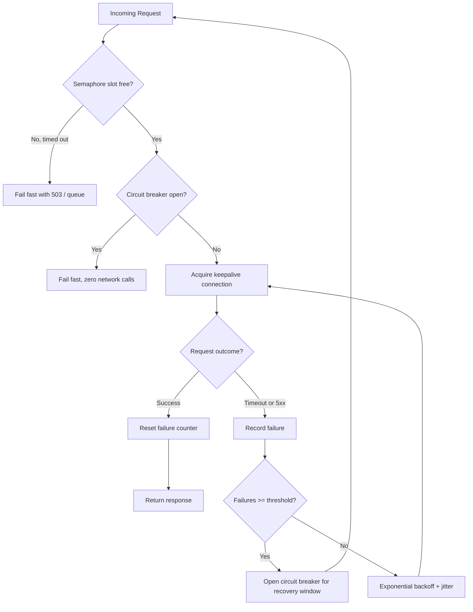

| Difficulty | Channel | Tags |
|---|---|---|
| advanced | backend | asyncio, aiohttp, concurrency |

Every developer has stared at a wall of timeouts at 3am and felt the urge to crank the connection pool size up. Netflix learned the hard way why that instinct backfires: when their downstream services hit latency spikes, saturated connection pools triggered cascading failures across their entire microservice graph, and engineers who increased pool sizes only managed to effectively DDoS their own backends [1]. This is the story of aiohttp connection pools, graceful degradation, and why the best fix often looks like doing less, not more.

---

> ### Real-World Case — Netflix
>
> Netflix's API system processed over 10 billion thread-isolated and 200+ billion semaphore-isolated Hystrix command executions per day across 243+ servers. When downstream services experienced latency spikes, connection pools would saturate, causing cascading failures across the entire microservice graph. Engineers would instinctively increase pool sizes, which paradoxically made the problem worse by effectively DDoSing their own backends.
>
> | | |
> |---|---|
> | **Challenge** | A single slow downstream service could exhaust connection pools across hundreds of servers, causing cascade failures. The counterintuitive trap: engineers kept increasing pool sizes (from 10 to 20 per host) thinking it would give services 'breathing room,' but this just doubled the concurrent connections from 1,000 to 2,000, overwhelming backends even further. |
> | **Solution** | Netflix implemented Hystrix with circuit breaker + thread pool isolation: each dependency gets a small dedicated thread pool (5-20 threads, typically 10). When a circuit trips (error rate >50% over 10 seconds with 20+ requests), it short-circuits all requests and routes to fallbacks. Pool rejections happen immediately instead of queuing, preventing resource exhaustion. Combined with Zuul's connection pool management using per-host-per-event-loop pools and HTTP/2 multiplexing. |
> | **Outcome** | After Hystrix adoption, cascading failures were contained to individual circuits instead of spreading across systems. Zuul's connection pool optimization later reduced total connections by 10x at peak traffic, churn by 8x, CPU utilization by ~4%, heap usage by ~15%, and latency by ~3%. One Zuul shard alone saw a reduction of 13 million connections at peak. |
> | **Lesson** | Under high load, the instinct to increase connection pool limits is catastrophic — it amplifies the problem. Circuit breakers must 'release pressure' on failing backends to let them recover, rather than pounding them with more connections. Small, isolated pools with fast failure + fallback degrade gracefully, while large shared pools cascade catastrophically. |

---

## Hook — It's 3am and the pool is full

Picture this: your API response times just tripled, the pager is screaming, and the dashboard shows a sea of red. You check the connection pool stats — every slot is taken. The obvious move seems to be increasing the pool size and adding more clients. So you do it. And somehow, the backlog gets worse. The requests that were failing slowly now fail instantly, in larger numbers. Sound familiar? This is the connurrent connection cliff, where adding capacity makes a fragile system more fragile. The tension in this story is that everything you learned about scaling — throw more resources at the problem — actively worsens this failure mode. The real fix requires treating your connection pool not as a resource limit, but as a circuit that protects both you AND your upstream service. What most developers don't realize is that the pool is a two-way street: it's not just your gate, it's also your backend's shield.

## Problem — The self-inflicted DDoS nobody talks about

Here's the core pain point: aiohttp's `ClientSession` maintains real TCP connections under the hood, and when a downstream service slows down, every request in flight starts holding those connections hostage. Each request eats a connection for the full duration of its latency — so a backend that degrades from 50ms to 5 seconds effectively quadruples the time every connection is occupied. The math is brutal: with 100 pool slots and a 5-second average response time, your throughput collapses to 20 requests per second, no matter how many threads you spawn. The instinct to enlarge the pool feels rational but is actually a plot twist: bigger pools mean more simultaneous in-flight requests, which pile onto an already-struggling backend, pushing it further into the danger zone. Worse, when connections start timing out, most retry logic just fires off new requests immediately without any coordination. The result is a thundering herd — hundreds of clients hammering a down service simultaneously, transforming a single-point latency spike into a system-wide outage [5]. The real enemy here isn't the slow service. It's the uncontrolled blast radius of everyone retrying at once.

## Real-World Case — Netflix vs. the cascade

No company lived this nightmare more publicly than Netflix. At peak, Netflix's API system executed over 10 billion thread-isolated and a staggering 200+ billion semaphore-isolated Hystrix command executions per day, spread across 243+ servers [1]. With that volume, a single slow dependency could saturate every connection pool in the chain, and because each call waits on its dependency, the failure propagated upstream like dominos. The cascade was the real killer: one service slowed, its clients' pools saturated, those clients' upstream services waited longer, and the entire microservice graph ground to a halt. The counterintuitive insight Netflix engineers documented? Pool sizing wasn't the lever. The winner was the circuit breaker — a mechanism that stops sending requests to a failing service entirely for a recovery window [1]. After Hystrix adoption, cascading failures were contained to individual circuits instead of bleeding across systems. The follow-up work on Zuul's connection pool optimization shows how far this thinking goes: total connections dropped 10x at peak traffic, connection churn dropped 8x, CPU utilization fell ~4%, heap usage fell ~15%, and latency improved ~3%. One Zuul shard alone shed 13 million connections at peak [1]. Thirteen million connections. That's what graceful degradation looks like at planetary scale.

## Deep Dive — The three pillars: semaphores, backoff, and circuit breakers

Building on Netflix's experience, a production-grade aiohttp pool comes down to three cooperating mechanisms — each handling a different stage of the failure lifecycle. The first is the semaphore, an async-friendly counter that bounds how many requests can hold a connection simultaneously. In Python, `asyncio.Semaphore` is designed exactly for this: it suspends the coroutine when the pool is full instead of burning a thread [3]. The second pillar is exponential backoff for retries. When a request fails, you don't retry immediately — you wait 2^attempt seconds plus a little random jitter, so retries don't synchronize into a perfect wave [5]. The third pillar is the circuit breaker: after a threshold of consecutive failures, the pool stops trying entirely and fails fast for a recovery window, giving the downstream service room to breathe [2]. Here is the key trade-off table teams wrestle with:

## Workflow — From request to response, the graceful path

This is how a hardened pool routes a request, step by step. First, the request enters and awaits the semaphore — if no slot frees up within a bounded wait, it's answered with a 503 or queued rather than piled onto the network. Once a slot is acquired, the circuit breaker is checked: if it's trips-open, the pool fails fast with zero network activity, protecting the backend from another spike of doomed traffic. If the breaker is closed, the pool grabs a keepalive connection from the session, fires the request, and measures the outcome. On success, the failure counter resets — the circuit breathes. On a timeout or 5xx, the failure counter increments; when it crosses the threshold, the breaker opens for a recovery window. Meanwhile, retry logic applies exponential backoff with jitter, so the flood becomes a trickle. For a visual walkthrough of this journey, see the flow below — it's the exact pipeline the code example implements.

## Code Example — A production aiohttp pool there's a real working pattern

Here's a working skeleton you can adapt tomorrow morning. The key insight is that the semaphore, circuit breaker, and backoff live together in one class so the failure handling is enforced centrally — not scattered across every caller in your codebase.

## Lessons Learned — Battle scars from the pool wars

So what should you actually do differently? First, accept that pool size is a ceiling, not a cure — tune it with your retry policy as a unit, using metrics like pending-wait time rather than gut feel. Second, always implement fail-fast responses: a clean 503 now beats a hung request later, and your upstream metrics will thank you [8]. Third, use keepalive connections and one shared `ClientSession` instead of creating a session per request — connection churn was the 8x problem Netflix eliminated [1][6][7]. The classic battle scars to look out for: forgetting to close the session on shutdown (asyncio hangs forever), catching `TimeoutError` instead of `asyncio.TimeoutError` in Python 3.11+ (subtle, sneaky), and skipping jitter in backoff (which turns your retries into a synchronized attack). If this feels like a lot to manage, you're not alone — but the entire system collapses into a few dozen lines when the pieces are composed cleanly. Start with the semaphore, add the breaker, then layer backoff. That's the whole journey, and it mirrors what Netflix learned at a scale you'll never see. Here's the honest takeaway: a connection pool is not a performance feature. It's a resilience feature. Treat it that way, and you'll stop being the reason your own backend goes down.

---

## Request Lifecycle with Graceful Degradation

<strong>Original Interview Question</strong>

**Q:** How would you implement a connection pool manager for aiohttp that handles graceful degradation under high load and connection timeouts?

**A:** Implement a connection pool manager for aiohttp using a semaphore to limit concurrent connections, exponential backoff for retrying failed requests, and circuit breaker pattern to gracefully degrade under high load and connection timeouts.

## Conclusion

The moral of the story is brutally simple: a connection pool is a resilience feature wearing a performance costume. When your backend slows down, the pool's job is not to push harder — it's to give up gracefully, in a coordinated way, and let the circuit breaker buy the recovery window. Adopt the three pillars in order — semaphore first, circuit breaker second, exponential backoff with jitter third — and make the failure path fail fast for real. Netflix measured the payoff: 10x fewer connections at peak, 8x less churn, and latency down ~3% [1]. No single line of code does that. The discipline does. And the memorable insight to take to your team: your pool shouldn't be measured by how many requests it lets through. It should be measured by how well it says no.

---

## References

1. [Netflix incident report](https://github.com/Netflix/Hystrix/wiki/Operations) — article
2. [Circuit breaker design pattern](https://en.wikipedia.org/wiki/Circuit_breaker_design_pattern) — documentation
3. [asyncio synchronization primitives — Semaphore](https://docs.python.org/3/library/asyncio-sync.html) — documentation
4. [aiohttp ClientSession quickstart](https://docs.aiohttp.org/en/stable/client_quickstart.html) — documentation
5. [Exponential backoff](https://en.wikipedia.org/wiki/Exponential_backoff) — documentation
6. [HTTP connection management — MDN](https://developer.mozilla.org/en-US/docs/Web/HTTP/Connection_management) — documentation
7. [RFC 9110 — HTTP Semantics](https://datatracker.ietf.org/doc/html/rfc9110) — documentation
8. [Fail-fast design](https://en.wikipedia.org/wiki/Fail-fast) — documentation

---

**Author:** Satishkumar Dhule — [GitHub](https://github.com/satishkumar-dhule) · [LinkedIn](https://linkedin.com/in/satishkumar-dhule) · [Website](https://satishkumar-dhule.github.io)
