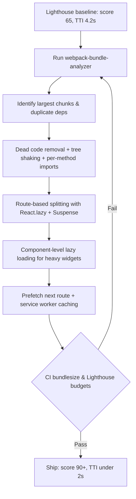

| Difficulty | Channel | Tags |
|---|---|---|
| intermediate | frontend | lighthouse, bundle, lazy-loading |

It was 2018, and Netflix had a problem hiding in plain sight: their logged-out homepage was a server-rendered React app dragging around roughly 300KB of client-side JavaScript — React itself, utility libraries like Lodash, and serialized context data waiting to hydrate. On a slow 3G connection, the page took seven seconds to become interactive. Seven seconds for a landing page [1]. The fix didn't come from a new framework or a rewrite. It came from understanding exactly what was shipped to the browser, cutting what users never needed, and loading the rest only when they asked for it. This is the same journey you'll take when a Lighthouse score of 65 stares back at you from a 2.1MB bundle.

---

> ### Real-World Case — Netflix
>
> Netflix's logged-out homepage (netflix.com) was served as a server-side-rendered React app with a large client-side React hydrate bundle — roughly 300KB of JavaScript including React, utility libraries like Lodash, and serialized context data. Performance audits revealed this JavaScript had a high cost: users on slower 3G connections waited far too long for the page to become interactive.
>
> | | |
> |---|---|
> | **Challenge** | Reduce Time-to-Interactive and JavaScript payload on the marketing/homepage for logged-out users, where every new signup begins, without breaking the text-to-speech consistency of the app or the single-page signup flow that follows. |
> | **Solution** | Instead of just code-splitting the existing bundle, the team aggressively deferred client-side JavaScript: they kept React for server-side rendering to generate the initial HTML, then stripped the client down to the bare minimum vanilla JavaScript needed to make the homepage interactive, and only shipped the full React application later as a secondary fetch. They also added prefetching of HTML, CSS and the (React) JavaScript bundle for subsequent navigations like the signup flow. |
> | **Outcome** | Loading and Time-to-Interactive for the logged-out desktop homepage both decreased by 50%, and the JavaScript bundle size was reduced by roughly 200KB. Prefetching HTML, CSS and JavaScript for future navigations cut Time-to-Interactive by an additional 30%, meaning the heavy React code was downloaded in the background only after the page was already usable. |
> | **Lesson** | The single biggest lever for Time-to-Interactive is the size of the JavaScript payload the browser must download, parse and execute — so the most effective 'lazy loading' is to not ship heavy framework code for the initial view at all. Netflix kept React for server rendering and deferred the client-side exp for until it was needed, proving that the biggest win on a slow network is shipping less code, not micro-optimizing the code you ship. |

---

## Hook — A 300KB Page Nobody Could Interact With

Here is the scene: you run Lighthouse, and the number you get back is 65. Your bundle is 2.1MB. Time to Interactive is 4.2 seconds. Sound familiar? Every developer on a growing React app has been there — the app started as a clean, fast prototype, and somewhere between the charts, the editors, and the third npm package that promised to do everything, it became a blob. The download works. The page paints eventually. But there is a gap between 'looks like it loaded' and 'actually responds to a click' that users feel on every single visit. The stakes are not abstract. On slower networks, every extra kilobyte of JavaScript means real seconds of dead time — seconds where your users' fingers hover over buttons that refuse to respond. And the most uncomfortable part? Most of that JavaScript, for most users, is never used at all. Netflix hit exactly this wall, and their response became a case study every frontend engineer should know.

## Problem — The Hidden Tax of the 2.1MB Bundle

Many developers think large bundles are mostly a network problem — 'the file just takes longer to download.' But the real cost is deeper and more expensive than transfer time. Every byte of JavaScript your browser downloads must then be parsed, compiled, and executed before the page can become interactive, and parsing time is dominated by device speed, not connection speed [8]. A top-tier laptop with a fiber connection chews through 2.1MB without blinking. A mid-range Android phone on 3G? That same 2.1MB can feel like a wall. Lighthouse's Time to Interactive metric exists precisely to catch this gap: it measures the moment the page can actually respond to input, not the moment it looks done. Moreover, the problem compounds silently. Every new feature, dependency, and page chips in. A 200KB codebase creeps to 500KB, then to 1MB — and no single pull request looks like the culprit [3]. Consequently, performance regressions are invisible until the numbers get embarrassing. You might think the answer is 'just buy a faster server' or 'use a CDN.' Both help with delivery, but neither helps with the parsing tax — and that's where the bundle itself becomes the enemy.

## Real-World Case — Netflix

Netflix's logged-out homepage was fast enough on fast connections, but performance audits told a different story about users on slower 3G networks, who waited seven seconds for the page to become interactive — far too long for a simple landing page [1]. The culprit was familiar to anyone who has inherited a React app: roughly 300KB of client-side JavaScript, including React's 45KB footprint, utility libraries like Lodash, and the serialized context data needed to hydrate the app's state [1]. The plot twist? Netflix didn't desperately code-split their way to victory. They made a bolder call. They removed React from the client entirely on that page, rebuilt the language switcher in vanilla JavaScript in under 300 lines of code, and shipped only the bare minimum of plain JavaScript needed to make the homepage interactive [1]. The results were staggering: loading and Time-to-Interactive both dropped by 50%, and the bundle shrank by roughly 200KB [1]. But the story doesn't end there. Netflix still wanted React for the signup flow's single-page experience, so they combined XHR prefetching with the browser's native prefetch, pulling the heavy React code in the background only after the homepage was already usable — cutting Time-to-Interactive by an additional 30% with zero JavaScript rewritten [1]. The lesson is subtle and powerful: optimize what users need right now, defer everything else, and prefetch the future in the background.

## Deep Dive — Analysis, Tree Shaking, and the Rules of Code Splitting

Building on the Netflix story, the first rule of optimization is: never guess — measure. Tools like webpack-bundle-analyzer generate an interactive treemap of every module in your bundle, showing stat, parsed, gzip, and Brotli sizes so you can see exactly where the bytes went [4]. Many developers are shocked by what they find: three versions of the same utility library, a charting library pulled in by a single import, an abandoned feature that still ships 400KB of code to every user. The second rule is to enable tree shaking properly. Tree shaking eliminates dead code, but it only works with ES2015 module syntax — static import and export — because the bundler can statically analyze which exports are actually used [5]. Consequently, migrating CommonJS-heavy libraries and updating your webpack optimization flags (usedExports, sideEffects, and scope hoisting) unlocks dramatic savings with zero user-visible changes [5]. The third rule is knowing which splitting strategy to use. Route-based splitting treats each page as its own chunk — the easiest win, since routes are natural boundaries [2]. Component-based splitting lazy-loads heavy components like charts, editors, and modals only when they open [2]. You might think more chunks are always better, but here is the counterintuitive twist: over-splitting creates a waterfall of dependent requests that can make things worse [8]. The real tradeoff is between initial payload and navigation latency, and the sweet spot varies by app — which is why the workflow matters more than any single technique.

## Workflow — The Seven-Step Performance Rescue Plan

This leads to a repeatable workflow that turns a 65-scoring, 2.1MB app into a 90+ scoring one without panicking. Teams that follow this order consistently hit their targets because each step informs the next, and the Mermaid flowchart below maps the complete journey. Step 1: baseline with Lighthouse on a simulated slow connection — record TTI and bundle size before touching anything. Step 2: run bundle analysis and identify the largest chunks and duplicate dependencies [4]. Step 3: cut dead weight — remove unused dependencies, migrate to per-method imports, and enable tree shaking with ES modules [5]. Step 4: apply route-based splitting with dynamic imports so each page loads only its own code [2]. Step 5: lazy-load heavy components and third-party libraries behind Suspense with error boundaries [6]. Step 6: preload the likely next route in the background so navigation feels instant [1]. Step 7: make it permanent — wire bundle-size budgets and Lighthouse thresholds into CI so regressions fail the build [8]. One real-world reference point: a two-week sprint on a legacy app following this exact sequence cut an initial bundle from 2MB to 400KB, slashed LCP from 8 seconds to 2.4 seconds, and moved the Lighthouse score from 32 to 95+, with a 40% conversion improvement [8].

## Code Example — Route Splitting, Component Splitting, and Error Boundaries

Here is the practical heart of it. Route-based splitting uses React.lazy to defer each page until it's needed, component-based splitting does the same for heavy widgets like charts, and both rely on Suspense for loading states and error boundaries for resilience the moment a chunk fails to download [2][6]. Every `import()` below produces a separate chunk that the browser only fetches when rendered — turning a monolithic download into a pay-for-what-you-use model.

## Lessons Learned — What Changes Tomorrow Morning

If this feels overwhelming, you're not alone — every performance rescue starts with a wall of numbers. But the takeaways here are small, precise, and immediately actionable. First: you cannot optimize what you cannot see, so bundle analysis is step zero, not an optional extra [4]. Second: tree shaking and per-method imports deliver quick, low-risk wins that often dwarf flashier changes [5]. Third: code splitting redistributes — it doesn't eliminate — your JavaScript cost, so pair it with prefetching to hide navigation latency and with caching strategies to make repeat visits nearly free [1][7]. Watch out for the classic battle scars: lazy components declared inside other components (React resets their state on every render), missing Suspense fallbacks (React throws to the nearest boundary), and named-export modules that silently break lazy loading [6]. To wrap it up: the bundle is not the enemy — silent accumulation is. Ship only what this user needs right now, defer the rest, and preload the future while they're already engaged. Netflix proved it with a 50% improvement on Time to Interactive [1]. Your Lighthouse score can prove it too.

---

## Performance Rescue Workflow

<strong>Original Interview Question</strong>

**Q:** You're tasked with improving a React app's Lighthouse performance score from 65 to 90+. The bundle size is 2.1MB and Time to Interactive is 4.2s. What specific steps would you take to optimize the bundle and implement lazy loading?

**A:** Implement code splitting with React.lazy() and Suspense, analyze bundle composition with webpack-bundle-analyzer to identify largest chunks, remove unused dependencies and optimize imports, add dynamic imports for heavy components and third-party libraries, implement route-based splitting for better initial load times, and utilize tree shaking with proper ES module configuration.

## Conclusion

The moral of the story: users judge your app in the first few seconds, and JavaScript they never needed is the biggest reason those seconds slip away. Netflix's 50% Time-to-Interactive win wasn't a rewrite — it was a mindset: measure, cut what nobody uses, defer what this user isn't asking for yet, and prefetch what they'll need next [1]. Tomorrow morning, run Lighthouse, open a bundle treemap, and delete one thing you find. Start with route-based splitting next, wire a bundle budget into CI to stop the bleed permanently, and let the numbers — not the gut — be the judge of when you're done [8]. Share that one insight with your team: the bundle is not the enemy. Silent accumulation is.

---

## References

1. [Netflix incident report](https://medium.com/dev-channel/a-netflix-web-performance-case-study-c0bcde26a9d9) — article
2. [React reference: lazy](https://react.dev/reference/react/lazy) — documentation
3. [React Suspense reference](https://react.dev/reference/react/Suspense) — documentation
4. [webpack-bundle-analyzer](https://github.com/webpack-contrib/webpack-bundle-analyzer) — documentation
5. [Tree Shaking guide — webpack](https://webpack.js.org/guides/tree-shaking) — documentation
6. [Code Splitting guide — webpack](https://webpack.js.org/guides/code-splitting) — documentation
7. [MDN: dynamic import()](https://developer.mozilla.org/en-US/docs/Web/JavaScript/Reference/Operators/import) — documentation
8. [Reduce JavaScript payloads with code splitting — web.dev](https://web.dev/articles/reduce-javascript-payloads-with-code-splitting) — documentation
9. [MDN: Service Worker API](https://developer.mozilla.org/en-US/docs/Web/API/Service_Worker_API) — documentation
10. [JavaScript — Wikipedia](https://en.wikipedia.org/wiki/JavaScript) — documentation

---

**Author:** Satishkumar Dhule — [GitHub](https://github.com/satishkumar-dhule) · [LinkedIn](https://linkedin.com/in/satishkumar-dhule) · [Website](https://satishkumar-dhule.github.io)
