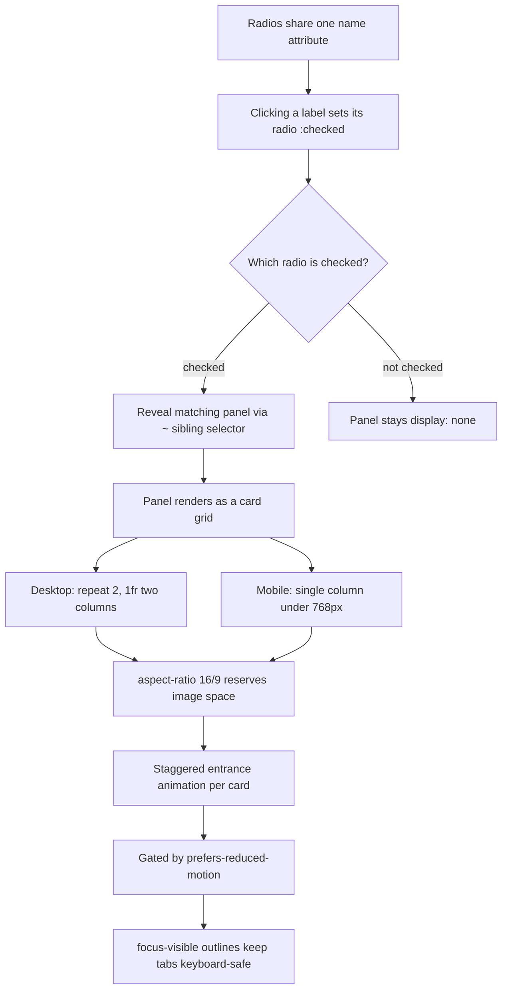

| Difficulty | Channel | Tags |
|---|---|---|
| beginner | frontend | css, flexbox, grid, animations |

Yahoo! JAPAN News — one of the world's largest news platforms, serving roughly 22 billion page views a month — once discovered its article pages were quietly shoving content around as images decoded, leaving readers stranded mid-thought [1]. The fix wasn't a JavaScript rewrite; it was disciplined CSS that reserved every pixel up front. That same discipline powers a CSS-only tab panel built from radio inputs, a responsive card grid, and animations that respect accessibility. This article shows you how to build one for your design-system docs page — no JavaScript, no layout shift, no excuses.

---

> ### Real-World Case — Yahoo! JAPAN
>
> Yahoo! JAPAN News — one of the world's largest news platforms at ~22 billion page views per month (the company overall serves 79 billion monthly PVs) — discovered its article detail page had a poor Cumulative Layout Shift (CLS) score. Fixed-size images, including the 16:9 hero image, loaded into unreserved space and shoved content down as they decoded, disrupting readers mid-article.
>
> | | |
> |---|---|
> | **Challenge** | Reserve space for fixed-ratio media (16:9 hero images) so the layout stops jumping when images load, without shipping heavy JavaScript — and while still supporting old browsers like iOS 9 where modern features were unavailable. |
> | **Solution** | Engineers used CSS aspect-ratio where supported and 'Aspect Ratio Boxes' (reserving the exact proportional space in markup/CSS before the image bytes arrive) as a no-JS fallback, pulling the image's known dimensions from their backend API. This is literally the same pure-CSS technique as setting a fixed 16:9 card image area with `aspect-ratio: 16/9` — space is reserved at first layout so nothing reflows when media finishes loading. |
> | **Outcome** | CLS dropped from ~0.2 to 0 in lab data, the number of URLs flagged as poor in Search Console fell 98%, and correlated engagement metrics improved 15.1% more page views per session, 13.3% longer session duration, and a 1.72 percentage-point lower bounce rate. The site also earned Chrome Android's 'Fast page' label. |
> | **Lesson** | A tiny, JS-free CSS fix — declaring the ratio of an image container up front — can move business metrics that bundle-size and framework work never could; and reserving space in CSS keeps the design system's cards stable for every user, JS or not. |

---

## Hook — The component so boring it must never move

Tabs on a docs page should be the most boring component on Earth. Boring, in a good way: click, content swaps, nothing jumps. But boring is a promise, and promises break. Picture this: you are halfway through a how-to guide, your eyes lock onto the next line, and the page shifts. The button you were about to click is suddenly somewhere else. Sound familiar? That is Cumulative Layout Shift (CLS) — and it is why Yahoo! JAPAN News, a platform doing 22 billion page views a month and pushing 79 billion across the whole company, treated layout stability like a business metric, not a nicety [1]. The stakes are huge: a jumping page doesn't just annoy users, it quietly bleeds engagement every single session. Yet here is the plot twist — the remedy that worked for a site of that scale was pure CSS. No framework, no hydration, no virtual DOM. Just styles that reserve space before content ever arrives.

## Problem — Every pixel you don't reserve is a reader you might lose

Now consider everything that can shove your layout around: a hero image that loads late and forces content down, a webfont swap that changes metrics mid-read, an ad slot that materializes out of nowhere. Individually each events feels tiny. Collectively, they are Cumulative Layout Shift — the Core Web Vital that measures unexpected movement in the viewport and is weighted heavily in how Google ranks real-world performance [2][9]. A tab panel is a hidden breeding ground for exactly this kind of jank. Many design-system doc sites load tab content dynamically, fetch images without reserved space, and animate panels in and out with height jumps. The result: every tab switch is a mini earthquake. So when would you actually use this? Everywhere tabs appear — docs sites, marketing product pages, settings panels, pricing comparators. The challenge is to build a tab panel that renders a 2×2 card grid on desktop, collapses to a single column on mobile, gives each card a fixed 16:9 image area, and animates in with a subtle stagger — all without a single line of JavaScript. Most developers reach for a component library here. You might think that is the safe move, but the library is exactly where the bloat, the shift, and the big dependency footprint come from. The alternative is something the browser already does natively.

## Real-World Case — Yahoo! JAPAN News

Building on that, look at what Yahoo! JAPAN News actually shipped. Their article detail page was scoring a poor CLS of around 0.2 in lab data — a number that sounds abstract until you remember it happens 22 billion times a month [1]. Fixed-size images, including the 16:9 hero image, were loading into unreserved space and shoving the content down as they decoded, disrupting readers mid-article. The engineering team's fix was almost embarrassingly simple: use the CSS aspect-ratio property and width/height attributes to reserve the space before the image arrives, plus a markup-based "Aspect Ratio Box" technique for older browsers like iOS 9 that lacked modern CSS support [1][2]. Consequently, the results were dramatic. CLS dropped from roughly 0.2 to 0 in lab data, and the number of URLs flagged as poor in Search Console fell by 98% [1]. Even better, these were not vanity metrics. The correlated engagement improvements measured 15.1% more page views per session, 13.3% longer session durations, and a 1.72 percentage-point lower bounce rate — and the site earned Chrome Android's 'Fast page' label [1]. Here is the thing that should stop you cold: paying users noticed respect for their reading flow to the tune of double-digit engagement gains. If reserving layout space is worth that much on a news article, imagine what it is worth inside your component library.

## Deep Dive — The radio, the selector, and the grid that never jumps

Now for the machinery. The core trick is that radio inputs are secretly a state machine — a shared name attribute means the browser enforces "exactly one checked value" for free, with zero JavaScript [3][10]. Pair each radio with a label, and clicking the label toggles its input's :checked state, which the browser tracks natively. The general sibling combinator (~) then lets CSS react to that state: any element that comes after a checked radio in the DOM can be styled based on it [4]. That single pattern replaces an entire state management layer. The panels themselves become pure layout: display: grid with repeat(2, 1fr) creates the two-by-two card matrix on desktop, and a single @media (max-width: 768px) rule collapses the grid to 1fr for a clean mobile column [6]. Each card's image container locks its shape with aspect-ratio: 16/9 — this is the exact mechanism Yahoo! JAPAN used to kill its CLS, since the browser now knows the image's height before a single byte of the file downloads [5][1]. The entrance animation is where sensitivity matters: wrap the stagger in @media (prefers-reduced-motion: no-preference) so users who opt out of motion never get bounced around [7]. And focus-visible outlines keep the hidden radios keyboard-navigable without marring the visual design [8].

Here is where intuition gets it wrong: many developers assume a no-JS component is a worse component. In reality the radio pattern is more robust — state lives in the browser, it survives refresh and autofill, and there is no event listener to unbind. The trade-off table tells the story:

| Concern | Radio/Label tabs (pure CSS) | JavaScript tabs (library-based) |
|---|---|---|
| State management | Browser handles it natively | Your framework does it |
| Dependency weight | Zero | Bundle + runtime |
| CLS risk | Low if space is reserved | Depends entirely on your code |
| Keyboard/ARIA support | Needs careful markup (roving tabindex is manual) | Often built-in |
| Complexity | Easy to reason about | Easy to over-engineer |

⚠️ Watch Out: the biggest battle scar in this pattern is remembering the sibling combinator's direction. The selector only reaches siblings that come AFTER the input in the DOM — reverse the order and the whole component silently breaks. A second scar: hiding radios with display: none removes them from the tab order, killing keyboard accessibility. Use opacity: 0 with position: absolute instead so the input stays focusable.

💡 Insight: the 16:9 aspect-ratio card is not just about looking tidy — it is the same space-reservation principle that took Yahoo! JAPAN's CLS from 0.2 to zero [1]. Layout that never moves is layout users never notice, and that is the highest compliment a design system can earn.

## Workflow — From click to settled layout in eight steps

This leads to a repeatable process you can drop into any design system. The diagram below traces the whole mechanism, from click all the way to a settled, animation-safe layout.

🧭 CSS-Only Tab Control Flow (mermaid):
A(radios, one shared name) → B(label click sets :checked) → C{which radio is checked?} → D(reveal matching panel via ~ selector) / E(panel stays display: none), D → F(panel renders as a grid), F → G(desktop two columns) and F → H(mobile one column), G → I(aspect-ratio reserves 16:9 image space), H → I, I → J(staggered entrance animation), J → K(gated by prefers-reduced-motion), K → L(focus-visible outlines keep it keyboard-safe).

The eight-step workflow:
1. Structure the tabs — one radio and one label per tab, all sharing a single name attribute [10].
2. Connect them — every label's for attribute must match its radio's id.
3. Hide the radios visually, not from focus — opacity: 0 and position: absolute keeps them in the tab order.
4. Wire visibility — each panel sits after the radios in the DOM, and an input:checked ~ .panel rule reveals it [4].
5. Build the responsive grid — repeat(2, 1fr) on desktop, 1fr under 768px via a media query [6].
6. Lock the image area — aspect-ratio: 16/9 reserves space and prevents CLS [5].
7. Animate with a guard — the stagger goes inside a prefers-reduced-motion: no-preference block [7].
8. Preserve focus — a :focus-visible outline on the active tab keeps keyboard users oriented at all times [8].

Each of these steps can be tested in isolation, and the whole pattern degrades gracefully: if CSS fails, the radios and labels still work as native form controls.

## Code Example — Building the tab panel, line by line

Time to see it in practice. The snippet below is a complete, self-contained implementation of the pattern — the same shape you would drop into a design-system docs page. Notice the DOM order: radios and labels first, panels after. That ordering is not decorative — it is what makes the sibling combinator work [4].

## Lessons Learned — What this pattern taught everyone who ships it

Looking back over the journey, the takeaways are less about syntax and more about architecture:

🎯 Key Point: the browser is an underrated state machine. A shared-name radio group gives you mutually exclusive state, persistence, and accessibility hooks for nothing — no state library required [3][10].

• Reserve before you render — the 16:9 card is the Yahoo! JAPAN lesson in miniature: space promised in advance never has to shift later [1].
• Respect motion preferences — the prefers-reduced-motion guard is not a nicety, it is a requirement for users with vestibular sensitivities [7].
• Never kill focus — hiding radios with display: none silently breaks keyboard navigation; opacity: 0 keeps inputs focusable [8].
• Watch your sibling order — the ~ combinator only reaches following siblings, and this single gotcha causes most "why is my tab broken" moments [4].

Quick comparison of the three most common mistakes:

| Common mistake | Symptom | Fix |
|---|---|---|
| Radios without a shared name | Multiple tabs checkable at once | Give all radios the same name attribute [10] |
| display: none on the radios | Keyboard users can't reach tabs | Use opacity: 0 + position: absolute [8] |
| Animation outside a motion guard | Unwanted movement for sensitive users | Wrap in prefers-reduced-motion: no-preference [7] |

🔥 Hot Take: if your docs site still loads a JavaScript runtime just to switch tabs, your design system is carrying dead weight. The pattern above does the job with markup that works even if every script on the page fails.

The moral of the story: Yahoo! JAPAN moved billions of page views a month with layout stability and gained engagement from it, and developers gave it no extra runtime [1]. The same move is available in every project, starting tomorrow morning. Reserve your space, respect motion preferences, and keep focus visible — then watch your Core Web Vitals thank you.

---

## CSS-Only Tab Control Flow

<strong>Original Interview Question</strong>

**Q:** Build a CSS-only tab panel for a design-system docs page. Use radio inputs to switch tabs (no JavaScript). Desktop: a 2x2 grid of cards under each tab; mobile: single column. Each card has a fixed 16:9 image area, a title, and a short meta line. Add a subtle entrance animation with a stagger and keep focus-visible outlines; ensure prefers-reduced-motion is respected?

**A:** Use a set of radio inputs with a shared `name` attribute and corresponding `` elements for each tab section. The `:checked` state of each radio controls visibility of its associated panel via adjacent sibling selectors. Each panel renders a 2×2 card grid on desktop and collapses to a single column on mobile. Cards use `aspect-ratio: 16/9` for fixed image containers, with a title and meta line below.

## Conclusion

The journey ends where it began: at Yahoo! JAPAN News, where respecting a reader's layout turned 0.2 of CLS into zero and bought 15.1% more page views per session [1]. The CSS-only tab panel is that lesson applied to one small, everyday component — reserve space with aspect-ratio, hand state to the browser with radio inputs, respect motion preferences, and keep focus visible. Start tomorrow: rebuild one tab panel on your docs page with this pattern, measure the CLS before and after with an audit, and watch what stable layout does for the people reading. Then share the one insight that matters with your team: the best performance fix is often the one that adds nothing at all.

---

## References

1. [Yahoo! JAPAN incident report](https://web.dev/case-studies/yahoo-japan-news) — article
2. [Cumulative Layout Shift (CLS)](https://web.dev/articles/cls) — documentation
3. [:checked — MDN Web Docs](https://developer.mozilla.org/en-US/docs/Web/CSS/:checked) — documentation
4. [General sibling combinator — MDN Web Docs](https://developer.mozilla.org/en-US/docs/Web/CSS/General_sibling_combinator) — documentation
5. [aspect-ratio — MDN Web Docs](https://developer.mozilla.org/en-US/docs/Web/CSS/aspect-ratio) — documentation
6. [CSS Grid Layout — MDN Web Docs](https://developer.mozilla.org/en-US/docs/Web/CSS/CSS_grid_layout) — documentation
7. [prefers-reduced-motion — MDN Web Docs](https://developer.mozilla.org/en-US/docs/Web/CSS/@media/prefers-reduced-motion) — documentation
8. [:focus-visible — MDN Web Docs](https://developer.mozilla.org/en-US/docs/Web/CSS/:focus-visible) — documentation
9. [Core Web Vitals — Wikipedia](https://en.wikipedia.org/wiki/Core_Web_Vitals) — documentation
10. [The Input (Form Input) element: radio — MDN Web Docs](https://developer.mozilla.org/en-US/docs/Web/HTML/Element/input/radio) — documentation

---

**Author:** Satishkumar Dhule — [GitHub](https://github.com/satishkumar-dhule) · [LinkedIn](https://linkedin.com/in/satishkumar-dhule) · [Website](https://satishkumar-dhule.github.io)
