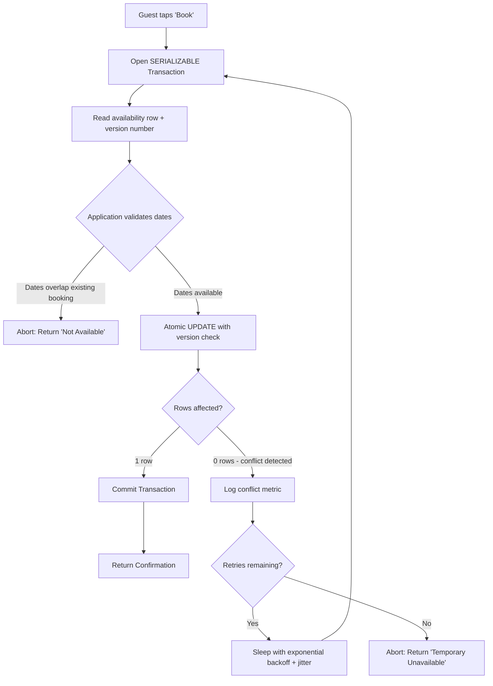

| Difficulty | Channel | Tags |
|---|---|---|
| intermediate | database | acid, isolation-levels, mvcc |

Picture this: it is Black Friday, and your booking system is under siege. Two guests tap 'Confirm' on the same beachfront villa at the exact same millisecond. Both transactions race toward the database. Both see the property as available. Both succeed. Now you have two confirmed guests, one property, and a customer service nightmare that will haunt your weekend. This is the double-booking ghost — and it haunts every reservation system on the internet. Airbnb learned this the hard way when migrating its payments infrastructure to a service-oriented architecture. A retried request, a double-clicked button, or an aggressive retry policy could charge a guest twice or pay a host multiple times. Because network failures make 'fire once' physically impossible, they needed a way to guarantee 'move money at most once' across distributed services [1]. What followed was a masterclass in transaction design — and the patterns they discovered apply far beyond payments.

---

> ### Real-World Case — Airbnb
>
> As Airbnb moved its payments system from a monolith to a microservice-based SOA, the risk of duplicate money movements exploded — a retried request, a double-clicked button, or an aggressive client retry policy could charge a guest twice or pay a host multiple payouts. Because network failures and timeouts make 'fire once' impossible, they needed a way to guarantee 'move money at most once' across distributed services.
>
> | | |
> |---|---|
> | **Challenge** | Preventing double payments (the financial equivalent of double bookings) in a distributed system where identical requests can arrive concurrently or via retries past the original response — a classic race condition where per-service checks are not atomic across the system. |
> | **Solution** | Airbnb built 'Orpheus', a general-purpose idempotency framework deployed across payments services. Each API call carries a deterministic idempotency key (e.g. 'payment-1234-refund'), and the framework acquires a database row-level lock on that key so concurrent duplicate calls serialize and only one proceeds; responses are persisted for replay. Counterintuitively, they deliberately used the master database for idempotency state rather than read replicas, since replica lag could allow a duplicate payment. They also rigorously classified errors as retryable vs non-retryable because a wrong label either deadlocks requests forever or causes double payments. |
> | **Outcome** | After launching Orpheus, Airbnb achieved five nines (99.999%) consistency for payments while simultaneously doubling its annual payment volume. |
> | **Lesson** | Row-level locking on a unique key (the idempotency key) plus replaying persisted responses is the same atomic-check-then-act pattern that prevents double bookings: you must serialize on the resource being claimed (a payment or a property's dates), never read from replicas when correctness is at stake, and treat 'check-then-set' logic as a distributed race unless the database enforces it. |

---

## The Double-Booking Ghost That Haunts Every Reservation System

Every developer who has built a booking system has met the double-booking ghost. It shows up when two users click 'Reserve' on the same hotel room, concert ticket, or rental car at nearly the same instant. Both reads return 'available.' Both writes succeed. The database, oblivious to the semantic meaning of what just happened, happily stores two confirmations for the same inventory slot. The result? Overbookings, angry customers, and a support inbox that explodes on Monday morning. This is not a theoretical edge case. It is the bread-and-butter failure mode of every e-commerce, travel, and ticketing platform. The core tension is brutal: you want high availability so users never see a loading spinner, but you also need correctness so that one booking never becomes two. These two goals pull in opposite directions. The CAP theorem tells you to pick a side. But what if there were patterns that let you thread the needle — achieving strong consistency for the write path while keeping reads blazingly fast?

## Problem — Why Concurrent Bookings Break Everything You Think You Know

Here is the thing about race conditions in booking systems: they are invisible until they are catastrophic. Consider a property available from June 1st to June 7th. Guest A queries availability on Monday. Guest B queries the same property on Tuesday. Both see the full week open. Both attempt to book June 3rd through June 5th. Without concurrency control, both transactions succeed — because neither one's write 'sees' the other's write until it is too late. Many developers reach for the simplest fix first: a SELECT followed by an INSERT, wrapped in a transaction at READ COMMITTED isolation. But this does not solve the problem. Under READ COMMITTED, each statement within the transaction sees only committed data at the moment that statement begins. Two concurrent transactions can both read 'available' before either one writes. The gap between the read and the write is where the ghost lives. You might think, 'Just lock the row!' Fair instinct. Pessimistic locking with SELECT FOR UPDATE forces transactions to queue up — the second transaction blocks until the first commits or rolls back. This works, but it creates a bottleneck. Under heavy load, lock contention spikes, response times climb, and your availability checks (which are read-heavy by nature) start blocking each other. The real-world tradeoff is stark: pessimistic locking trades throughput for correctness, while optimistic locking trades retry complexity for throughput. Neither is free. The question is which cost your system can absorb.

## Real-World Case — Airbnb's Orpheus: From Double Charges to Five-Nines Consistency

As Airbnb migrated its payments system from a monolithic Ruby on Rails application to a service-oriented architecture, the risk of duplicate money movements exploded. A retried request, a double-clicked button, or an aggressive client retry policy could charge a guest twice or pay a host multiple payouts. Because network failures and timeouts make 'fire once' physically impossible, the team needed a way to guarantee 'move money at most once' across distributed services [1]. Their answer was Orpheus, a general-purpose idempotency library embedded in each payments service. The framework rests on four spare ideas: an idempotency key identifying each logical request, request state read and written only from a sharded master database, every non-network step wrapped in a single database transaction, and every error classified as retryable or non-retryable [1]. The key architectural insight was separating network calls from database work. They learned the hard way that holding a database connection open across a slow network call drained the connection pool and degraded the entire service. So Pre-RPC and Post-RPC phases each became a single enclosing database transaction, while the RPC itself — the live network call — happened outside any transaction boundary [1]. Perhaps the sharpest lesson came from replica lag. If the idempotency tables were read from a replica instead of the master, a correct retry could turn into a double charge: the payment succeeds on master, the client times out, the retry reads a replica that has not caught up, sees no record, and runs the payment again. A few seconds of replica lag equals a double charge. So Orpheus reads and writes on master only, winning back lost scale by sharding on the idempotency key [1]. The result? After launching Orpheus, Airbnb achieved five nines (99.999%) consistency for payments while simultaneously doubling its annual payment volume.

## Deep Dive — SERIALIZABLE, MVCC, and the Optimistic Concurrency Playbook

Airbnb's solution addresses the distributed systems layer, but the database layer has its own arsenal of concurrency tools. Understanding them is essential for building booking systems that work at scale. **MVCC: The Unsung Hero of Read Performance.** Multiversion Concurrency Control is the mechanism that allows readers and writers to coexist without blocking each other [2]. When a transaction modifies a row, MVCC does not overwrite the original. Instead, it creates a newer version. Each reader sees a consistent snapshot of the database at the instant its transaction began — no locks required for reads. PostgreSQL implements MVCC by keeping old row versions in the table itself and garbage-collecting them via VACUUM [2]. This means availability checks can fly at full speed without contending with booking writes. **Isolation Levels: Picking Your Poison.** PostgreSQL offers four isolation levels, each with different guarantees [3]: READ COMMITTED allows phantom reads and nonrepeatable reads. REPEATABLE READ prevents dirty reads and nonrepeatable reads but still allows serialization anomalies. SERIALIZABLE goes all the way — it emulates serial execution, detecting and aborting any concurrent transaction set that could produce an inconsistent result [3]. For booking operations that check-then-write (is the date available? then book it), SERIALIZABLE is the gold standard. PostgreSQL's implementation, Serializable Snapshot Isolation (SSI), uses predicate locking to detect dangerous read-write patterns without the blocking overhead of traditional two-phase locking [3]. The catch? SERIALIZABLE transactions that detect a serialization anomaly are rolled back with error code 40001, and the application must retry. This is where many teams stumble — they enable SERIALIZABLE but forget the retry logic. **Optimistic Concurrency with Version Columns.** An alternative approach, and the one Airbnb uses at the application layer, is optimistic concurrency control. Each row carries a version integer. When reading, you capture the current version. When writing, you issue an atomic UPDATE that includes WHERE version = captured_version [4]. If another transaction modified the row in between, the UPDATE affects zero rows, and you know you have a conflict. This is essentially a database-level compare-and-swap operation. The version check and the data change happen in a single atomic statement — no window exists for another writer to sneak in [4]. Here is the nuance many developers miss: optimistic locking does not prevent conflicts. It detects them. The power is in what you do after detection — retry with exponential backoff, surface a clean error to the user, or fall back to pessimistic locking for hot rows. **The Tradeoff Matrix.** Pessimistic locking (SELECT FOR UPDATE) guarantees no retry needed but creates lock contention under high concurrency. Optimistic locking scales better under low contention but requires retry logic and degrades when conflicts exceed roughly 10-15% of writes. SERIALIZABLE isolation sits in between — PostgreSQL's SSI is non-blocking in most cases, but the false-positive abort rate rises under write-heavy workloads. The practical default for most booking systems: optimistic locking with version columns and a unique constraint as a safety net. Simple to reason about, correct under realistic contention, and only becomes a bottleneck when you measure lock wait times in monitoring.

## Workflow — From Race Condition to Safe Booking in Five Steps

Here is the step-by-step architecture for preventing double bookings using optimistic concurrency control. The Mermaid diagram below visualizes the complete flow — from the moment a guest taps 'Book' to the final confirmation or retry.

The flow follows this sequence:

1. **Read availability snapshot** — The application reads the property's availability row, capturing both the current status and the version number. Under MVCC, this read is non-blocking [2].
2. **Application-level validation** — The code checks whether the requested dates overlap with existing bookings. This is your semantic check — does the business logic permit this booking?
3. **Atomic compare-and-swap write** — The application issues an UPDATE that includes both the date range and the version check. If the version has changed (another booking snuck in), zero rows are affected [4].
4. **Handle the result** — On success (one row affected), commit the transaction and return a confirmation. On conflict (zero rows affected), log the conflict, wait with exponential backoff, and retry from step 1.
5. **Retry with backoff** — Cap retries at 5 attempts. Apply exponential backoff with jitter: sleep = random(0, min(2000ms, 50ms * 2^attempt)). If retries are exhausted, surface a clear error to the user.

The key insight: steps 1 through 3 happen inside a single SERIALIZABLE transaction. PostgreSQL's SSI monitors for dangerous read-write patterns and automatically aborts transactions that would produce inconsistent results [3]. Combined with the version-column CAS update, this provides defense in depth — SSI catches serialization anomalies that the version check might miss, and the version check catches conflicts that SSI might not detect until commit time.

## Code Example — Building a Race-Condition-Proof Booking Engine in Python

Here is a production-grade implementation of the optimistic concurrency pattern for a property booking system. The code uses PostgreSQL with psycopg2, implements exponential backoff with jitter, and demonstrates the complete read-validate-write-retry cycle.

The implementation follows this design:

- **Schema**: The `property_availability` table carries a `version` column for optimistic concurrency control, and the `bookings` table enforces a unique constraint on `(property_id, booking_start, booking_end)` as a safety net [4].
- **SERIALIZABLE transaction**: The booking attempt runs inside a `SET TRANSACTION ISOLATION LEVEL SERIALIZABLE` block, providing the strongest isolation guarantee PostgreSQL offers [3].
- **Optimistic CAS write**: The UPDATE includes `AND version = %s` to detect concurrent modifications. If another transaction changed the row, zero rows are affected, triggering a retry [4].
- **Exponential backoff with jitter**: Conflicts trigger a retry loop with `sleep(random(0, min(cap, base * 2^attempt)))`, preventing retry storms under contention.
- **Idempotency key**: Each booking attempt carries a UUID idempotency key, preventing duplicate bookings even if the client retries the same request — a pattern directly inspired by Airbnb's Orpheus framework [1].

The explanation walks through each section: the `try_booking` function opens a SERIALIZABLE transaction, locks the availability row with SELECT FOR UPDATE (belt-and-suspenders with the version check), validates date overlap via a subquery, and issues the atomic CAS update. The `book_with_retry` wrapper handles the retry loop with backoff. The `create_property_availability` function demonstrates idempotent setup using ON CONFLICT DO NOTHING.

## Lessons Learned — What the Double-Booking Ghost Taught Us

After dissecting Airbnb's journey and the mechanics of database-level concurrency control, several hard-won lessons emerge. **Lesson 1: Never trust a read without a write guard.** The most common mistake in booking systems is checking availability in one statement and booking in another, without locking or versioning between them. Under concurrency, the gap between check and write is a battlefield. Always pair reads with either a lock (SELECT FOR UPDATE) or a version check (optimistic CAS) on the write [4]. **Lesson 2: SERIALIZABLE is not a magic wand — you still need retry logic.** PostgreSQL's SSI implementation is brilliant, but it communicates failures via SQLSTATE 40001. If your application does not catch this error and retry the transaction, you will get mysterious rollbacks under load [3]. Many teams enable SERIALIZABLE and ship to production, only to discover intermittent failures when contention spikes. **Lesson 3: Read replicas lie about availability.** Airbnb learned this at the payments layer: reading from a replica introduces lag, and lag means stale data. For any read that directly informs a write decision (is this property available?), read from the master [1]. Offload read-heavy, non-critical availability checks to replicas, but always route the final availability check before booking through the primary. **Lesson 4: Unique constraints are your safety net, not your strategy.** A UNIQUE constraint on (property_id, booking_start, booking_end) prevents duplicate bookings at the database level, but it surfaces a raw IntegrityError — not a user-friendly 'This property is no longer available' message. Use constraints as a backstop, not as your primary concurrency strategy [4]. **Lesson 5: Monitor conflict rates, not just success rates.** Track the ratio of version conflicts to successful bookings. If the conflict rate on a specific property exceeds 15-20% over a rolling window, that property is a hot row. Consider falling back to pessimistic locking (SELECT FOR UPDATE) for those properties specifically, or implementing a queue-based serialization pattern for flash-sale scenarios. **Lesson 6: Idempotency keys save you from yourself.** Every booking request should carry a client-generated UUID. Store it alongside the booking record. If the same key arrives twice (client retry after timeout), return the existing booking instead of creating a duplicate [1]. This is the single most impactful pattern for preventing double bookings in distributed systems. **The takeaway for tomorrow:** Audit your booking flow tonight. Check whether your availability check and booking write are in the same transaction with proper isolation. Add a version column if you do not have one. Wrap retries in exponential backoff. These four changes eliminate the vast majority of double-booking bugs — and they are the same patterns Airbnb used to achieve five-nines consistency.

---

## Optimistic Concurrency Booking Flow

<strong>Original Interview Question</strong>

**Q:** You're building a booking system for Airbnb where multiple users can reserve the same property simultaneously. How would you design the transaction handling to prevent double bookings while maintaining high availability?

**A:** Use SERIALIZABLE isolation with optimistic concurrency control. Implement row-level locks on property availability tables, use MVCC snapshot reads for checking availability, and apply application-level validation to ensure atomic booking operations.

## Conclusion

The double-booking ghost is not a bug — it is a symptom of treating concurrent access as an afterthought. Airbnb's journey from a monolithic payments system to five-nines consistency via Orpheus proves that the problem is solvable at scale, but only if you respect the fundamentals: idempotency keys for request deduplication, version columns for optimistic concurrency, SERIALIZABLE isolation for complex multi-row correctness, and master-only reads for decisions that inform writes [1][3][4]. The patterns are not complicated. What is hard is remembering to use all of them together. Start tonight: add a version column to your inventory table, wrap your booking write in a SERIALIZABLE transaction, implement exponential backoff with jitter in your retry loop, and generate an idempotency key for every booking request. These four changes will eliminate the vast majority of double-booking bugs in your system — and they are the same patterns Airbnb used to process billions in payments without losing a cent.

---

## References

1. [Avoiding Double Payments in a Distributed Payments System](https://medium.com/airbnb-engineering/avoiding-double-payments-in-a-distributed-payments-system-2981f6b070bb) — blog
2. [Multiversion Concurrency Control — Wikipedia](https://en.wikipedia.org/wiki/Multiversion_concurrency_control) — documentation
3. [PostgreSQL Documentation: Transaction Isolation](https://www.postgresql.org/docs/18/transaction-iso.html) — documentation
4. [Implementing Optimistic Concurrency with Version Columns](https://www.distributedrequest.com/distributed-coordination-locking-strategies/optimistic-vs-pessimistic-concurrency-control/implementing-optimistic-concurrency-with-version-columns/) — documentation
5. [HTTP Conditional Requests — MDN Web Docs](https://developer.mozilla.org/en-US/docs/Web/HTTP/Guides/Conditional_requests) — documentation
6. [Designing a Reservation and Booking System: Inventory Holds and Double-Booking Prevention](https://letsbuildsolutions.com/blog/system-design/designing-a-reservation-and-booking-system-inventory-holds-double-booking-prevention-and-concurrency-control/) — blog
7. [ACID — Wikipedia](https://en.wikipedia.org/wiki/ACID) — documentation
8. [PostgreSQL Documentation: Data Consistency Checks at the Application Level](https://www.postgresql.org/docs/19/applevel-consistency.html) — documentation

---

**Author:** Satishkumar Dhule — [GitHub](https://github.com/satishkumar-dhule) · [LinkedIn](https://linkedin.com/in/satishkumar-dhule) · [Website](https://satishkumar-dhule.github.io)
