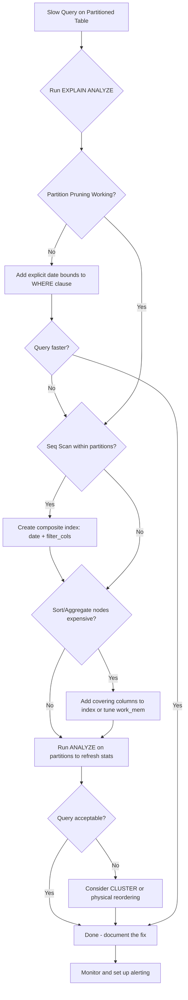

| Difficulty | Channel | Tags |
|---|---|---|
| intermediate | database | explain, query-plan, partitioning |

A 1TB table. 30-second queries. IOPS breaching 24,000 limits every single day. That was the reality for CoinGecko's engineering team when their hourly crypto price table — after eight years of relentless data ingestion — became a performance black hole [1]. What makes this story fascinating isn't just the scale of the problem; it's that the fix introduced a hidden regression that made one query *worse*, and the team didn't catch it until production. If you've ever stared at an EXPLAIN plan and wondered why your partitioned table isn't as fast as the docs promised, this story is for you.

---

> ### Real-World Case — CoinGecko
>
> CoinGecko's hourly crypto price table grew to 1TB+ over 8 years with 100M+ rows, causing queries to take 30+ seconds, IOPS constantly breaching limits at 24K, replica lag, and declining Apdex scores. They needed to optimize without downtime on a table used across all applications.
>
> | | |
> |---|---|
> | **Challenge** | A single PostgreSQL table storing hourly price data for every crypto pair was too large for indexes to help (JSONB column with currency-specific keys made indexing impractical). Queries were full-scanning 1TB+ of data, causing production SLO/SLA risk. |
> | **Solution** | Implemented range-based table partitioning by month on the timestamp column. Created a new partitioned table, warmed it up using Foreign Data Wrappers to read from a pre-warmed replica and write to production (avoiding IOPS exhaustion on the primary), then did a live table swap using triggers for zero-downtime cutover. |
> | **Outcome** | p99 response time dropped 86% from 4.13s to 578ms. IOPS reduced by 20%. Replica lag disappeared. Data deletion went from multi-hour DELETE operations to sub-second partition drops. However, one query actually got WORSE after the switch — it lacked a lower date bound, causing it to scan ALL partitions instead of just the relevant ones. |
> | **Lesson** | Partitioning can be detrimental if queries don't properly constrain the partition key. A query with `created_at > ?` (no upper limit) scanned all partitions and was slower on the partitioned table than the original unpartitioned table. The key insight: partition pruning only works when the WHERE clause provides clean range predicates — without both bounds, you're scanning everything. Always audit every query pattern against the partition key before migrating. |

---

## Hook — The Query That Refused to Speed Up

You partitioned the table. You ran EXPLAIN ANALYZE. You saw it pruning partitions. And yet — the query is still painfully slow. Sound familiar? This is one of the most common frustrations developers encounter with large partitioned PostgreSQL tables. The assumption is that partitioning automatically equals speed. But partitioning is a scalpel, not a magic wand. Without understanding *why* your query is slow — the specific bottleneck hiding in the query plan — you're optimizing blind. The EXPLAIN plan is your map. But reading it wrong, or missing the right clue, leads you down expensive dead ends. Let's unpack exactly what to look for, and the real-world disaster that happens when you skip a step.

## Problem — When Partitioning Creates More Questions Than Answers

Here's the uncomfortable truth many developers learn the hard way: partitioning a table doesn't automatically make queries faster. In fact, it can make certain queries *slower* if your WHERE clause doesn't align with how the data is partitioned. Consider a scenario familiar to many teams: you have a PostgreSQL table with 100M+ rows, partitioned by date. A query filtering on a specific date range is still slow. You check the EXPLAIN plan and see sequential scans, expensive sorts, or — worst of all — the planner scanning *every single partition* because your query lacks a lower date bound. The core challenge isn't that partitioning is broken. It's that developers often conflate three separate problems: partition pruning effectiveness, index utilization patterns within each partition, and sort/aggregate overhead that partitioning doesn't address. Each requires a different diagnostic tool and a different optimization strategy. Miss one, and your 30-second query becomes a 30-second query that also costs more to run [2].

## Real-World Case — CoinGecko's 1TB Table Meltdown

CoinGecko's hourly crypto price table grew to over 1TB after eight years of data [1]. Queries that used to return in milliseconds now took over 30 seconds on average. IOPS usage spiked to 24,000 limits constantly, triggering daily alerts. Replica lag appeared, Apdex scores dropped, and request queues piled up. Their initial instinct — add more indexes — quickly hit a wall. The table contained a JSONB column with keys based on supported currencies, and indexing every possible key combination across applications was deemed impractical [1]. They chose range partitioning by month. During their dry run, they discovered something critical: a cold, unwarmed partitioned table performed *worse* than the original unpartitioned one. Warming up the original table took 10 hours; the partitioned table took 3 hours. Copying 1.2TB of data took over 3 days, with IOPS spiking to 6,000 during the copy alone [1]. On go-live day, the original table was so degraded they couldn't complete a single day's copy within 15 minutes. They improvised with Foreign Data Wrappers to read from a warmed-up staging database and write to production [1]. The results were dramatic: p99 response time dropped 86% from 4.13s to 578ms, IOPS reduced by 20%, and replica lag disappeared entirely. But here's the twist that haunts every partitioning project — one query actually got *worse*. It lacked a lower date bound on the date range, causing PostgreSQL to scan all partitions instead of pruning down to the relevant ones [1].

## Deep Dive — Reading the EXPLAIN Plan Like a Performance Detective

Let's break down the three things you should check in your EXPLAIN plan, in order of priority.

**1. Partition Pruning: The First Thing to Verify**
Partition pruning is PostgreSQL's way of skipping partitions that can't possibly contain matching rows [3]. With pruning enabled (the default), the planner examines each partition's constraints and eliminates irrelevant ones. You can verify this by running:

```sql
EXPLAIN (ANALYZE, BUFFERS) SELECT * FROM events
WHERE event_date BETWEEN '2024-01-01' AND '2024-01-31'
AND status = 'completed';
```

Look for `Subplans Removed: N` in the output — this tells you how many partitions were pruned at planning time. If every partition still appears in the plan, your WHERE clause isn't constraining the partition key effectively. This is exactly what happened to CoinGecko: a query with `created_at > ?` but no upper bound scanned every partition [1].

**2. Index Utilization Within Partitions**
Even with perfect pruning, each partition still needs proper indexes. Look for `Seq Scan` nodes in your EXPLAIN output — if you see them, your partition-level indexes aren't being used. The most effective pattern is a composite index that covers your WHERE clause: `(date_column, filtered_column)`. PostgreSQL's B-tree indexes follow a left-to-right prefix rule [4], so the column order matters enormously. An index on `(event_date, status)` supports queries filtering on `event_date` alone OR `event_date + status` together — but NOT `status` alone.

**3. Sort and Hash Aggregate Operations**
After pruning and indexing, watch for `Sort` or `HashAggregate` nodes with high cost estimates. These operations happen in memory (or spill to disk for large result sets) and can dominate query time. If you see `Sort Method: external merge Disk: XkB`, your sort is spilling to disk — a clear sign you need either a covering index that eliminates the sort, or a `work_mem` increase for that session.

| Scenario | What EXPLAIN Shows | Fix |
|---|---|---| |
| No partition pruning | All partitions scanned | Add explicit date bounds to WHERE clause |
| Seq Scan within partitions | No index used | Create composite index on (date, filter_cols) |
| Expensive Sort node | In-memory or disk sort | Covering index or work_mem tuning |
| Hash Aggregate spill | Disk-based hash agg | Increase work_mem or rewrite query |

## Workflow — The Optimization Diagnostic Path

Here's the step-by-step workflow to diagnose and fix slow queries on partitioned tables:

1. Run `EXPLAIN (ANALYZE, BUFFERS)` on your slow query
2. Check if partitions are being pruned — count visible vs total partitions
3. If no pruning, inspect your WHERE clause for missing partition key bounds
4. If pruning works but query is still slow, check for Seq Scans within partitions
5. Create composite indexes covering the most common filter patterns
6. Check for Sort/HashAggregate operations that dominate execution time
7. Consider CLUSTER or physical ordering for frequently accessed partitions
8. Run ANALYZE on individual partitions to refresh statistics after changes

The diagram below illustrates this diagnostic flow:



Building on this workflow, remember that partition pruning can happen at two different stages [3]: during planning (when the planner knows values statically) and during execution (for parameterized queries). The EXPLAIN output tells you which stage did the work — check the `Subplans Removed` count and the `loops` property carefully.

## Code Example — From Slow to Fast in Four Moves

Here's a practical implementation showing each optimization step:

```sql
-- Step 1: Baseline — identify the problem
-- Run this first to see what PostgreSQL is actually doing
EXPLAIN (ANALYZE, BUFFERS, FORMAT TEXT)
SELECT *
FROM events
WHERE event_date BETWEEN '2024-01-01' AND '2024-01-31'
  AND status = 'completed'
ORDER BY created_at DESC;

-- Step 2: Create composite index covering the WHERE clause
-- The leading column matches the partition key for efficient partition-local scans
-- CONCURRENTLY avoids locking the table during index creation
CREATE INDEX CONCURRENTLY idx_events_date_status
ON events (event_date, status);

-- Step 3: Add a covering index if sorts are expensive
-- INCLUDE columns are stored in the leaf pages without affecting tree structure
-- This eliminates table lookups for queries that only need these columns
CREATE INDEX CONCURRENTLY idx_events_covering
ON events (event_date, status) INCLUDE (created_at, payload);

-- Step 4: Refresh statistics so the planner can make good choices
-- ANALYZE on a partitioned table processes each leaf partition individually
ANALYZE events;

-- Bonus: For append-heavy time-series tables, consider CLUSTER
-- This physically reorders rows on disk to match the index
-- Only needed once — subsequent inserts may not maintain order
CLUSTER events USING idx_events_date_status;
```

**Walkthrough:** Step 1 establishes your baseline with full timing and buffer statistics. The `BUFFERS` option shows you exactly how many pages PostgreSQL reads — if this number is close to the total table size, your index isn't being used. Step 2 creates the composite index that covers your most common query pattern. The `CONCURRENTLY` keyword is critical in production — without it, the index build locks the table against writes [5]. Step 3 adds a covering index with `INCLUDE` columns, which stores additional column values directly in the index leaf pages. This turns an Index Scan (which hops back to the heap for non-indexed columns) into an Index Only Scan. Step 4 refreshes planner statistics — a frequently overlooked step that can cause the planner to choose a bad plan after schema changes.

## Lessons Learned — What CoinGecko (and Every Developer) Should Take Away

**Lesson 1: Always specify both bounds of your date range.** A query with `created_at > ?` but no upper bound will scan every partition. CoinGecko learned this the hard way when one query regressed after switching to partitioned tables [1]. Always use `BETWEEN` or explicit upper bounds.

**Lesson 2: Don't pre-create empty future partitions.** CoinGecko created all partitions for 2025 upfront to reduce future maintenance. But queries without upper bounds scanned these empty partitions, wasting IOPS and CPU [1]. Create partitions just-in-time instead.

**Lesson 3: Warm up your partitions before switching.** A cold partitioned table is slower than a warm unpartitioned one. CoinGecko's dry run revealed that prewarming the original table took 10 hours while the partitioned version took 3 hours [1]. Never skip this step.

**Lesson 4: Run a dry run on a production-mirror database.** CoinGecko's dry run exposed critical gaps: the copy took 3+ days, IOPS spiked to 6,000, and the original table was too degraded to copy from directly [1]. These findings changed their entire execution plan.

**Lesson 5: Block deployments on cutover day.** Two unrelated deployments ran on the same day as the partition switch, causing higher CPU and IOPS that nearly triggered a rollback [1]. Isolate your change.

**Lesson 6: Consider incremental rollout.** Since most users access only recent data (last 4 months), CoinGecko could have toggled queries for recent dates to the new table first [1]. Don't wait for a full migration.

**Lesson 7: Run ANALYZE after any schema or data change.** The planner uses table statistics to make cost-based decisions. Stale statistics lead to bad plans [6]. Run `ANALYZE` on individual partitions, not just the parent table.

---

## Partitioned Table Query Optimization Workflow


<details>
<summary><strong>Original Interview Question</strong></summary>

**Q:** You have a PostgreSQL table with 100M rows partitioned by date. A query filtering on a specific date range is still slow. What would you check in the EXPLAIN plan and how would you optimize it?

**A:** Check partition pruning effectiveness, index utilization patterns, and expensive sort operations. Create composite indexes on (date, filtered_columns) and evaluate clustering strategies for optimal data access.

</details>

## Conclusion

The real lesson from CoinGecko's 1TB table isn't about partitioning — it's about the gap between 'it works' and 'it works fast.' Partitioning solved the retention and pruning problem, but a missing upper date bound almost derailed the entire effort. Tomorrow, open your EXPLAIN plan on your slowest partitioned query. Check three things: is partition pruning actually happening, are indexes being used within each partition, and are sorts or hash aggregates dominating the execution time. Fix those in that order, and you'll get the performance that partitioning promises — not the performance it assumes you'll figure out on your own.

---

## References

1. [CoinGecko: Scaling PostgreSQL Performance with Table Partitioning](https://amree.dev/2025/06/13/scaling-postgresql-performance-with-table-partitioning/) — blog
2. [PostgreSQL Documentation: Table Partitioning](https://www.postgresql.org/docs/current/ddl-partitioning.html) — documentation
3. [PostgreSQL Documentation: Partition Pruning](https://www.postgresql.org/docs/17/ddl-partitioning.html) — documentation
4. [PostgreSQL Documentation: Multicolumn Indexes](https://www.postgresql.org/docs/current/indexes-multicolumn.html) — documentation
5. [PostgreSQL Documentation: CREATE INDEX CONCURRENTLY](https://www.postgresql.org/docs/current/sql-createindex.html) — documentation
6. [PostgreSQL Documentation: ANALYZE](https://www.postgresql.org/docs/17/sql-analyze.html) — documentation
7. [PostgreSQL Documentation: Index Types](https://www.postgresql.org/docs/current/indexes-types.html) — documentation
8. [EDB: How to Use Table Partitioning to Scale PostgreSQL](https://www.enterprisedb.com/postgres-tutorials/how-use-table-partitioning-scale-postgresql) — blog
9. [PostgreSQL Documentation: CLUSTER](https://www.postgresql.org/docs/13/sql-cluster.html) — documentation

---

**Author:** Satishkumar Dhule — [GitHub](https://github.com/satishkumar-dhule) · [LinkedIn](https://linkedin.com/in/satishkumar-dhule) · [Website](https://satishkumar-dhule.github.io)
