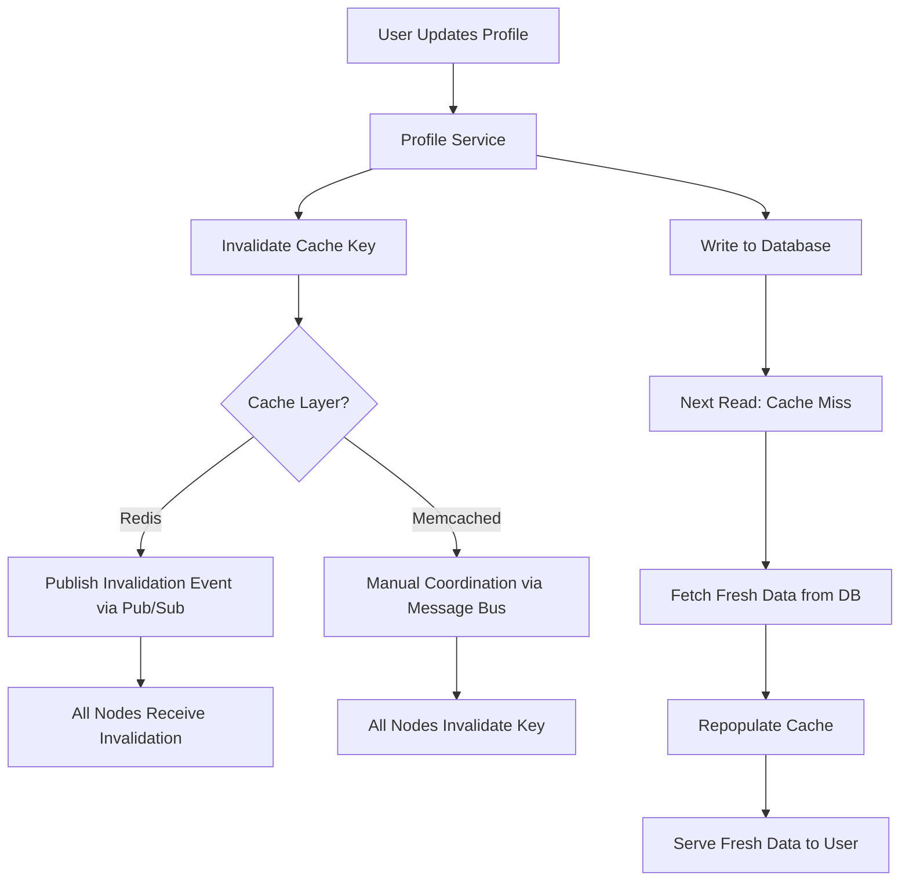

| Difficulty | Channel | Tags |
|---|---|---|
| beginner | backend | redis, memcached, cache-invalidation |

Every time a user updates their profile on Facebook, a cascade of stale data must be purged across thousands of servers — or hundreds of millions of users see an update that never happened [1]. Facebook processes over a billion requests per second, storing trillions of cached items across ~6,000 Memcached servers worldwide. When a single profile edit can leave fleet-wide ghost copies of outdated data, cache invalidation stops being a textbook topic and becomes a survival skill. Understanding how Facebook solved this problem reveals the principles every backend engineer needs for building profile caching that actually works.

---

> ### Real-World Case — Facebook (Meta)
>
> Facebook served hundreds of millions of daily active users whose pages fan out to hundreds of reads per request — friend lists, profiles, photos, likes — over a billion times per second. Reads outnumber writes by ~two orders of magnitude, so almost every user object is fetched through a cache, and the moment a user edits their profile, stale copies of that profile exist fleet-wide and users will notice the update 'didn't stick'.
>
> | | |
> |---|---|
> | **Challenge** | How to keep a distributed user/profile cache consistent at planet-scale: a single profile update touches objects cached across thousands of memcached servers in many clusters, and relying on TTL expiration alone either serves stale data or, when a hot key expires, triggers a thundering herd of database queries. |
> | **Solution** | Facebook chose to build its cache on memcached (not Redis), and solved invalidation with three techniques: (1) prefer DELETE over SET — each SQL statement that mutates authoritative state is amended with the exact memcache keys to invalidate once the transaction commits, so the cache is demand-filled back rather than pre-populated; (2) a daemon named mcsqueal runs on every MySQL instance, parses the replication/commit stream, and issues the delete invalidations to all front-end clusters in batch (the distributed-invalidation coordination problem the topic asks about, solved in memcached via the app-level pipeline rather than pub/sub); (3) leases + a 'stale value' flag to combat the thundering herd when a hot profile key is deleted: a client that receives a valid lease token is the only one allowed to repopulate the key, and can optionally serve a slightly stale value while the fresh one is fetched. |
> | **Outcome** | The system processed over a billion requests per second and stored trillions of items while keeping cache hit rates high; leases reduced the thundering-herd database query rate on popular keys from 6% of requests to 0.3% (peak ~1.3K queries/sec for a single key), without hurting hit rate. The architecture scaled from a few memcached servers to ~6,000 across geo-distributed clusters. |
> | **Lesson** | At scale, TTL expiration is not your invalidation strategy — it's your safety net. Delete-based invalidation driven from the database commit log (what the topic describes as the memcached 'manual coordination' downside) is The right pattern: it's idempotent, works without Redis pub/sub, and deletes beat sets because they trigger demand-fill that can't be overwritten by an older write. The real engineering work is in the invalidation pipeline, not the cache engine. |

---

## The Moment You Realize Caching Is Not Enough

Picture this: you deploy your new user profile service. The cache hit rate climbs to 98%. Your database load drops to a whisper. You celebrate. Then a user emails support saying their updated bio shows the old version. Their friend sees the new one. Your caching layer, the very thing designed to improve performance, has become the source of confusion. This is the caching paradox — the faster your reads become, the harder your writes become. Cache invalidation is not merely a pattern; it is the mechanism that determines whether users trust your system or abandon it. If you have ever stared at a production dashboard wondering why a user's profile update did not propagate, you are not alone. Every backend team encounters this at scale.

## The Core Problem — Why Stale Data Haunts Distributed Systems

At its heart, the problem is simple: caches exist to avoid slow database reads, but any cache is a snapshot of data at a moment in time. When the source of truth changes, the snapshot must be updated or destroyed. For a user profile service, this means every read operation — fetching a name, avatar, or bio — hits the cache first [2]. If a user edits their profile and the cache is not invalidated, every subsequent read returns stale data. The consequences compound in distributed systems. When your application runs across multiple servers, each server may hold its own cached copy of a profile. A write to one server does not automatically propagate to the others. Without a coordinated invalidation strategy, you end up with what Facebook calls 'fleet-wide stale reads' — ghost copies of outdated profiles scattered across your infrastructure [1]. This is not a theoretical concern. For a profile service handling millions of users, even a 5-minute stale window means thousands of users see incorrect information.

## Real-World Case — Facebook (Meta)

Facebook's engineering team documented this exact problem in their 2013 NSDI paper on scaling Memcached at Facebook [1]. The system served hundreds of millions of daily active users, with each page load fanning out to hundreds of cached reads — friend lists, profiles, photos, and likes — processed over a billion times per second. Reads outnumbered writes by roughly two orders of magnitude, making caching essential for performance. However, every user profile edit created the possibility of stale copies existing fleet-wide. Users would notice when updates 'did not stick,' eroding trust in the platform. To solve this, Facebook pioneered lease-based cache invalidation within Memcached, reducing the thundering-herd database query rate on popular keys from 6% of requests down to 0.3% — a peak of ~1,300 queries per second for a single key [1]. Their infrastructure scaled from a few Memcached servers to approximately 6,000 across geo-distributed clusters, proving that cache invalidation, when done right, scales to the largest workloads on the planet.

## Deep Dive — Write-Through, TTL, and the Redis vs Memcached Showdown

So what does cache invalidation actually look like in practice? There are several patterns, but for user profile services, write-through caching with TTL-based expiration is the most practical starting point [3]. With write-through caching, every profile update writes new data to both the database and the cache simultaneously. This ensures consistency at the moment of write. Additionally, deleting the cache key on update forces subsequent reads to fetch fresh data from the database, eliminating stale reads entirely. TTL (Time-To-Live) acts as a safety net — even if invalidation fails for some reason, the cache key expires after a set period (typically 5–30 minutes for profiles) and forces a database read [4].

Here is where the Redis vs Memcached decision becomes critical. Many developers assume these tools are interchangeable. They are not — and the choice has real consequences for your invalidation strategy [5].

**Redis** offers pub/sub messaging, which enables automatic distributed invalidation. When one server updates a profile, it publishes an invalidation message that all other servers receive and act upon. Redis also provides persistence options, advanced data structures like hashes and sorted sets, and atomic operations. For complex invalidation patterns, Redis is the stronger choice [6].

**Memcached**, by contrast, has a simpler architecture optimized purely for caching. It offers lower memory overhead and faster raw cache performance for simple key-value lookups. However, it lacks built-in pub/sub, meaning distributed invalidation requires manual coordination — typically through a message bus like Kafka or RabbitMQ. Memcached also offers no persistence, so if a node crashes, all cached data is lost [5].

The trade-off is not about which tool is better overall. It is about which tool matches your invalidation requirements. If you need automatic distributed invalidation and your profiles have complex relationships, Redis wins. If your workload is purely key-value caching with simple invalidation needs and you prioritize raw speed, Memcached is lighter and faster [3].

## Workflow — How Profile Cache Invalidation Actually Flows

To see how this works end to end, consider the following architecture. When a user updates their profile, the request hits your service, which writes to the database and invalidates the cache key in Redis or Memcached. On the next read, the cache miss triggers a database fetch that repopulates the cache with fresh data. The Mermaid diagram below illustrates this flow, including the distributed invalidation path for Redis pub/sub.



## Code Example — Implementing Write-Through Cache Invalidation

The following Python implementation demonstrates write-through caching with cache invalidation using Redis. It includes TTL-based expiration as a safety net and pub/sub-based distributed invalidation across application instances.

```python
import redis
import json
import time
from typing import Optional, Dict, Any

# Initialize Redis connections for data operations and pub/sub
# Using two clients: one for cache operations, one for pub/sub
redis_client = redis.Redis(host='localhost', port=6379, db=0)
pubsub_client = redis.Redis(host='localhost', port=6379, db=0)
publisher = pubsub_client.pubsub()

CACHE_TTL = 900  # 15 minutes - safety net for stale data
PROFILE_PREFIX = "profile:"
INVALIDATION_CHANNEL = "profile_invalidation"

def cache_key(user_id: int) -> str:
    """Generate a consistent cache key for a user profile."""
    return f"{PROFILE_PREFIX}{user_id}"

def get_profile(user_id: int) -> Optional[Dict[str, Any]]:
    """Fetch profile from cache; on miss, read from DB and repopulate."""
    key = cache_key(user_id)
    
    # Try cache first
    cached = redis_client.get(key)
    if cached:
        print(f"Cache HIT for user {user_id}")
        return json.loads(cached)
    
    # Cache miss — fetch from database
    print(f"Cache MISS for user {user_id} — reading from DB")
    profile = fetch_profile_from_database(user_id)
    
    if profile:
        # Repopulate cache with TTL as safety net
        redis_client.setex(key, CACHE_TTL, json.dumps(profile))
    
    return profile

def update_profile(user_id: int, updates: Dict[str, Any]) -> bool:
    """Write-through update: write to DB, invalidate cache, notify peers."""
    key = cache_key(user_id)
    
    # Step 1: Write new data to the database
    success = save_profile_to_database(user_id, updates)
    if not success:
        return False
    
    # Step 2: Delete the cache key (not update!) to avoid stale reads
    redis_client.delete(key)
    print(f"Invalidated cache for user {user_id}")
    
    # Step 3: Publish invalidation event for distributed nodes
    redis_client.publish(
        INVALIDATION_CHANNEL,
        json.dumps({"user_id": user_id, "action": "invalidate"})
    )
    
    return True

def subscribe_to_invalidation():
    """Listen for invalidation events from other application instances."""
    publisher.subscribe(INVALIDATION_CHANNEL)
    print("Subscribed to profile invalidation channel...")
    
    for message in publisher.listen():
        if message["type"] == "message":
            data = json.loads(message["data"])
            key = cache_key(data["user_id"])
            redis_client.delete(key)
            print(f"Received invalidation for user {data['user_id']}")

def fetch_profile_from_database(user_id: int) -> Optional[Dict[str, Any]]:
    """Simulated database read — replace with your actual ORM call."""
    # In production: SELECT * FROM profiles WHERE id = user_id
    return {"id": user_id, "name": "Jane Doe", "bio": "Updated bio"}

def save_profile_to_database(user_id: int, updates: Dict[str, Any]) -> bool:
    """Simulated database write — replace with your actual ORM call."""
    # In production: UPDATE profiles SET bio = %s WHERE id = %s
    print(f"Saved updates for user {user_id}: {updates}")
    return True
```

**Walkthrough:**
- The `get_profile` function implements the cache-aside pattern: check cache first, on miss read from DB and repopulate with a 15-minute TTL [7].
- The `update_profile` function executes write-through caching: it writes to the database first, then deletes the cache key (rather than updating it, which risks race conditions), and publishes an invalidation event for peer instances [3].
- The `subscribe_to_invalidation` function runs as a background listener, receiving pub/sub messages and invalidating stale keys across all application nodes — this is what gives Redis its distributed invalidation advantage over Memcached [6].
- The TTL acts as a safety net: even if a pub/sub message is lost, the stale data expires within 15 minutes rather than persisting indefinitely [4].

## Lessons Learned — What Facebook's Scale Teaches Every Backend Engineer

The journey from a simple cache to a distributed invalidation system reveals several hard-won lessons. First, never update cache keys on write — delete them. Updating introduces race conditions where a slow write overwrites a newer value [3]. Second, always set a TTL as a safety net. No invalidation mechanism is 100% reliable; TTL ensures stale data eventually expires [4]. Third, choose your cache tool based on your invalidation needs, not raw performance benchmarks. Redis pub/sub eliminates the manual coordination Memcached requires, which reduces operational complexity at scale [6]. Fourth, monitor cache hit rates religiously. A dropping hit rate is often the first sign that your invalidation strategy is leaving stale keys around [5]. Finally, remember Facebook's thundering-herd lesson: without proper lease mechanisms or stale-while-revalidate patterns, popular keys can trigger thousands of simultaneous database queries when the cache expires [1]. If you are building a profile service today, start with write-through invalidation, add a Redis pub/sub layer for distributed consistency, and instrument everything. The next time a user updates their profile, every server in your fleet should serve the new data — not a ghost from five minutes ago.

---

## Profile Cache Invalidation Flow


<details>
<summary><strong>Original Interview Question</strong></summary>

**Q:** You're building a user profile service that caches frequently accessed profiles. How would you implement cache invalidation when a user updates their profile, and what trade-offs would you consider between Redis and Memcached?

**A:** Implement write-through caching with TTL-based expiration. On profile update, invalidate the cache by deleting the key and writing new data to both the database and cache. Redis offers pub/sub for automatic distributed invalidation, while Memcached requires manual coordination across nodes.

</details>

## Conclusion

Cache invalidation is not a solved problem — it is a managed risk. Facebook proved that even at billion-request-per-second scale, the combination of write-through caching, TTL safety nets, and pub/sub-based distributed invalidation keeps stale data from reaching users. The key takeaway: delete cache keys on write, never update them; always set a TTL as your last line of defense; and choose Redis over Memcached when your invalidation logic requires distributed coordination. Start by implementing the write-through pattern in your profile service today, add monitoring for cache hit rates, and treat invalidation as a first-class concern — not an afterthought.

---

## References

1. [Facebook (Meta) incident report — Scaling Memcache at Facebook](https://www.usenix.org/system/files/conference/nsdi13/nsdi13-final170.pdf) — paper
2. [MDN — Cache strategies and best practices](https://developer.mozilla.org/en-US/docs/Web/HTTP/Caching) — documentation
3. [AWS — Caching strategies overview](https://docs.aws.amazon.com/AmazonElastiCache/latest/mem-ug/Strategies.html) — documentation
4. [Redis documentation — EXPIRE command](https://redis.io/docs/latest/commands/expire/) — documentation
5. [Wikipedia — Memcached](https://en.wikipedia.org/wiki/Memcached) — documentation
6. [Redis documentation — Pub/Sub](https://redis.io/docs/latest/develop/interact/pubsub/) — documentation
7. [DigitalOcean — Implementing caching strategies with Redis](https://www.digitalocean.com/community/tutorials/understanding-redis-caching) — blog
8. [Wikipedia — Cache invalidation](https://en.wikipedia.org/wiki/Cache_invalidation) — documentation

---

**Author:** Satishkumar Dhule — [GitHub](https://github.com/satishkumar-dhule) · [LinkedIn](https://linkedin.com/in/satishkumar-dhule) · [Website](https://satishkumar-dhule.github.io)
