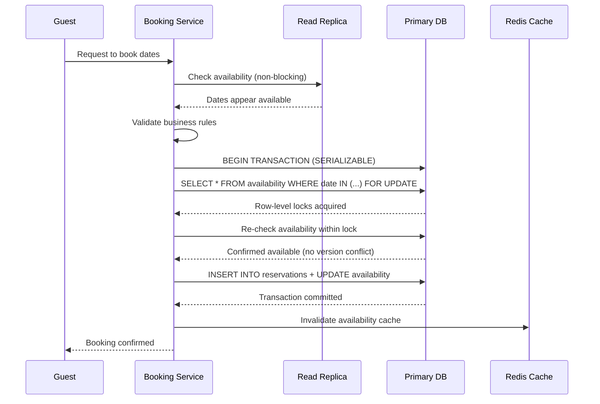

| Difficulty | Channel | Tags |
|---|---|---|
| intermediate | database | acid, isolation-levels, mvcc |

It was 3am when the alerts started firing—guests were being charged twice for the same reservation, and hosts were receiving duplicate payments. Airbnb's migration from a monolithic Ruby on Rails application to microservices had shattered their payment system into independent services, each handling fragments of a booking transaction [1]. A single guest booking now triggered a cascade of payment operations across service boundaries: charging the guest, holding funds in escrow, paying the host, calculating fees. Any network call in this chain could fail, time out, or succeed without the caller knowing. The result: Airbnb faced the risk of double-charging guests at massive scale, with no reliable way to know if a payment had actually landed.

---

> ### Real-World Case — Airbnb
>
> As Airbnb migrated from a monolithic Ruby on Rails application to a service-oriented architecture (SOA), their payment system was broken into many independent microservices. A single guest booking now triggered a cascade of payment operations across service boundaries — charging the guest, holding funds in escrow, paying the host, calculating fees. Any network call in this chain could fail, time out, or succeed without the caller knowing. The result: Airbnb faced the risk of double-charging guests or double-paying hosts at massive scale, with no reliable way to know if a payment had actually landed.
>
> | | |
> |---|---|
> | **Challenge** | In a distributed system where every API call fans out into downstream service calls that each change state, maintaining exactly-once delivery semantics is theoretically impossible. A network timeout after a charge succeeds but before the response arrives leaves the system in an ambiguous state — retry risks double-charging, not retrying risks failing to process a legitimate payment. This was compounded by the fact that users could double-click 'Book' or aggressive client retry policies could fire duplicate requests. The system needed to guarantee that money-moving operations were processed at most once, across all microservices, under all failure conditions. |
> | **Solution** | Airbnb built 'Orpheus', a generic idempotency library embedded across all payments services. Every payment operation is modeled as a three-phase state machine: (1) Pre-RPC: validate and acquire a row-level lock on an idempotency key stored in the master database; (2) RPC: make the external call to the payment processor; (3) Post-RPC: record the outcome. No network calls happen during Pre/Post-RPC phases (learned the hard way after connection pool exhaustion), and no database work happens during RPC. Errors are classified as retryable or non-retryable — misclassification in either direction is catastrophic (false non-retryable = permanently failed request; false retryable = double payment). Critically, all idempotency reads/writes happen exclusively on the master database, never replicas. A few seconds of replica lag on a retry could cause the system to miss a successful response and re-execute the payment. |
> | **Outcome** | Since launching Orpheus, Airbnb Payments achieved five nines (99.999%) of data consistency, while their annual payment volume simultaneously doubled. The framework became the foundation for their rebuilt payment orchestration system (2022), where every major workflow is a DAG of retryable idempotent steps, maintaining eventual consistency across all key services. The same patterns — idempotency keys, master-only reads, lease-based locking, retryable/non-retryable classification — were extended to Kafka-based asynchronous communication, upgrading at-least-once delivery to exactly-once semantics. |
> | **Lesson** | The most counterintuitive insight: reading idempotency state from a database replica — which seems like a performance optimization — can directly cause double payments. A few seconds of replication lag means a correct retry sees no record of a successful operation and re-executes it. Consistency must win over latency for financial operations. The second key lesson: idempotency is not just a server-side concern. Clients must cooperate by sending the same key on retries, never mutating request payloads between tries, and using exponential backoff with jitter to avoid thundering herds. Neither side can get this right alone — it requires a contract between client and server. |

---

## Hook — When Your Booking System Becomes a Casino

Picture this: two guests are scrolling through Airbnb at the exact same moment, both eyeing the same beachfront villa in Bali for the same weekend. Both click 'Reserve.' Both enter their credit card details. Both hit 'Confirm.' And then—chaos. Your system now has two confirmed bookings for one property on one weekend. One guest will arrive to find someone else already sipping coffee on the balcony. This isn't a hypothetical scenario. This is the daily reality of building high-traffic booking systems where race conditions lurk in every millisecond of concurrency. The stakes aren't just technical debt—they're customer trust, revenue, and your company's reputation. Every booking platform faces this fundamental tension: how do you guarantee that only one person can book a property at any given moment, while still serving millions of users simultaneously without turning your database into a bottleneck?

## Problem — The Illusion of Availability

At first glance, preventing double bookings seems straightforward: check if a date is available, then book it. But here's the catch—checking and booking aren't atomic operations. Between the moment you read availability and the moment you write the reservation, another request can slip through. This is the classic race condition, and it's amplified in distributed systems where network latency can stretch milliseconds into seconds. Traditional approaches like SELECT FOR UPDATE create row-level locks that serialize access to specific dates, but this introduces contention. If 100 users try to book the same popular property, they're all waiting in line behind a single lock. Meanwhile, your database CPU spikes, response times degrade, and users start abandoning their carts. The real problem isn't just preventing double bookings—it's doing so while maintaining high availability and acceptable latency for millions of concurrent users. Many developers discover that naive locking strategies solve correctness but destroy performance, especially during peak booking periods like holiday seasons or flash sales.

## Real-World Case — Airbnb's Distributed Payment Nightmare

Airbnb's engineering team documented a critical challenge during their microservices migration: when a single booking triggered payment operations across independent services, any network call could fail without the caller knowing the outcome [1]. This wasn't just a theoretical concern—without proper transaction handling, the system risked double-charging guests or double-paying hosts at scale. The solution was Orpheus, a framework that achieved five nines (99.999%) of data consistency while their annual payment volume simultaneously doubled. Orpheus introduced idempotency keys, master-only reads, lease-based locking, and retryable/non-retryable classification of operations. These patterns transformed at-least-once delivery into exactly-once semantics, ensuring that even when Kafka messages were replayed or services retried failed operations, payments landed exactly once. This framework became the foundation for their rebuilt payment orchestration system in 2022, where every major workflow is a directed acyclic graph (DAG) of retryable, idempotent steps maintaining eventual consistency across all key services [1].

## Deep Dive — SERIALIZABLE Isolation and Optimistic Concurrency

To understand how to prevent double bookings, you need to grasp two foundational concepts: isolation levels and concurrency control. PostgreSQL offers four isolation levels—READ UNCOMMITTED, READ COMMITTED, REPEATABLE READ, and SERIALIZABLE—with SERIALIZABLE being the strongest guarantee [2]. Under SERIALIZABLE isolation, transactions appear to execute sequentially even though they run concurrently, preventing phenomena like dirty reads, non-repeatable reads, and phantom reads [3]. However, SERIALIZABLE comes with a performance cost: it requires conflict detection and can cause serialization failures that force transaction retries. This is where optimistic concurrency control (OCC) enters the picture. Instead of locking rows upfront (pessimistic), OCC allows transactions to proceed optimistically, checking for conflicts only at commit time using version columns. If a conflict is detected, the transaction retries with fresh data [4]. The MVCC (Multi-Version Concurrency Control) snapshot reads in PostgreSQL allow readers to access consistent snapshots without blocking writers, which is crucial for checking availability without holding locks [5]. Many developers think SERIALIZABLE is too slow for high-throughput systems, but when combined with optimistic patterns and proper retry logic, it provides the strongest consistency guarantees without sacrificing availability. After debugging this pattern many times, here is what works: use SERIALIZABLE for the critical booking write path, but allow read replicas to handle availability checks with slightly stale data—stale availability checks are acceptable if your write path has the final say.

## Workflow — From Check to Confirmation in Five Steps

The booking workflow follows a precise sequence designed to maximize concurrency while guaranteeing correctness. First, the system reads the current availability snapshot from a read replica—a fast, non-blocking operation that tells you which dates appear open. Second, it validates the requested dates against business rules (minimum stay, check-in restrictions). Third, it enters the SERIALIZABLE transaction where it performs SELECT FOR UPDATE on the specific date rows, acquiring row-level locks that prevent concurrent modifications. Fourth, it re-checks availability within the locked context—if another transaction already booked those dates, the version column will have incremented, causing a serialization failure. Finally, it writes the reservation and commits, releasing locks. If any step fails, exponential backoff retry logic kicks in, typically retrying 3-5 times before failing the booking. The following diagram illustrates this concurrent booking flow:

## Code Example — Implementing the Booking Engine

Here's a production-grade Python implementation using SQLAlchemy with PostgreSQL that demonstrates the optimistic concurrency pattern with SERIALIZABLE isolation:

## Lessons Learned — Battle Scars and Best Practices

After implementing booking systems for high-traffic platforms, several patterns emerge. First, always use idempotency keys for booking operations—generate a unique key per booking attempt and store it, so retries don't create duplicate reservations. Second, implement circuit breakers for hot properties; if a property is receiving 100 booking requests per second, the lock contention will destroy your database. Consider rate limiting or queueing for high-contention resources. Third, monitor lock wait times as a key metric—if your P99 lock wait exceeds 500ms, you have a contention problem that needs architectural attention. Many teams discover too late that their retry logic has no exponential backoff, causing thundering herd problems when a popular property becomes available. Finally, remember that eventual consistency is often acceptable for availability checks, but strong consistency is non-negotiable for the actual booking write. As Airbnb learned, the framework for achieving consistency in distributed systems requires careful classification of operations as retryable versus non-retryable, with idempotency as the foundation [1].

---

## Concurrent Booking Flow with Optimistic Locking

<strong>Original Interview Question</strong>

**Q:** You're building a booking system for Airbnb where multiple users can reserve the same property simultaneously. How would you design the transaction handling to prevent double bookings while maintaining high availability?

**A:** Use SERIALIZABLE isolation with optimistic concurrency control. Implement row-level locks on property availability tables, use MVCC snapshot reads for checking availability, and apply application-level validation to ensure atomic booking operations.

## Conclusion

The double-booking paradox reveals a fundamental truth about distributed systems: consistency and availability exist in tension, but with the right patterns, you can achieve both. Airbnb's journey from monolithic chaos to five-nines consistency demonstrates that the solution isn't choosing between SERIALIZABLE isolation and performance—it's layering optimistic concurrency control, idempotency, and intelligent retry logic on top of strong isolation guarantees. As you build your next booking system, remember: use SERIALIZABLE for critical writes, allow slightly stale reads for availability checks, implement exponential backoff for retries, and always generate idempotency keys. The real lesson from Airbnb isn't about a specific technology—it's about systematically classifying operations as retryable versus non-retryable, building frameworks that make consistency the default rather than an afterthought. Start by auditing your current transaction boundaries: are you holding locks too long? Are your retries thundering? Are your idempotency keys actually unique? Fix these three things, and you'll sleep better during your next Black Friday sale.

---

## References

1. [Airbnb engineering: Avoiding double payments in a distributed payments system](https://medium.com/airbnb-engineering/avoiding-double-payments-in-a-distributed-payments-system-2981f6b070bb) — blog
2. [PostgreSQL documentation: Transaction Isolation](https://www.postgresql.org/docs/current/transaction-iso.html) — documentation
3. [Wikipedia: Isolation (database systems)](https://en.wikipedia.org/wiki/Isolation_(database_systems)) — documentation
4. [Wikipedia: Optimistic concurrency control](https://en.wikipedia.org/wiki/Optimistic_concurrency_control) — documentation
5. [PostgreSQL documentation: MVCC - Multi-Version Concurrency Control](https://www.postgresql.org/docs/current/mvcc.html) — documentation
6. [Martin Kleppmann: Designing Data-Intensive Applications](https://www.oreilly.com/library/view/designing-data-intensive-applications/9781491903094/) — paper
7. [Wikipedia: Distributed transaction](https://en.wikipedia.org/wiki/Distributed_transaction) — documentation
8. [AWS documentation: DynamoDB transactions](https://docs.aws.amazon.com/amazondynamodb/latest/developerguide/transaction-apis.html) — documentation

---

**Author:** Satishkumar Dhule — [GitHub](https://github.com/satishkumar-dhule) · [LinkedIn](https://linkedin.com/in/satishkumar-dhule) · [Website](https://satishkumar-dhule.github.io)
