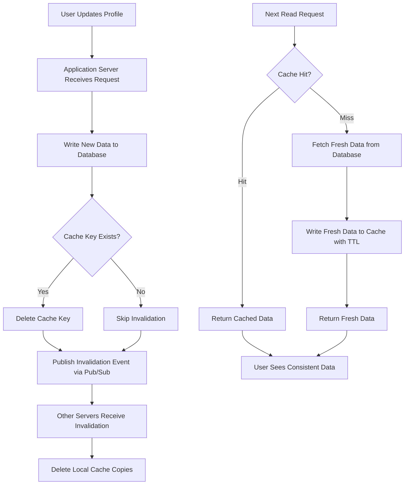

| Difficulty | Channel | Tags |
|---|---|---|
| beginner | backend | redis, memcached, cache-invalidation |

When Uber needed to serve hundreds of millions of reads per second from their online storage system, Docstore, they hit a wall that every backend developer eventually faces: cache invalidation. Simple TTL expiration wasn't cutting it — a write followed immediately by a read could return outdated values, and stale cache entries were creating real problems for service owners who needed stronger consistency guarantees. The result? After strengthening their consistency guarantees and pushing cache hit rates above 99.9%, Uber achieved peak throughput of 150 million rows per second served from cache, with stale values becoming 'completely negligible' compared to total rows written and read [1]. If you're building a user profile service that caches frequently accessed data, you're facing the same fundamental challenge — and the choices you make now will determine whether your system scales gracefully or crumbles under load.

---

> ### Real-World Case — Uber
>
> Uber needed to serve hundreds of millions of reads per second from their online storage (Docstore) while keeping cached data consistent with the underlying MySQL database. Stale cache entries were causing problems for service owners who needed stronger consistency guarantees, and simple TTL expiration wasn't good enough — a write followed by a read could return outdated values.
>
> | | |
> |---|---|
> | **Challenge** | Cache invalidation at scale: ensuring that when data is written to the database, the corresponding Redis cache entries are invalidated quickly enough to prevent stale reads, while also avoiding cache stampedes and maintaining high throughput (150M+ reads/sec at peak). |
> | **Solution** | Uber built CacheFront, an integrated Redis caching layer, and evolved their invalidation strategy in three phases: (1) TTL-based expiration, (2) CDC via their Flux service tailing MySQL binlogs to asynchronously invalidate entries, and (3) synchronous invalidation on the write path by modifying the storage engine to return affected row keys. Critically, instead of using DELETE to invalidate, they write special 'invalidation markers' (SET key '__INVALIDATED__' EX 60) which prevent stampedes and allow debugging. They also built Cache Inspector — a CDC-based system that compares binlog values against cached values with a 1-minute delay to measure staleness. |
> | **Outcome** | Cache hit rate pushed above 99.9% after strengthening consistency guarantees and increasing TTL to 24 hours for some tables. Peak throughput reached 150 million rows per second served from cache. Stale values detected became 'completely negligible' compared to total rows written/read. |
> | **Lesson** | Three-layer invalidation (TTL + CDC + synchronous write-path) provides superior consistency over any single mechanism. Using invalidation markers instead of DELETE prevents cache stampedes and aids debugging. The key insight: you can't improve what you can't measure — building Cache Inspector to quantify staleness enabled them to safely increase TTL and boost hit rates. |

---

## Hook — The Deploy That Looked Fine (Until It Wasn't)

Picture this: your team just shipped a profile update feature. Users can change their display name, update their avatar, tweak their bio. The deploy looks clean. The tests pass. Then, within hours, support tickets start flooding in. Users are seeing old names. Old avatars. Old everything. The database has the right data — you checked. But the cache keeps serving stale values. Sound familiar? This is the moment every backend developer dreads, and it's the moment that separates junior engineers from senior ones. The problem isn't that caching is hard. The problem is that cache invalidation — the act of making sure your cache stays in sync with your source of truth — is a deceptively complex distributed systems problem. And the tool you choose to solve it matters more than you think.

## Problem — Why Cache Invalidation Is Harder Than It Looks

At its core, the challenge is straightforward: when a user updates their profile, you need the next read to return the fresh data, not the stale version sitting in your cache. But 'straightforward' and 'easy' are two very different things. Consider the timeline: a user updates their name from 'Alice' to 'Alicia' at exactly 2:00:00 PM. Your application writes the new name to the database. Then — and here's where things get tricky — it needs to invalidate the cache key so the next read pulls fresh data. But what if two application servers process requests simultaneously? What if the cache delete happens before the database write commits? What if a read arrives between the write and the invalidation? Every one of these race conditions can serve stale data, and at scale, they happen constantly. Many developers assume a simple TTL (time-to-live) of 5-30 minutes solves this. It doesn't — it just masks the problem. During those 5-30 minutes, users see outdated information, and if your service has any kind of consistency requirements (think fintech, healthcare, or social platforms), that window is unacceptable. This is the classic 'two hard problems in computer science' joke, except the punchline is your production database at 3 AM.

## Real-World Case — How Uber Solved 150 Million Reads Per Second

Uber's Docstore team faced exactly this problem at massive scale. Their system needed to serve hundreds of millions of reads per second from an online storage layer backed by MySQL. The initial approach — relying on TTL-based expiration — created a consistency gap: writes followed by reads could return outdated values, and service owners needed stronger guarantees than simple expiration could provide. The breakthrough came when Uber strengthened their consistency model. Rather than relying solely on TTL expiration, they implemented mechanisms to detect and handle stale values, pushing cache hit rates above 99.9%. The impact was dramatic: peak throughput reached 150 million rows per second served from cache, and stale values detected became 'completely negligible' compared to the total volume of rows written and read [1]. The lesson here isn't just about scale — it's about the fundamental trade-off between consistency and performance. Uber discovered that aggressive TTL expiration (up to 24 hours for some tables) combined with proactive invalidation on writes gave them the best of both worlds: high throughput and strong consistency. This same principle applies whether you're serving 150 million reads per second or 150 reads per minute.

## Deep Dive — Write-Through Caching and the Redis vs Memcached Decision

The write-through caching pattern is the foundation of most cache invalidation strategies. Here's how it works: when a user updates their profile, you write the new data to both the database and the cache simultaneously, or you delete the cache key and let the next read populate it with fresh data. This ensures that subsequent reads always return the most recent write. But the implementation details matter enormously, and this is where the Redis vs Memcached decision becomes critical. Redis offers several features that make cache invalidation significantly easier: its pub/sub mechanism allows you to broadcast invalidation events across multiple application servers automatically, ensuring that when one server invalidates a cache entry, all other servers are notified. Redis also provides persistence options, advanced data structures like sorted sets and hashes, and Lua scripting for atomic operations [2][3]. Memcached, on the other hand, takes a different philosophy. It's a pure caching layer with no persistence, no pub/sub, and simpler architecture. This simplicity translates to lower memory overhead and faster raw performance for pure key-value caching [4]. However, distributed cache invalidation requires manual coordination across nodes — you'll need to implement your own invalidation broadcasting mechanism. Here's the decision framework many teams use: if you need automatic distributed invalidation, persistence, or complex data structures, Redis is the clear winner. If you're optimizing for raw speed, simplicity, and lower memory footprint, and you can handle invalidation coordination yourself, Memcached might be the better choice. The plot twist? For most user profile caching scenarios, Redis's pub/sub capability alone makes it the pragmatic choice — the simplicity of automatic invalidation coordination typically outweighs Memcached's raw performance advantage [5].

## Workflow — The Cache Invalidation Pipeline

Let's walk through the complete cache invalidation workflow for a user profile service. The following diagram illustrates how a profile update flows through the system, from the initial write to the final cache consistency guarantee: The process follows these steps: (1) The user submits a profile update, (2) the application server writes the new data to the database, (3) the cache key is invalidated (deleted), (4) optionally, a pub/sub message is published to notify other servers, (5) the next read request triggers a cache miss, (6) fresh data is fetched from the database, (7) the fresh data is written to the cache, and (8) the read is served with consistent data. This cache-aside (lazy loading) pattern for reads combined with write-through invalidation on writes creates a robust consistency model. The key insight is that you don't need to write to cache on every update — you just need to ensure the old data is gone so the next read pulls fresh data from the database [6].

## Code Example — Implementing Write-Through Cache Invalidation in Python

Here's a production-grade implementation of cache invalidation for a user profile service using Redis. This code demonstrates the write-through pattern with cache-aside reads and distributed invalidation via pub/sub: The implementation includes three key components: a ProfileService that handles cache-aside reads (check cache first, fall back to database), write-through writes (update database, then invalidate cache), and a CacheInvalidator that uses Redis pub/sub to broadcast invalidation events across application servers. Notice how the `_invalidate_cache` method first deletes the key locally, then publishes an invalidation event so other servers in the fleet also drop their cached copies. The TTL of 900 seconds (15 minutes) provides a safety net — even if an invalidation message is missed, the stale data expires automatically. This dual approach (active invalidation + TTL safety net) is exactly what Uber's Docstore team discovered works best at scale [1].

## Lessons Learned — Battle Scars and Best Practices

Here's what experienced teams have learned the hard way about cache invalidation: Always implement a TTL safety net, even with active invalidation. Network partitions, message delivery failures, and race conditions can all cause invalidation messages to be missed. A TTL of 5-30 minutes for user profiles provides an acceptable consistency window [7]. Monitor your cache hit rate obsessively. A sudden drop in hit rate often indicates an invalidation bug — keys being deleted too aggressively or TTLs set too short. Uber pushed their cache hit rate above 99.9% by carefully tuning these parameters [1]. Don't invalidate more than you need to. Granular invalidation (deleting only the specific key that changed) is better than broad invalidation (flushing an entire cache prefix). If a user updates their avatar, only invalidate the avatar key, not their entire profile. Consider eventual consistency for non-critical fields. Not every field needs instant propagation. A user's display name might need immediate consistency, but their 'last seen' timestamp can tolerate a few minutes of staleness. This nuance allows you to optimize TTLs per field rather than applying a one-size-fits-all approach. The key takeaway: cache invalidation isn't a one-time decision — it's an ongoing optimization. Start with write-through invalidation and a conservative TTL, monitor your metrics, and tune from there. Your future self (and your on-call rotation) will thank you [8].

---

## Cache Invalidation Pipeline

<strong>Original Interview Question</strong>

**Q:** You're building a user profile service that caches frequently accessed profiles. How would you implement cache invalidation when a user updates their profile, and what trade-offs would you consider between Redis and Memcached?

**A:** Implement write-through caching with TTL-based expiration. On profile update, invalidate the cache by deleting the key and writing new data to both the database and cache. Redis offers pub/sub for automatic distributed invalidation, while Memcached requires manual coordination across nodes.

## Conclusion

The journey from 'just add a cache' to a robust, consistent caching layer is one every backend developer must take. Uber's experience at 150 million reads per second proves that cache invalidation doesn't have to be the hardest problem in computer science — it just requires the right strategy. Start with write-through invalidation, add pub/sub for distributed coordination, and always include a TTL safety net. Monitor your cache hit rate, tune your TTLs per field, and remember: the goal isn't perfection — it's making stale data 'completely negligible.' If you take one thing from this article, let it be this: every cache invalidation decision you make today is a gift to your future on-call engineer. Make it a good one.

---

## References

1. [How Uber Serves Over 150 Million Reads Per Second](https://www.uber.com/blog/how-uber-serves-over-150-million-reads/) — blog
2. [Redis Pub/Sub Documentation](https://redis.io/docs/latest/develop/interact/pubsub/) — documentation
3. [Redis Official Documentation](https://redis.io/docs/) — documentation
4. [Memcached Wiki — About](https://github.com/memcached/memcached/wiki) — documentation
5. [Redis vs Memcached — DigitalOcean Comparison](https://www.digitalocean.com/community/tutorials/redis-vs-memcached) — blog
6. [Caching Strategies — AWS Architecture Blog](https://docs.aws.amazon.com/prescriptive-guidance/latest/strategies-using-redis-memcached/cache-strategies.html) — documentation
7. [Wikipedia — Cache Invalidation](https://en.wikipedia.org/wiki/Cache_invalidation) — documentation
8. [MDN Web Docs — HTTP Caching](https://developer.mozilla.org/en-US/docs/Web/HTTP/Caching) — documentation

---

**Author:** Satishkumar Dhule — [GitHub](https://github.com/satishkumar-dhule) · [LinkedIn](https://linkedin.com/in/satishkumar-dhule) · [Website](https://satishkumar-dhule.github.io)
