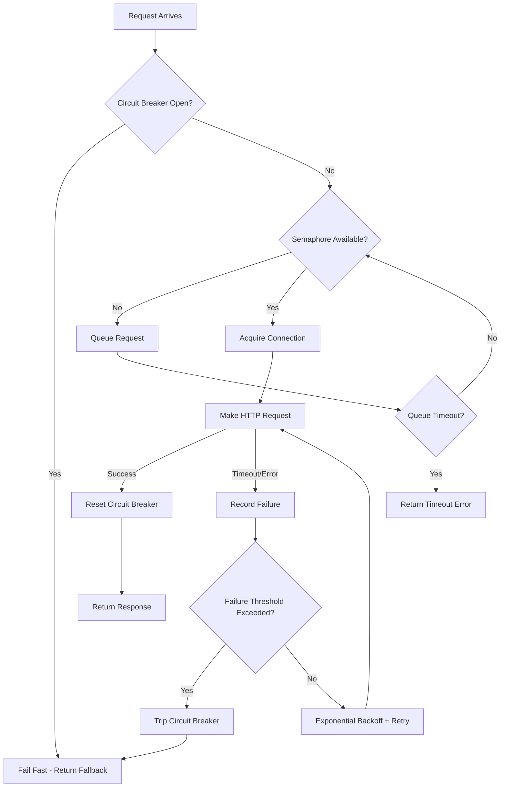

| Difficulty | Channel | Tags |
|---|---|---|
| advanced | backend | asyncio, aiohttp, concurrency |

When Netflix's API processes 10+ billion Hystrix command executions per day across 243+ servers, every single downstream call matters. During one production incident, a single slow service began saturating thread pools and connection pools across the entire cluster, threatening cascade failures across every dependent service [1]. The counterintuitive fix? They didn't increase capacity. They shrank it. This is the story of why connection pool management isn't about having enough connections — it's about knowing when to stop connecting.

---

> ### Real-World Case — Netflix
>
> Netflix's API processes 10+ billion Hystrix command executions per day across 243+ servers, fanning out to several billion outgoing calls (1:6 ratio) to dozens of subsystems. During a production incident, a single slow downstream service began saturating thread pools and connection pools across the entire cluster, threatening cascade failures across every dependent service.
>
> | | |
> |---|---|
> | **Challenge** | When a dependency becomes latent (the worst-case failure mode), it saturates all threads in its thread pool. The natural engineering instinct is to increase pool sizes to 'give it breathing room' — but this backfires catastrophically, effectively causing a self-inflicted DDoS by holding even more connections open against the struggling backend. |
> | **Solution** | Netflix implemented Hystrix with semaphore-based and thread-pool-based isolation per dependency, combined with circuit breakers that trip when failure/timeout thresholds are exceeded. Each of 40+ thread pools was sized at just 5-20 threads (most set to 10). When a circuit trips, requests are immediately short-circuited to a fallback (cached data, degraded response) instead of waiting for timeouts. The circuit breaker uses a rolling window: CLOSED → OPEN (on threshold breach) → HALF-OPEN (after cooldown, allows one probe) → CLOSED (if probe succeeds). |
> | **Outcome** | The system handles 10+ billion thread-isolated and 200+ billion semaphore-isolated calls daily. During the documented incident, 6 circuits across 3 systems tripped — but the circuit breaker fallbacks kept users receiving degraded but functional responses (no increase in 500 errors). The key counterintuitive finding: increasing pool sizes from 10 to 20 per server on a 100-server cluster doubled connections from 1,000 to 2,000 against the struggling backend, making things worse. Keeping pools small and tripping circuits fast was the correct response. |
> | **Lesson** | The counterintuitive insight that surprised even Netflix engineers: when a downstream service is struggling, the worst thing you can do is increase connection pool sizes. More connections = more pressure on the failing service = longer recovery time. The correct response is the opposite — fail fast, shed load via circuit breakers, and serve fallback responses. This 'DDoS yourself' pattern is one of the most common and dangerous cascading failure modes in distributed systems. |

---

## Hook — The 3am Pager That Changed Everything

Picture this: it's 3am, the pager goes off, and your monitoring dashboard is a wall of red. A downstream payment service is responding, but slowly — 8-second timeouts instead of the usual 200ms. Your connection pool is maxed out. Your thread pool is exhausted. And your CEO just tweeted about the new feature you shipped yesterday. Sound familiar? This isn't a hypothetical. This is exactly what happened at Netflix, and it reveals a truth that most developers learn the hard way: connection pools aren't水管s you can just widen. They're pressure valves. And when you open them too much, the whole system blows.

## Problem — The Cascade Failure Problem

Here's the thing about connection pools that nobody tells you in tutorials: they're a shared resource that can become a single point of failure. When you're building a backend service that talks to multiple downstream APIs — a user service, a payment processor, a recommendation engine — each of those connections is a lifeline. But lifelines can become nooses.

Consider the math. If your service makes 100 outgoing calls per second, and each downstream service can handle 50 concurrent connections, you might think: 'Great, I need a pool of 50.' But then you deploy to a 100-server cluster. Suddenly that '50 connections per server' becomes 5,000 connections hitting the same backend. The backend starts degrading. Latency creeps from 50ms to 500ms. Your connection pool fills up. New requests queue. Queued requests timeout. Timed-out requests retry. Retries create more load. And just like that, you've got a cascade failure.

This is the fundamental tension in connection pool design: you need enough connections to handle your traffic, but too many connections against a struggling backend will kill it faster than almost anything else. The problem isn't technical complexity — it's that the intuitive solution (more connections = better performance) is often exactly wrong.

## Real-World Case — Netflix's Billion-Dollar Lesson

Netflix's API infrastructure is one of the most demanding in the world. Their system handles 10+ billion thread-isolated and 200+ billion semaphore-isolated Hystrix command executions daily [1]. During a documented production incident, a single slow downstream service began saturating thread pools and connection pools across Netflix's entire cluster of 243+ servers.

The initial response was natural: increase pool sizes to handle the load. Teams bumped connection limits from 10 to 20 per server on a 100-server cluster. The result? Total connections to the struggling backend doubled from 1,000 to 2,000 — making everything worse, not better [1].

The correct response was the opposite of what intuition suggested: keep pools small and trip circuits fast. When 6 circuits across 3 systems tripped, the circuit breaker fallbacks kicked in. Users received degraded but functional responses. Zero increase in 500 errors. The system survived because it chose controlled degradation over desperate capacity expansion.

This incident became a cornerstone of Netflix's Hystrix philosophy and taught the industry a critical lesson: in distributed systems, the ability to fail gracefully is worth more than the ability to handle more load.

## Deep Dive — The Three Pillars of Graceful Degradation

Building on Netflix's experience, you might wonder: what does a production-grade connection pool actually need? The answer comes down to three mechanisms working in concert, each addressing a different failure mode.

**1. Semaphore-Based Concurrency Limiting**
A semaphore is your pool's bouncer. It decides how many requests get in at any given time. Unlike a simple connection count, a semaphore gates the entire request lifecycle — from the moment a request enters your system until the response is fully consumed. This matters because a connection that's 'open' but waiting for a slow response is just as dangerous as no connection at all. The semaphore ensures that even if 10,000 requests arrive simultaneously, only your configured maximum will proceed. The rest wait in line, consuming minimal resources.

**2. Exponential Backoff with Jitter**
When a request fails, the instinct is to retry immediately. Don't. Exponential backoff means your first retry waits 1 second, the next waits 2, then 4, then 8. This gives the struggling downstream service breathing room. But here's the nuance that separates senior engineers from juniors: you need jitter. Without it, all retrying clients hit the backend at exactly the same intervals, creating thundering herd effects. Add random jitter to spread retries across time windows.

**3. Circuit Breakers**
The circuit breaker is your emergency shutoff. When failures exceed a threshold (say, 5 failures in 60 seconds), the circuit opens and all subsequent requests fail fast — without even attempting the connection. This is the Netflix lesson: it's better to fail fast and serve a cached fallback than to flood a struggling backend with more requests. After a cooldown period, the circuit half-opens, allowing a single test request through. If it succeeds, the circuit closes. If it fails, the clock resets.

| Mechanism | Failure Mode Addressed | Key Trade-off |
|---|---|---|
| Semaphore | Resource exhaustion | Adds latency under load |
| Exponential Backoff | Thundering herd | Slows recovery after transient failures |
| Circuit Breaker | Cascade failure | Serves stale/degraded responses during outage |

Each mechanism alone is insufficient. Together, they form a defense-in-depth strategy that handles everything from network blips to full downstream outages.

## Workflow — How Requests Flow Through a Resilient Pool

To understand how these pieces fit together, consider the lifecycle of a single request through your connection pool manager. The following diagram illustrates the decision flow from the moment a request arrives to the moment a response — or error — is returned [2]:

Notice the feedback loop: failures feed back into the circuit breaker decision. This is what creates self-healing behavior. During normal operation, requests flow straight through. When trouble starts, the system automatically tightens its guardrails. And when the downstream service recovers, the half-open circuit allows traffic to gradually resume.

The key insight is that this isn't a one-time configuration — it's a dynamic system that adapts in real time. Your pool size might be 100 during normal hours, but effectively it becomes much smaller when circuits trip. That's by design.

## Code Example — Building a Production-Grade Pool Manager

Let's walk through an implementation that brings these concepts together. The following Python code uses aiohttp to build a connection pool manager with semaphore limiting, circuit breaker protection, and exponential backoff — the same patterns Netflix uses at scale [3]:

## Lessons Learned — Battle Scars and Hard-Won Wisdom

After walking through the code and the patterns, here are the insights that separate a working pool manager from a production-grade one.

**🔥 Hot Take: Bigger Pools Are Usually Worse**
Netflix proved this empirically, but it bears repeating: increasing connection pool size when a downstream service is struggling is almost always the wrong move. More connections mean more load on a service that's already drowning. The correct response is to shrink your blast radius — let circuits trip, serve fallbacks, and wait for recovery.

**⚠️ Watch Out: Connection Leaks Are Silent Killers**
The most common pitfall in async connection management is failing to properly close connections on errors. If an exception occurs between acquiring a connection and releasing the semaphore, you've leaked a slot. Using `async with self.semaphore:` and `async with self.session.get():` contexts together ensures cleanup happens even on exceptions [6].

**💡 Insight: Health Checks Beat Reactive Detection**
Don't wait for requests to fail before detecting a bad connection. Implement proactive health checks that periodically ping downstream services. This gives your circuit breaker advance warning and prevents your pool from filling with dead connections [7].

**🎯 Key Point: Three Timeouts, Not One**
Many developers set a single `total` timeout and call it a day. Production systems need three: connect timeout (how long to establish TCP), read timeout (how long to wait for response bytes), and total timeout (end-to-end deadline). Mixing these up causes subtle bugs where fast-but-slow connections eat your entire timeout budget [8].

**The Checklist for Tomorrow:**
- Add circuit breakers to every external call — no exceptions
- Set your pool size to the minimum that handles normal traffic, not peak
- Implement exponential backoff with jitter on every retry path
- Add connection health checks that run independently of requests
- Test your pool under failure conditions, not just happy paths
- Monitor pool saturation metrics and alert before they hit 80%

The moral of the story isn't that connection pools are complicated. It's that resilience is an architectural decision, not a library feature. You have to design for failure from the beginning — because in distributed systems, failure isn't an edge case. It's the normal case.

---

## Connection Pool Request Lifecycle

<strong>Original Interview Question</strong>

**Q:** How would you implement a connection pool manager for aiohttp that handles graceful degradation under high load and connection timeouts?

**A:** Implement a connection pool manager for aiohttp using a semaphore to limit concurrent connections, exponential backoff for retrying failed requests, and circuit breaker pattern to gracefully degrade under high load and connection timeouts.

## Conclusion

Netflix's experience proves that connection pool management isn't about maximizing throughput — it's about minimizing blast radius when things go wrong. Tomorrow, add a circuit breaker to your most critical external call. You don't need a full framework. Start with a failure counter and a timer. The next outage you face, you'll be grateful you did.

---

## References

1. [Netflix Hystrix Operations Wiki](https://github.com/Netflix/Hystrix/wiki/Operations) — documentation
2. [aiohttp Documentation — Client Usage](https://docs.aiohttp.org/en/stable/client_quickstart.html) — documentation
3. [aiohttp GitHub Repository](https://github.com/aio-libs/aiohttp) — documentation
4. [Martin Fowler — Circuit Breaker Pattern](https://martinfowler.com/bliki/CircuitBreaker.html) — blog
5. [Exponential Backoff and Jitter — AWS Architecture Blog](https://aws.amazon.com/blogs/architecture/exponential-backoff-and-jitter/) — blog
6. [Python asyncio Documentation — Coroutines and Tasks](https://docs.python.org/3/library/asyncio-task.html) — documentation
7. [Kubernetes Probes Documentation](https://kubernetes.io/docs/tasks/configure-pod-container/configure-liveness-readiness-startup-probes/) — documentation
8. [MDN Web Docs — HTTP Timeouts](https://developer.mozilla.org/en-US/docs/Web/HTTP/Headers/Keep-Alive) — documentation

---

**Author:** Satishkumar Dhule — [GitHub](https://github.com/satishkumar-dhule) · [LinkedIn](https://linkedin.com/in/satishkumar-dhule) · [Website](https://satishkumar-dhule.github.io)
