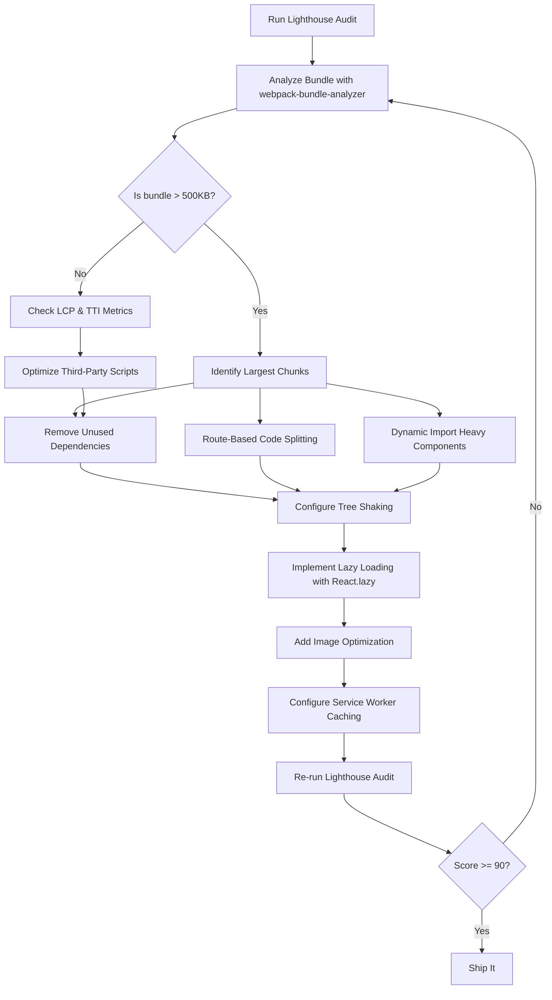

| Difficulty | Channel | Tags |
|---|---|---|
| intermediate | frontend | lighthouse, bundle, lazy-loading |

It was loading in 7 seconds on a 3G connection. Not a dashboard. Not a data-heavy analytics tool. A simple landing page — the first thing every potential Netflix subscriber ever saw. And for every extra second that spinner spun, conversion rates bled away. What Netflix discovered next changed how they shipped JavaScript entirely [1], and the lessons apply directly to every React app sitting at a 65 Lighthouse score wondering why users are bouncing.

---

> ### Real-World Case — Netflix
>
> Netflix's logged-out homepage — the critical sign-up landing page that every new subscriber sees first — was loading in 7 seconds on a 3G connection. The page contained 300KB of JavaScript including React, Lodash, and hydration code, despite being a relatively simple landing page where most interactivity wasn't needed for the first user interaction.
>
> | | |
> |---|---|
> | **Challenge** | The initial JavaScript bundle (React + client-side libraries + hydration context data) was causing unacceptable Time-to-Interactive latency, especially impacting conversion rates on mobile and slow-network users in international markets. |
> | **Solution** | Netflix took the counterintuitive step of removing client-side React entirely from the landing page, replacing it with minimal vanilla JavaScript for essential interactions. React was still used server-side to render the initial HTML. They then implemented a prefetching strategy — proactively downloading the full React bundle and CSS for the sign-up flow during idle time after the landing page loaded, so it was already cached when users clicked 'Sign Up'. |
> | **Outcome** | Time-to-Interactive decreased by over 50% for the logged-out homepage. JavaScript payload reduced by 200KB. Subsequent navigations (to the sign-up flow) were 30% faster due to prefetching. Desktop TTI dropped to under 3.5 seconds on throttled 3G simulations. |
> | **Lesson** | Sometimes the best performance optimization is questioning whether you need a framework at all for a specific page. Deferring client-side framework execution until it's actually needed — rather than eagerly hydrating everything — can yield dramatic improvements. The key insight is that server-side rendering and client-side interactivity are separate concerns that can be loaded independently. |

---

## The Weight of a Single Second

You know the feeling. You run Lighthouse, the gauge needles swing, and there it is: 65. Your Time to Interactive sits at 4.2 seconds. Your bundle is 2.1MB of JavaScript that the browser has to parse, compile, and execute before a user can even click a button. For every second of delay, conversion rates drop by an average of 7% — and that is not a theoretical number. Google's own research across mobile sites confirmed this relationship between speed and revenue [2]. But here is the uncomfortable truth: most developers stare at that 2.1MB number and immediately reach for the wrong tools. They minify CSS. They compress images. They add caching headers. All fine moves — but none of them address the elephant in the bundle. The real problem is not that your JavaScript is slow. It is that you are shipping JavaScript your users never asked for, to features they may never visit, on page loads where they need exactly three things to work.

## Netflix's 7-Second Problem

Netflix faced this exact crisis on their logged-out homepage — the critical sign-up landing page that every new subscriber sees first. The page loaded in 7 seconds on a 3G connection and contained 300KB of JavaScript including React, Lodash, and hydration code, despite being a relatively simple landing page where most interactivity was not needed for the initial user interaction [1]. Here is the plot twist: Netflix did not rewrite React. They did not switch to a lighter framework. They did something far more surgical. They analyzed exactly what JavaScript was needed for that first paint and stripped out everything else. The result? Time-to-Interactive dropped by over 50%, the JavaScript payload shrank by 200KB, and subsequent navigations to the sign-up flow were 30% faster thanks to prefetching strategies [1]. The lesson is clear — you do not always need to rebuild the engine. Sometimes you just need to stop hauling a trailer full of furniture down the highway when all you needed was a backpack.

## Why Your Bundle Exploded — A Technical Autopsy

Building on Netflix's discovery, let us open the hood of your own 2.1MB bundle. When webpack (or Vite, or esbuild) compiles your React application, every import statement is a potential doorway. Import a utility library? That entire library lands in your bundle unless tree shaking catches it. Add a date formatter? Congratulations — you might have just pulled in the entire moment.js locale catalog. The core tension in modern frontend development is this: developers optimize for developer experience, but the browser pays the bill for runtime experience [3]. Specifically, there are three categories of bundle bloat that plague React applications. First, there is **unused dependencies** — packages imported but whose code is never actually executed. A single lodash import can add 70KB minified to your bundle [4]. Second, there are **non-route code** — components and logic for /settings, /admin, or /analytics pages that get bundled into the initial load even though users land on /dashboard. Third, there is **polyfills and vendor code** — Babel polyfills, fetch shims, and third-party analytics scripts that have no business being in the critical path. The key insight is this: a 2.1MB bundle does not mean 2.1MB of useful code. It often means 200KB of essential code buried under 1.9MB of inertia.

## The Optimization Workflow — From Analysis to Transformation

So how do you systematically turn a 65 into a 90+? The answer follows a repeatable workflow that Netflix themselves refined [1]. It starts with measurement, not magic. The following diagram illustrates the complete optimization pipeline — from initial analysis through to verified improvements. Notice how each step feeds the next; you cannot skip ahead without losing signal. The workflow is iterative: after each optimization, you re-measure. The goal is not one big rewrite but a series of compounding gains. Many developers jump straight to code splitting without first understanding what is actually heavy — and that is like reorganizing a closet without ever opening the doors. The diagram below captures this process visually.

## Code Splitting in Practice — Route by Route

Here is the code that turns a monolithic React bundle into a lean, lazy-loaded application. The approach uses React.lazy() with Suspense for route-based splitting — the same pattern Netflix employed to defer non-critical code [1]. Notice how each route becomes its own chunk, loaded only when the user navigates to it. The error boundary wrapping ensures that if a chunk fails to load, the user sees a graceful fallback instead of a white screen. A common mistake here is splitting too granularly — creating a separate chunk for every tiny component. That creates excessive HTTP requests that degrade performance on slower networks. The sweet spot is route-level splitting first, then component-level splitting only for genuinely heavy features like chart libraries or rich text editors [5].

## The Full Picture — What Actually Moves the Needle

If you have followed along so far, you have seen the analysis workflow and the core code splitting pattern. But code splitting alone will not get you from 65 to 90. The remaining gains come from a constellation of smaller optimizations that compound. Here is the honest hierarchy of what moves Lighthouse scores, based on documented results from production React applications [6]. Image optimization consistently delivers the largest single score improvement — switching to next-gen formats like WebP or AVIF and implementing lazy loading for below-the-fold images can recover 10-15 points on its own [7]. Tree shaking configuration matters more than most developers realize; the difference between default webpack and a properly configured ES module setup can eliminate 20-30% of dead code [4]. Third-party script auditing is the silent killer — analytics, chat widgets, and A/B testing tools often inject 100-300KB of JavaScript that runs before your app becomes interactive. And finally, service worker caching, when implemented correctly, ensures that subsequent visits are nearly instant — Netflix achieved 30% faster follow-up navigations through prefetching alone [1].

## Battle Scars — Lessons from the Trenches

Here is where the theory meets reality, and where most optimization guides go silent. After debugging performance across dozens of React applications, certain patterns of failure emerge repeatedly. The first battle scar: **over-splitting**. Teams get excited about React.lazy() and split every component into its own chunk. On a 3G connection, that can actually make performance worse — the waterfall of 15 small HTTP requests takes longer than one medium-sized chunk. The second scar: **lazy loading the wrong things**. Some developers lazy-load navigation components or layout wrappers — pieces the user needs immediately. The rule is simple: if the user sees it on first render, do not lazy-load it. The third scar: **ignoring the data layer**. You can ship a 50KB bundle and still have a 4.2s TTI if your GraphQL query fetches 2MB of data on mount. Bundle size and network payload are different problems with different solutions [3]. The fourth scar: **forgetting to verify**. Developers implement lazy loading, see the bundle size drop in their build output, and call it done — without ever checking whether Lighthouse actually improved. Always measure in production-like conditions, not just locally [6]. The bottom line is this: optimization is not a one-time task. It is a discipline that requires ongoing vigilance, measurement, and a healthy skepticism toward assumptions.

---

## React Bundle Optimization Pipeline

<strong>Original Interview Question</strong>

**Q:** You're tasked with improving a React app's Lighthouse performance score from 65 to 90+. The bundle size is 2.1MB and Time to Interactive is 4.2s. What specific steps would you take to optimize the bundle and implement lazy loading?

**A:** Implement code splitting with React.lazy() and Suspense, analyze bundle composition with webpack-bundle-analyzer to identify largest chunks, remove unused dependencies and optimize imports, add dynamic imports for heavy components and third-party libraries, implement route-based splitting for better initial load times, and utilize tree shaking with proper ES module configuration.

## Conclusion

The journey from 65 to 90+ is not about a single silver-bullet optimization. Netflix did not achieve their 50% TTI improvement by doing one thing right — they systematically eliminated unnecessary JavaScript at every layer [1]. The same discipline applies to your 2.1MB bundle: start by understanding what is actually heavy, then split routes, tree-shake dead code, lazy-load non-critical features, and verify every change with Lighthouse. The most important lesson is not technical — it is cultural. Performance is not a one-time fix you ship and forget. It is a discipline that compounds. Every new dependency is a conversation. Every route is a decision. And every millisecond of Time-to-Interactive is a user deciding whether to stay or bounce. The tools are well-documented [5][6][7], the patterns are proven, and the business case is undeniable [2]. The only remaining variable is whether you treat performance as an afterthought or as a first-class feature. Start with one thing tomorrow: run webpack-bundle-analyzer on your production build. What you find in that treemap will surprise you — and that surprise is where the optimization journey begins.

---

## References

1. [Netflix Web Performance Case Study](https://medium.com/dev-channel/a-netflix-web-performance-case-study-c0bcde26a9d9) — blog
2. [Google Research on Mobile Page Speed and Conversion](https://web.dev/articles/find-out-how-slow-sites-lose-money) — documentation
3. [MDN: Web Performance Best Practices](https://developer.mozilla.org/en-US/docs/Web/Performance/How_web_performance_affects_businesses) — documentation
4. [Webpack: Tree Shaking Documentation](https://webpack.js.org/guides/tree-shaking/) — documentation
5. [React Docs: Lazy Loading and Code Splitting](https://react.dev/reference/lazy/Suspense) — documentation
6. [Lighthouse Performance Scoring Methodology](https://developer.chrome.com/docs/lighthouse/performance/performance-scoring) — documentation
7. [MDN: Lazy Loading Images and Video](https://developer.mozilla.org/en-US/docs/Web/Performance/Lazy_loading) — documentation
8. [Core Web Vitals by Google](https://web.dev/articles/vitals) — documentation

---

**Author:** Satishkumar Dhule — [GitHub](https://github.com/satishkumar-dhule) · [LinkedIn](https://linkedin.com/in/satishkumar-dhule) · [Website](https://satishkumar-dhule.github.io)
