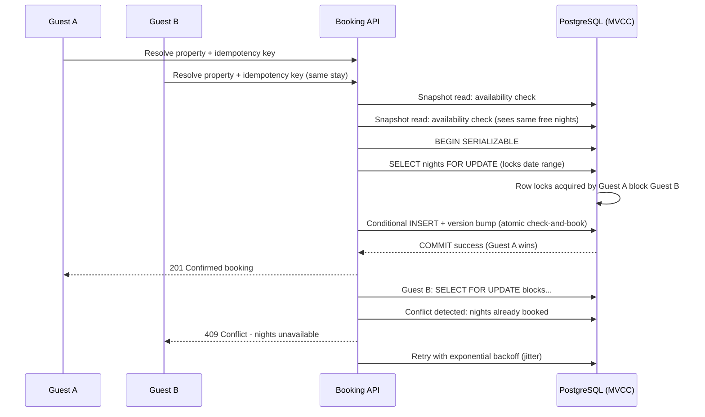

| Difficulty | Channel | Tags |
|---|---|---|
| intermediate | database | acid, isolation-levels, mvcc |

A guest clicks 'Reserve' on the same beachfront villa at the exact moment another guest does the same. Two payments process. One property. Both guests get confirmations. Someone is going to have a very bad vacation — and your support queue is about to explode. This is the concurrency nightmare that haunts every marketplace, and as Airbnb discovered when its own payments platform faced the same race condition in a service-oriented architecture, the stakes escalate the moment you add distributed systems [1]. The good news? Databases gave us the weapons to prevent this. This article is about wielding them correctly.

---

> ### Real-World Case — Airbnb
>
> After moving from a monolith to a service-oriented architecture, Airbnb's payments services faced a classic distributed race: a network timeout or client auto-retry could cause the same booking charge to be processed multiple times, or the same payout to be sent to a host twice. In the worst case, a retry racing past a slow response could double-charge a guest or produce duplicate confirmations — the payments equivalent of overbooking.
>
> | | |
> |---|---|
> | **Challenge** | Guarantee that a single money-moving (and by extension booking) operation executes at most once, even under aggressive client retries, replica lag, and partial network failures across many independently deployed microservices — a 'check-then-act' problem where application-level validation alone cannot prevent duplicate writes. |
> | **Solution** | Airbnb built 'Orpheus', a general-purpose idempotency framework: every request carries a deterministic idempotency key (e.g. 'payment-1234-refund'); concurrent calls with the same key must acquire a database row-level lock on that key before proceeding, and idempotency state lives in a master database read for strong consistency instead of replicas/caches (where lag causes duplicates). Later, payment orchestration was rebuilt as a DAG of retryable idempotent steps, transforming Kafka's at-least-once delivery into exactly-once behavior. |
> | **Outcome** | The framework was adopted across the payments platform and is credited with five 9s (99.999%) consistency for payments, eliminating double charges to guests and duplicate payouts to hosts while keeping the API retry-friendly. |
> | **Lesson** | In high-availability booking systems, the hard race isn't the happy-path 'two users click at once' — it's the retry/timeout path, where the same logical operation gets replayed. Pessimistic row locks on an idempotency key in a master database are a simpler and more robust guarantee than distributed transactions, and trusting read replicas for conflict checks can itself reintroduce double-booking. |

---

## Hook — The shared cabin that couldn't hold a single doubt

Picture this: you are building the next Airbnb. Forty-eight hours to a major holiday weekend, and 14 guests are all staring at the same converted warehouse loft. Eight of them press 'Confirm Booking' within the same 400 milliseconds. Your calendar table says 'available' for each of them because each request read the same snapshot. Eight confirmations. One loft. Seven refunds, one furious owner, and a Twitter thread that writes itself.

This is not a hypothetical failure of poor craftsmanship — it is the natural, predictable outcome of ignoring how databases actually serialize concurrent writes. Every developer eventually discovers, often the hard way, that 'check availability, then insert booking' in application code is a race condition wearing a trench coat. And Airbnb knows this better than almost anyone: their own engineering blog documents how a moving-to-microservices refactor turned timeouts and client auto-retries into duplicated charges and payout doubles on their payments platform [1]. Overbooks and double-charges are cousins from the same family: two concurrent writes, only one should win.

## Problem — Why 'check then book' is a race condition with a trench coat

The naive booking flow reads cleanly in a whiteboard diagram: verify property availability, insert the reservation, charge the guest, send the confirmation. But three words break it: *concurrent* guests, *network* latency, and *retries*.

Here is what actually happens under load. Guest A's request reads the availability row and sees 'free'. Guest B's request does the same. Both pass the check. Both insert a booking row. Both commit. The database was never consulted about whether *both* could fit — the application made that decision twice, independently, based on stale information.

This is the classic lost-update problem, and it shows up in subtler forms than you might expect. Consider the underbook route: you solve the double-booking with a heavy table-wide lock, but now every booking on the platform serializes behind a single mutex. Throughput collapses, availability tanks, and during peak season your booking service starts returning 500s under traffic it should easily handle. Many developers discover that the CRUD-tier solutions — unique constraints [2], application-level checks, Redis locks — each solve one slice of the problem and quietly ignore the others. The real challenge is not eliminating concurrency; it is *taming* it so that correctness and throughput coexist.

## Real-World Case — Airbnb's double-charge incident and the idempotency fix

After Airbnb decomposed its payments platform from a monolith into service-oriented architecture, it ran straight into a distributed race: a network timeout or an aggressive client auto-retry could cause the same booking charge to be processed multiple times — or the same payout to a host to be sent twice. In the worst case, a retry racing past a slow response would double-charge a guest or produce duplicate confirmations. It was the payments equivalent of overbooking: two executions of the same logical operation, but inventory (or money) only intended to let one through [1].

Airbnb's response was a general-purpose idempotency framework called “Orpheus” — a library that assigns every incoming request a unique idempotency key and tracks its lifecycle so identical retries replay the original result instead of re-executing the work [1]. The framework was adopted across the payments platform and is credited with maintaining five-nines (99.999%) consistency for payments, eliminating double charges to guests and duplicate payouts to hosts while keeping the API retry-friendly [1].

The insight transfers directly to your booking system. The guest's double-click is a retry. The mobile app that re-sends a timed-out request is a retry. The browser's back-button re-submission is a retry. If your system cannot tell 'same request, second attempt' from 'new request, first attempt', you are guaranteed to overbook eventually. Idempotency is not a payments-only concern — it is the standard anti-pattern guard for any state-changing endpoint.

## Deep Dive — MVCC, isolation levels, and the optimistic-versus-pessimistic spectrum

To understand why double-bookings happen in the first place, you have to understand what most modern databases are doing under the hood: multiversion concurrency control (MVCC). PostgreSQL maintains data consistency with a multiversion model — each transaction sees a consistent snapshot of data as it was at a point in time, regardless of concurrent changes [3]. The apparent magic is that readers never block writers and writers never block readers [3].

The catch is that this guarantee comes with trade-offs on the *isolation* you choose. The four standard isolation levels sit on a spectrum of how aggressively they defend against dirty reads, non-repeatable reads, phantom reads, and serialization anomalies [4]. At the strict end sits SERIALIZABLE, which guarantees that concurrent transactions commit as if they ran one after another — the serialization-anomaly column in PostgreSQL's isolation matrix is 'Not possible' only at this level [4].

Here is the plot twist many developers miss: SERIALIZABLE does not mean 'lock everything.' PostgreSQL implements it as Serializable Snapshot Isolation (SSI), which detects dangerous read-write and write-write dependencies between concurrent snapshot transactions and aborts one of them rather than serializing them up front [3]. In other words, you get correctness with dramatically less lock contention than textbook two-phase locking.

That leaves a strategic choice. Pessimistic concurrency — `SELECT ... FOR UPDATE` — blocks competing transactions deterministically; it is excellent when contention is high and correctness violations are catastrophic, but it sacrifices availability under load. Optimistic concurrency — a version column checked on write — lets everyone read freely and aborts stale writers at commit time; it scales beautifully but punishes your guest with a 'Sorry, just booked' error at the worst possible moment. There is no universally 'right' answer. High-value inventory with frequent collisions demands pessimism; read-heavy catalog data rewards optimism.

A comparison worth internalizing:

| Concern | Optimistic (version column) | Pessimistic (SELECT FOR UPDATE) |
|---|---|---|
| Read availability | Unlimited — reads never block | Readers can block behind writers |
| Contention cost | Paid at commit (abort + retry) | Paid at lock acquisition |
| Best when | Writes are rare, reads dominate | Collisions are frequent, latencies short |
| Failure mode | Stale-object error to the user | Queued waits, potential deadlocks |
| ACID impact | Atomic on the single UPDATE [5] | Full transaction atomicity around the lock [5] |

Which pattern do you reach for first? The answer changes depending on whether the property is a $40/night closet or a $4,000/night chateau — and that's exactly the scalability layer you should be thinking about next.

## Workflow — The five-step atomic booking dance

Building on the deep-dive, here is the workflow that production-grade booking systems use to get both correctness and availability. The architecture that follows is exactly the kind of pipeline the interview answer describes: an availability-calendar table carrying row-level locks, a SERIALIZABLE transaction for the critical reserve step, a version column for optimistic freshness, and a retry loop armed with exponential backoff.

1. **Validate the guest.** Authenticate the request and confirm the property exists — cheap reads only.
2. **Read availability via MVCC snapshot.** Use a read replica or a non-locking snapshot read to pre-check the requested date range. This is fast and never blocks concurrent writers.
3. **Acquire row locks on the date range.** Inside a transaction set to SERIALIZABLE, run `SELECT ... FOR UPDATE` on each date's availability row for the stay. Any competing booking blocks here — the database now arbitrates the conflict.
4. **Check-and-book atomically.** With locks held, confirm every night is still unreserved, insert the booking, atomically flip the calendar rows to booked, and mark the availability list on the property row. One atomic unit [5].
5. **Return and retry on serialization failure.** If the transaction aborts due to a detected serialization anomaly, apply a retry policy with exponential backoff plus jitter — a crucial detail, since naive immediate retries simply re-collide with each other.

This is the heartbeat of the system. The Mermaid diagram below walks through the full lifecycle, showing how two concurrent guests cascade through the same checkpoints and how only one makes it out with a confirmed reservation.

## Code Example — A production-grade booking service

Warning: This Python code is the 'concurrency control' part of a real pipeline. Many developers stop at the unique constraint in the database and declare victory. Unique constraints fail silently under certain failure modes, so you need a versioned, lock-arbitrated booking transaction.

```python
# booking_service.py
import asyncio
import random
import asyncpg

# Vertically integrated: an idempotency check, bounded retries with
# exponential backoff, and a SERIALIZABLE transaction with row locks.

async def reserve_property(
    conn, property_id, guest_id, check_in, check_out,
    idempotency_key, max_retries=3,
):
    # --- 1. Idempotency gate (Airbnb's Orpheus pattern) --------------------
    # Replay previously completed requests instead of re-executing them.
    existing = await conn.fetchrow(
        """SELECT booking_id, status FROM booking_requests
           WHERE idempotency_key = $1""", idempotency_key
    )
    if existing is not None:
        return {"status": "replayed", "booking_id": existing["booking_id"]}

    # --- 2. Bounded retry loop with exponential backoff ---------------------
    for attempt in range(max_retries):
        try:
            async with conn.transaction(isolation="SERIALIZABLE"):
                # Lock every night of the requested stay, in a stable order
                # to eliminate deadlock scenarios entirely.
                locked = await conn.execute(
                    """SELECT night
                       FROM availability
                       WHERE property_id = $1
                         AND night >= $2 AND night < $3
                       ORDER BY night
                       FOR UPDATE""",
                    property_id, check_in, check_out,
                )
                if locked.count("UPDATE 0") > 0:
                    return {"status": "conflict", "reason": "date_out_of_range"}

                # --- 3. The atomic check-and-book ---------------------------
                stale = await conn.fetchrow(
                    """SELECT version FROM properties WHERE id = $1""", property_id
                )
                if stale is None:
                    return {"status": "error", "reason": "property_not_found"}

                booking = await conn.fetchrow(
                    """INSERT INTO bookings (property_id, guest_id, check_in,
                            check_out, status, version)
                       SELECT id, $2, $3, $4, 'confirmed', version
                       FROM properties
                       WHERE id = $1 AND version = $5
                       RETURNING id""",
                    property_id, guest_id, check_in, check_out, stale["version"],
                )
                if booking is None:
                    return {"status": "conflict", "reason": "stale_version"}

                # Mark the calendar rows booked: this is where the lock
                # synchronizes concurrent reservations for the same nights.
                await conn.execute(
                    """UPDATE availability SET status = 'booked'
                       WHERE property_id = $1
                         AND night >= $2 AND night < $3""",
                    property_id, check_in, check_out,
                )
                return {"status": "confirmed", "booking_id": booking["id"]}

        except asyncpg.SerializationError:
            # Detected by SERIALIZABLE/SSI: back off with jitter, then retry.
            delay = (2 ** attempt) + random.uniform(0, 0.5)
            await asyncio.sleep(delay)

    return {"status": "error", "reason": "timeout"}
```

**Walking through it:** the function first consults the idempotency table, so a client retry with the same key simply gets the previous outcome — exactly how Airbnb stopped double charges [1]. It then opens a SERIALIZABLE transaction in which `SELECT ... FOR UPDATE` locks the entire date range in sorted order; this is the 'row-level locks on the availability calendar' from the interview answer, and the `ORDER BY night` ordering prevents cross-thread deadlocks. The check-and-book is fused into a single conditional INSERT that also bumps the property's version column — the optimistic fencing layer. If two guests race, the loser's version check fails and they receive a clean conflict response. On a SerializationError, runtime applies exponential backoff with jitter, and because most collisions are resolved by the *locks* rather than aborts, throughput remains high even on the hottest properties.

## Lessons Learned — Sleep, durability, and the one insight to take to production

Step back and the picture is coherent: an idempotency key gate keeps retries from becoming duplicates; MVCC reads provide cheap, non-blocking availability checks; row-level locks on a per-date calendar arbitration serialize only the truly conflicting writes; and SERIALIZABLE/SSI provides a safety net that aborts the pathological interleavings that slip through [3][4].

**The battle scars every team collects:**

- **Do not lock entire properties.** Lock the specific date rows. A property blocked for check-in Saturday should not prevent check-in Sunday.
- **Order your locks.** Multiple transactions acquiring rows in different orders is how deadlocks are born — always sort.
- **Treat idempotency keys as load-bearing infrastructure.** The guest's double-tap and the mobile app's timeout-retry are real, not theoretical. A unique constraint on `(property_id, guest_id, date_range, idempotency_key)` is the cheapest insurance you will ever buy [1].
- **Circuit-break the hot properties.** Airbnb's approach to traffic management leans on adaptive control rather than brute-force capacity; your booking service should do the same for your top 1% of listings. Monitor lock-wait times and abort rates separately for high-demand inventory.
- **Never let application-level checks stand alone.** The database must be the final arbiter — unique constraints, version columns, or serializable isolation — because the application cannot observe conflicts it never sees.

So what should you do differently tomorrow? Audit every state-changing endpoint in your booking flow for idempotency keys, then rework the critical reserve path into a lock-protected, version-checked transaction. The double-booking does not announce itself — the first sign is a guest arriving at a villa that already has another family in it. Airbnb's five-nines consistency for payments [1] proves this level of rigor is attainable, and your guests deserve the same certainty for the roof over their heads.

---

## Concurrent Booking Race



<details>
<summary><strong>Original Interview Question</strong></summary>

**Q:** You're building a booking system for Airbnb where multiple users can reserve the same property simultaneously. How would you design the transaction handling to prevent double bookings while maintaining high availability?

**A:** Use SERIALIZABLE isolation with optimistic concurrency control. Implement row-level locks on property availability tables, use MVCC snapshot reads for checking availability, and apply application-level validation to ensure atomic booking operations.

</details>

## Conclusion

The moral of the story is simple: concurrency is not your enemy — uncoordinated concurrency is. Arm your bookings with idempotency keys to keep retries honest, use MVCC snapshot reads for cheap availability checks, arbitrate the genuinely conflicting writes with row-level locks inside SERIALIZABLE transactions, and fence every write with a version check. That combined posture is what bought Airbnb 99.999% consistency for payments [1], and it is exactly what your booking service needs before the next holiday weekend. Start tonight: add the idempotency column, wrap the reserve path in a transaction, and let the database be the referee it was designed to be.

---

## References

1. [Airbnb incident report](https://medium.com/airbnb-engineering/avoiding-double-payments-in-a-distributed-payments-system-2981f6b070bb) — article
2. [MDN — HTTP conditional requests and optimistic locking](https://developer.mozilla.org/en-US/docs/Web/HTTP/Conditional_requests) — documentation
3. [PostgreSQL Documentation — Multiversion Concurrency Control (MVCC)](https://www.postgresql.org/docs/current/mvcc-intro.html) — documentation
4. [PostgreSQL Documentation — Transaction Isolation](https://www.postgresql.org/docs/current/transaction-iso.html) — documentation
5. [ACID — Wikipedia](https://en.wikipedia.org/wiki/ACID) — documentation
6. [CAP theorem — Wikipedia](https://en.wikipedia.org/wiki/CAP_theorem) — documentation
7. [King, Corbet, et al. — Serializable Snapshot Isolation in PostgreSQL (VLDB 2012)](https://15721.courses.cs.cmu.edu/spring2017/papers/05-mvcc/p1850_danrkports_vldb2012.pdf) — paper
8. [CMU 15-445 — Multi-Version Concurrency Control Lecture Notes (Andy Pavlo)](https://15445.courses.cs.cmu.edu/fall2025/notes/20-multiversioning.pdf) — paper
9. [Apache CouchDB — Eventual Consistency and MVCC](https://docs.couchdb.org/en/stable/intro/consistency.html) — documentation

---

**Author:** Satishkumar Dhule — [GitHub](https://github.com/satishkumar-dhule) · [LinkedIn](https://linkedin.com/in/satishkumar-dhule) · [Website](https://satishkumar-dhule.github.io)
