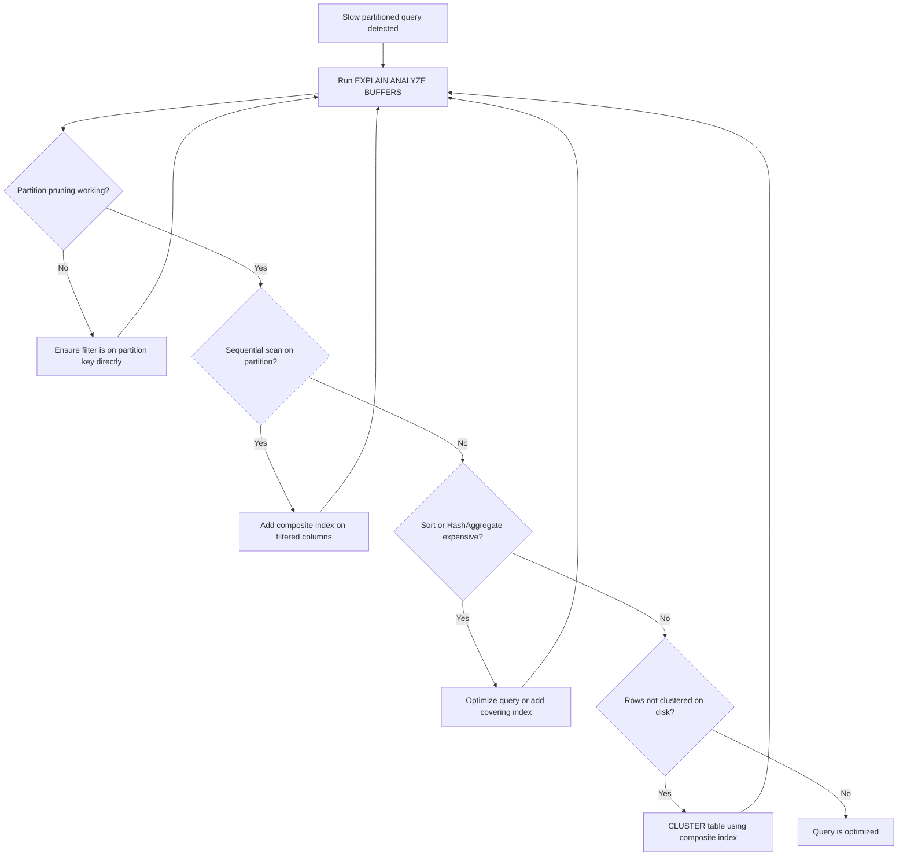

| Difficulty | Channel | Tags |
|---|---|---|
| intermediate | database | explain, query-plan, partitioning |

It was a regular Tuesday when CoinGecko's monitoring dashboard lit up red. A single PostgreSQL table — eight years old, storing hourly crypto price data, ballooned past 1TB — was choking on queries that used to breeze through in milliseconds. Response times hit 30+ seconds. Replica lag spiked during traffic bursts, causing cascading outages. The p99 latency? A gut-punching 4.13 seconds [1]. The culprit wasn't a missing index or a bad query. It was something far more subtle — something that haunts developers working with large partitioned tables every day. If you've ever added partitioning to a slow table and watched your queries *still* crawl, this story is for you.

---

> ### Real-World Case — CoinGecko
>
> CoinGecko's 8-year-old PostgreSQL table storing hourly crypto price data grew to over 1TB, with queries taking 30+ seconds on average. The p99 response time hit 4.13 seconds, IOPS kept breaching limits, and replica lag was causing outages during request spikes.
>
> | | |
> |---|---|
> | **Challenge** | A single unpartitioned table with hundreds of millions of rows where time-range queries scanned the entire dataset. Adding indexes wasn't viable because the JSONB column structure made per-application indexes impractical. The team needed to optimize both query performance and I/O costs without re-architecting to a different database. |
> | **Solution** | They implemented range partitioning by month on the timestamp column, so queries only touched up to 4 monthly partitions instead of the entire table. They created the partitioned table alongside the original, copied 1.2TB of data using Foreign Data Wrappers to avoid IOPS spikes on production, prewarmed partition caches, and did a table rename cutover. Critically, they also had to fix a query that lacked a lower date bound — which caused ALL partitions to be scanned after partitioning, making that specific query WORSE than before. |
> | **Outcome** | 86% reduction in p99 response time (4.13s → 578ms), 20% reduction in IOPS, eliminated replica lag during traffic spikes. The sub-second p99 was sustained even under peak request loads. One regression was caught and fixed by rewriting the unbounded query to include both lower and upper date limits. |
> | **Lesson** | Partitioning is not a silver bullet — it can make things WORSE if queries don't filter on the partition key. A query with `created_at > ?` without an upper bound scanned all future empty partitions. The key insight: verify partition pruning is actually happening by checking the EXPLAIN plan's Append node and counting how many partitions appear. Also, don't wait until the entire table is migrated — use feature toggles to route recent-data queries to partitioned tables early. |

---

## Hook — A 1TB Table That Refused to Cooperate

Picture this: you've done everything the textbooks told you. You partitioned your massive table by date. You added indexes. You even rewrote the slowest queries. And yet, when a user asks for a month of data, your database still takes 30 seconds to respond. Your p99 latency is through the roof, IOPS are breaching limits, and your read replicas can't keep up with write throughput during peak traffic. Sound familiar? This isn't a hypothetical. This is exactly what happened at CoinGecko — and the fix wasn't what most developers would expect. The real lesson here isn't just about partitioning. It's about what happens *after* you partition, and why the execution plan becomes the single most important document in your database playbook.

## Problem — Why Partitioned Tables Can Still Betray You

Here's the uncomfortable truth: partitioning a table is necessary but nowhere near sufficient. Many developers partition a 100M-row table by date, breathe a sigh of relief, and move on. Then three months later, a query filtering on a specific date range is somehow still slow. The problem lives in five blind spots that most teams miss: partition pruning isn't always happening, indexes aren't being utilized, the EXPLAIN plan is full of expensive sorts and hash aggregates, composite indexes covering the WHERE clause are missing, and the partition key itself might be poorly chosen for the actual query pattern. When you run `EXPLAIN ANALYZE` on a 100M-row partitioned table and see a sequential scan on a single partition, your first instinct should be alarm — not acceptance. PostgreSQL has to scan every row in that partition if there's no useful index. And if the planner decides a hash aggregate or sort is cheaper than an index scan, it will. Every time. Without complaint. The real question becomes: why is the query planner making these choices, and how do you force it to make better ones?

## Real-World Case — CoinGecko's Partitioning Comeback

CoinGecko's story is a masterclass in what happens when a table outgrows its architecture. Their PostgreSQL table storing hourly crypto price data had been growing for eight years. By the time it hit 1TB, queries averaging 30+ seconds were the norm. The p99 response time sat at 4.13 seconds — an eternity for a data API serving real-time crypto prices. IOPS were constantly breaching infrastructure limits, and replica lag during request spikes caused outages that affected users worldwide [1]. The impact was measured in real dollars and lost trust. But here's what makes this story remarkable: the solution wasn't a rewrite. It wasn't a migration to a distributed database. It was a disciplined application of table partitioning — combined with meticulous EXPLAIN plan analysis and query rewriting. CoinGecko partitioned the table by date, enforced partition pruning through query design, and rewrote unbounded queries to include explicit date limits. The result? An 86% reduction in p99 response time — dropping from 4.13s to 578ms. IOPS dropped 20%. Replica lag vanished entirely under peak loads. And one regression was caught and fixed simply by rewriting an unbounded query to include both lower and upper date boundaries [1]. The takeaway: partitioning works, but only when you understand the full picture of how PostgreSQL executes queries against partitioned tables.

## Deep Dive — The Five Things Your EXPLAIN Plan Is Trying to Tell You

Let's break down exactly what to look for when a partitioned query is slow, and why each element matters. First: partition pruning. This is PostgreSQL's ability to skip entire partitions that don't match your WHERE clause. If you partition by `event_date` and filter on a specific month, PostgreSQL should only scan that month's partition. But here's the catch — partition pruning only works when the filter is on the partition key itself. A function call, a cast, or a subquery on the partition key can silently disable pruning. Second: index utilization. Even with partition pruning working perfectly, if there's no index on the filtered columns within the target partition, PostgreSQL falls back to a sequential scan. On a partition with millions of rows, that's devastating. Third: sort and hash operations. The EXPLAIN plan might show a `Sort` node with high cost estimates or a `HashAggregate` that's consuming disproportionate memory. These operations happen *after* the data is fetched — so even if partition pruning and indexing are working, a poorly optimized aggregation can blow up your query time. Fourth: composite indexes. A single-column index on `event_date` helps with partition pruning but does nothing for the `status = 'completed'` filter. You need a composite index covering both columns to allow index-only scans. Fifth: clustering. Even with the right index, if rows on disk aren't physically ordered by the index, PostgreSQL still performs random I/O across the partition. `CLUSTER` reorders rows on disk to match the index, which can dramatically improve sequential read performance. The ordering of these checks matters. Fix partition pruning first, then indexes, then operations, then clustering. Each layer builds on the previous one.

## Workflow — From Slow Query to Sub-Second Response

Here's the systematic workflow to diagnose and fix a slow partitioned query, visualized in the diagram below:

Start by running `EXPLAIN (ANALYZE, BUFFERS)` on your slow query. The BUFFERS option shows you actual I/O — how many pages were read from disk versus cache. This is critical because it tells you whether the problem is CPU-bound (too much computation) or I/O-bound (reading too much data). From there, follow the decision tree. Check partition pruning first — it's the highest-leverage fix. If pruning is working, look for sequential scans. If you see them, composite indexes are your next move. If index scans are present but the query is still slow, check for expensive sorts or hash operations. And if everything looks right in the plan but performance is still poor, clustering might be the final piece. The key insight: this is iterative. Each fix should be followed by re-running EXPLAIN ANALYZE to verify the improvement before moving to the next step.

## References

If you want to go deeper, here are the resources that informed this analysis.

---

## Partitioned Query Optimization Workflow

```mermaid
flowchart TD
    A[Slow partitioned query detected] --> B[Run EXPLAIN ANALYZE BUFFERS]
    B --> C{Partition pruning working?}
    C -->|No| D[Ensure filter is on partition key directly]
    C -->|Yes| E{Sequential scan on partition?}
    E -->|Yes| F[Add composite index on filtered columns]
    E -->|No| G{Sort or HashAggregate expensive?}
    G -->|Yes| H[Optimize query or add covering index]
    G -->|No| I{Rows not clustered on disk?}
    I -->|Yes| J[CLUSTER table using composite index]
    I -->|No| K[Query is optimized]
    D --> B
    F --> B
    H --> B
    J --> B
```

<strong>Original Interview Question</strong>

**Q:** You have a PostgreSQL table with 100M rows partitioned by date. A query filtering on a specific date range is still slow. What would you check in the EXPLAIN plan and how would you optimize it?

**A:** Check partition pruning effectiveness, index utilization patterns, and expensive sort operations. Create composite indexes on (date, filtered_columns) and evaluate clustering strategies for optimal data access.

## Conclusion

The CoinGecko story proves that partitioning is a powerful tool — but only when paired with disciplined EXPLAIN plan analysis and intentional query design. The 86% improvement in p99 latency didn't come from a fancy database migration. It came from understanding how PostgreSQL executes queries against partitioned tables and fixing the five blind spots: partition pruning, index utilization, sort operations, composite indexes, and clustering. Tomorrow, run EXPLAIN (ANALYZE, BUFFERS) on your slowest partitioned query. Look for sequential scans, missing indexes, and unbounded date filters. Fix what you find. Then run it again. That single habit — inspecting the execution plan before assuming the problem is infrastructure — will save you from more outages than any amount of hardware scaling ever could.

---

## References

1. [CoinGecko: Scaling PostgreSQL Performance with Table Partitioning](https://amree.dev/2025/06/13/scaling-postgresql-performance-with-table-partitioning/) — blog
2. [PostgreSQL Documentation: Partitioning](https://www.postgresql.org/docs/current/ddl-partitioning.html) — documentation
3. [PostgreSQL Documentation: Using EXPLAIN](https://www.postgresql.org/docs/current/using-explain.html) — documentation
4. [PostgreSQL Documentation: CLUSTER](https://www.postgresql.org/docs/current/sql-cluster.html) — documentation
5. [Use The Index, Luke: SQL Index Handbook](https://use-the-index-luke.com/) — documentation
6. [PostgreSQL Wiki: Performance Optimization](https://wiki.postgresql.org/wiki/Performance_Optimization) — documentation
7. [PostgreSQL Documentation: Indexes](https://www.postgresql.org/docs/current/indexes.html) — documentation
8. [PostgreSQL Documentation: CREATE INDEX](https://www.postgresql.org/docs/current/sql-createindex.html) — documentation

---

**Author:** Satishkumar Dhule — [GitHub](https://github.com/satishkumar-dhule) · [LinkedIn](https://linkedin.com/in/satishkumar-dhule) · [Website](https://satishkumar-dhule.github.io)
