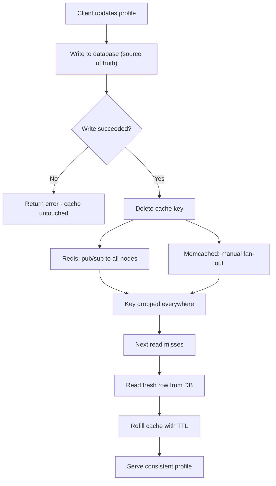

| Difficulty | Channel | Tags |
|---|---|---|
| beginner | backend | redis, memcached, cache-invalidation |

Meta runs two of the largest cache deployments on the planet, TAO and Memcache, serving billions of reads per second across the social graph [1]. When a user updates their profile, every cached copy across thousands of servers must be invalidated - and for years, even 99.9999% consistency was not good enough, because rare race conditions between the cache fill and invalidation paths left stale data sitting in memory indefinitely [1]. This is the story of how Meta pushed its caches from six nines to ten nines of consistency, and what that journey reveals about the classic Redis-versus-Memcached decision every backend developer eventually faces.

---

> ### Real-World Case — Meta
>
> Meta operates some of the largest cache deployments in the world (TAO and Memcache), serving billions of reads per second across their social graph. When a user updates their profile or posts content, every cached copy across thousands of servers must be invalidated. They discovered that even at six nines of cache consistency (99.9999%), rare race conditions between cache fill and invalidation paths were causing stale data to persist indefinitely.
>
> | | |
> |---|---|
> | **Challenge** | Cache invalidation in a distributed system where data is mutated on both read (cache fill) and write (cache invalidation) paths simultaneously, creating race conditions that are nearly impossible to detect or debug manually. A single missed invalidation means users see stale profile data, posts, or social graph information. |
> | **Solution** | Meta built Polaris, a consistency monitoring service that acts as a client and measures client-observable invariant violations without knowing cache internals. Polaris intercepts invalidation events and queries all cache replicas to detect stale entries, reporting metrics like '99.99999999% of cache writes are consistent within 5 minutes.' They also implemented consistency tracing that provides a complete timeline of every step leading to an inconsistent state, enabling root cause analysis in minutes instead of weeks. |
> | **Outcome** | Improved TAO cache consistency from 99.9999% (six nines) to 99.99999999% (10 nines) — meaning less than 1 in 10 billion cache writes is inconsistent after 5 minutes. One specific bug that would have taken weeks to find was located in under 30 minutes using consistency tracing. The bug was a 7-step race condition where a rare transient error during cache invalidation triggered error handling code that silently dropped the fix, leaving stale metadata in cache indefinitely. |
> | **Lesson** | Cache invalidation isn't just about the delete or write pattern — it's about the entire lifecycle including error handling. Even with version-based conflict resolution (the standard approach), a rare interleaving of cache fill, database transaction, and transient error can create permanent staleness. The real innovation is measuring and tracing consistency, not just assuming it works. |

---

## Hook — Six nines sounds impressive. It was not enough.

Picture this: a user changes their profile picture, and one server serves the new photo while another, milliseconds later, serves the old one [1]. Multiply that by billions of reads per second across thousands of cache nodes, and a one-in-a-million inconsistency stops being a rounding error and becomes a daily occurrence. That was exactly Meta's world. The company pushed TAO's cache consistency to 99.9999%, six nines, and then discovered the residual failures were not random noise - they were systematic races between the two code paths that mutate the cache: reads that fill it, and writes that invalidate it [1]. Six nines sounds impressive. It was not enough.

## Problem — The joke that stops being funny

There is an old joke that computer science has only two hard problems: cache invalidation and naming things. It stops being funny the day you build a service that caches frequently accessed user profiles. Every read can be served from the cache, which means every write must answer a question: update the cached copy, delete it, or ignore it? Get it wrong and users see stale bios, outdated subscription statuses, or authentication data that no longer matches reality. Many developers think the hard part is choosing between Redis and Memcached - but that is the easy part [2]. The hard part is the invalidation protocol you build on top, whichever store you pick. A cache without a coherent invalidation strategy is not a cache; it is a time bomb full of stale data, waiting for the busiest hour of the day to go off.

## Real-World Case — Meta's seven-step race condition

Meta's engineers documented exactly how that time bomb detonates [1]. In a rare engineering deep-dive, they described a bug that left stale metadata in the cache indefinitely: a seven-step race condition [1]. A transient error during cache invalidation triggered error-handling code that silently dropped the fix - no crash, no obvious log line, just a key that never recovered and kept serving an old value forever [1]. Before the right tooling existed, a bug of this class could take weeks of forensic work. After building Polaris, a service that measures client-observable consistency, plus a stateful tracing library that logs cache mutations inside the narrow window where races happen, the same kind of bug was located in under 30 minutes [1]. The result: TAO went from 99.9999% to 99.99999999% consistent, with fewer than 1 in 10 billion cache writes inconsistent after five minutes [1]. The lesson is uncomfortable and liberating: you cannot fix what you cannot measure.

## Deep Dive — Redis vs Memcached and the invalidation trade-off

Building on that story, the operational takeaway is that your cache choice is inseparable from your invalidation strategy - and the real gap between Redis and Memcached is not where most people think it is.

Memcached is a purpose-built distributed in-memory cache: simple key-value semantics, LRU eviction, values up to 1 MB, and a multi-threaded design optimized for raw throughput [3]. Redis is a data-structure server that also happens to be an excellent cache: strings, hashes, lists, sorted sets, pub/sub, streams, persistence, and clustering [4]. Head-to-head benchmarks on identical VMs show Memcached winning simple GET/SET workloads by roughly 10-15%, with better P99 latency, thanks to its thread-per-core model [7]. But here comes the plot twist: with pipelining, Redis pushes past Memcached on aggregate throughput, because one network round trip carries many commands [7]. The raw microbenchmark is a trap; the application-level number pays your cloud bill.

**Option A vs Option B — the real tradeoff:**

| Dimension | Redis | Memcached |
| --- | --- | --- |
| Data model | Rich structures: strings, hashes, lists, sets, streams [4] | Key-value blobs only [3] |
| Invalidation coordination | Native pub/sub broadcasts to all subscribers [4] | None - you fan out deletes from app code [3] |
| Persistence | RDB snapshots + AOF journal [4] | None - pure cache, transitory data [3] |
| Simple GET/SET throughput | ~10-15% slower single-node in raw benchmarks | Faster, multi-threaded [7] |
| Scaling | Redis Cluster, automatic sharding (up to ~1000 nodes) [4] | Client-side consistent hashing, shared-nothing [3] |
| Memory overhead | Higher per key | Slab allocator, efficient for uniform sizes [3] |
| TTL granularity | Millisecond precision | Second precision |

Consequently, the decision is not 'fancier versus faster.' It is about what your consistency story requires. If you need broadcastable invalidation and durable rebuilds, Redis hands you the primitives. If your workload is pure key-value with small, uniform objects and a reader tolerant of staleness, Memcached lets you squeeze more ops per dollar [7]. This even echoes the web's caching semantics: like HTTP freshness and revalidation, a short TTL bounds how wrong you are willing to be [8].

There is one more layer, and it is where most production systems fail: the pattern. AWS's guidance distinguishes cache-aside (lazy loading: fill on miss) from write-through (update the cache immediately after the DB write) [2]. On writes, the universally safe move is invalidating - deleting the key - after the database commit, which also happens to be exactly what Facebook's Memcache architecture used at billions of requests per second [5].

## Workflow — The write-through dance

Every sound invalidation flow follows the same choreography, and the ordering rule is non-negotiable: update the data store first, then remove the cached item [6]. Delete first and you open a window where a concurrent read fetches the still-old row and repopulates the cache with stale data - creating the exact bug you were trying to avoid [6].

The Mermaid diagram below captures the canonical flow for a profile service: database write, cache invalidation broadcast, then a cache-aside fill on the next read.

The steps in plain language:

1. A client updates a profile, and the application writes new data to the authoritative database.
2. The application then deletes the cache key - invalidate on write - rather than setting it to the new value [6].
3. The invalidation fans out. With Redis, pub/sub broadcasts the event to every subscriber automatically [4]. With Memcached, your application code must reach every node in the cluster [3].
4. The next read misses, hits the database, and repopulates the cache under a TTL (5-30 minutes is a sane band for profiles) [2].
5. Monitoring tracks cache hit rate and P99 read latency so a spike in misses is visible before it becomes an outage.

Why delete instead of set? Because delete is commutative [6]. Two overlapping writers SETting different values can reorder and leave permanently wrong data in the cache; two overlapping DELETEs cannot, and the next reader simply rebuilds from the source of truth [6].

## Code Example — A production-grade Python profile cache

Here is what that flow looks like in production-grade Python using redis-py: cache-aside on reads, delete-on-write invalidation, and a jittered TTL as your safety net.

The `get_profile` function is pure cache-aside: it returns fast on a hit, and on a miss it reads the authoritative store, caches, and returns [2]. Notice the TTL is jittered - if every popular key carries the same expiry, keys expire together and produce a synchronized burst of misses, a thundering herd. `update_profile` is the write-through invalidate half [2]: the database commit comes first, and the cache deletion comes second, per the ordering rule that prevents repopulating the cache with stale rows [6]. The final commented step is where the Redis-versus-Memcached decision bites: with Redis you publish to a channel and every subscriber drops the key; with Memcached you must fan out deletes from application code yourself because there is no pub/sub primitive [3]. This mirrors how real systems apply caching strategies per field: profiles tolerate bounded staleness, while data like balances or permissions escalate to stronger write-through semantics [2].

## Lessons Learned — What the war taught us

- 🔥 Hot Take: Benchmarks that crown a winner between Redis and Memcached without naming your workload are marketing, not engineering. Memcached is faster for simple reads at high concurrency; Redis wins aggregate throughput with pipelining and unlocks complex invalidation [7].
- 💡 Insight: TTL is not just a freshness knob - it is the blast-radius cap on every invalidation bug. Without one, a missed delete creates stale data that lives forever [1].
- ⚠️ Watch Out: Use DELETE, never SET, on the write path. Two racing SETs can land a permanently stale value; two racing DELETEs cannot [6].
- ⚠️ Watch Out: Order matters. Database first, cache second. Reverse it and a concurrent read resurrects the old row into the cache [6].
- 🎯 Key Point: Measure consistency like Meta. You cannot chase ten nines, or even a healthily small number of stale keys, until Polaris-style telemetry tells you where they are [1].

The one insight worth sharing with your team on Monday: cache invalidation is a measurement problem hiding as a design problem.

---

## Cache Invalidation Flow

<strong>Original Interview Question</strong>

**Q:** You're building a user profile service that caches frequently accessed profiles. How would you implement cache invalidation when a user updates their profile, and what trade-offs would you consider between Redis and Memcached?

**A:** Implement write-through caching with TTL-based expiration. On profile update, invalidate the cache by deleting the key and writing new data to both the database and cache. Redis offers pub/sub for automatic distributed invalidation, while Memcached requires manual coordination across nodes.

## Conclusion

The journey started with Meta staring at rare, seemingly random stale profile reads and ended at ten nines of consistency - but the real artifact is a culture of measuring what the cache actually does [1]. Tomorrow morning, the highest-leverage move is tiny: put a TTL on every key, delete on write after the database commit, and add a hit-rate dashboard before you add a single new cache. Do that, and when something does go stale - and something always will - you will catch it in minutes, not weeks. Six nines is a day job. Ten nines is a discipline.

---

## References

1. [Meta incident report](https://engineering.fb.com/2022/06/08/core-infra/cache-made-consistent/) — article
2. [Caching patterns - AWS Database Caching Strategies Using Redis](https://docs.aws.amazon.com/whitepapers/latest/database-caching-strategies-using-redis/caching-patterns.html) — documentation
3. [Memcached - Wikipedia](https://en.wikipedia.org/wiki/Memcached) — documentation
4. [Redis - Wikipedia](https://en.wikipedia.org/wiki/Redis) — documentation
5. [Scaling Memcache at Facebook (USENIX NSDI 2013)](https://www.usenix.org/conference/nsdi13/technical-sessions/presentation/nishtala) — paper
6. [Cache-Aside pattern - Azure Architecture Center](https://learn.microsoft.com/en-us/azure/architecture/patterns/cache-aside) — documentation
7. [Performance and Scalability Analysis of Redis and Memcached - DZone](https://dzone.com/articles/performance-and-scalability-analysis-of-redis-memcached) — blog
8. [HTTP caching - MDN Web Docs](https://developer.mozilla.org/en-US/docs/Web/HTTP/Caching) — documentation

---

**Author:** Satishkumar Dhule — [GitHub](https://github.com/satishkumar-dhule) · [LinkedIn](https://linkedin.com/in/satishkumar-dhule) · [Website](https://satishkumar-dhule.github.io)
