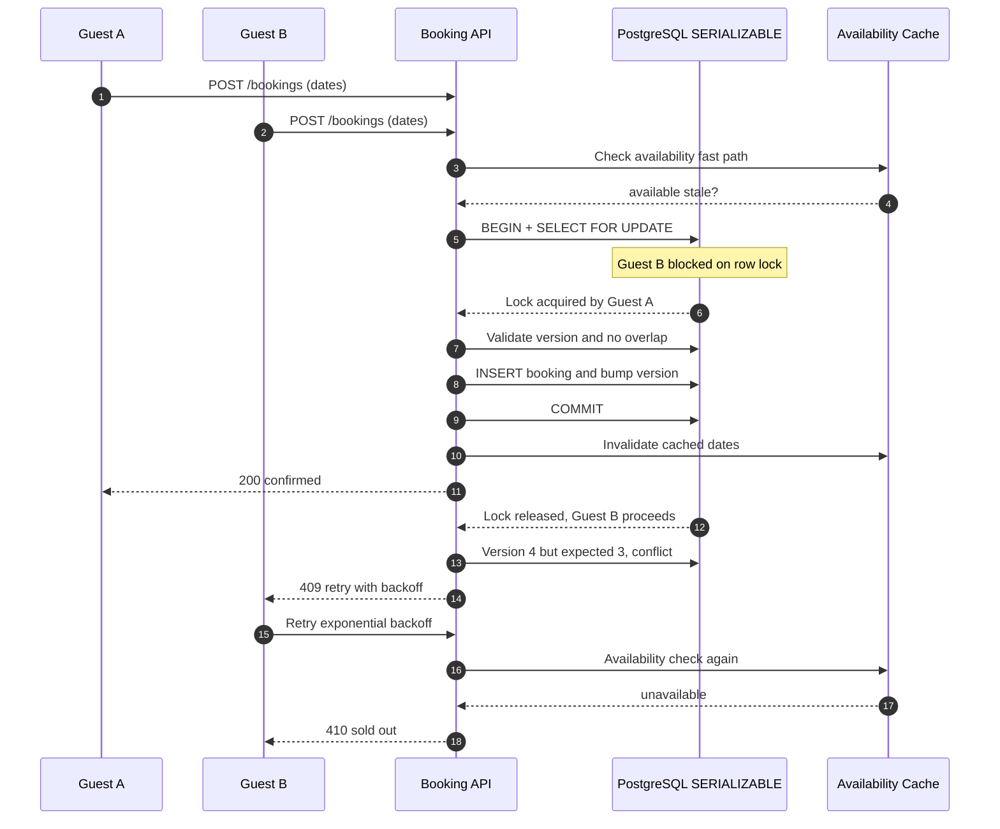

| Difficulty | Channel | Tags |
|---|---|---|
| intermediate | database | acid, isolation-levels, mvcc |

On November 15, 2022, roughly 14 million visitors — fans and bots alike — slammed Ticketmaster's servers during the Taylor Swift Eras Tour presale, generating 3.5 billion total requests and demolishing every prior traffic record [1]. Fans watched carted tickets evaporate, errors swallowed 15% of interactions, and more than 2 million tickets vanished within hours [1]. When a finite inventory collides with unlimited demand, the database becomes the referee. This article walks the full journey through that failure and shows you the isolation techniques, row locks, and retry logic that keep one seat from ever being sold twice.

---

> ### Real-World Case — Ticketmaster
>
> On November 15, 2022, Ticketmaster opened the Verified Fan presale for Taylor Swift's Eras Tour. Roughly 1.5 million verified fans were sent purchase codes, but bots and fans without codes crashed the site with 3.5 billion total system requests — 4x their previous peak. Fans were booted from queues, lost tickets they had carted, and many were left with error messages despite the demand being for a strictly finite inventory of seats.
>
> | | |
> |---|---|
> | **Challenge** | A reservation system must allocate a fixed, scarce inventory (a finite number of seats across 52 stadium shows) at most once per item, while millions of concurrent users compete for the exact same hot listings. The booking path had to stay both correct (each seat booked exactly once, no double sales) and highly available under 4x the traffic the platform had ever handled — with the contention concentrated on identical records for identical seats and dates. |
> | **Solution** | Defense-in-depth on the reservation path: the Verified Fan gate filtered entrants before the queue, a virtual waiting room serialized purchase attempts, and the ticketing backend had to atomically hold/reserve inventory the moment a cart checkout began so competing requests for the same seats would fail cleanly. When load exceeded design, operators deliberately 'slowed down some sales and pushed back others' — throttling and shedding load (a circuit-breaker-style response) to stabilize systems rather than let the booking transaction path collapse entirely. |
> | **Outcome** | 3.5 billion total system requests (4x the previous peak, with roughly 14 million visitors including bots hitting a sale 'supposed to open for 1.5 million fans'); about 15% of interactions experienced errors; over 2 million tickets sold on Nov 15 — the most ever sold for an artist in a single day; the general public sale was cancelled citing 'insufficient remaining ticket inventory.' The fallout escalated into Senate and House scrutiny, a DOJ antitrust investigation, a Senate Judiciary hearing, and Taylor Swift publicly describing the failures as 'excruciating to watch mistakes happen with no recourse.' |
> | **Lesson** | Preventing double-booking under high availability is not only a database-isolation problem. When thousands of users race for the same finite item, the booking path needs load-shedding (queues, rate limits, throttling), filtering of ineligible/bot traffic at the gate, atomic cart holds so inventory can't be reserved twice, and a deliberate degradation mode — because the alternative is a correctness and availability failure so visible it triggers regulators. |

---

## Hook — The night 14 million fans showed up for one concert

It was less a concert presale and more a digital riot. Roughly 1.5 million verified fans received purchase codes, but an estimated 14 million visitors — including bot armies — hammered the sale anyway, and the seats were strictly finite [1]. That scenario sounds absurdly far from an interview question like 'build a booking system where two users can reserve the same property at once.' In reality, it is exactly the same nightmare wearing different clothes. Every ticketing platform, airline, hotel chain, and yes, Airbnb property, runs on the same currency: scarce rows that many people can request in the same millisecond. Overbook the property and you eat refunds, rebookings, and hard-won trust. Under-deliver and queues fill with furious customers. Here is the satisfying part: the fix is not more code, and it is not more servers. It is a handful of isolation and concurrency patterns any developer with a few years of SQL under their belt can master in a single sitting.

## Problem — When two clicks carve the same hole in your calendar

Everyone has debugged a bug that only appears in production at high traffic, and the double-booking race is the archetypal member of that species. The failure is brutally simple: two guests click 'Reserve' at the same instant. Both requests query the availability table and both see the dates as free. Both then write a booking. Congratulations — the property now has two guests for one bed. In database theory this is called a race condition, and it is the exact class of bug the ACID guarantees were designed to tame [2]. The deeper problem is that most modern web frameworks encourage a check-then-write habit — first SELECT to validate, later INSERT to commit — and those two steps are separated by network round-trips, retries, and slow clients. Between them, anything can change. A transaction is only as safe as its weakest isolation decision, and the default settings in most databases will happily let two concurrent transactions believe the same row is still free [3]. The stakes go beyond a single angry guest. Firms absorb compensation payouts, refund billings, support surges, and a reputation dent that marketing spend cannot sand off. Sound familiar? Now the real question: how do you guarantee correctness at scale without trading away the high availability users expect?

## Real-World Case — Ticketmaster's Eras Tour meltdown

Here is the case that made overbooking unforgettable. On November 15, 2022, Ticketmaster opened the Verified Fan presale for Taylor Swift's Eras Tour. Roughly 1.5 million fans received codes, but the site was attacked by roughly 14 million visitors including bots, generating 3.5 billion total system requests — four times the platform's previous traffic peak [1]. About 15% of those interactions ended in errors [1]. The scale of the demand dwarfed everything in the company's history; the Eras Tour itself became one of the largest concert tours ever assembled, and that single day moved more than 2 million tickets — the most ever sold for an artist in one day [1][9]. And yet the wait was a disaster. Fans were booted from queues, lost tickets already sitting in their carts, and stared at error screens while seats drained away [1]. The general public sale was later cancelled, with Ticketmaster citing 'insufficient remaining ticket inventory' [1]. The fallout snowballed into Senate and House scrutiny, a Department of Justice antitrust investigation, and a Senate Judiciary hearing — and Swift publicly described watching the failures as 'excruciating.' [1] Here is what engineers should extract from the chaos: the fault line was not just network capacity. A gigantic portion of the damage came from inventory logic being overwhelmed — rapid-fire, overlapping requests racing for the same finite seats, where stale reads and weak isolation let more users believe a seat was theirs than seats actually existed. Public attention faded, but the lesson endures — and you do not need 3.5 billion requests to learn it. The patterns below work identically for a booking system doing ten reservations a day or ten million.

## Deep Dive — Isolation, MVCC, and the phantom that sells your room twice

Building on the Ticketmaster story, the surprise is that the underlying bug is older than SQL itself: two transactions read the same row as free, then both commit writes based on a stale belief. ACID was created precisely to tame this chaos — atomicity, consistency, isolation, and durability mean a transaction either fully happens or fully does not [2]. That sounds reassuring until you realize isolation is a dial, not a switch. Standard SQL defines four levels, and each one trades correctness for throughput [6][10].

| Isolation level | Anomalies it still allows | What it blocks | Typical cost |
| --- | --- | --- | --- |
| READ UNCOMMITTED | Dirty reads, non-repeatable reads, phantoms | Nothing | Fastest, rarely used |
| READ COMMITTED | Non-repeatable reads, phantoms | Dirty reads | Default in PostgreSQL |
| REPEATABLE READ | Phantoms | Dirty + non-repeatable reads | Stable snapshot, moderate |
| SERIALIZABLE | None on committed data | All standard anomalies | Aborts under conflict |

The transitions between levels explain the failure modes you may already fear. READ COMMITTED gives each statement a fresh view of the world, so two availability checks inside one booking flow can disagree with each other [3][6]. REPEATABLE READ holds a stable snapshot for the whole transaction — but here is the plot twist — that snapshot cannot stop a phantom. Two guests can each snapshot an 'empty' calendar, both book concurrently, and both commit. The double booking did not happen in the write; it happened in what each transaction believed to be true [3]. This is precisely the Airbnb and Ticketmaster failure mode, and ordinary application validation cannot see it coming.

This leads to the engine room of modern databases: MVCC, or multiversion concurrency control. Every write creates a new version of a row while readers keep seeing the snapshot from when they began, so concurrent reads never block writes and vice versa [4][8]. That property is the quiet hero behind high availability — you can push read-heavy availability checks onto read replicas with zero contention. However, MVCC's snapshot model is also exactly what makes phantoms possible, which is why it pairs so naturally with serializable snapshot isolation. PostgreSQL implements SERIALIZABLE through SSI: transactions run optimistically on their snapshots, and the moment two of them would serialize inconsistently, the database aborts one with a serialization error [6]. The referee rarely blocks anyone — and then occasionally slams the whistle and tells one transaction to run the race again.

Optimistic concurrency control mirrors this at the application layer: rows carry a version column, and any update that finds the version changed fails instead of blindly overwriting [5]. Pessimistic locking — SELECT ... FOR UPDATE — is the opposite bet: you seize the row lock up front so the rival waits in line rather than fighting at commit time [7]. No single style wins everywhere. For hot properties or marquee seats, FOR UPDATE's raw exclusivity is worth it; for low-conflict inventories, optimistic checks avoid holding locks for the whole transaction — with the caveat that every optimistic abort demands a retry [5][7]. Whichever you pick, never forget the cache trap. A cached 'available' answer is stale by definition, and under a stampede it just funnels more users into the same scarce rows. Cache for speed, but validate against the source of truth inside the transaction, and invalidate on commit — not on a timer.

## Workflow — A transaction pipeline for the last seat

Now it all snaps together into a repeatable workflow, and the sequence diagram below shows two guests colliding on the same date range — one walks away with the night, the other walks away with a clean 'no.'

1. Serve the cheap reads first. Availability lookups hit read replicas and an in-memory cache, so casual browsing never touches your booking transaction path. 2. The moment a user commits to booking, open a SERIALIZABLE transaction — PostgreSQL will enforce serializability through SSI [6]. 3. Lock exactly the rows for the requested date range with SELECT ... FOR UPDATE, never a whole table and never an app-wide mutex [7]. 4. Re-validate inside the transaction against freshly committed data; a cache said 'available,' but now you confirm it under lock. 5. Write the booking and bump the version column in the same commit — one atomic read-modify-write [5]. 6. Invalidate the cache as the commit succeeds, not before, so the next fast-path read reflects the new reality. 7. Catch SerializationFailure and retry with exponential backoff plus an idempotency key, because SSI aborts are a feature, not a bug [6]. 8. Monitor lock wait times and latency for hot rows, and trip a circuit breaker that sheds load when a single property's lock queue runs away.

A natural objection: won't FOR UPDATE create a queue behind a celebrity property? Yes — a short, correct queue, which is far better than a long, wrong one. The diagram tells the visual story.

## Code Example — A booking function that cannot sell a room twice

Reading about isolation is one thing; translating it into a function you can actually ship is another. This Python example uses psycopg2 against PostgreSQL and combines every pattern discussed so far: a SERIALIZABLE transaction, row-level locking, in-transaction validation, an optimistic version bump, and retry with exponential backoff. The pattern assumes an availability calendar table with one row per property-night and a version column, plus a bookings table for confirmed reservations. The code is deliberately slim so the transaction anatomy stays visible.

## Lessons Learned — The ticket master's rulebook for fair bookings

The entire journey distills into a short set of rules that fit on a sticky note. First, correctness belongs in the database, while speed belongs in the cache — never let a cache decide who gets a scarce row. Second, always lock the narrowest set of rows; a table-wide lock or an app-wide mutex will serialize your whole booking system and quietly destroy availability. Third, optimistic version columns outperform blanket locks when conflicts are rare, but they are only safe when paired with disciplined retry-and-backoff, because every abort is a small loss [5][6]. Fourth, stale availability caches are stampede fuel — invalidate on commit, not on a timer. Fifth, treat serialization failures as instrumentation gold; graph them, alert on them, and let a circuit breaker shed load before a hot row melts your latency. And lastly, never hold a database lock across a network round-trip to an external service; that is how deadlocks and 30-second checkouts are born. Here's what you need to know in one breath:

- Use SERIALIZABLE plus SELECT FOR UPDATE for the final reservation step [6][7].
- Re-validate availability inside the transaction, never in application code before it [3].
- Add version columns and treat every SerializationFailure as a scheduled retry [5].
- Serve browse-level availability from replicas and cache, then invalidate on commit [8].
- Test with real collisions: fire fifty concurrent bookings for the same night and assert exactly one commits.

Pro tip from the trenches: after debugging this pattern into production, the strongest habit is chaos-testing concurrency directly — spin up concurrent writers against one night, watch exactly one succeed, and only then call the system done. Leave one kno...

---

## Concurrent Booking Flow

<strong>Original Interview Question</strong>

**Q:** You're building a booking system for Airbnb where multiple users can reserve the same property simultaneously. How would you design the transaction handling to prevent double bookings while maintaining high availability?

**A:** Use SERIALIZABLE isolation with optimistic concurrency control. Implement row-level locks on property availability tables, use MVCC snapshot reads for checking availability, and apply application-level validation to ensure atomic booking operations.

## Conclusion

So what is the takeaway for tomorrow morning? The next time you ship a booking flow — a room, a seat, a badge, a van — remember that the database, not the UI, decides who wins the last available slot. Ticketmaster's presale was a public stage for a problem every builder meets privately: finite rows, infinite demand, and the gamble between throughput and correctness [1]. You now hold the playbook. Set SERIALIZABLE for the reservation step [6], lock the exact rows with FOR UPDATE [7], re-validate under lock instead of trusting a cache, bump a version column as the atomic write lands [5], and catch every serialization failure with a backoff-retry before the user ever sees a spinner. Then do the test that matters: fire a wave of concurrent bookings at a single available night and confirm that exactly one succeeds. The insight to carry back to your team: a seat is a row, a click is a transaction, and a fair sale is just an isolation level done right.

---

## References

1. [Ticketmaster incident report](https://business.ticketmaster.com/press-release/taylor-swift-the-eras-tour-onsale-explained) — article
2. [ACID — Wikipedia](https://en.wikipedia.org/wiki/ACID) — documentation
3. [Isolation (database systems) — Wikipedia](https://en.wikipedia.org/wiki/Isolation_(database_systems)) — documentation
4. [Multiversion concurrency control — Wikipedia](https://en.wikipedia.org/wiki/Multiversion_concurrency_control) — documentation
5. [Optimistic concurrency control — Wikipedia](https://en.wikipedia.org/wiki/Optimistic_concurrency_control) — documentation
6. [PostgreSQL Documentation — Transaction Isolation](https://www.postgresql.org/docs/current/transaction-iso.html) — documentation
7. [PostgreSQL Documentation — Explicit Locking](https://www.postgresql.org/docs/current/explicit-locking.html) — documentation
8. [PostgreSQL Documentation — Concurrency Control (MVCC)](https://www.postgresql.org/docs/current/mvcc.html) — documentation
9. [The Eras Tour — Wikipedia](https://en.wikipedia.org/wiki/The_Eras_Tour) — documentation
10. [Understanding Isolation Levels in Database Transactions — DigitalOcean](https://www.digitalocean.com/community/tutorials/understanding-isolation-levels-in-database-transactions) — blog

---

**Author:** Satishkumar Dhule — [GitHub](https://github.com/satishkumar-dhule) · [LinkedIn](https://linkedin.com/in/satishkumar-dhule) · [Website](https://satishkumar-dhule.github.io)
