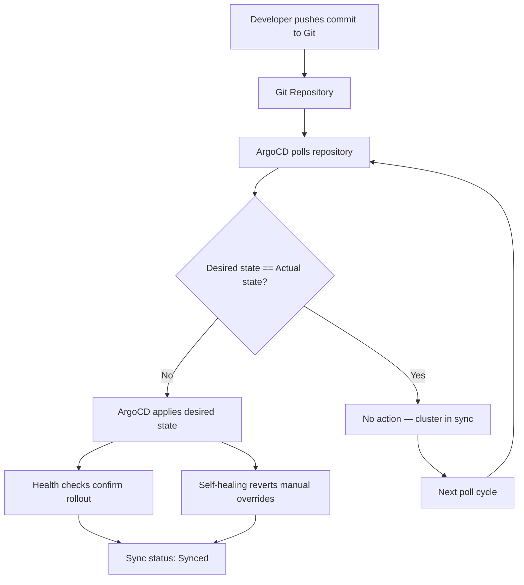

| Difficulty | Channel | Tags |
|---|---|---|
| beginner | devops | argocd, flux, declarative |

For years, Adobe's internal delivery platform Moonbeam ran on fragile, queue-based pipelines and imperative workflows that nobody truly understood. Configuration drift was rampant, deployment queues crawled, and the sprawling footprint had become nearly impossible to secure or operate reliably. Then something shifted: Adobe migrated or decommissioned 10,400 pipelines, transitioned hundreds of teams to GitOps with Argo, and retired roughly 80% of the stale and duplicate services nobody had bothered to clean up — transforming a liability into one of the largest enterprise GitOps deployments on record, serving 3,000+ developers and 3,000+ production services [1]. If that sounds like an exaggerated success story, consider this: the real lesson is not what went right, but how many teams are still building Moonbeam-style pipelines today, one `kubectl apply` at a time.

---

> ### Real-World Case — Adobe
>
> Adobe's legacy internal delivery platform, Moonbeam, had become too hard to scale, secure, and operate reliably. Its deployment model relied on fragile, queue-based pipelines and imperative workflows that produced constant configuration drift across a sprawling footprint.
>
> | | |
> |---|---|
> | **Challenge** | Modernize software delivery for 3,000+ engineers running 3,000+ production services, migrating thousands of services and pipelines off a legacy container platform to a declarative, Git-based operating model without disrupting engineering velocity or security compliance. |
> | **Solution** | Adobe built 'Flex,' a governed GitOps delivery platform on Kubernetes using the Argo ecosystem (Argo CD, Workflows, Events, Rollouts). Git became the single source of truth, with declarative application/infrastructure definitions continuously reconciled by Argo CD — auto-sync, self-healing, and auditability replaced manual kubectl edits and queue-based deploys. A self-service migration UI with pause/resume state orchestrated by Argo Workflows coordinated thousands of changes across hundreds of teams. |
> | **Outcome** | Migrated or decommissioned 10,400 pipelines, transitioned hundreds of teams to GitOps, dramatically cut deployment queue times, and retired ~80% of stale/duplicate services uncovered during migration — contributing meaningful infrastructure cost savings and stronger security. The platform now supports 3,000+ developers and 3,000+ production services, and is one of the largest publicly described enterprise deployments of Argo-based GitOps. |
> | **Lesson** | Large-scale GitOps adoption is as much about lifecycle control and workflow orchestration as it is about the tooling — 'adopting the technology was only part of the challenge.' Also, the declarative migration was a forcing function to delete abandoned services: moving to Git as source of truth not only killed configuration drift but surfaced thousands of dead workloads. |

---

## Hook — The 3 AM Phone Call Nobody Wants to Answer

Picture this: it is 3 AM, a deploy "went through" twenty minutes ago, and your production cluster is now running three different versions of the same microservice. Nobody knows which version is correct. Nobody knows who applied the change. The YAML files on Git say one thing, the cluster says another, and the difference — called configuration drift — has been quietly accumulating for weeks. Sound familiar? You are not alone. Most teams operating Kubernetes in production discover, painfully, that the gap between what Git says should exist and what actually exists in the cluster is a breeding ground for incidents, security holes, and deployment paralysis. This is exactly the cliff Adobe stared into — and it is the cliff that GitOps exists to pull you back from.

## Problem — Configuration Drift and the Imperative Trap

At the heart of the problem is a deceptively simple question: where is the source of truth for your infrastructure? In a traditional imperative setup, developers run `kubectl` commands directly against the cluster. A hotfix gets applied at 11 PM. A junior engineer experiments with a scaling policy during on-call. A CI pipeline applies a manifest and moves on without recording the change anywhere auditable. Over time, the cluster diverges from whatever is in version control — or worse, there is no version control at all. The consequences compound. Rollbacks become archaeological expeditions. Auditors find unauthorized changes nobody can explain. And when something breaks, the absence of a single, authoritative state means every fix is essentially a guess.

This is the imperative trap: every command you run directly against the cluster is a decision made outside the system designed to track decisions. You might think, "But our team is disciplined enough to always commit changes first." Many teams think that — until a production outage reveals a manual tweak from six months ago that nobody documented. The plot twist? The fix is not stricter process. It is a fundamentally different architecture.

## Real-World Case — Adobe's Moonbeam Reckoning

Adobe's internal delivery platform, Moonbeam, was a case study in imperative sprawl. Queue-based pipelines had accumulated over years, configuration drift was constant, and the sprawling service footprint had become ungovernable. The platform's deployment model relied on imperative workflows where changes were applied directly to clusters, bypassing any single source of truth [1].

The scale was staggering. Adobe ultimately migrated or decommissioned 10,400 pipelines and transitioned hundreds of teams to an Argo-based GitOps model. The cleanup alone — identifying and retiring approximately 80% of services as stale or duplicate — produced meaningful infrastructure cost savings and a dramatically stronger security posture. Today, the platform supports 3,000+ developers and 3,000+ production services, making it one of the largest publicly described enterprise deployments of Argo-based GitOps [1].

What makes this story instructive is not the success; it is the diagnosis. Moonbeam failed because it treated the cluster as the source of truth. GitOps succeeded because it inverted that assumption entirely: Git is the source of truth, and the cluster is merely a reflection of it.

## Deep Dive — Declarative vs Imperative: The Architecture That Changes Everything

To understand why GitOps resolves configuration drift at a structural level, you need to internalize the difference between declarative and imperative approaches.

With the **imperative approach**, you tell the system *how* to get from state A to state B. Run `kubectl scale deployment api --replicas=5`. Apply a patch. Delete a resource. Every command is a transaction with the cluster, and none of those transactions are guaranteed to leave an audit trail in version control [2]. The cluster is the system of record.

With the **declarative approach**, you describe *what* you want the cluster to look like — and you commit that description to Git. A deployment YAML declares five replicas. A Helm chart declares a complete release. A Kustomize overlay declares environment-specific variants. You never tell the system *how* to achieve the desired state. You simply declare it, and a reconciliation engine — in this case, ArgoCD — makes it so [3].

This distinction is not academic. It changes who can make changes, how changes are reviewed, and what happens when things go wrong. Consider the practical tradeoffs:

| Dimension | Declarative (GitOps) | Imperative (kubectl) |
|---|---|---|
| Source of truth | Git repository | Cluster state |
| Change tracking | Git history with full diffs | Scattered across shells and pipelines |
| Rollback mechanism | `git revert` + auto-reconciliation | Manual re-apply or hoping backups exist |
| Collaboration | Pull requests, code review, approvals | Oral tradition and Slack messages |
| Auditability | Complete, by default | Requires separate tooling |
| Drift prevention | Continuous reconciliation | Hope and discipline |

Many developers discover that the real cost of imperative workflows is not the initial setup — it is the accumulated interest of undocumented changes over months and years. GitOps pays down that debt structurally.

## Workflow — How ArgoCD Becomes Your Reconciliation Engine

ArgoCD operationalizes the declarative approach through a tight, Kubernetes-native feedback loop. Here is how it works in practice:

**Step 1: Git as the Single Source of Truth.** Your Kubernetes manifests, Helm charts, or Kustomize configurations live in a Git repository. Every change goes through a pull request with code review and CI checks. No exceptions.

**Step 2: Application CRD.** You define an ArgoCD `Application` custom resource that points to your Git repository, specifies the target cluster and namespace, and declares the sync policy. This CRD is itself a Kubernetes resource, so the setup is fully declarative [4].

**Step 3: Auto-Sync.** ArgoCD continuously polls the Git repository (default interval: every 3 minutes) and compares the desired state in Git against the actual state in the cluster. If they differ, ArgoCD automatically applies the changes to bring the cluster into alignment [5].

**Step 4: Self-Healing.** If someone runs a `kubectl` command that modifies a managed resource outside of Git, ArgoCD detects the drift and reverts the change on the next sync cycle. This is the enforcement mechanism that eliminates configuration drift by design.

**Step 5: Health Checks.** ArgoCD monitors Kubernetes resource health (Deployment rollout status, Pod readiness, etc.) and reports sync status in its dashboard and API, giving operators real-time visibility into whether the desired state has been achieved [6].

This loop — declare, commit, sync, reconcile, heal — is the beating heart of GitOps. It is not a tool. It is an operating model where Git is the control plane and the cluster is the data plane.

The following diagram illustrates this reconciliation flow:

## Code Example — Defining an ArgoCD Application in Practice

Theory is useful. Code is proof. Below is a production-style example of an ArgoCD Application CRD that configures auto-sync with self-healing for a microservices deployment:

## Lessons Learned — Battle Scars from the GitOps Trenches

After watching teams adopt and stumble with GitOps, here are the patterns that separate successful deployments from painful ones:

**1. Start with one service, not ten.** Adobe did not flip a switch on 3,000 services overnight. They iterated. Pick a non-critical service, configure ArgoCD, let the team build confidence with the sync loop, then expand. Premature scale is the leading cause of GitOps adoption failure.

**2. Resist the temptation to `kubectl edit` during incidents.** This is the hardest habit to break. When production is on fire at 3 AM, the urge to fix things imperatively is overwhelming. But every manual override weakens the GitOps contract. If you must apply an emergency fix, commit it to Git first, even if it takes an extra 90 seconds. Future-you will be grateful.

**3. Monitor sync status, not just pod health.** ArgoCD's sync status is an early warning system. If `OutOfSync` persists for more than one sync cycle, something is wrong — either in Git or in the cluster. Treat it as an alert, not a dashboard decoration.

**4. Use ApplicationSets for scale.** Managing individual Application CRDs across hundreds of services does not scale. ArgoCD's ApplicationSets let you generate Applications dynamically from a template, reducing configuration sprawl [7].

**5. Secure your Git repository as if it controls production — because it does.** Branch protection rules, required reviews, signed commits, and limited write access are not optional. A compromised Git repo in a GitOps setup means a compromised cluster [8].

The bottom line: GitOps is not a tool you install. It is a discipline you practice. The configuration is straightforward — a few YAML files, a sync interval, a health check policy. The hard part is building the cultural习惯 of treating Git as the only acceptable path to production. If Adobe can do it across 3,000+ services, your team can do it across five.

---

## ArgoCD GitOps Reconciliation Flow

<strong>Original Interview Question</strong>

**Q:** You're setting up GitOps for a microservices deployment. How would you configure ArgoCD to automatically sync changes from your Git repository to Kubernetes, and what's the difference between declarative and imperative approaches in this context?

**A:** I'd configure ArgoCD by setting up a Git repository containing Kubernetes manifests or Helm charts, creating an Application CRD that points to the Git repository, enabling auto-sync with a health check interval of 3 minutes, and implementing self-healing to automatically revert any manual changes. The declarative approach involves defining the desired state in Git through YAML manifests, Helm charts, or Kustomize configurations, where ArgoCD continuously reconciles the actual state with the desired state. In contrast, the imperative approach uses kubectl commands to make direct changes to the cluster, bypassing the Git repository as the single source of truth.

## Conclusion

The story of Adobe's Moonbeam is not really about ArgoCD, Helm, or Kubernetes manifests. It is about a question every team must answer: who owns the truth? If the answer is "whoever runs `kubectl` last," you are building Moonbeam. If the answer is "the commit on main," you are building GitOps. The configuration is the easy part — a CRD, a sync interval, a self-healing flag. The hard part is the cultural commitment to never bypass Git, even when the pager goes off at 3 AM. Start with one service. Prove the model. Then scale. And if anyone on your team says, "Let me just apply this quick fix directly to the cluster" — you will know exactly what to say.

---

## References

1. [Adobe incident report](https://www.cncf.io/case-studies/adobe/) — article
2. [Kubernetes kubectl Command-Line Tool](https://kubernetes.io/docs/reference/kubectl/) — documentation
3. [Argo CD Declarative GitOps Engine](https://github.com/argoproj/argo-cd) — documentation
4. [Argo CD Application CRD Reference](https://argo-cd.readthedocs.io/en/stable/operator-manual/declarative-setup/) — documentation
5. [Argo CD Auto-Sync Documentation](https://argo-cd.readthedocs.io/en/stable/user-guide/auto-sync/) — documentation
6. [Kubernetes Resource Health Documentation](https://kubernetes.io/docs/concepts/workloads/pods/pod-lifecycle/#pod-health) — documentation
7. [Argo CD ApplicationSets](https://argo-cd.readthedocs.io/en/stable/operator-manual/applicationset/) — documentation
8. [GitOps Working Group Principles](https://opengitops.dev/) — documentation
9. [Helm Kubernetes Package Manager](https://helm.sh/docs/) — documentation
10. [Kustomize Kubernetes-native Configuration Management](https://kustomize.io/) — documentation

---

**Author:** Satishkumar Dhule — [GitHub](https://github.com/satishkumar-dhule) · [LinkedIn](https://linkedin.com/in/satishkumar-dhule) · [Website](https://satishkumar-dhule.github.io)
