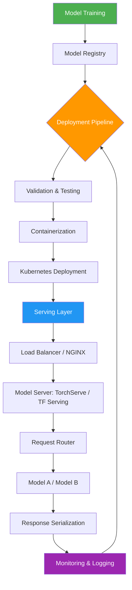

| Difficulty | Channel | Tags |
|---|---|---|
| beginner | devops | mlops, deployment |

In 2015, Uber's data scientists were building ML models that power everything from ETAs to surge pricing — but getting them into production was a nightmare. Each team hand-deployed models into bespoke, one-off serving containers, creating a fragmented mess that made it impossible to scale ML across dozens of teams [1]. The company eventually built Michelangelo, an end-to-end ML platform that separated deployment infrastructure from online model serving, and within a year it became the de-facto ML system serving 250,000+ predictions per second with P95 latency under 10ms [1]. But here is the thing most developers get wrong: deployment and serving are not the same thing, and conflating the two is exactly the kind of mistake that sinks ML systems at scale.

---

> ### Real-World Case — Uber
>
> In 2015, Uber's data scientists built ML models (ETAs, UberEATS delivery time, surge pricing) but had no standardized way to get them into production. Each model was hand-deployed into bespoke, one-off serving containers written by whichever engineering team happened to build it, making it impossible to scale ML across dozens of teams. Uber built Michelangelo, an end-to-end ML platform, to separate the concerns of deployment infrastructure from online model serving.
>
> | | |
> |---|---|
> | **Challenge** | Uber needed to distinguish two very different problems that teams kept conflating: model deployment (standardized CI/CD, model registry, containerized rollout, monitoring, rollback) and model serving (real-time inference at sub-10ms latency on request/response RPC APIs at massive QPS). Online serving also had a hidden trap: models trained offline on HDFS couldn't compute features from production databases in real time, so features had to be precomputed into Cassandra for low-latency lookup at prediction time. |
> | **Solution** | Michelangelo standardized the full workflow: data management, training, evaluation, deployment, prediction, and monitoring. Models deploy either to Spark jobs for batch prediction or to one of two online paths: native Java-based prediction service clusters (hundreds of machines behind a load balancer, multiple models loaded and routed per container) or embedded library serving for low-latency in-process calls. They built a model registry for tracking/rollback and a feature store (~10,000 features) shared across teams, treating ML like software engineering. |
> | **Outcome** | Within a year Michelangelo was the de-facto ML system at Uber across multiple data centers, with dozens of teams deploying models; the highest-traffic models served 250,000+ predictions per second with P95 latency under 10ms (sub-5ms for most models at 1M+ predictions/sec by 2019). By 2022, it had grown to ~400 active ML projects, 20K+ model training jobs monthly, and 5,000+ models in production serving 10 million real-time predictions per second at peak. |
> | **Lesson** | Deployment and serving are different disciplines with different constraints: deployment is about iteration, rollback, and reproducibility (CI/CD, registries, monitoring), while serving is a latency- and throughput-bound runtime problem that often requires rethinking data access (precomputed features vs. live reads) and choosing between batch and online systems. Conflating them produces fragile custom serving containers; separating them with a standardized platform is what scales ML across a company. |

---

## Hook — The Deploy Button That Does Nothing

Picture this: your team just trained a model that cuts customer churn prediction error by 15%. The data scientist pushes it to a staging environment, someone clicks a deploy button, and the model is... technically running. But nobody can explain why inference latency spiked to 400ms, why the model is responding to requests it should not be serving, or why rolling back takes 20 minutes of manual container shuffling. Sound familiar? You might think deploying a model means it is ready to serve predictions. But deployment and serving are fundamentally different concerns — and confusing them is the number one reason ML systems break down in production. The question is not whether you need both. The question is whether you understand what each one actually does.

## Problem — Why Deployment Is Not Serving (And Why That Matters)

Most developers discover the hard way that deployment and serving are two separate disciplines. Deployment is the infrastructure layer: CI/CD pipelines, container orchestration, environment configuration, rollback strategies, and monitoring [2]. Serving is the runtime layer: request routing, model loading, response serialization, batching, and latency optimization [3]. When you conflate them, you end up with what Uber experienced — dozens of teams building bespoke serving infrastructure from scratch, each with different patterns, different monitoring blind spots, and different failure modes. The real danger is that your models might appear to work in a test environment while completely collapsing under production traffic. A model that handles 100 requests per second in development might choke at 10,000 QPS because nobody configured horizontal pod autoscaling or set up proper load balancing behind the inference API [4]. This is not a theoretical problem. It is the everyday reality for ML teams that do not treat deployment and serving as distinct engineering concerns.

## Real-World Case — Uber's Michelangelo Platform

By 2015, Uber's ML teams were in crisis. ETAs, UberEATS delivery time predictions, and surge pricing models were all critical to the business, but each model lived in its own hand-deployed container. There was no standardized way to get models into production, making it impossible to scale ML across the organization [1]. The company built Michelangelo to solve this by cleanly separating deployment infrastructure from online model serving. The results were staggering: within a year, Michelangelo became Uber's de-facto ML platform across multiple data centers. The highest-traffic models served 250,000+ predictions per second with P95 latency under 10ms. By 2019, that scaled to 1M+ predictions per second with sub-5ms latency. By 2022, Michelangelo supported approximately 400 active ML projects, 20,000+ monthly model training jobs, 5,000+ models in production, and 10 million real-time predictions per second at peak [1]. The key insight? Michelangelo did not replace serving frameworks — it standardized how models moved from training to serving, giving every team a consistent, scalable path to production. This separation of concerns is the architectural pattern that every serious ML platform follows today.

## Deep Dive — The Two Layers of Production ML

Think of model deployment and model serving as two distinct layers in your production stack, each with its own tools, concerns, and failure modes.

**Deployment** handles the journey from trained model artifact to running service. It includes CI/CD pipelines that validate model artifacts, infrastructure provisioning via Kubernetes or Terraform, environment configuration, rollback strategies, and observability setup. Tools in this layer include MLflow for experiment tracking and model registry, SageMaker or Vertex AI for managed deployment, and GitHub Actions or Jenkins for pipeline automation [2][5].

**Serving** handles what happens after the model is deployed. It manages request routing, model loading into GPU/CPU memory, response serialization, batching incoming requests for efficiency, and versioning so you can run A/B tests or canary deployments. Frameworks like TensorFlow Serving, TorchServe, and BentoML are purpose-built for this [3][6].

The trade-offs are real and consequential:

| Concern | Deployment Focus | Serving Focus |
|---|---|---|
| Latency | Pipeline execution time | Inference response time |
| Scaling | Infrastructure provisioning | Request-level autoscaling |
| Failure Mode | Pipeline breaks, deploys stall | Model OOM, request timeouts |
| Monitoring | Deploy success/failure rates | P50/P95/P99 latency, error rates |
| Rollback | Re-deploy previous version | Switch model version at router |

The plot twist many teams miss: you can have perfect deployment infrastructure and still fail at serving if your inference framework cannot handle real-time request routing. Conversely, a brilliant serving layer is useless if your deployment pipeline cannot reliably push model updates without downtime. Both layers need to work together, but they must be engineered independently.

## Workflow — From Training to Serving in Production

Here is the typical workflow when both layers are properly separated. The Mermaid diagram below visualizes the full journey from model training to production serving:



The flow breaks down into three phases:

1. **Registration**: After training, the model artifact is registered in a model registry like MLflow or SageMaker Model Registry. This captures metadata, version, and lineage [5].
2. **Deployment Pipeline**: The CI/CD pipeline validates the artifact, builds a Docker container, and deploys it to Kubernetes with the appropriate resource requests (GPU, CPU, memory) [2][7].
3. **Serving Layer**: Once running, the model server handles inference requests through a load balancer, routes traffic between model versions, and serializes responses [3][6].

The critical handoff point between deployment and serving is the model artifact itself. Deployment pushes it; serving loads it. When these two layers are decoupled, teams can iterate on serving infrastructure independently — for example, switching from TensorFlow Serving to BentoML without touching the deployment pipeline.

## Code Example — Separating Deployment from Serving with BentoML

The following example demonstrates how to separate model serving logic from deployment infrastructure using BentoML, a framework designed for production-grade model serving:

```python
import bentoml
from bentoml.io import JSON, NumpyNdarray
import numpy as np

# Serving layer: define how the model handles requests
# This lives independently of deployment infrastructure
iris_runner = bentoml.sklearn.get("iris_classifier:latest").to_runner()
svc = bentoml.Service("iris_classifier", runners=[iris_runner])

# Define the inference endpoint with explicit input/output types
@svc.api(input=NumpyNdarray(), output=JSON())
async def predict(input_data: np.ndarray) -> dict:
    # Request routing and response serialization happen here
    # The serving framework handles batching, timeout, and concurrency
    prediction = await iris_runner.predict.async_run(input_data)
    return {
        "predictions": prediction.tolist(),
        "model_version": "iris_classifier:latest",
        "status": "success"
    }

# To deploy this service to Kubernetes:
# 1. Build: bentoml build (creates the deployment artifact)
# 2. Containerize: bentoml containerize iris_classifier:latest
# 3. Deploy: kubectl apply -f deployment.yaml
#
# The deployment layer (Kubernetes manifests, Helm charts)
# is completely separate from the serving logic above.
# You can swap Kubernetes for SageMaker, or switch from
# BentoML to TorchServe, without changing the serving code.
```

**Walking through the code**: The `predict` function defines the serving layer — it accepts numpy arrays, runs inference through the runner, and returns structured JSON. Notice how the serving logic has zero dependency on Kubernetes, Docker, or any deployment tool. The comments at the bottom explain the deployment layer: `bentoml build` creates an artifact, `bentoml containerize` wraps it in a Docker image, and `kubectl apply` deploys it to Kubernetes. These are completely separate operations that can be managed by different teams or pipelines [6][8]. This separation is exactly the pattern Uber's Michelangelo enforced across its organization.

## Lessons Learned — What Every ML Team Should Know

After watching dozens of ML teams stumble on this distinction, here are the battle-tested takeaways:

**1. Treat deployment and serving as separate engineering domains.** Deployment teams own CI/CD, infrastructure, and rollback. Serving teams own inference latency, request routing, and model optimization. Mixing them creates bottlenecks and blind spots [1][2].

**2. Latency is a serving concern, not a deployment concern.** Many developers monitor deploy success rates and call it a day. But P95 inference latency under 100ms is what matters in production — and that lives entirely in the serving layer [3][4].

**3. Horizontal scaling solves different problems at each layer.** At the deployment layer, scaling means more pods and faster pipeline execution. At the serving layer, it means request-level autoscaling and efficient batching. Kubernetes handles both, but with different configurations [4][7].

**4. Model versioning must work across both layers.** Your model registry (MLflow, SageMaker) should be the single source of truth that both the deployment pipeline and the serving framework reference [5].

**5. Cold starts are a serving problem.** When your model takes 30 seconds to load into GPU memory, that is a serving optimization problem — consider pre-loading models, using model caching, or warm-up requests [3][6].

The one insight to share with your team tomorrow: **deployment gets your model into production; serving keeps it alive there.** Build both layers deliberately, and your ML systems will scale the way Uber's did — from dozens of models to millions of predictions per second.

---

## ML Model Deployment to Serving Pipeline


<details>
<summary><strong>Original Interview Question</strong></summary>

**Q:** Explain the key differences between model serving and model deployment in ML systems, including specific technologies, scaling considerations, and real-world implementation patterns?

**A:** Deployment encompasses CI/CD pipelines, infrastructure setup, and monitoring using tools like Kubernetes, MLflow, and SageMaker. Serving focuses on runtime inference APIs with frameworks like TensorFlow Serving, TorchServe, or BentoML, handling request routing, model versioning, and autoscaling. Key trade-offs include latency vs throughput, batch vs real-time inference, and cold start optimization.

</details>

## Conclusion

The Uber story is not just a cautionary tale — it is a blueprint. Deployment and serving are distinct engineering concerns, and treating them as a single monolithic 'put model in production' step is the mistake that separates teams that scale ML from teams that drown in it. Start by mapping which of your current tools belong to the deployment layer (Kubernetes, MLflow, CI/CD) and which belong to the serving layer (TorchServe, BentoML, request routing). Then ask yourself: if you changed one, would the other break? If the answer is yes, you have not decoupled them yet. The teams that get this right do not just ship models faster — they ship models that actually stay alive in production.

---

## References

1. [Uber Michelangelo Machine Learning Platform](https://www.uber.com/us/en/blog/michelangelo-machine-learning-platform/) — blog
2. [Kubernetes Documentation: Deployments](https://kubernetes.io/docs/concepts/workloads/controllers/deployment/) — documentation
3. [TensorFlow Serving Documentation](https://www.tensorflow.org/tfx/guide/serving) — documentation
4. [Kubernetes Horizontal Pod Autoscaler](https://kubernetes.io/docs/tasks/run-application/horizontal-pod-autoscale/) — documentation
5. [MLflow Model Registry Documentation](https://mlflow.org/docs/latest/model-registry.html) — documentation
6. [BentoML Documentation: Getting Started](https://docs.bentoml.com/en/latest/getting-started/index.html) — documentation
7. [Docker Documentation: Overview](https://docs.docker.com/get-started/overview/) — documentation
8. [PyTorch TorchServe Documentation](https://pytorch.org/serve/) — documentation
9. [AWS SageMaker Model Deployment](https://docs.aws.amazon.com/sagemaker/latest/dg/deploy-model.html) — documentation
10. [Google Vertex AI Prediction Endpoints](https://cloud.google.com/vertex-ai/docs/predictions/getting-predictions) — documentation

---

**Author:** Satishkumar Dhule — [GitHub](https://github.com/satishkumar-dhule) · [LinkedIn](https://linkedin.com/in/satishkumar-dhule) · [Website](https://satishkumar-dhule.github.io)
