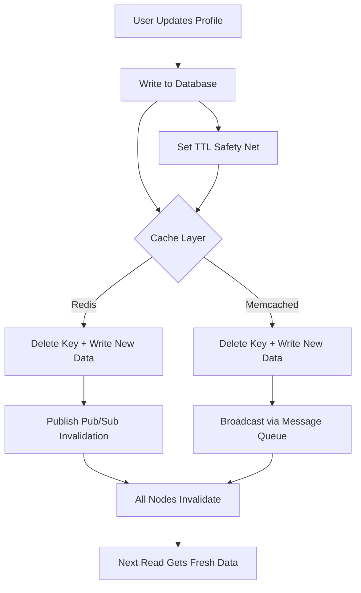

| Difficulty | Channel | Tags |
|---|---|---|
| beginner | backend | redis, memcached, cache-invalidation |

Picture two friends messaging the same person on Facebook. One sends 'Want to grab dinner?' and the other sends 'Meeting at 7?' — but neither sees the other's message. This isn't a theoretical edge case. It actually happened at Meta, where a cache inconsistency between TAO and Memcache delivered messages to different data regions, leaving users with split conversations [1]. At the scale of over one quadrillion queries per day, even a 99.9999% consistency rate means thousands of broken experiences every minute. The question you should be asking isn't whether your caching layer has bugs — it's whether you'd even catch them before your users do.

---

> ### Real-World Case — Meta
>
> Meta serves over 1 quadrillion queries per day across TAO and Memcache, their two primary caching systems. Cache inconsistencies at this scale cause real user-facing bugs — including a split-brain messaging incident where two people messaging the same user had their messages delivered to different data regions, resulting in neither seeing a complete conversation.
>
> | | |
> |---|---|
> | **Challenge** | Maintaining cache consistency across globally distributed cache clusters when cache fills (reads) and cache invalidations (writes) race against each other. At Meta's scale (10 trillion+ cache fills per day even at 99% hit rate), even tiny inconsistency rates produce massive numbers of stale reads, and the non-deterministic nature of race conditions makes them nearly impossible to debug without new tooling. |
> | **Solution** | Meta built two complementary systems: (1) Polaris, a monitoring service that acts as a fake cache server receiving invalidation events, then queries real cache replicas to detect inconsistencies — using multi-timescale reporting (1, 5, 10 minutes) to avoid false positives and reduce database bypass queries. (2) A consistency tracing library embedded in cache servers that logs mutations only during the narrow 'race window' where inconsistencies can be introduced, rather than logging every cache state change (which would turn a read-heavy workload into a write-heavy one). This combination allowed them to systematically find and fix bugs like a critical error handler that called drop_cache(key, version) but failed to drop entries when the stale version matched the latest version — leaving metadata inconsistent indefinitely. |
> | **Outcome** | Improved TAO cache consistency from 99.9999% (six nines) to 99.99999999% (ten nines) — meaning fewer than 1 in 10 billion cache writes remain inconsistent after 5 minutes. The consistency tracing system reduced bug diagnosis time from weeks to under 30 minutes for complex race conditions. |
> | **Lesson** | Cache invalidation bugs hide in error handling code paths that are only triggered by rare combinations of transient failures and interleaving operations. You cannot design your way out of this — you need observability infrastructure (like Polaris) that measures consistency from the client's perspective and traces mutations during the exact window where races occur. Also: never assume your cache is 'just a cache' — at scale, cache inconsistency is functionally equivalent to data loss. |

---

## Hook — One Inconsistent Cache Write, Zero Complete Conversations

When Meta engineers first noticed the split-brain messaging bug, the initial instinct was to blame the database layer. After all, databases are where data consistency lives, right? But the real culprit was hiding in plain sight: the caching layer. Two users messaging the same recipient hit different cache nodes in different regions, and because the invalidation signals didn't propagate correctly, each node held a stale version of the conversation. Neither user saw the full thread. This wasn't a one-off glitch — it was a systemic failure that exposed a brutal truth: caching is easy to set up and terrifyingly hard to get right at scale. The debugging process took weeks. The fix? A consistency tracing system that reduced diagnosis time to under 30 minutes. But the lessons from that journey apply to every backend system that caches user data, whether you're serving 100 users or 100 billion.

## Problem — The Cache Invalidation Trilemma

Every backend developer eventually runs into what Phil Karlton famously called one of the two hard problems in computer science: cache invalidation [2]. The core challenge is deceptively simple: when a user updates their profile — changes their name, uploads a new photo, edits their bio — every cached version of that profile across every server in your fleet needs to reflect the new data. Fail to invalidate, and users see stale information. Invalidate too aggressively, and you hammer your database with unnecessary reads. Invalidate incorrectly, and you get split-brain scenarios like Meta's messaging disaster. The tension sits at the intersection of three competing goals: consistency (users always see the latest data), performance (cache hits stay fast), and availability (the system doesn't fall over when a cache node goes down). You cannot optimize for all three simultaneously — this is the caching trilemma. Many developers discover this the hard way, usually at 3am when a customer reports that their profile photo is showing someone else's face.

## Real-World Case — Meta's TAO and Memcache Reconciliation

Meta's caching infrastructure is built on two primary systems: TAO (The Associations and Objects cache, a distributed graph cache) and Memcache (a distributed key-value cache) [1]. Together, they handle over one quadrillion queries per day. The split-brain messaging incident occurred when cache invalidation signals failed to propagate uniformly across regions. Specifically, when a message was written to one region's cache, the invalidation of the corresponding association in another region didn't complete before a read arrived — creating a window where two concurrent readers could see different partial states of the same conversation. The impact was severe: Meta improved TAO cache consistency from 99.9999% (six nines) to 99.99999999% (ten nines) through a dedicated consistency tracing system [1]. That means fewer than 1 in 10 billion cache writes remain inconsistent after a 5-minute window. The tracing system itself reduced bug diagnosis time from weeks to under 30 minutes for complex race conditions. The key insight wasn't that caching is broken — it's that consistency guarantees must be measured and traced, not assumed. If you're caching user profiles today, the question isn't whether your invalidation is perfect. It's whether you'd know if it weren't.

## Deep Dive — Write-Through Caching and the Redis vs Memcached Decision

The most reliable cache invalidation strategy for user profile data is write-through caching with TTL-based expiration. Here's how it works: when a user updates their profile, you don't just write to the database. You simultaneously write the new data to both the database and the cache, and you delete the old cache key to prevent any stale reads from sneaking through [3]. This two-pronged approach ensures that even if the write to the cache fails momentarily, the TTL expiration will eventually clean up the stale entry. Setting the right TTL is critical — profiles don't change frequently, so a 5-to-30-minute window balances freshness against database load [4]. Now, here's where it gets interesting: the tool you choose for this job fundamentally shapes your invalidation architecture. Redis and Memcached are the two dominant players, and they are not interchangeable.

**Redis** offers pub/sub messaging, which means a cache invalidation on one node can broadcast to all other nodes automatically [5]. It supports persistence (data survives restarts), advanced data structures (hashes, sorted sets, lists), and Lua scripting for atomic operations. For distributed invalidation across multiple servers, Redis pub/sub eliminates the need for custom coordination layers.

**Memcached**, on the other hand, is purpose-built for simplicity. It uses a slab allocator for memory efficiency, has lower per-key overhead, and scales horizontally with near-linear performance for pure caching workloads [6]. However, it offers no built-in pub/sub, no persistence, and no advanced data structures. Cache invalidation across Memcached nodes requires manual coordination — typically through a message queue or application-level broadcast.

| Feature | Redis | Memcached |
|---------|-------|------------|
| Pub/Sub for invalidation | Yes, built-in | No, manual coordination required |
| Persistence | Yes (RDB + AOF) | No |
| Data structures | Hashes, lists, sets, sorted sets | Key-value only |
| Memory overhead | Higher per key | Lower per key |
| Horizontal scaling | Cluster mode with sharding | Simple consistent hashing |
| Best for | Complex invalidation, durability | Pure caching, low latency |

The plot twist? Many teams choose Redis because it's "more powerful," then never use pub/sub, persistence, or advanced structures. If your only use case is simple key-value profile caching with TTL expiration, Memcached's lower overhead might actually serve you better. The right choice depends on your invalidation complexity, not on feature checklists.

## Workflow — The Profile Update Pipeline

Here's the step-by-step flow when a user updates their profile in a write-through caching architecture:

1. **User submits update** — A PUT or POST request hits your API endpoint with the new profile data.
2. **Write to database first** — The authoritative source gets the update. This is non-negotiable. The database is truth [3].
3. **Invalidate the cache** — Delete the old cache key immediately. Don't try to update it in place — deletion is atomic and avoids race conditions between concurrent writes.
4. **Write new data to cache** — Populate the cache with the fresh data from the database write. This ensures the next read hits the cache with correct data.
5. **Set TTL** — Apply a 5-to-30-minute expiration as a safety net. Even if invalidation fails for some reason, the stale data will self-destruct.
6. **Distribute invalidation** — If using Redis, publish an invalidation event via pub/sub. If using Memcached, broadcast through your message queue or application layer.
7. **Monitor hit rates** — Track cache hit/miss ratios. A sudden spike in misses after a deployment often signals invalidation bugs [7].



## Code Example — Write-Through Cache Invalidation in Python

Here's a production-style implementation using Python with Redis. The pattern applies equally to Memcached — swap the Redis client and remove the pub/sub logic.

```python
import redis
import json
import hashlib
from datetime import timedelta
from typing import Optional, Dict, Any

# Initialize Redis connection
redis_client = redis.Redis(
    host='localhost',
    port=6379,
    db=0,
    decode_responses=True
)

# TTL for profile cache — 15 minutes balances freshness vs DB load
PROFILE_CACHE_TTL = timedelta(minutes=15)

def _profile_cache_key(user_id: str) -> str:
    """Generate a deterministic cache key for a user profile."""
    return f"profile:{user_id}"

def get_profile(user_id: str) -> Optional[Dict[str, Any]]:
    """
    Cache-aside read: check cache first, fall back to DB.
    This is the READ path — fast path on cache hit.
    """
    cache_key = _profile_cache_key(user_id)
    
    # Step 1: Try the cache first
    cached = redis_client.get(cache_key)
    if cached:
        return json.loads(cached)
    
    # Step 2: Cache miss — read from database
    profile = _read_profile_from_database(user_id)
    if profile is None:
        return None
    
    # Step 3: Populate cache for next time
    redis_client.setex(
        cache_key,
        PROFILE_CACHE_TTL,
        json.dumps(profile)
    )
    return profile

def update_profile(user_id: str, updates: Dict[str, Any]) -> Dict[str, Any]:
    """
    Write-through update: DB first, then cache.
    This is the WRITE path — consistency over speed.
    """
    cache_key = _profile_cache_key(user_id)
    
    # Step 1: Write to database (source of truth)
    updated_profile = _write_profile_to_database(user_id, updates)
    
    # Step 2: Invalidate old cache key (delete, don't update in place)
    redis_client.delete(cache_key)
    
    # Step 3: Write new data to cache with fresh TTL
    redis_client.setex(
        cache_key,
        PROFILE_CACHE_TTL,
        json.dumps(updated_profile)
    )
    
    # Step 4: Publish invalidation event for distributed nodes
    # This ensures other app servers don't serve stale data
    redis_client.publish(
        'profile_invalidation',
        json.dumps({
            'user_id': user_id,
            'event': 'profile_updated',
            'timestamp': updated_profile.get('updated_at')
        })
    )
    
    return updated_profile

def subscribe_to_invalidation(pubsub_thread):
    """
    Run on each app server to listen for invalidation events.
    Ensures distributed cache consistency.
    """
    pubsub = redis_client.pubsub()
    pubsub.subscribe(**{
        'profile_invalidation': lambda message: redis_client.delete(
            _profile_cache_key(json.loads(message['data'])['user_id'])
        )
    })
    pubsub_thread.run_in_thread(sleep_time=0.001)
```

**Walkthrough:** The `get_profile` function implements the cache-aside pattern — it checks Redis first, and only hits the database on a cache miss [8]. The `update_profile` function is where write-through happens: it writes to the database first (the database is always the source of truth), deletes the old cache key to prevent stale reads, writes the fresh data to cache with a 15-minute TTL as a safety net, and publishes an invalidation event so other app servers clear their local references [5]. The subscriber function runs on each server and listens for invalidation broadcasts, deleting the corresponding cache key when it receives one. The critical design choice here is **deletion over update** — when you delete the old key before writing the new one, you eliminate the race condition where a concurrent read picks up partially written cache data. This is the same pattern Meta refined to achieve ten nines of consistency [1].

## Lessons Learned — What Cache Invalidation Teaches You About System Design

After walking through Meta's journey and the mechanics of write-through caching, here are the insights that separate junior from senior backend thinking:

**🎯 Delete, don't update.** When invalidating cache, always delete the key rather than updating it in place. Deletion is atomic and eliminates race conditions between concurrent reads and writes. This is the single most important cache invalidation practice [3].

**🎯 TTL is your safety net, not your strategy.** TTL expiration catches invalidation failures, but it should never be the primary mechanism for consistency. If you're relying on TTL alone, you've already lost [4].

**🎯 Measure consistency, don't assume it.** Meta's biggest breakthrough wasn't a new algorithm — it was a tracing system that measured whether invalidation actually propagated [1]. If you can't measure it, you can't fix it.

**🎯 Choose Redis or Memcached based on invalidation complexity, not features.** If your cache invalidation is simple (key-value with TTL), Memcached's lower overhead wins. If you need pub/sub, persistence, or complex data structures, Redis is the right choice [5][6].

**🎯 Monitor cache hit rates obsessively.** A sudden drop in hit rate after a deployment is the earliest signal of an invalidation bug. Set up alerts on hit/miss ratios [7].

⚠️ **Watch Out:** The most common mistake is writing to cache before the database succeeds. If the database write fails, you've cached data that doesn't exist. Always write to the database first, then cache.

If you implement nothing else from this article, add cache invalidation tracing. Log every invalidation event and verify it reached every node. The 30 minutes you invest in observability will save you weeks of debugging split-brain bugs at 3am.

---

## Profile Update Cache Invalidation Flow


<details>
<summary><strong>Original Interview Question</strong></summary>

**Q:** You're building a user profile service that caches frequently accessed profiles. How would you implement cache invalidation when a user updates their profile, and what trade-offs would you consider between Redis and Memcached?

**A:** Implement write-through caching with TTL-based expiration. On profile update, invalidate the cache by deleting the key and writing new data to both the database and cache. Redis offers pub/sub for automatic distributed invalidation, while Memcached requires manual coordination across nodes.

</details>

## Conclusion

Cache invalidation isn't just a technical problem — it's a systems thinking problem. Meta's journey from six nines to ten nines of consistency didn't require a breakthrough algorithm. It required building observability around the assumption that cache writes are never as reliable as you think they are [1]. The practical takeaway: always delete cache keys on write (never update in place), use TTL as a safety net (not a strategy), and instrument your invalidation pipeline so you know when it fails. If you're choosing between Redis and Memcached, match the tool to your invalidation complexity — Redis for distributed pub/sub coordination, Memcached for pure speed on simple workloads. The teams that get caching right aren't the ones with the fastest infrastructure. They're the ones that build the muscle to catch inconsistency before their users do.

---

## References

1. [Cache made consistent](https://engineering.fb.com/2022/06/08/core-infra/cache-made-consistent) — blog
2. [Two hard things in computer science](https://en.wikipedia.org/wiki/Two_hard_things_in_computer_science) — documentation
3. [Cache-aside pattern](https://learn.microsoft.com/en-us/azure/architecture/cache-patterns/cache-aside) — documentation
4. [Redis expiration documentation](https://redis.io/docs/latest/develop/keys/expire/) — documentation
5. [Redis pub/sub documentation](https://redis.io/docs/latest/develop/interact/pubsub/) — documentation
6. [Memcached documentation](https://github.com/memcached/memcached/wiki) — documentation
7. [Cache hit ratio and why it matters](https://www.digitalocean.com/community/tutorials/how-to-use-redis-caching-to-speed-up-applications) — documentation
8. [Redis Python client documentation](https://redis-py.readthedocs.io/en/stable/) — documentation

---

**Author:** Satishkumar Dhule — [GitHub](https://github.com/satishkumar-dhule) · [LinkedIn](https://linkedin.com/in/satishkumar-dhule) · [Website](https://satishkumar-dhule.github.io)
