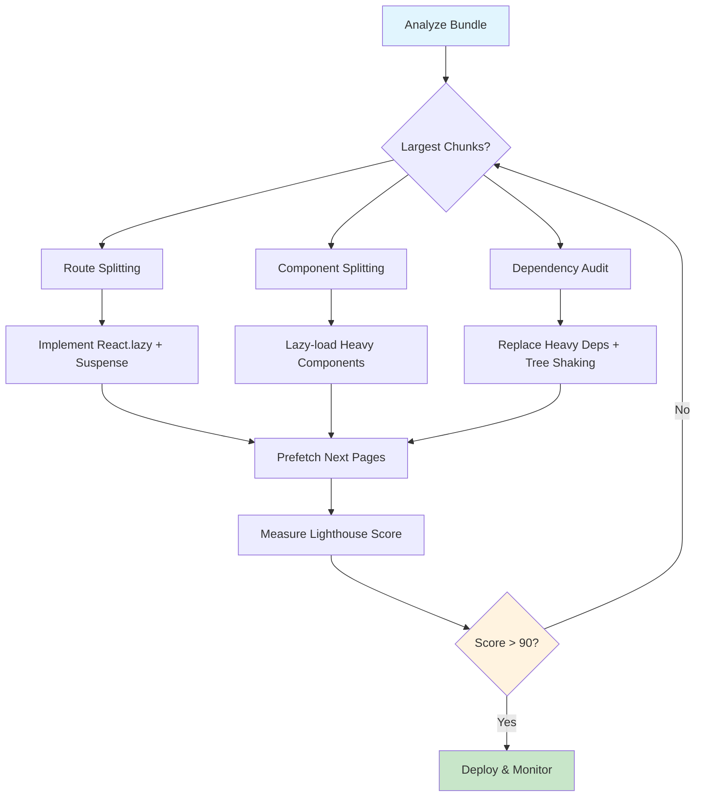

| Difficulty | Channel | Tags |
|---|---|---|
| intermediate | frontend | lighthouse, bundle, lazy-loading |

What if your heaviest JavaScript bundle was loading code your users would never see? Netflix faced exactly this problem: their logged-out homepage took over 7 seconds to become interactive on 3G connections [1]. Users on slow networks were staring at blank screens before they even had a chance to hit "Sign Up." The fix wasn't a magic bullet — it was a disciplined, surgical approach to reducing what shipped to the browser. If your React app is sitting at a 65 Lighthouse score with a bloated bundle, the same principles that rescued Netflix's signup flow can rescue yours.

---

> ### Real-World Case — Netflix
>
> Netflix's website team needed to improve startup performance for the logged-out homepage (signup flow). Users on slow connections were waiting 7 seconds on 3G to load what was essentially a simple landing page. The existing legacy stack used Java/Tomcat on the server with jQuery enhancement on the client, but the new architecture moved to server-side React with a JavaScript client application.
>
> | | |
> |---|---|
> | **Challenge** | The initial homepage loaded 300KB of client-side JavaScript including React, Lodash, and other libraries — most of which was unnecessary for a relatively simple landing page. The Time-to-Interactive was 7 seconds on 3G connections, far too slow for what was essentially a marketing page with a signup button. |
> | **Solution** | The Netflix team made a counterintuitive decision: they REMOVED React from the client-side rendering of the landing page entirely. Since the page was mostly static HTML with simple interactions (language switcher, signup button), they rebuilt those interactions in vanilla JavaScript using less than 300 lines of code. React was still used server-side to generate the HTML, and the React client bundle was prefetched in the background using XHR while users interacted with the landing page — so it was ready for the subsequent signup flow pages where it was actually needed. |
> | **Outcome** | Time-to-Interactive improved by over 50% (from 7s to under 3.5s on 3G). The 200KB+ reduction in client-side JavaScript meant the browser had far less to download and parse. Additionally, prefetching React for subsequent pages during landing page interaction reduced TTI for the next page by 30%. The signup conversion rate increased as a direct result of faster page loads, particularly in countries with slower network connections. |
> | **Lesson** | The most powerful performance optimization isn't always adding more tooling — sometimes it's recognizing when you don't need a framework at all. Netflix's engineers discovered that the cost of shipping React to the client far outweighed its benefits for simple, read-heavy pages. The key insight is: server-render your React components, but don't hydrate them on the client if the interactivity doesn't justify the JavaScript cost. Defer the heavy framework code until the user actually needs it. |

---

## Hook — The 7-Second Blank Screen That Was Losing Netflix Millions

Picture this: a potential subscriber in Southeast Asia on a 3G connection taps a Netflix ad. Seven seconds pass. Nothing loads. They close the tab and never come back. This wasn't a hypothetical scenario — it was Netflix's daily reality for their logged-out homepage. Their legacy stack, built on Java/Tomcat server rendering with jQuery client enhancement, was sending the entire page's HTML markup upfront, including code for sections users might never visit [1]. The browser had to download, parse, and execute all of it before anything became interactive. The Time to Interactive was devastating, and every second of delay was money left on the table.

## Problem — Why Your Bundle Size Is a Silent Revenue Killer

Here's the uncomfortable truth most developers learn the hard way: bundle size isn't a technical metric — it's a business metric. Research from Google shows that 53% of mobile users abandon sites that take over 3 seconds to load [3]. When your React app ships 2.1MB of JavaScript to the browser, you're not just wasting bandwidth. You're forcing the user's device to download, parse, compile, and execute a small application before they can interact with a single button. Time to Interactive (TTI) becomes the real enemy. A 4.2-second TTI means the page looks like it's loaded — the DOM is painted, the layout is visible — but nothing responds to taps or clicks. Users rage-click on unresponsive buttons and leave, convinced your site is broken. The core challenge breaks down into three interconnected problems: you're sending too much JavaScript upfront, you're not splitting code by what users actually need, and you're loading dependencies that aren't critical to the initial experience. Many developers discover their bundle is bloated only after user complaints surface or a Lighthouse audit reveals a score in the 60s. By then, the performance debt has compounded.

## Real-World Case — How Netflix Cut 3G Load Times in Half

Netflix's Website UI Engineering team tackled this problem head-on when rebuilding netflix.com. Their approach was methodical and yielded extraordinary results. The key insight was architectural: instead of having the Java server generate the full page and then handing it to JavaScript for enhancement, they flipped the model. The server would render only the minimal markup needed to bootstrap the client-side React application [1]. This single architectural change meant the browser received dramatically less HTML to parse and could start downloading JavaScript sooner. But they didn't stop there. Netflix implemented prefetching of React code for subsequent pages during the initial landing page interaction. So while a user was reading the signup page, the browser was quietly downloading the JavaScript needed for the next step in the funnel [1]. The results speak for themselves: Time to Interactive improved by over 50%, dropping from 7 seconds to under 3.5 seconds on 3G. The 200KB+ reduction in client-side JavaScript gave the browser far less work to do, and the prefetching strategy reduced TTI for subsequent pages by 30%. Most importantly, signup conversion rates increased, particularly in regions with slower network connections [1]. This is the same playbook you can apply to your React app — not by rebuilding your entire architecture, but by systematically applying code splitting, lazy loading, and bundle optimization.

## Deep Dive — The Three Pillars of Bundle Optimization

To move from a 65 to a 90+ Lighthouse score, you need to master three interconnected strategies: code splitting, tree shaking, and dependency auditing. Each attacks the problem from a different angle, and together they can shrink your initial bundle by 60-80%.

### Code Splitting: Breaking the Monolith
Code splitting is the practice of breaking your single massive bundle into smaller chunks that load on demand. React provides two powerful primitives for this: `React.lazy()` and `Suspense`. Route-based splitting is the highest-impact starting point because each route typically represents a distinct user journey — and users rarely visit every route in a single session [5]. Component-based splitting goes deeper, targeting heavy components like charts, editors, or modals that are only shown conditionally.

### Tree Shaking: Killing Dead Code
Tree shaking eliminates unused exports from your dependencies. If you import the entire `lodash` library but only use `debounce`, tree shaking should remove the other 300+ functions. However, tree shaking only works reliably with ES module imports (import/export syntax), not CommonJS (require/module.exports) [6]. Many developers discover their tree shaking isn't working because a dependency ships CommonJS, or because their bundler configuration isn't set up for it.

### Dependency Auditing: The Hidden Cost of npm Install
Every dependency you add carries weight. A tool like `webpack-bundle-analyzer` generates a visual treemap of your bundle, revealing which dependencies consume the most space [4]. Common culprits include moment.js (293KB with all locales), full lodash bundles, and icon libraries that import thousands of icons when you only use a dozen. After auditing, you'll often find 15-30% of your bundle comes from dependencies you could replace with lighter alternatives or native browser APIs.

## Workflow — The 5-Step Bundle Optimization Playbook

Here's the systematic process that mirrors Netflix's disciplined approach, adapted for any React application:

**Step 1: Analyze Your Current State** — Run `webpack-bundle-analyzer` to visualize your bundle composition. You can't optimize what you can't see. Identify the top 5 largest chunks and flag dependencies that seem disproportionate to their usage.

**Step 2: Implement Route-Based Code Splitting** — Wrap each route's component with `React.lazy()`. This is the single highest-impact change you can make. Users visiting your homepage shouldn't download code for the settings page or admin dashboard.

**Step 3: Add Component-Level Splitting** — Target conditionally rendered components: modals, charts, rich text editors, and heavy third-party components. Split these into their own chunks loaded only when triggered.

**Step 4: Optimize Dependencies** — Replace heavy libraries with lighter alternatives (date-fns over moment.js, lodash-es over lodash). Configure your bundler for proper tree shaking and ensure all dependencies use ES modules.

**Step 5: Implement Prefetching** — Like Netflix did, prefetch the JavaScript for likely next pages during idle time. React 18+ supports this natively with `React.lazy` and dynamic imports that can be triggered on user interaction.

The following diagram illustrates the complete optimization flow from analysis to deployment:



## Code Example — Implementing the Full Optimization Strategy

Here's a production-ready implementation that combines route-based splitting, component-level lazy loading, error boundaries, and prefetching. This code directly addresses the pattern Netflix used to achieve their performance gains:

```javascript
import React, { Suspense, lazy, useEffect } from 'react';
import { Routes, Route, useLocation } from 'react-router-dom';

// Route-based code splitting — each page becomes its own chunk
// Only the code for the current route is downloaded initially
const Landing = lazy(() => import('./pages/Landing'));
const Dashboard = lazy(() => import('./pages/Dashboard'));
const Analytics = lazy(() => import('./pages/Analytics'));
const Settings = lazy(() => import('./pages/Settings'));

// Component-level splitting for heavy, conditionally-shown components
const HeavyChart = lazy(() => import('./components/HeavyChart'));
const MarkdownEditor = lazy(() => import('./components/MarkdownEditor'));

// Error boundary catches chunk loading failures gracefully
class ChunkErrorBoundary extends React.Component {
  state = { hasError: false };

  static getDerivedStateFromError() {
    return { hasError: true };
  }

  render() {
    if (this.state.hasError) {
      return (
        <div className="error-fallback">
          <p>Something went wrong loading this page.</p>
          <button onClick={() => window.location.reload()}>Retry</button>
        </div>
      );
    }
    return this.props.children;
  }
}

// Prefetch routes the user is likely to visit next
// Netflix used this technique to reduce TTI for subsequent pages by 30%
function useRoutePrefetch() {
  const location = useLocation();

  useEffect(() => {
    if ('requestIdleCallback' in window) {
      window.requestIdleCallback(() => {
        if (location.pathname === '/') {
          import('./pages/Dashboard');
        } else if (location.pathname === '/dashboard') {
          import('./pages/Analytics');
        }
      });
    }
  }, [location.pathname]);
}

function LoadingSpinner() {
  return (
    <div className="loading-spinner" role="status">
      <span>Loading...</span>
    </div>
  );
}

// Main App with Suspense at the top level
export default function App() {
  useRoutePrefetch();

  return (
    <ChunkErrorBoundary>
      <Suspense fallback={<LoadingSpinner />}>
        <Routes>
          <Route path="/" element={<Landing />} />
          <Route path="/dashboard" element={<Dashboard />} />
          <Route path="/analytics" element={<Analytics />} />
          <Route path="/settings" element={<Settings />} />
        </Routes>
      </Suspense>
    </ChunkErrorBoundary>
  );
}
```

**Step-by-step walkthrough:**

1. **`React.lazy()` for route splitting** — Each `lazy(() => import(...))` call tells the bundler to create a separate chunk for that page. The code only downloads when the user navigates to that route, not on initial load [5].

2. **Component-level splitting** — `HeavyChart` and `MarkdownEditor` are split into their own chunks. They load only when triggered by user interaction, not during the initial render [5].

3. **Error boundary** — `ChunkErrorBoundary` catches failures when a chunk can't load (network issues, deployment race conditions). Without this, a failed chunk load crashes the entire app.

4. **Route prefetching** — `useRoutePrefetch` uses `requestIdleCallback` to prefetch likely next routes during browser idle time. This is exactly the pattern Netflix used to reduce TTI for subsequent pages by 30% [1].

5. **Suspense wrapper** — The top-level `Suspense` component shows a loading spinner while any lazy component is loading, preventing the flash of unmounted content.

## Lessons Learned — Battle Scars and Hard-Won Wisdom

After watching teams apply these optimizations across dozens of React applications, several patterns emerge:

**The 80/20 rule of bundle optimization** — Route-based splitting alone typically accounts for 60-70% of the total improvement. If you're short on time, start there and defer component-level splitting to a second pass [5].

**Common mistake: splitting too granularly** — Developers often create a separate chunk for every tiny component. This creates a waterfall of network requests that can actually hurt performance. Aim for chunks between 20-100KB — small enough to load fast, large enough to avoid request overhead [5].

**⚠️ Watch Out: Suspense without error boundaries** — If a lazy-loaded chunk fails to load (network timeout, deployment mismatch), React will throw an unhandled error. Always wrap `Suspense` in an error boundary. This is the most common production bug from incomplete code splitting implementations [5].

**Tree shaking has limits** — Side effects in your dependencies can prevent tree shaking. Check that your `package.json` includes `"sideEffects": false` for libraries that are tree-shakeable [6]. Without this flag, bundlers assume every module has side effects and won't eliminate unused exports.

**The prefetch tradeoff** — Prefetching like Netflix's approach uses bandwidth that could slow down the current page. Only prefetch during idle time with `requestIdleCallback`, and never prefetch more than 1-2 likely next routes [1].

**🔥 Hot Take: Image lazy loading matters more than you think** — While JavaScript code splitting gets the headlines, images often represent 50%+ of total page weight. Use native `loading="lazy"` attributes and optimize image formats with WebP/AVIF [3]. Netflix's approach of deferring non-critical resources applies equally to images.

**The measurable outcome** — Teams that follow this playbook systematically see Lighthouse scores jump from the 60s to 90+, TTI improvements of 40-60%, and bundle size reductions of 60-80%. More importantly, these aren't vanity metrics — they directly correlate with user retention and conversion rates [1][3].

If this feels like a lot to tackle at once, remember: Netflix didn't optimize everything overnight. They started with the highest-impact architectural change — reducing server-rendered markup — and then layered on prefetching and client-side optimizations. You can do the same: start with route splitting this sprint, add component splitting next sprint, and audit dependencies in the third.

---

## Bundle Optimization Workflow


<details>
<summary><strong>Original Interview Question</strong></summary>

**Q:** You're tasked with improving a React app's Lighthouse performance score from 65 to 90+. The bundle size is 2.1MB and Time to Interactive is 4.2s. What specific steps would you take to optimize the bundle and implement lazy loading?

**A:** Implement code splitting with React.lazy() and Suspense, analyze bundle composition with webpack-bundle-analyzer to identify largest chunks, remove unused dependencies and optimize imports, add dynamic imports for heavy components and third-party libraries, implement route-based splitting for better initial load times, and utilize tree shaking with proper ES module configuration.

</details>

## Conclusion

The journey from a 65 Lighthouse score to 90+ isn't about learning one clever trick — it's about systematically reducing what ships to the browser. Netflix proved this with a 50% TTI improvement on 3G, and the same principles apply whether you're building a streaming giant or a mid-size SaaS dashboard. Start with route-based code splitting (the biggest single win), audit your dependencies with bundle-analyzer, and layer on component-level lazy loading and prefetching. The tools are already in React — `lazy()`, `Suspense`, dynamic imports — you just need to use them deliberately. Tomorrow morning, run `webpack-bundle-analyzer` on your project. The treemap will tell you exactly where to start.

---

## References

1. [Netflix Tech Blog — Making Netflix.com Faster](https://netflixtechblog.com/making-netflix-com-faster-f95d15f2e972) — blog
2. [React — Code-Splitting Documentation](https://legacy.reactjs.org/docs/code-splitting.html) — documentation
3. [Google — Find out how you're doing on web performance](https://web.dev/articles/vitals) — documentation
4. [webpack-bundle-analyzer — GitHub Repository](https://github.com/webpack-contrib/webpack-bundle-analyzer) — documentation
5. [web.dev — Code splitting with React.lazy and Suspense](https://web.dev/articles/code-splitting-suspense) — documentation
6. [Webpack — Tree Shaking Documentation](https://webpack.js.org/guides/tree-shaking/) — documentation
7. [MDN — Dynamic Import (import())](https://developer.mozilla.org/en-US/docs/Web/JavaScript/Reference/Operators/import) — documentation
8. [MDN — Using requestIdleCallback](https://developer.mozilla.org/en-US/docs/Web/API/Window/requestIdleCallback) — documentation

---

**Author:** Satishkumar Dhule — [GitHub](https://github.com/satishkumar-dhule) · [LinkedIn](https://linkedin.com/in/satishkumar-dhule) · [Website](https://satishkumar-dhule.github.io)
