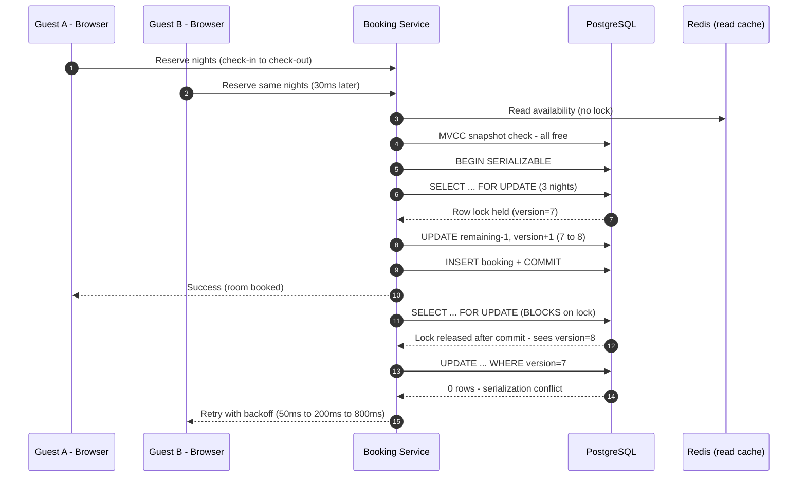

| Difficulty | Channel | Tags |
|---|---|---|
| intermediate | database | acid, isolation-levels, mvcc |

Before F1 and Spanner existed, AdWords — the engine behind nearly all of Google's revenue — ran on a manually sharded MySQL database. Resharding that system took two years of cross-team effort, failover could lose data, and two application nodes in two datacenters could double-book the same advertiser budget: the financial twin of two guests reserving one room [1]. Google eventually rebuilt the entire stack on F1/Spanner to make that impossible while staying globally available [2]. This is the story of that problem — and the transaction design pattern it produced, one you can use the day you build a booking system.

---

> ### Real-World Case — Google (F1/Spanner, AdWords)
>
> Google's AdWords — its revenue engine (nearly all of Google's multi-billion-dollar income came from ads) — ran on a manually sharded MySQL database. Resharding that revenue-critical database took over two years of intense cross-team effort, and failover risked data loss, so teams offloaded data to NoSQL systems that broke transactional guarantees. With real-time ad auctions debiting advertiser budgets across multiple datacenters, two nodes in two datacenters could effectively 'double-book' the same budget — the financial twin of a double booking.
>
> | | |
> |---|---|
> | **Challenge** | Provide strictly serializable ACID transactions with MVCC snapshot reads and high availability at a scale sharded MySQL could not reach, ensuring two concurrent requests in different regions could never both approve the same spend against the same budget while still serving billions of events per day. |
> | **Solution** | Google built Spanner and F1. Spanner runs strictly serializable transactions (two-phase locking) replicated via Paxos for availability, and uses MVCC so snapshot reads never block writes. F1 layered optimistic concurrency on top: it re-reads per-row modification timestamps at commit to detect conflicts and retry. The plot twist: to order transactions across the globe without a coordination bottleneck, Google installed GPS receivers and atomic clocks in every datacenter (the TrueTime API), bounding clock uncertainty to <10ms and using 'commit wait' so global serialization order is guaranteed by physics. |
> | **Outcome** | AdWords fully moved from sharded MySQL to F1/Spanner; manual resharding became automatic, failover was 'nearly invisible,' and applications update billions of rows per day at roughly 500 transactions/sec each, with TrueTime's uncertainty kept under 10ms. Google demonstrated that global strict serializability and high availability are simultaneously achievable — serializable semantics with performance comparable to weaker-guarantee databases. |
> | **Lesson** | Consistency should be solved at the database level, not patched in application code ('a significant fraction of developers' time goes to error-prone eventual-consistency workarounds'); with enough engineering, the CAP tradeoff between correctness and availability is not absolute — and time itself can be the synchronization primitive. |

---

## Hook — Two Clicks, One Room

Two clicks. One room. Thirty milliseconds apart.

A family in Seattle is tapping 'Reserve' on a lakeside cabin for July. In a different timezone, another family is doing the exact same thing on the same listing. Both screens show 'Available.' Both payment forms are spinning. Both databases are about to commit — and only one of them should win.

That is a double booking. It is also the reason Google rebuilt its entire revenue engine.

Before you dismiss this as an edge case only Airbnb-sized companies face, consider that the same exact race condition has drained advertiser budgets, oversold flights, and emptied warehouse inventory lines for companies you have definitely heard of. The mechanics never change: two concurrent transactions read the same row, both decide it looks free, and both write their claim. The stakes scale up, but the bug does not.

Here is the good news: the pattern that fixed this at Google scale is something you can apply in a single Postgres deployment tomorrow.

## Problem — The Check-Then-Act Trap

Many developers start a booking system the same way: check availability, then insert the reservation.

Look, the SQL reads beautifully. `SELECT COUNT(*) FROM availability WHERE ...` — all clear! Then `INSERT INTO bookings`. Two statements, two round trips, one race condition the size of a pothole.

Timeline: request A checks availability at t=0 and sees zero bookings. Request B checks at t=1ms and also sees zero bookings. Request A commits at t=2ms. Request B commits at t=3ms. Congratulations — you have overbooked a room with perfectly 'normal' database behavior.

This is a check-then-act race, and it is a special case of the lost update anomaly. The database did not fail; you simply gave it no way to know the two transactions were connected. Each one was correct in isolation. Together they were a disaster [8].

The trouble multiplies when a naive fix makes things worse. Slap an index on it? Not enough. Move the logic into application code? Now you have two servers each running that code, and you are back to the same race with extra steps. Lock the whole table? Sure — and wave goodbye to availability at 4 p.m. on a Friday.

The real question is not 'how do I make the check faster?' It is 'how do I make the decision atomic?'

## Real-World Case — Google's AdWords and the F1/Spanner Rebuild

Now here is the pothole version of this bug, funded by nearly all of Google's income.

For years, AdWords — the platform generating the overwhelming majority of Google's revenue — ran on a manually sharded MySQL fleet. Because the database was sharded by hand, resharding it was an enormous, multi-year, cross-team operation. Failover risked data loss, so teams avoided it. Desperate for flexibility, engineers offloaded work to NoSQL systems — and discovered they had thrown out the transactional guarantees that made the business correct in the first place [1].

The result was a chilling kind of failure. With real-time ad auctions running across datacenters, two nodes in two datacenters could each debit the same advertiser budget concurrently. Economically, that is a double booking: one pool of money, two withdrawals, zero coordination. Nobody wanted to explain to a major advertiser why their budget drained twice as fast as they approved [1].

Google's response was not a patch. It was a rewrite of the fundamentals: F1, a SQL-fronted transactional layer, running on Spanner, a globally distributed, externally consistent database. Manual resharding became automatic. Failover became 'nearly invisible.' And the numbers tell the story: applications update billions of rows per day at roughly 500 transactions per second each, with TrueTime clock uncertainty held under 10 milliseconds [2].

Spanner did not just fix AdWords. It demolished a long-held assumption: that you cannot have global strict serializability and high availability at the same time [1][2]. You can. And the patterns Spanner uses at planetary scale have scaled-down cousins you can deploy locally — which is exactly what the rest of this post walks through.

## Deep Dive — The Three-Layer Pattern Behind Google's Fix

Building on Google's lesson, you can now ask the real design question: which mechanism do you reach for first? The answer is a stack of three layers, and each one has a job the others cannot do.

Layer one is the isolation level. PostgreSQL's SERIALIZABLE runs your transaction as if it operated serially, even though the database interleaves you with everyone else for performance [3]. The guarantee is called serializability: the outcome is identical to some serial ordering of the transactions [6]. Under SERIALIZABLE, when two transactions truly conflict, one of them aborts with a serialization_failure rather than letting both commit silently. The default, READ COMMITTED, gives you none of this — overlapping write sets produce anomalies you will chase for days.

Layer two is row-level locking. PostgreSQL's `SELECT ... FOR UPDATE` takes a write lock on exactly the rows you inspect, so a competing transaction's attempt to lock the same range simply waits [4][10]. This is the pessimistic half of the pattern: it control-orders access to the hot rows. Combining FOR UPDATE with SERIALIZABLE is powerful — the locks reduce surprises, and the isolation level catches the collisions your locks missed.

Layer three is optimistic concurrency control: the version number. Each availability row carries a version column, and your UPDATE only succeeds if the version you read is still current, bumping it as it goes [7]. If two bookings race, only the first update wins; the second sees a version mismatch and retries with backoff. No locks held during think time — just a cheap assertion at write time.

🔥 Hot Take: Collecting version numbers (rows updated) and evaluating them is the single most underused correctness tool in most schemas.

Here is the plot twist: teams bottle it at each of these three layers. Many developers crank the isolation level and stop — only to discover that hot properties still serialize badly. Others go all-in on optimistic locking and litter the codebase with retry loops. The winning move is the combination, tuned per hot signature.

🎯 Key Point: SERIALIZABLE gives correctness. FOR UPDATE gives fairness on hot rows. Version columns give cheap conflict detection without holding an existing transaction's read locks.

Here is the real tradeoff in table form:

| Approach | What it prevents | Hidden cost |
|---|---|---|
| READ COMMITTED + check-then-insert | nothing | silent overlaps, angry guests |
| SERIALIZABLE alone | write-write anomalies | app-side retries on every collision |
| FOR UPDATE locks | lock-waiter races | hot row becomes a mutex; latency stacks |
| Version column (optimistic) | lost updates | retries, but zero read-blocking |

A small truth worth remembering: every booking is a mutex in disguise, so the art is deciding who waits, who retries, and who reads without a lock at all. Read replicas and a write-through cache handle the 'who reads without a lock' job — but only if you invalidate the cache inside the same transaction that commits the booking, or the two will disagree about reality [5]. Keep the cache as a speed layer, never as a source of truth.

## Workflow — The Seven-Step Booking Transaction

Now that the mechanics are clear, here is the full move sequence a booking request walks through — the same shape behind the diagram below.

1. Snapshot read: read availability with multiversion concurrency control so readers never block writers [5]. Serve from cache or a read replica when load demands it.
2. Open a SERIALIZABLE transaction with a short timeout. Fast path: if the dates are unavailable, return immediately.
3. `SELECT ... FOR UPDATE` across the exact date range. Every competing request for those nights queues at this row lock instead of racing past it.
4. Re-validate the range — FOR UPDATE re-reads the latest committed row, so you now see truth as of now, not as of your earlier snapshot.
5. Update with the version guard: `UPDATE availability SET remaining = remaining - 1, version = version + 1 WHERE ... AND version = ?`. If rowcount is 0, a rival already booked.
6. INSERT the booking row, then COMMIT. The commit and the cache invalidation happen together — no dangling inconsistent state.
7. On serialization_failure or lock timeout, retry with exponential backoff (for example 50ms, then 200ms, then 800ms). Exhaust retries → fail gracefully and tell the guest honestly.

The sequence diagram below shows both guests colliding on steps 3 and 5, and what each one waits on or retries.

## Code Example — Wiring It Up in Python

Here is the whole reserve path as production-shaped Python, using psycopg2 against PostgreSQL. It composes SERIALIZABLE, FOR UPDATE, and a version column into one retry loop — the exact three-layer pattern from the deep dive.

## Lessons Learned — What to Take to Your Team

Google's Spanner paper closed with a quiet guarantee that most teams still do not believe is real: strict serializability and high availability can coexist [1][2]. Your booking system is a miniature version of that bet, and the translation to a single Postgres database comes down to a few rules.

- Never check-then-act without a guard. Every availability check must be causally tied to the write that consumes the space.
- Start at SERIALIZABLE for booking transactions. Know that hot rows still serialize, and lean on FOR UPDATE to keep the loser waiting instead of guessing.
- Use a version column as the cheap, lock-free assertion. It is the simplest optimistic guard most codebases are missing [7].
- Retry with exponential backoff, and cap it. A retry explosion is just a thundering herd wearing a party hat.
- Read replicas and caching serve availability checks only; the commit path always goes through the source of truth [5].
- Monitor lock contention on hot properties and add circuit breakers. Google treats resharding as a routine, monitored event; local teams should treat hot-listing contention the same way [2].

⚠️ Watch Out: The most common failure here is running SERIALIZABLE with the default statement timeout — a legitimately contended listing can then abort healthy bookings. Set an explicit, generous timeout and log retries.

The one sentence to take to your team: a booking is not a query, it is a decision about shared money — and it deserves an isolation level and a guard, not a hope. Tomorrow, walk to your availability table and add the version column and the FOR UPDATE. The disaster you avoid may well be the one you never see coming.

---

## Booking Transaction Flow

<strong>Original Interview Question</strong>

**Q:** You're building a booking system for Airbnb where multiple users can reserve the same property simultaneously. How would you design the transaction handling to prevent double bookings while maintaining high availability?

**A:** Use SERIALIZABLE isolation with optimistic concurrency control. Implement row-level locks on property availability tables, use MVCC snapshot reads for checking availability, and apply application-level validation to ensure atomic booking operations.

## Conclusion

Google's AdWords war story ended with a rewrite that made double bookings mathematically impossible while staying globally available [1][2]. Your Airbnb-scale problem is smaller in geography but identical in essence: two concurrent transactions fighting over one scarce resource. You now have the full toolkit — SERIALIZABLE for correctness, FOR UPDATE for fairness, version columns for cheap optimistic guards, and backoff for reality — and the knowledge that they compose into something resilient. So here is what you do differently tomorrow: open your availability table, add the version column, wrap the reserve path in SERIALIZABLE, and write the retry loop before the traffic spike. Then a double booking becomes a theoretical bug you read about — not a pager at 3 a.m. [1]

---

## References

1. [Google (F1/Spanner, AdWords) incident report](https://research.google/pubs/pub39966/) — article
2. [Spanner: Google's Globally-Distributed Database (arXiv paper)](https://arxiv.org/abs/1209.4964) — paper
3. [PostgreSQL Documentation: Transaction Isolation](https://www.postgresql.org/docs/current/transaction-iso.html) — documentation
4. [PostgreSQL Documentation: Explicit Locking](https://www.postgresql.org/docs/current/explicit-locking.html) — documentation
5. [Multiversion Concurrency Control (MVCC)](https://en.wikipedia.org/wiki/Multiversion_concurrency_control) — documentation
6. [Serializability](https://en.wikipedia.org/wiki/Serializability) — documentation
7. [Optimistic Concurrency Control](https://en.wikipedia.org/wiki/Optimistic_concurrency_control) — documentation
8. [ACID](https://en.wikipedia.org/wiki/ACID) — documentation
9. [Amazon DynamoDB Developer Guide: Condition Expressions](https://docs.aws.amazon.com/amazondynamodb/latest/developerguide/Expressions.ConditionExpressions.html) — documentation
10. [PostgreSQL Documentation: SELECT statement with FOR UPDATE clause](https://www.postgresql.org/docs/current/sql-select.html) — documentation

---

**Author:** Satishkumar Dhule — [GitHub](https://github.com/satishkumar-dhule) · [LinkedIn](https://linkedin.com/in/satishkumar-dhule) · [Website](https://satishkumar-dhule.github.io)
