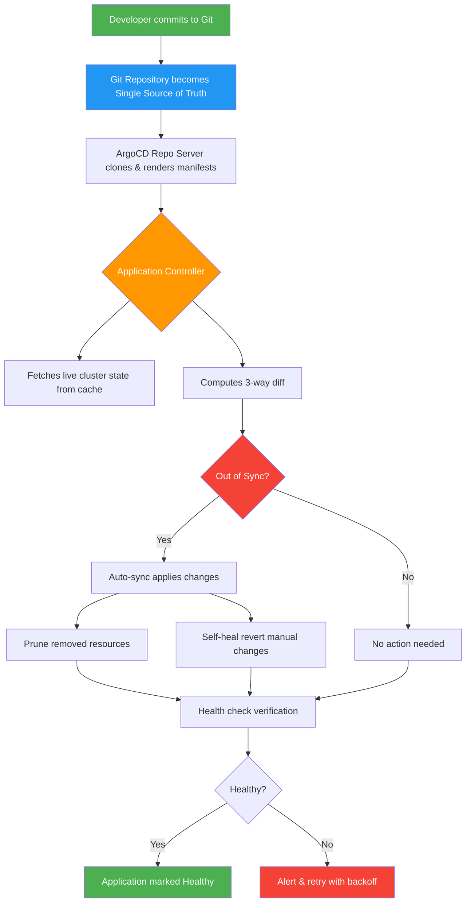

| Difficulty | Channel | Tags |
|---|---|---|
| beginner | devops | argocd, flux, declarative |

Picture this: it's January, and your team at a major financial software company orders more servers to prepare for the April tax rush. The deployment cycle? Days, sometimes weeks, just to ship a release. That was Intuit's reality — until they discovered that Git-based declarative deployment could compress all of that into minutes [1]. Their acquisition of Applatix, the startup behind Argo, didn't just improve their pipeline. It transformed 2,000+ services, 345 clusters, and 32,000+ applications into a self-healing machine running roughly 2,400 PR-driven deployments per day [1]. This is the story of how GitOps and ArgoCD turned a bloated release ceremony into a five-minute routine — and how you can apply the same patterns to your own microservices.

---

> ### Real-World Case — Intuit
>
> Intuit, maker of QuickBooks and TurboTax, realized that migrating to the public cloud via lift-and-shift was barely improving development velocity — teams still took days, sometimes weeks, to ship a release. To fix this they acquired Applatix, the startup behind Argo, and made Git-based declarative deployment (GitOps) the backbone of their internal developer platform.
>
> | | |
> |---|---|
> | **Challenge** | Cloud migration hadn't sped up software delivery. Releases were 'a ceremony' requiring manual scripts across dozens of services, onboarding a new developer took ~3 days, and rolling back a bad deploy meant slow, manual intervention (MTTR of ~45 minutes) — all across 500+ microservices and, later, hundreds of Kubernetes clusters. |
> | **Solution** | Intuit built 'Modern SaaS', a self-service Kubernetes platform where ArgoCD continuously reconciles clusters against Git as the single source of truth. Developers declare the desired state (YAML/Helm/kustomize) in Git; ArgoCD auto-syncs it to clusters, drift is self-healed, and rollbacks are just git reverts — replacing manual kubectl-style imperative cluster fiddling with fully auditable declarative delivery. |
> | **Outcome** | The QuickBooks deployment cycle dropped from days to minutes, MTTR for rollback/roll-forward fell from 45 minutes to under 5 minutes, and creating/upgrading a service now takes less than 10 minutes. In 18 months Intuit went from zero to ~2,000 services on Kubernetes, and today the platform operates at 345+ clusters with ~32,000 applications managed across 50+ ArgoCD instances, handling 2,400+ PR-driven deployments per day. |
> | **Lesson** | Cloud migration alone doesn't deliver velocity — changing HOW you deploy does. Making Git the declarative source of truth (GitOps) turns deployment, drift detection, and rollback into auditable, automatable events, which is what actually compresses release cycles and recovery time. Bonus twist: the tool they built out of necessity, ArgoCD, became one of the most widely adopted CNCF projects in the world. |

---

## Hook — The Deploy That Took Weeks

Every developer has felt the sting of a release that refuses to behave. You merge your PR on Monday. By Wednesday, someone notices the staging environment is out of sync with production. By Friday, the rollback takes 45 minutes of manual `kubectl` commands while the on-call engineer sweats through a Slack channel full of panicked messages. The root cause? Configuration drift — that invisible gap between what your Git repo says should exist and what is actually running in your cluster. It feels like a rite of passage, but it's actually a systemic failure. And in the late 2010s, one of the largest fintech companies in the world was drowning in it.

## Problem — The Deployment Velocity Trap

Most teams believe that moving to the cloud automatically makes shipping faster. The reality is more nuanced. Lift-and-shift — simply rehosting existing applications on Kubernetes — barely touches the actual velocity bottleneck [1]. The problem isn't infrastructure; it's the process of moving changes from a developer's laptop to a live cluster safely, repeatedly, and without surprise side effects. Consider the typical imperative workflow: a developer runs `kubectl set image deployment/api-server api=myorg/api:v2.3.1` directly against a production cluster. The change happens instantly, but the Git repository still says `v2.3.0`. Nobody reviewed it. Nobody approved it. Nobody can roll it back without memorizing the exact sequence of commands. Multiply that by 50 microservices across three environments, and you have a recipe for configuration drift — the silent killer of deployment confidence [2]. The imperative approach asks "what command do I run?" The declarative approach asks "what state should exist?" That philosophical gap is where GitOps lives.

## Real-World Case — Intuit's GitOps Transformation

Intuit, the company behind QuickBooks and TurboTax, hit this exact wall. By 2013, they had gone all-in on the public cloud, but teams were still taking days — sometimes weeks — to create and deploy new software releases [1]. Developer onboarding onto the QuickBooks Online codebase took roughly three days. The fix? Intuit acquired Applatix, the startup behind Argo, in early 2018 and made Git as the single source of truth the backbone of their internal developer platform [1]. The results were staggering. The QuickBooks deployment cycle dropped from days to minutes. Mean time to rollback (MTTR) fell from 45 minutes to under 5 minutes. Creating or upgrading a service took less than 10 minutes, including fully automated end-to-end build and deployment pipelines [1]. In 18 months, Intuit went from zero to approximately 2,000 services running on Kubernetes. By 2021, their platform operated roughly 1,000 deployments per day across 350 clusters, 15,000 nodes, and 40,000 applications managed by 140+ self-managed ArgoCD instances [3]. Today, those numbers have grown to 345+ clusters, 32,000+ applications across 50+ ArgoCD instances, handling 2,400+ PR-driven deployments per day [1]. The takeaway is clear: declarative, Git-based deployment isn't a nice-to-have at scale. It's survival.

## Deep Dive — Declarative vs Imperative: The Core Philosophical Split

Here is the thing though: the difference between declarative and imperative isn't just a syntax preference. It's a fundamental shift in how you think about infrastructure. The imperative approach is a set of commands. You tell Kubernetes exactly what to do, step by step: `kubectl run nginx`, `kubectl expose deployment nginx`, `kubectl scale deployment nginx --replicas=5`. Each command modifies the live cluster state directly, but leaves no trace in version control [4]. The declarative approach is a statement of intent. You write a YAML manifest that says "I want 5 replicas of nginx with this configuration," and you apply it. Kubernetes — or ArgoCD — continuously reconciles the actual state toward that declared goal [4]. Kubernetes documentation actually identifies three distinct management techniques: imperative commands for one-off tasks, imperative object configuration for single objects, and declarative object configuration — the gold standard — for production GitOps workflows [4]. The key mechanism behind declarative management is the three-way merge. When you run `kubectl apply`, Kubernetes stores the configuration in a `last-applied-configuration` annotation. On subsequent applies, it compares three things: the last-applied state, the live state, and your new manifest [4]. Fields you added get created. Fields you changed get patched. Fields you removed get deleted. Fields modified by other controllers (like an HPA scaling replicas) get preserved. This makes `kubectl apply` idempotent — safe to run repeatedly without side effects [4]. The imperative approach offers none of this safety. It's fast, intuitive, and perfect for debugging a throwaway pod. But for anything that needs to be reproducible, auditable, and rollback-friendly, declarative wins decisively [5].

## Workflow — ArgoCD's Reconciliation Loop

So how does ArgoCD actually bridge the gap between your Git repository and your live cluster? Think of it as a continuous feedback loop with five key steps: First, the Application Controller watches your Application Custom Resource Definition (CRD), which specifies the Git repository, target revision, and destination cluster [6]. Second, on every refresh cycle — every three minutes by default, or instantly when a Git webhook fires — ArgoCD's repo-server clones the repository and renders the manifests using your configured tool (plain YAML, Helm, Kustomize, or Jsonnet) [6]. Third, the controller fetches the live cluster state from a cached view of your Kubernetes resources, avoiding excessive API server calls [6]. Fourth, it computes a three-way diff between the desired state (from Git), the last-applied state, and the live state. Resources are classified as Synced or OutOfSync, and their health is assessed [6]. Fifth, if automated sync is enabled and resources are OutOfSync, ArgoCD applies the changes, prunes removed resources, and — if self-healing is on — reverts any manual changes made directly to the cluster [6].

## Workflow — Visualizing the GitOps Flow

Here is the visual story of how ArgoCD's reconciliation loop works, from a developer's Git commit to a self-healing cluster. [See Mermaid diagram below for the full architecture flow]

## Code Example — Setting Up a Production-Ready ArgoCD Application

Let's walk through a real-world ArgoCD Application CRD configuration. This is the YAML that would power a microservice deployment with automated sync, self-healing, and retry logic — the same patterns that power platforms at Intuit's scale [3].

## Lessons Learned — Battle Scars and Best Practices

After watching teams adopt GitOps with ArgoCD, here are the patterns that separate successful rollouts from painful ones. First, start with manual sync for production. The `automated` flag with `prune: true` is powerful, but a misconfigured prune can delete critical resources before anyone notices. Add automated sync for non-production first, then graduate to production once you trust your manifests [6]. Second, never mix imperative and declarative on the same resource. Kubernetes documentation is explicit about this: pick one management technique per resource and stick with it [4]. Mixing `kubectl create` and `kubectl apply` on the same object leads to unexpected three-way merge behavior. Third, use sync waves for dependencies. CRDs need to exist before operators, operators before infra, infra before workloads. The `argocd.argoproj.io/sync-wave` annotation lets you orchestrate this ordering [6]. Fourth, implement custom health checks for CRDs. ArgoCD has built-in health checks for Deployments, Services, and other standard resources, but custom CRDs default to "Unknown" health status unless you add Lua-based health checks in the `argocd-cm` ConfigMap [6]. Fifth, watch out for self-healing in multi-source applications. Even with self-heal disabled, a change in one source can trigger an auto-sync of the entire application. If you need precise control, consider splitting into separate Applications [6]. The moral of this story is that GitOps isn't a tool you install — it's a discipline you practice. Intuit didn't just deploy ArgoCD. They restructured their entire developer experience around the principle that Git is the single source of truth, and every cluster change flows through a pull request [1]. Start there, and the rest follows.

---

## ArgoCD GitOps Reconciliation Loop

<strong>Original Interview Question</strong>

**Q:** You're setting up GitOps for a microservices deployment. How would you configure ArgoCD to automatically sync changes from your Git repository to Kubernetes, and what's the difference between declarative and imperative approaches in this context?

**A:** I'd configure ArgoCD by setting up a Git repository containing Kubernetes manifests or Helm charts, creating an Application CRD that points to the Git repository, enabling auto-sync with a health check interval of 3 minutes, and implementing self-healing to automatically revert any manual changes. The declarative approach involves defining the desired state in Git through YAML manifests, Helm charts, or Kustomize configurations, where ArgoCD continuously reconciles the actual state with the desired state. In contrast, the imperative approach uses kubectl commands to make direct changes to the cluster, bypassing the Git repository as the single source of truth.

## Conclusion

Intuit's journey from weeks-long deployment cycles to 2,400+ PR-driven deployments per day proves one thing: velocity at scale doesn't come from faster humans running faster commands. It comes from eliminating the commands entirely and replacing them with a pull-based, self-healing reconciliation loop [1]. If you're staring at a microservices deployment that still involves manual kubectl patches and prayer, the path forward is deceptively simple: make your Git repository the single source of truth, let a controller like ArgoCD reconcile reality against it, and never allow a manual change to survive more than three minutes [6]. Start with one service. Set up the Application CRD. Enable auto-sync with prune and selfHeal. Watch it work. Then scale that pattern to 10, 100, 32,000 applications. The infrastructure is open-source. The patterns are battle-tested. The only thing standing between you and five-minute rollbacks is the decision to commit to declarative.

---

## References

1. [Intuit case study — With cloud native, Intuit brings lightning fast deployment to thousands of developers](https://www.cncf.io/case-studies/intuit/) — article
2. [Argo CD Overview — Declarative GitOps Engine for Kubernetes](https://argo-cd.readthedocs.io/en/stable/) — documentation
3. [Argo CD Production Best Practices — ArgoCon 2021 Talk](https://github.com/argoproj/argo-cd) — documentation
4. [Kubernetes Object Management — Declarative vs Imperative Approaches](https://kubernetes.io/docs/concepts/overview/working-with-objects/object-management/) — documentation
5. [OpenGitOps Principles v1.0.0 — Declarative, Versioned, Immutable, Pulled, Reconciled](https://opengitops.dev/) — documentation
6. [Argo CD Application Specification — Sync Policy, Health Checks, and Reconciliation](https://argo-cd.readthedocs.io/en/stable/user-guide/application-specification/) — documentation
7. [Argo CD GitHub Repository — CNCF Graduated Project](https://github.com/argoproj/argo-cd) — documentation
8. [Argo CD Declarative Setup — Operator Manual](https://argo-cd.readthedocs.io/en/stable/operator-manual/declarative-setup/) — documentation
9. [Helm Package Manager for Kubernetes — Documentation](https://helm.sh/docs/) — documentation
10. [Kustomize — Kubernetes Native Configuration Management](https://kustomize.io/) — documentation

---

**Author:** Satishkumar Dhule — [GitHub](https://github.com/satishkumar-dhule) · [LinkedIn](https://linkedin.com/in/satishkumar-dhule) · [Website](https://satishkumar-dhule.github.io)
