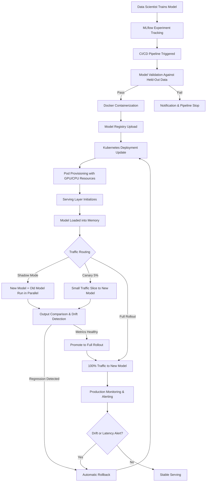

| Difficulty | Channel | Tags |
|---|---|---|
| beginner | devops | mlops, deployment |

Every ML team hits the same wall: the model that aced every offline test quietly self-destructs the moment real users touch it. Uber discovered this at breathtaking scale — their Michelangelo platform runs 400 active use cases and pushes over 15 million real-time predictions per second at peak [1]. Yet even with that infrastructure, models that passed validation began failing within minutes once deployed, because data drift and integration edge cases lurk where notebooks never look. The gap between "it works" and "it works in production" is the story every MLOps engineer lives — and this is the map to close it.

---

> ### Real-World Case — Uber
>
> Uber's Michelangelo ML platform has served the full ML lifecycle since 2016, running over 400 active use cases, executing 20,000+ training jobs per month, and serving more than 15 million real-time predictions per second at peak. But as ML adoption exploded, Uber found that models behave differently from code: they pass offline validation yet fail in production within minutes due to data drift and integration edge cases, at a scale where even small regressions ripple across millions of users.
>
> | | |
> |---|---|
> | **Challenge** | How do you make model deployment safe when models are probabilistic and tightly coupled to shifting data? Static unit tests and offline metrics can't catch silent failures like unexpected nulls, schema drift, or training/serving skew, so Uber needed a safety system that could catch issues earlier, validate models more reliably, and roll back instantly without slowing delivery velocity. |
> | **Solution** | Uber built a hybrid safety framework on top of Michelangelo: shadow testing (running candidate models in parallel on live production traffic without affecting user-facing predictions) became a default safeguard now covering 75%+ of critical online use cases; controlled canary rollouts with auto-rollback to the last known good version; the Hue observability stack (Flink + Pinot) for real-time drift detection and online-offline feature parity checks; and a deployment-safety scoring system that tracks offline evaluation, shadow coverage, unit tests, and monitoring coverage. |
> | **Outcome** | Michelangelo serves 15M+ real-time predictions/second at peak with ~400 use cases and 20,000 training jobs/month; shadow testing is used in over 75% of critical online use cases (targeting 100% by H2 2025); regressions that once lingered for days now surface within hours; and by mid-2025 over 75% of critical models reached at least the Intermediate safety level. |
> | **Lesson** | The plot twist: for ML, validation is not a one-shot CI gate but a continuous runtime activity — shadow traffic, drift detection, and auto-rollback safeguards must be default-on in the serving plane, because the biggest failures come from data changing underneath a model, not from code you can unit test. |

---

## Hook — The Deploy That Looked Perfect

Picture this: your team just shipped a new fraud-detection model. Offline metrics look stellar — AUC of 0.97, latency under 20ms in the test harness. You merge the PR, CI green-lights it, and you roll it out. Thirty minutes later, alerts start firing. The model is silently classifying every transaction as "safe" because a new data source is feeding features in a slightly different schema than the training pipeline expected. No crash. No error log. Just a model that confidently produces wrong answers at thousands of requests per second. This is the nightmare that separates model deployment from model serving — and understanding that distinction is what separates teams that ship reliably from teams that firefight constantly.

## Problem — Why Deployment and Serving Get Conflated

Many developers think of "deploying a model" as a single action: push the container, expose the endpoint, done. But deployment and serving are fundamentally different concerns, and confusing them is the root of most production ML failures. Deployment is the full lifecycle discipline — CI/CD pipelines, infrastructure provisioning with tools like Kubernetes and Terraform, monitoring dashboards, rollback strategies, and governance. It answers: how does a model get from a training environment into a production-grade system safely? Serving, by contrast, is the runtime layer — the actual inference engine that handles incoming requests, routes traffic, loads model artifacts, and returns predictions under real-time latency constraints. It answers: once the model is deployed, how does it serve predictions at scale without falling over? The tension between these two domains creates the real-world complexity. Deployment teams optimize for safety, reproducibility, and auditability. Serving teams optimize for throughput, latency, and resource efficiency. When neither side understands the other's constraints, you get the classic failure mode: a model that deploys cleanly but serves poorly, or one that serves fast but can't be rolled back when something goes wrong.

## Real-World Case — Uber's Michelangelo and the Scale of Silent Failure

Uber's experience crystallizes this problem at a scale most teams can only imagine. Their Michelangelo ML platform, operational since 2016, executes over 20,000 training jobs per month and serves more than 15 million real-time predictions per second at peak demand [1]. With roughly 400 active use cases spanning fraud detection, ETA prediction, and dynamic pricing, the platform had to solve both deployment and serving at industrial strength. The breakthrough realization was that models behave fundamentally differently from traditional software. A microservice that passes unit tests almost always works correctly in production. A model that passes offline validation can fail silently within minutes once live — because the data distribution it encounters is subtly different from what it saw during training. To address this, Uber implemented shadow testing across over 75% of critical online use cases by mid-2025, targeting 100% coverage. Shadow testing runs the new model in parallel with the existing one, comparing outputs without affecting users, catching regressions that previously lingered for days within hours. By the same period, over 75% of critical models had reached at least an intermediate safety maturity level [1]. The lesson is stark: at Uber's scale, the deployment pipeline is only as good as the serving infrastructure's ability to detect when a model is wrong — not just when it crashes.

## Deep Dive — The Technology Stack and Trade-offs

Once you internalize Uber's lesson, the technology choices start making sense. Let's break down each layer. Deployment tooling focuses on the journey from notebook to production. Kubernetes provides the orchestration backbone — managing container lifecycle, scaling replicas, and handling rollbacks via declarative configuration [2]. Docker packages models and their dependencies into reproducible containers, eliminating the "works on my machine" problem. MLflow and SageMaker abstract away infrastructure complexity, offering experiment tracking, model registry, and managed deployment pipelines [3][4]. CI/CD tools like GitHub Actions or Jenkins automate the path from model training to production validation. Serving frameworks, meanwhile, handle the runtime inference problem. TensorFlow Serving and TorchServe are purpose-built model servers that optimize for throughput — they manage model loading into memory, batch inference, and GPU utilization [5][6]. For custom serving logic, FastAPI and gRPC provide lightweight, high-performance API layers. BentoML bridges the gap, offering a framework-agnostic packaging format that bundles models with their serving logic [7]. Load balancers like NGINX or Envoy sit in front, routing traffic and enabling canary deployments. The critical trade-offs emerge at the intersection of these layers. Latency versus throughput is the fundamental tension — batching requests improves throughput but adds latency, which matters when you need sub-100ms responses for real-time features like ride ETA predictions. Cold start optimization becomes critical when models are large — loading a multi-gigabyte transformer into GPU memory can take seconds, which is unacceptable for auto-scaling scenarios. Horizontal scaling via pod replicas addresses throughput but multiplies memory cost. Vertical scaling via GPU allocation improves latency but creates single points of failure.

## Workflow — From Training to Serving in Production

The end-to-end workflow follows a logical progression that mirrors the separation of concerns between deployment and serving. First, a data scientist trains a model in an experimentation environment, tracking metrics and artifacts with MLflow. Next, the model enters a CI/CD pipeline where it's validated against held-out data, containerized with Docker, and pushed to a model registry. Then, the deployment pipeline provisions or updates Kubernetes resources — creating pods, configuring resource requests, and setting up health checks. Finally, the serving layer takes over: loading the model, configuring inference batching, routing traffic, and enabling shadow or canary testing before full rollout. The Mermaid diagram below visualizes this entire flow, showing where deployment responsibilities end and serving responsibilities begin. This separation matters because each stage has different failure modes — and different teams should own different parts of the pipeline.

## Code Example — A Production-Ready Serving Pattern with FastAPI and BentoML

Below is a practical example that bridges deployment and serving concerns. This FastAPI service loads a scikit-learn model, implements health checks, request validation, and graceful shutdown — the minimum viable production serving pattern. Notice how the deployment concerns (health checks, lifecycle hooks, structured logging) coexist with serving concerns (inference logic, input validation, response formatting). The key insight is that a production serving endpoint is not just a predict() call wrapped in HTTP — it is a system that must be observable, resilient, and deployable.

## Lessons Learned — What to Do Differently Tomorrow

If you take one thing from Uber's journey and from this technical breakdown, let it be this: model deployment is not a checkbox — it is a continuous safety practice. Here are the actionable takeaways. First, separate deployment and serving responsibilities explicitly. Your deployment pipeline should answer "is it safe to ship?" while your serving infrastructure answers "is it working correctly right now?" Second, invest in shadow testing early. Even at modest scale, comparing new model outputs against the existing model in production catches regressions that offline tests miss entirely [1]. Third, monitor data quality as aggressively as you monitor model metrics. Data drift is the silent killer — your model can be architecturally sound but functionally wrong if the input distribution shifts [8]. Fourth, design for rollback from day one. Kubernetes rolling updates with readiness probes and traffic splitting via canary deployments should be non-negotiable [2]. Fifth, accept that cold starts are inevitable with large models — use model caching, lightweight distillation, or pre-warming strategies to mitigate latency spikes during scaling events. The teams that get ML production right are not the ones with the fanciest models. They are the ones who treat deployment and serving as distinct, equally important disciplines — and build the muscle to observe, detect, and respond when reality diverges from the training set.

---

## ML Model Deployment to Serving Pipeline

<strong>Original Interview Question</strong>

**Q:** Explain the key differences between model serving and model deployment in ML systems, including specific technologies, scaling considerations, and real-world implementation patterns?

**A:** Deployment encompasses CI/CD pipelines, infrastructure setup, and monitoring using tools like Kubernetes, MLflow, and SageMaker. Serving focuses on runtime inference APIs with frameworks like TensorFlow Serving, TorchServe, or BentoML, handling request routing, model versioning, and autoscaling. Key trade-offs include latency vs throughput, batch vs real-time inference, and cold start optimization.

## Conclusion

The gap between a model that works in a notebook and one that works at 15 million predictions per second is not about better algorithms — it is about treating deployment and serving as distinct, equally critical engineering disciplines. Uber learned this at a scale most teams will never face, but the lesson applies universally: build shadow testing into your rollout process, separate your deployment pipeline from your serving infrastructure, and monitor data drift as aggressively as model accuracy [1]. Start tomorrow by adding a /health endpoint to your serving code and implementing structured logging for latency. These two small changes will give you the visibility to catch regressions before your users do.

---

## References

1. [Uber incident report — Raising the Bar on ML Model Deployment Safety](https://www.uber.com/blog/raising-the-bar-on-ml-model-deployment-safety/) — blog
2. [Kubernetes Documentation — Deployments](https://kubernetes.io/docs/concepts/workloads/controllers/deployment/) — documentation
3. [MLflow Documentation — Model Registry](https://mlflow.org/docs/latest/mlflow-model-registry.html) — documentation
4. [AWS SageMaker Documentation — Deploy a Model](https://docs.aws.amazon.com/sagemaker/latest/dg/deploy-model.html) — documentation
5. [TensorFlow Serving Documentation](https://www.tensorflow.org/tfx/guide/serving) — documentation
6. [TorchServe GitHub Repository](https://github.com/pytorch/serve) — documentation
7. [BentoML Documentation — Get Started](https://docs.bentoml.com/en/latest/getting-started/index.html) — documentation
8. [Wikipedia — Concept Drift in Machine Learning](https://en.wikipedia.org/wiki/Concept_drift) — documentation

---

**Author:** Satishkumar Dhule — [GitHub](https://github.com/satishkumar-dhule) · [LinkedIn](https://linkedin.com/in/satishkumar-dhule) · [Website](https://satishkumar-dhule.github.io)
