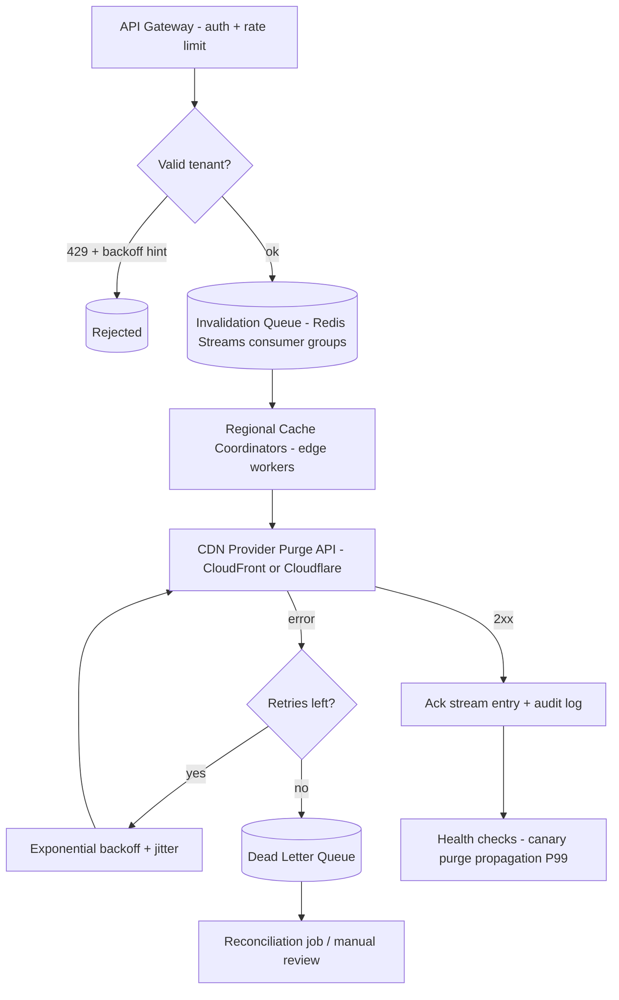

| Difficulty | Channel | Tags |
|---|---|---|
| intermediate | system-design | edge, caching, purging |

Every developer knows the sinking feeling: you push a fresh build, but the new page expects an API endpoint the old JavaScript still calls. Static, stale, dead on arrival. That is exactly the scenario Cloudflare engineers fought every day — the world's largest cache network, spanning 300+ data centers, still took over 1.5 seconds to propagate a purge at P50 and more than 6 seconds at P99 [1]. For a system whose entire job is making content disappear from the edge, those seconds mean crashed front-ends, broken checkouts, and a very unhappy pager. So how does anyone build a purge system that guarantees propagation in under 5 seconds while absorbing 10,000 invalidations per second? This is the journey, from a 6-second stale-cache outage to a 149ms global purge [1].

What makes this problem so sneaky — and so career-defining to get right — is that the easy answers all fail in production. Buckle up.

---

> ### Real-World Case — Cloudflare
>
> Cloudflare, running the world's largest global cache network across 300+ data centers, hit the scalability wall of its 10-year-old centralized cache purge system. Purge requests had to round-trip to a handful of 'core' data centers that authenticated, queued, and fanned out invalidations via Quicksilver (a spoke-hub replicated KV store), and that single central write funnel backed up under load — a global purge-by-tag/hostname/prefix took ~1.5 seconds P50 and over 6 seconds at P99, leaving customers reading stale content (which can fully break sites, e.g. on a non-backwards-compatible JS release).
>
> | | |
> |---|---|
> | **Challenge** | Design a multi-region CDN cache invalidation system that propagates purge decisions to hundreds of geo-distributed data centers near-instantaneously and scales horizontally with cache purge throughput, eliminating the central-coordinator bottleneck, purge race conditions, and the storage overhead of lazy (expiry-only) purging — all while sustaining high invalidation rates. |
> | **Solution** | Cloudflare rebuilt the purge pipeline as a 'coreless' architecture that deliberately deleted the central brain. Purge requests now ingress at the nearest data center (a Workers API gateway handles auth and filtering in-place), get queued in distributed Durable Object-backed purge queues per region (with a Regional Autoscaler to keep throughput in a 'goldilocks zone'), then broadcast peer-to-peer via regional Purge Fanout workers to every data center. Each machine runs CacheDB, a Rust service over RocksDB, that actively indexes cached files, checks its local buffer queue on every cache HIT (so purged content is never served even before deletion completes), and purges content immediately instead of waiting to evict expired files. Distribution uses Consul-based peer health checks, and flexible purges are rate-limited via token buckets with batching up to 100 keys per request. |
> | **Outcome** | Global purge latency for tags, hostnames, and prefixes dropped from ~1,570ms to 149ms P50 (a 90% improvement) across 330 cities in 120+ countries — 3x the purge throughput from the regional fanout workers alone, 10x storage savings from active purging, and freed disk improving cache hit ratios and reducing origin egress. This was achieved while running purge-by-URL in production since July 2022, and the system now sustains purge rates high enough for Cloudflare to ship 'Instant Purge' to all plan types (Enterprise bucket of 500 requests with 5,000 keys/sec). |
> | **Lesson** | When the central coordinator becomes your latency and throughput bottleneck, don't scale it — remove it. The counterintuitive win was distributing the hot path (ingest, auth, and propagation) to every edge node with per-machine index state (CacheDB) and Durable Object queues, keeping consistency through local queue checks and health-tracked peer fanout instead of a single global write funnel. Shrink the stale-content race window to near-zero by making purge effective the moment it reaches a machine. |

---

## Hook — The Friday release that shipped a time bomb

It is 3:47pm on a Friday. The freshly compiled JavaScript bundle deploys cleanly, CI is green, and the deploy dashboard is calm. Then the support channel lights up. Users are staring at blank screens, and the only culprit is content that already died on the origin but refuses to leave the edge. Sound familiar?

Here is the thing nobody warns you about: stale cache is not a cosmetic annoyance — it is a production outage wearing a caching hat [2]. Every CDN duplicates your content across dozens, hundreds, or thousands of physically distant points of presence; those copies are the whole reason your pages load fast. But the moment you ship a non-backwards-compatible change, every duplicate becomes a live grenade [9]. The purge request is the defuse kit. And as countless teams discover, building a defuse kit that is both fast enough and reliable enough is one of the gnarliest system design problems in modern infrastructure.

You might think the hard part is evicting a cache key fast. You would be wrong. The hard part is coordinating that eviction across every region on the planet, under load, without waking your on-call engineer. Cloudflare learned this lesson brutally — and their fix, now named Instant Purge, is one of the finest architecture stories of the last decade [1]. But before diving into their rewrite, you need to understand precisely why plain cache invalidation is so brutally hard in the first place.

## Problem — Why cache invalidation is one of the two hardest things in computer science

Phil Karlton never actually said it, but the internet crediting him got the joke right anyway: cache invalidation is one of the two hard things in computer science. Not the eviction itself — modern cache keys can be deleted in milliseconds. The hard part is the guarantee that a purged URL returns fresh content from *every edge on the planet*, plus a throughput that keeps up when your origin pipelines, CI systems, and content teams all decide to purge at once.

The pain shows up in three distinct places. First, latency: an invalidation that takes six seconds might as well not exist during an incident, because users have already fetched and cached the poisoned asset [4]. Second, volume: a busy platform can trivially generate 10,000 invalidation requests per second during a bad rollout or a sweep of expiring price data [6]. Third — the sneaky one — consistency: different regions serving different versions of the same page is arguably a worse bug than no cache at all.

🎯 Key Point: Real requirements for such a system are brutal. Sub-5-second global propagation, 10K invalidations per second, 99.99% availability, and strong-enough consistency that your regions agree — all at once. Nobody achieves all four with a single central queue and a prayer.

⚠️ Watch Out: Many teams discover the hard way that synchronous fan-out is a trap. Requiring every edge to acknowledge a purge in lockstep turns a cache flush into a distributed transaction, and distributed transactions are where latency goes to die [8]. The design that actually works treats purge as an asynchronous, reconcilable event — never a global lock.

## Real-World Case — Cloudflare hit the purging wall

Cloudflare operates caches across roughly 330 cities in more than 120 countries [1]. For a decade, its purge system shipped every invalidation through a small set of “core” data centers: authenticate here, queue here, then fan out via Quicksilver, a spoke-hub replicated KV store. That architecture looks clean on a whiteboard — until real traffic shows up.

Under load, the single central write funnel backed up. A global purge by tag, hostname, or prefix took about 1.5 seconds at P50 and over 6 seconds at P99 [1]. Do not let the “only 6 seconds” fool you; those numbers genuinely break production sites. Consider a non-backwards-compatible JavaScript release: every edge cache is still serving the stale bundle while the origin has already moved on, and six seconds of that is an eternity for an e-commerce checkout or an auth redirect. Stale content that breaks a page is a full outage, measured in real-time money [9].

The fix was a conceptual rewrite, not an optimization sprint. Cloudflare stopped routing purges through a single funnel and distributed the coordination itself — every region can publish invalidations to all edges, with no central write-path bottleneck [1]. The results deserve a slow clap:

- Purge latency for tags, hostnames, and prefixes fell from ~1,570ms to 149ms at P50 — a 90% improvement [1].
- The regional fan-out workers alone delivered 3x the purge throughput [1].
- Active purging freed ~10x the storage, which improved cache hit ratios and reduced origin egress [1].
- Purge-by-URL has run in production since July 2022, and the system now sustains rates high enough to offer “Instant Purge” to every plan tier — Enterprise gets 500 requests at 5,000 keys per second [1].

🎯 Key Point: The winning move was not a faster hammer for a bigger queue. It was removing the singular queue design entirely — replacing a bottleneck with distributed fan-out and self-reconciliation across regions [1].

But how does that rewrite actually work under the hood? That is where the real design lessons live.

## Deep Dive — Bounded staleness, distributed queues, and the plot twist hiding inside

First, an honest reframe that most architects resist: you do not need strong consistency for cache purging. You need *bounded staleness* — a hard guarantee that no edge serves content older than a few seconds after a purge is issued [4]. Chasing linearizable global consistency on cache invalidation requires global locks and serialization points that will crush throughput [8].

The smarter target: cap the TTL window so worst-case staleness is small, then use purge as the fast path that shrinks it further. This is why the 2-second TTL trick is genuinely brilliant: for dynamic content, `Cache-Control: max-age=2, must-revalidate` bounds how long any stale copy can legally live, and revalidation at the origin closes the final gap [3]. Some teams treat short TTLs as defeat. Actually, they are the cheapest staleness guarantee you can buy [2].

Second, the queue is the heart of throughput. Redis Streams with consumer groups give you append-only entries, durable pending states, per-consumer partitioning, and explicit acknowledgment semantics that map perfectly onto a purge workload [5]. Several regional coordinators consume different partitions simultaneously, turning one logical queue into a parallel fan-out engine. Compare that with the old way, and the trade-offs become unmistakable:

| Axis | Centralized single-write funnel | Distributed regional fan-out |
|---|---|---|
| Purge latency P99 | Multi-second, queue pile-up | Sub-second, parallel workers |
| Throughput ceiling | Bounded by one write path | Scales with region count |
| Failure blast radius | One bottleneck kills all purges | Isolated per region |
| Operational complexity | Simple to reason about | Needs reconciliation jobs |

Third, batch or die. CDN purge APIs are priced and rate-limited per request, not per key. Folding 100 invalidations into a single call cuts API costs by roughly 90% and keeps your concurrency well under the provider's ceilings [6][7].

🔥 Hot Take: Most cache invalidation systems fail because they are designed as *event push* when they should be designed as *state reconciliation*. A purge that says only “delete X” is fragile; a purge that also carries the current content state — letting edges self-heal by diffing — is what survives a network partition [8].

Which leads to the part that looks boring until your P99 catches fire: failure handling. A circuit breaker trips after five consecutive failures so a degraded provider does not drown in retries [8]. Exponential backoff with full jitter prevents worldwide retry stampedes. And a dead-letter queue captures records that exhausted their retries, where a reconciliation job replays them later [5]. None of this is glamorous. All of it is why Cloudflare's 149ms story is real instead of a slide-deck fantasy [1].

But full-blown design on paper is one thing. What does a single purge request actually experience as it travels through this machine? Trace one end to end.

## Workflow — From one API call to a worldwide eviction in seven moves

When a purge request arrives, seven moves happen — each with a deliberate failure path. This is the architecture in the diagram below, and the ordering matters.

1. **Authenticate and rate-limit at the gateway.** The API gateway validates the caller and applies per-tenant limits; a misbehaving client gets a 429 with a backoff hint instead of heating up your queue [7].
2. **Buffer durably in a Redis Stream.** Invalidated keys land in a Redis Stream as an append-only entry with a consumer group — the shock absorber that bursts of traffic bounce off safely [5].
3. **Fan out regions in parallel.** Regional cache coordinators (edge functions such as Cloudflare Workers [10]) read their stream partitions and convert each key into a provider-native purge payload.
4. **Batch to the provider API.** Batches of ~100 keys hit the CDN's purge endpoint — AWS CloudFront invalidation [6] or Cloudflare's purge-cache API [7].
5. **Ack only on durable success.** On a 2xx, the coordinator acks the stream entry. On failure, it retries with exponential backoff plus jitter, capped at three attempts [5].
6. **Dead-letter the exhausted.** Records that ran out of retries move to a dedicated queue for manual review or a scheduled reconciliation job.
7. **Watch the tail.** A health-check loop continuously measures real purge propagation — for example, a canary URL fetched from multiple regions — and alerts on the P99 of propagation, not the average [10].

The diagram below condenses that journey into its final shape.

Notice the deliberate absence of a mandatory single hop. Every component scales horizontally, the only source of truth is an append-only stream instead of a mutable global lock, and acknowledgments happen after the provider confirms — never optimistically. That discipline is what turns a “fire-and-forget” delete into an auditable, reconcilable state change.

Now, the fun part: making this concrete in code you could actually ship.

## Code Example — A production-shaped purge coordinator in TypeScript

This coordinator is the engine room of the design: a consumer-group worker that drains the Redis Stream in batches, fans out purge calls with retry discipline, and acks only after a durable success. It is the pattern that turns the Cloudflare lesson into a reusable architecture [1][5].

## Lessons Learned — Five battle scars still worth stealing

Cloudflare's rewrite took a decade of accumulated complexity and replaced it with something conceptually simpler — and 90% faster [1]. The lessons generalize far beyond their network. Here is what to take into your own system:

- **Purge latency is a P99 sport.** Design for the tail, alert on the tail. Cloudflare's problem only became visible once P99 crossed 6 seconds [1].
- **Batching is a free win.** 100 keys per call slashes cost and request count by ~90% [6][7].
- **Short TTLs are an ally, not a downgrade.** `Cache-Control: max-age=2, must-revalidate` bounds staleness and makes every purge cheaper [3][4].
- **Make the queue the source of truth.** Consumer groups plus ack-only-on-success turn a buffer into a reconcilable state machine [5].
- **Jitter every retry.** Exponential backoff without randomness is just a synchronized global stomp [8].

⚠️ Watch Out: Do not wire every edge into a synchronous write-through. Requiring all regions to ack in lockstep converts a cache flush into a distributed transaction — the exact latency trap Cloudflare escaped [1].

🔥 Hot Take: If your purge coordinator has a global lock, a centralized SQL table of pending purges, or a synchronous round-trip to every region, you have not designed a purge system — you have designed an outage with extra steps.

The pattern works because it embraces a deceptively radical idea: accept that regions will disagree for a bounded moment, and make the reconciliation automatic. That is the difference between fighting the physics of distributed systems and designing with them.

---

## Distributed Cache Invalidation Pipeline

<strong>Original Interview Question</strong>

**Q:** How would you design a multi-region CDN cache purging system that guarantees content propagation within 5 seconds while handling 10,000 concurrent invalidations per second?

**A:** Implement Cloudflare API + AWS CloudFront with distributed invalidation queue, edge compute coordination, and 2-second TTL. Use batch invalidation, exponential backoff, and regional cache headers for 5-second SLA.

## Conclusion

Remember that 3:47pm Friday release with the stale bundle? The fix was never to cache harder — it was to purge smarter. Cloudflare's decade-long journey from a 6-second central funnel to a 149ms regional fan-out is the proof [1]: the system survived not because it found a faster queue, but because it removed the single point of coordination and embraced bounded staleness, batched fan-out, and automatic reconciliation.

So what should you do differently tomorrow? Measure purge propagation at P99, not P50. Batch your invalidation calls. Add exponential backoff with jitter to every retry. And set short, honest TTLs on dynamic content so the worst-case state is small [3][4]. If your team is interviewing for senior roles, this is the second-highest-yield system-design topic after “design a URL shortener” — and unlike the shortener, this one can save your production from a real outage.

The one insight worth sharing with your team over coffee: the best purge system is the one you barely need — short TTLs keep staleness small, and a distributed, reconcilable fan-out closes whatever gap remains. That is the entire journey, compressed into a single sentence.

---

## References

1. [Cloudflare incident report](https://blog.cloudflare.com/instant-purge/) — article
2. [HTTP caching — MDN Web Docs](https://developer.mozilla.org/en-US/docs/Web/HTTP/Caching) — documentation
3. [Cache-Control — MDN Web Docs](https://developer.mozilla.org/en-US/docs/Web/HTTP/Reference/Headers/Cache-Control) — documentation
4. [RFC 9111 — HTTP Caching](https://datatracker.ietf.org/doc/html/rfc9111) — documentation
5. [Redis Streams — documentation](https://redis.io/docs/latest/develop/data-types/streams/) — documentation
6. [AWS CloudFront — Removing and replacing content (invalidations)](https://docs.aws.amazon.com/AmazonCloudFront/latest/DeveloperGuide/Invalidation.html) — documentation
7. [Cloudflare — How to purge cache](https://developers.cloudflare.com/cache/how-to/purge-cache/) — documentation
8. [Circuit breaker design pattern — Wikipedia](https://en.wikipedia.org/wiki/Circuit_breaker_design_pattern) — documentation
9. [Content delivery network — Wikipedia](https://en.wikipedia.org/wiki/Content_delivery_network) — documentation
10. [Cloudflare Workers — documentation](https://developers.cloudflare.com/workers/) — documentation

---

**Author:** Satishkumar Dhule — [GitHub](https://github.com/satishkumar-dhule) · [LinkedIn](https://linkedin.com/in/satishkumar-dhule) · [Website](https://satishkumar-dhule.github.io)
