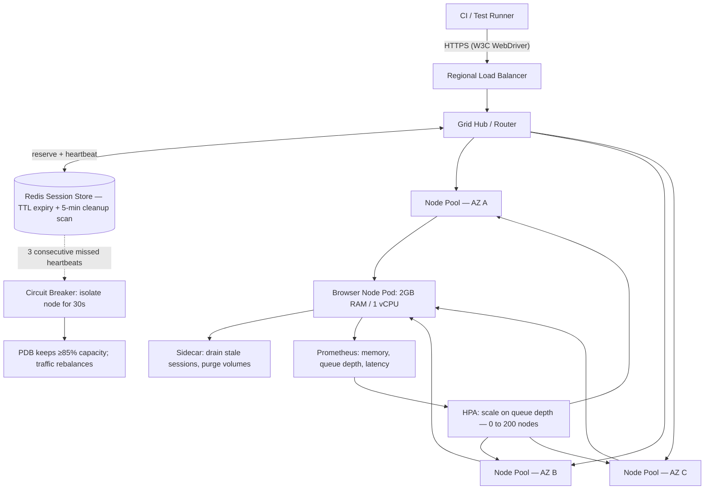

| Difficulty | Channel | Tags |
|---|---|---|
| advanced | system-design | selenium, webdriver, grid |

Sauce Labs built one of the first massively scalable Selenium testing clouds on AWS EC2 — a farm of "robotically controlled browsers as a service" [1]. The idea was tactically insane and economically obvious: dedicated test grids sit idle roughly 99% of the time, yet teams still need instant bursts of hundreds of parallel browsers the moment a release lands [1]. Their proof set the benchmark — single runs consumed about 250 instances, the live pool reached ~400 machines, and more than 3 million tests ran with every video preserved in S3 [1]. This article walks through the architecture that turns that trick into a repeatable system: 10,000 concurrent sessions, 99.9% uptime, and a session lifecycle that refuses to leak memory.

---

> ### Real-World Case — Sauce Labs
>
> Sauce Labs built one of the first massively scalable Selenium testing clouds ("robotically controlled browsers as a service") on top of AWS EC2. The core economic problem: dedicated in-house test grids are idle roughly 99% of the time, wasting capital, yet teams still needed instant bursts of hundreds of parallel browsers when a release landed.
>
> | | |
> |---|---|
> | **Challenge** | Design a Selenium Grid that could elastically scale from near-zero to hundreds of concurrent browser sessions on demand, coordinate session lifecycle across a pool of short-lived test VMs, and retain all test artifacts (video/logs) without leaking instances or storage over time. |
> | **Solution** | A single m1.xlarge EC2 instance coordinated an elastic pool of c1.medium test servers built from 5-6 baked AMIs combos of OS and browsers. They kept a few warm instances ready for instant session start, used historic usage patterns to pre-scale before expected load, recorded continuous screen capture of every session, and streamed all video to S3 (Sauce TV), with instances spun up per session and reclaimed afterward. |
> | **Outcome** | The largest single test run consumed about 250 instances and the overall pool grew to ~400 concurrent machines; 3+ million tests were run with every test's video retained in S3. Customers saw 10-20x reductions in test execution time by throwing elastic resources at the problem. |
> | **Lesson** | Browser testing is a textbook burst workload: the plot twist is that it scales so well it can become an "accidental load test" of the system under test — the grid stops being the bottleneck and your own app starts crashing. Session lifecycle (create, execute, record, destroy) must be fully automated, and pre-scaling from historical data is what makes on-demand concurrency cheap instead of catastrophic. |

---

## Hook — The Night the Grid Has to Decide

Release night. A pipeline triggers, and in the space of a few minutes the Selenium grid has to spin up browser sessions by the thousands, run them, tear them down, and keep doing it until the suite passes. Sounds fine on a whiteboard. Then a single node somewhere in the cluster starts eating memory, a handful of sessions get stranded, and — because nobody taught the grid how to clean up after itself — the damage quietly compounds [2].

Sound familiar? The stakes are blunt: 10,000 concurrent sessions, 99.9% uptime, and zero memory leaks. Miss any one of those and release night becomes a post-mortem. But here is the thing nobody tells you at the start: scale was never the real challenge. Cleanup was. Every design decision in this article follows from that single, uncomfortable realization.

## Problem — You Are Paying for a Podium You Never Use

Start with the economics, because they poison every design decision that follows. A grid built to survive release-day spikes spends the other 99% of its life idle — lit, rented, and billing your team while every browser sits bored [1]. That is why the old "buy a bigger cluster" answer fails: you double the bill to halve the wait, and the machines still sit quiet on quiet days.

Moreover, the spike itself is where naive grids fall apart. Session leak #1: a timed-out test aborts mid-run, nothing ever calls driver.quit(), and a 2GB node slowly becomes a 2GB tombstone. Session leak #2: a node "succeeds" its health check with a 400ms response while its sessions hang for an hour. Meanwhile, the requirement sheet demands P99 session initiation under 2 seconds, and network partitions, zero-day node images, and rolling upgrades all choose to arrive at the worst possible moment [3].

Consequently, the safe scaling story rests on three pillars most teams never wire together: elastic capacity, mandatory lifecycle, and automatic isolation. Nail those, and the math — 10,000 sessions, 200 nodes, 520GB — becomes an exercise instead of a prayer.

## Real-World Case — Sauce Labs Shows What a Grid Can Do Without Owning the Browsers

Back when "the cloud" still sounded like a weather forecast, Sauce Labs launched a service built of robotically controlled browsers running on AWS EC2 [1]. Their founding bet was contrarian: nobody should own a test grid anymore — teams should rent the browsers, burst to need, and forget the farm [1]. The numbers vindicated them. The single largest test run consumed roughly 250 instances, the shared pool grew to about 400 concurrent machines, and more than 3 million tests ran on the platform with every test's screen recording retained in S3 for debugging [1]. Customers saw 10–20x reductions in test execution time, exactly the payoff elastic resources promise [1][10].

Here is the plot twist, though: Sauce Labs's cloud proved that scaling up was never the hard part. Their economics only worked because rented machines could be released the moment a run finished — one customer's terminal moment became the next customer's fresh node [1]. The hard part, the engineering that separates a demo from a platform, is making sure every one of those sessions actually ends. Otherwise the pool fills with orphans and the elastic dream becomes a slow-bleeding infrastructure bill [1]. Which brings the story straight to the modern question: how do you build that lifecycle discipline into your own grid, on your own cluster?

## Deep Dive — State, Limits, and Isolation: The Three Layers That Keep 10,000 Sessions Alive

The hub-node pattern — a central router distributing work to disposable browser workers — is still the backbone of Selenium Grid [2]. In a Kubernetes setting, each browser node becomes a StatefulSet-managed pod with a stable identity, spread across multiple availability zones so a single region failure cannot take the whole suite down [3]. Every node ships with hard resource quotas: 2GB of RAM and 1 CPU per pod. That boundary does double duty — it caps the blast radius of any single browser, and it gives the scheduler the numbers it needs to pack 50 sessions per node.

With those constraints, the arithmetic writes itself. 10,000 sessions at 50 sessions per node → 200 nodes minimum. 200 nodes × 2GB → 400GB baseline, plus a 30% buffer for autoscaling headroom and redistribution during evictions → roughly 520GB of cluster memory. Latency: P99 session initiation under 2 seconds, enforced by regional load balancers that keep browsers close to the tests using them.

Every session's state lives in a Redis cluster, not in the nodes — that separation is the trick that makes sessions movable and recoverable [6]. Keys carry TTLs so a session that forgets to die expires on its own, and a sweep that scans for expired keys runs every 5 minutes to keep the store honest. Crucially, TTL is the safety net, not the strategy; production grids pair it with connection pooling so checkout is cheap and cleanup is explicit [6].

Health checks deserve more respect than the usual "ping me" dance. Here the node exposes an HTTP /status endpoint probed every 10 seconds, and three consecutive failures remove it from rotation immediately [11]. But health checks only tell you a node is alive, not that it is sane. Consequently, circuit breakers — the Hystrix pattern — wrap node interaction so a node that starts failing fast gets isolated for 30-second recovery windows instead of dragging the whole pool down with it [8].

Then the orchestration guarantees. Horizontal pod autoscaling keys off queue depth rather than CPU, because a grid's real signal is waiting work, not busy processors [4]. Pod Disruption Budgets negotiate with the scheduler so evictions — node drains, Kubernetes upgrades, spot reclamation — can never drop the cluster below 85% effective capacity [5]. And since a zero-day bug in a new node image is a classic multi-AZ outage generator, new node versions ship as canary deployments with traffic splitting instead of a big-bang swap [3].

💡 Insight: TTL expiry is a parachute, not a plan. A leak recovered every five minutes is still a five-minute window of 2GB nodes doing nothing.

⚠️ Watch Out: The classic incident is not a failed health check — it is a node that passes every /status probe while its sessions hang. That is precisely what circuit breakers exist for [8].

🔥 Hot Take: Most teams build for scale-up and then learn, mid-incident, that scale-down is the actual engineering. Teardown speed is throughput.

🎯 Key Point: Queue depth, not CPU utilization, is the honest autoscaling metric for a test grid [4].

| Owned VM fleet | Elastic Kubernetes node pool |
| --- | --- |
| Idle cost: paid 100% of the time, used ~1% [1] | Scale to zero; pay only for the burst |
| Burst reaction: manual provisioning, hours | HPA sizing, seconds to minutes |
| Failed browser: manual restart, disk fills | Pod restart + sidecar cleanup |
| Failure blast radius: one bad box, manual failover | PDBs and circuit breakers isolate it [5][8] |

## Workflow — One Session's Journey From HTTP Call to Redis Grave

Putting the layers together, the grid runs as a loop, and every loop has a visible end. Follow a single session through the system — the diagram below, "Session Lifecycle and Autoscaling Control Flow," shows the full path at a glance:

1. A test runner opens a WebDriver session over HTTPS and hits the regional load balancer [11].
2. The router reserves a slot in Redis with a TTL and binds the session to the node with the lightest queue [6].
3. The node launches the browser inside its pod; the 2GB / 1vCPU quota is the container that keeps the browser honest [3].
4. Every 10 seconds the node reports /status, and each heartbeat extends the session's TTL — so timeouts are explicit, not accidental [11][6].
5. On finish — success, failure, or exception — driver.quit() returns the session; the sidecar purges stale volumes and the Redis key expires [2][6].
6. Prometheus drains the metrics, and the HPA reads queue depth to scale the pool from 0 toward 200 nodes as demand dictates [7][4].

Every one of those steps has a failure pathway the architecture already anticipated: a missed heartbeat trips the circuit breaker, an eviction is bounded by the Pod Disruption Budget, and a runaway key is collected by the sweep. That is the difference between a diagram and a grid — each transition leads somewhere safe instead of straight into a memory cliff [5][8].

## Code Example — A Session Lifecycle That Physically Cannot Leak

Now the discipline made concrete. The pattern below is the teardown logic Sauce Labs-style grids live on, distilled to its essence: a context manager that guarantees driver.quit() runs no matter what happens inside the test. In a real grid, this same wrapper is a shared fixture imported by every test, which means lifecycle correctness is enforced once, at the chokepoint, instead of being trusted to each test author. The capabilities shown are honored server-side by Selenium Grid and act as a second backstop against tests that hang or forget to finish [2].

## Lessons Learned — Battle Scars You Can Skip by Reading This

• Treat teardown as a first-class requirement. If a session cannot reliably die, it will eventually kill the node — write the summoning wrapper before the first test.

• Health checks are necessary but not sufficient. Pair /status probes with circuit breakers; otherwise a "healthy" zombie node will eat your throughput [8][11].

• Agree cleanup windows with the scheduler. Without Pod Disruption Budgets, a routine node drain on release night becomes a mass test cancellation [5].

• Autoscale on queue depth, alert on memory. At 80% memory, page an engineer; at queue-depth spikes, let the HPA do its job [4][7].

• In the consumption of memory, embrace the restart. Weekly rolling restarts plus canary node images keep slow leaks and zero-day images from meeting your release [3].

If this feels like a lot — it is. But here is the part worth remembering: you do not need Sauce Labs's fleet to practice the discipline. The same three invariants — elastic capacity, mandatory lifecycle, automatic isolation — fit on a single diagram, and they generalize to any bursty, stateful workload you run.

---

## Session Lifecycle and Autoscaling Control Flow

<strong>Original Interview Question</strong>

**Q:** Design a scalable Selenium Grid architecture to handle 10,000 concurrent test sessions with 99.9% uptime, ensuring zero memory leaks through automatic session lifecycle management, real-time monitoring, and graceful node failure recovery across multiple data centers?

**A:** Deploy Kubernetes cluster with auto-scaling node pools, Redis session store with TTL policies, Prometheus metrics for memory monitoring, circuit breakers for node isolation, and sidecar containers for session cleanup. Implement health checks, resource quotas, and rolling updates.

## Conclusion

The story that started with a cloud of rented browsers at Sauce Labs — 250 instances in a single run, 400 machines in the pool, more than 3 million tests with every screen recording kept [1] — ends with a much smaller, more portable lesson. Scaling a Selenium grid to 10,000 sessions is not really about buying capacity for scale-up; it is about engineering scale-down: TTL-backed session state, circuit-breaker isolation, queue-depth autoscaling, and a wrapper that guarantees cleanup [6][8][4].

Tomorrow, do one concrete thing: instrument a single grid node, count how many orphaned sessions survive an ordinary day of test failures, and build the chokepoint that makes that number zero. The insight to share with your team: scalability is not how fast a system scales up — it is how reliably it scales down.

---

## References

1. [Sauce Labs incident report](https://aws.amazon.com/blogs/aws/sauce-labs) — article
2. [SeleniumHQ/selenium — Grid and WebDriver source](https://github.com/SeleniumHQ/selenium) — documentation
3. [Kubernetes StatefulSets](https://kubernetes.io/docs/concepts/workloads/controllers/statefulset/) — documentation
4. [Kubernetes HorizontalPodAutoscaler](https://kubernetes.io/docs/tasks/run-application/horizontal-pod-autoscale/) — documentation
5. [Kubernetes Pod Disruption Budgets](https://kubernetes.io/docs/tasks/run-application/configure-pdb/) — documentation
6. [Redis (redis/redis)](https://github.com/redis/redis) — documentation
7. [Prometheus (prometheus/prometheus)](https://github.com/prometheus/prometheus) — documentation
8. [Netflix Hystrix — circuit breaker patterns](https://github.com/Netflix/Hystrix) — documentation
9. [Selenium (software) — Wikipedia](https://en.wikipedia.org/wiki/Selenium_(software)) — documentation
10. [Amazon EC2 Auto Scaling](https://docs.aws.amazon.com/autoscaling/ec2/userguide/what-is-amazon-ec2-auto-scaling.html) — documentation
11. [MDN WebDriver — W3C protocol reference](https://developer.mozilla.org/en-US/docs/Web/WebDriver) — documentation

---

**Author:** Satishkumar Dhule — [GitHub](https://github.com/satishkumar-dhule) · [LinkedIn](https://linkedin.com/in/satishkumar-dhule) · [Website](https://satishkumar-dhule.github.io)
