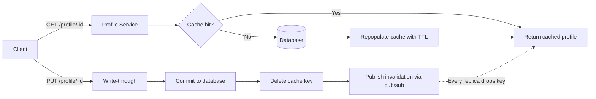

| Difficulty | Channel | Tags |
|---|---|---|
| beginner | backend | redis, memcached, cache-invalidation |

Somewhere in the world right now, Katy Perry just tweeted. And like magic, that single post is being stamped into millions of in-memory timelines — Twitter's Redis fleet processes over 30 billion cache updates every single day to deliver them [1]. That is the scale your tiny user-profile cache is secretly aspiring to. But before you dream about billions of requests, you have to solve a far more embarrassing problem: what happens to that cached profile after the user edits it in a way that makes the cache a lie?

---

> ### Real-World Case — Twitter
>
> Twitter's home timeline is the most-read data in the entire system, and every user's timeline is cached in-memory for sub-second delivery. But the product's fan-out nature means a single tweet from a top account must be appended to millions of cached timelines at once - over 30 billion timeline cache updates every day.
>
> | | |
> |---|---|
> | **Challenge** | How to keep frequently accessed timelines fresh (cache invalidation/update on every new tweet) without saturating network or memory. Twitter's original Memcached-based cache hit what its team called the 'network bandwidth problem' and 'long common prefix problem': fanout writes were small and incremental, but each cached timeline object was large, and Memcached treated timelines as opaque blobs that had to be rewritten wholesale. |
> | **Solution** | Twitter moved timeline caching to Redis. Each user's home timeline became a native Redis list with only tweet IDs stored (capped at ~800 IDs per timeline, hydrated later from separate user/tweet caches). On every tweet, the fanout service performs an in-place append (LPUSH) to each follower's cached list instead of deleting/rewriting the whole object. Timelines are replicated 3x for fault tolerance, and only active users' timelines are kept in RAM (inactive ones are evicted and rebuilt on demand). |
> | **Outcome** | The Redis timeline cache scaled to 30 billion updates/day, ~300,000 reads/sec on home timelines, peak tweet rates of 12,000/sec, and 39 million timeline inserts for a single Katy Perry tweet - serving nearly every active user's timeline from memory. Because Redis list structures hold ~20 bytes per entry with compression-friendly encodings, the same job needed far less infrastructure than the blob-based Memcached approach. |
> | **Lesson** | For cache invalidation at scale, the data structure matters as much as the cache engine. The 'simpler, faster' option (Memcached) lost to the 'heavier' option (Redis) purely because append-friendly native list structures made write-path cache updates cheap - an argument that directly mirrors the write-through vs delete-and-rebuild trade-off in the interview answer. |

---

## Hook — The tweet that moved 39 million timelines

Picture this: a cached timeline that is 10 seconds stale feels like a bug. A cached timeline that is 10 minutes stale feels like a betrayal, and a users profile that shows the old name, old photo, and old bio after they hit save is a one-way ticket to the support queue. Now understand the stakes at Twitter's scale: nearly every active users home timeline is served straight from memory, peak tweet rates hit 12,000 per second, and a single Katy Perry tweet triggered roughly 39 million timeline inserts in one blast [1]. At that volume, invalidation is not a footnote — it is the whole engineering problem. This article walks you through the write-through pattern, the delete-vs-overwrite trap, and the honest Redis-versus-Memcached trade-off, told through the war story of a system that turns every tweet into a cache-busting event.

## Problem — Your cache is a liar, and it does not even know it

Most developers hit the same wall around month three of running a real service. You add a cache to make reads fast, watch the latency numbers plummet, and then the first angry email lands: users say the profile still shows last weeks photo. The cache served a stale value. The root cause is never the cache itself — it is the fact that you treated invalidation as an afterthought. Many developers believe writing the new value straight into the cache on every update solves everything. It does not. That approach reintroduces a race where an old read can overwrite a fresh write, and it duplicates work across every application replica. Consequently, the actual questions are: when does the cache learn about a change, and who decides when old data is garbage? Whether you are running two servers or two thousand, the failure modes are identical — only the blast radius changes. IF ALGO: think of it as a contract: the database is the source of truth, and the cache is a speeding copy that must be actively invalidated, never trusted.

## Real-World Case — Twitter staples itself to a tweet

Twitter's home timeline is the most-read data in the entire company, and it is cached completely in memory for sub-second delivery [1]. The painful catch was simple: the products fan-out nature means one tweet from a big account must be appended to millions of cached timelines at once. To make that happen, Twitter leans hard on Redis list structures — stored with compression-friendly encodings that keep each entry around 20 bytes — rather than the blob-based Memcached approach that dominated early designs. The numbers published in VMWare's case study are staggering: 30 billion timeline cache updates per day, roughly 300,000 reads per second across home timelines, and peak tweet rates of 12,000 per second [1]. The over-arching insight is a plot twist most engineers miss: Redis is not just a cache here, it is the data structure engine doing the writes all updates produce. That single choice meant far less infrastructure for the same job. For you, the lesson extends: when you pick a cache, you are also picking your invalidation mechanics. And that decision will quietly define your operational life.

## Deep Dive — Redis vs Memcached: the real trade-off

Beneath all the drama, the core pattern every profile service should use is write-through caching with a TTL backstop [2][3]. Reads go cache-first — a pattern known as cache-aside — and writes go to the database first, then invalidate the cache by deleting the key rather than overwriting it. Delete-or-overwrite is the classic trap: overwriting in place can interleave with concurrent reads, but a delete makes the next read miss, fetch fresh data, and repopulate — no intermediate stale state [5]. So where does Redis separate itself from Memcached? Redis ships built-in pub/sub, meaning when one application instance invalidates a profile key, it can broadcast the event and every other instance drops its own copy automatically [6]. Memcached gives you no such channel — invalidation across nodes is your job to coordinate by hand [3]. Yet the trade-off cuts both ways: Memcached is simpler, leaner, and historically faster for the pure get/set workload, while Redis carries more memory overhead per key and more features to misconfigure. Lists, sorted sets, and durability make Redis the right call for complex invalidation patterns and critical data. Memcached wins when you want radically simple horizontal scaling and minimal memory cost. For a profile service specifically, the pub/sub bonus alone usually tips the scales — but only if you actually need multi-node invalidation today, not in theory.

## Workflow — The lifecycle of a profile update

Now stitch the pattern together into a flow you can trace end to end. Start with the read path: a client asks for a profile, the service checks the cache, and on a miss it fetches from the database and repopulates with a TTL. Then the write path: an update lands, the database commits first, the service deletes the cache key, and a pub/sub message tells every replica that key is gone. That is the whole arc — persist, purge, propagate. The diagram below traces the journey of both a read and an update through the same service, so you can see exactly where staleness dies. Building on that, notice the TTL is not optional flavor — it is the safety net that eventually evicts data even when every invalidation message gets lost or a deploy races with a write [4]. Cache stampede protection matters too: after a hard delete, a thundering herd of readers can all miss at once and hammer the database, so many teams add a short per-key lock or micro-stagger repopulation. And do not keep your TTL in the dark — set it deliberately. For profiles, 5 to 30 minutes is the sweet spot that balances freshness against database load.

## Code Example — A profile service that actually handles updates

Here is a minimal, production-flavored implementation in Python that ties the whole strategy together — cache-aside reads, write-through updates, delete-not-overwrite, TTL backstop, and pub/sub propagation [6]. It reads like the tutorial you wish you had found before that first stale-profile incident.

## Lessons Learned — What to do differently tomorrow

Pull four takeaways from this and paste them onto your teams walls. First: delete, never overwrite, when invalidating a cache key — a delete is a race-free reset where the next reader repopulates with truth [5]. Second: TTLs are a backstop, not a strategy — they forgive your invalidation sins, but do not let them become your only defense. Third: measure before you choose — cache hit rates, eviction counts, and write amplification deserve real dashboards, because an invisible cache degradation is the worst kind [8]. And fourth: Redis and Memcached both get the job done, but you are really choosing durability and invalidation features versus raw simplicity and memory overhead [3][6][7]. If this feels like a lot to hold at once, you are not alone — every engineer has debugged a stale value at 2am and questioned their career. The good news is the fix is not exotic. Apply write-through invalidation, keep TTLs sane, and monitor hit rates: you will sleep through the next deploy, and your users will never see last weeks photo again.

---

## Write-Through Cache Invalidation Flow

<strong>Original Interview Question</strong>

**Q:** You're building a user profile service that caches frequently accessed profiles. How would you implement cache invalidation when a user updates their profile, and what trade-offs would you consider between Redis and Memcached?

**A:** Implement write-through caching with TTL-based expiration. On profile update, invalidate the cache by deleting the key and writing new data to both the database and cache. Redis offers pub/sub for automatic distributed invalidation, while Memcached requires manual coordination across nodes.

## Conclusion

The moral is surprisingly simple: your cache is not a storage system, it is a contract with a set of rules. Twitter earned 30 billion updates a day by respecting the mechanics of its chosen tool — Redis lists for fan-out, memory for speed, and an invalidation pipeline that never trusted the cache to fix itself [1]. Tomorrow, audit your own service. Do reads go cache-first? Do writes delete the key and propagate the event? Is there a TTL standing guard? Pick the cache that matches your invalidation needs — pub/sub-rich Redis for complex patterns, minimal Memcached for pure speed — then measure hit rates like your users' patience depends on them, because it does [3][6][8]. If there is one insight to share with your team at standup, it is this: delete, don't overwrite. That one word is the difference between a cache that serves copies and a cache that serves lies.

---

## References

1. [Twitter incident report](https://blogs.vmware.com/tanzu/case-study-staple-yourself-to-a-tweet-to-understand-30-billion-redis-updates-per-day) — article
2. [Redis (Wikipedia)](https://en.wikipedia.org/wiki/Redis) — article
3. [Memcached (Wikipedia)](https://en.wikipedia.org/wiki/Memcached) — article
4. [Cache stampede (Wikipedia)](https://en.wikipedia.org/wiki/Cache_stampede) — article
5. [RFC 9111: HTTP Caching](https://datatracker.ietf.org/doc/html/rfc9111) — documentation
6. [Redis Pub/Sub Documentation](https://redis.io/docs/latest/develop/interact/pubsub/) — documentation
7. [MDN: HTTP Caching](https://developer.mozilla.org/en-US/docs/Web/HTTP/Caching) — documentation
8. [AWS ElastiCache Documentation](https://docs.aws.amazon.com/AmazonElastiCache/latest/red-ug/WhatIs.html) — documentation

---

**Author:** Satishkumar Dhule — [GitHub](https://github.com/satishkumar-dhule) · [LinkedIn](https://linkedin.com/in/satishkumar-dhule) · [Website](https://satishkumar-dhule.github.io)
