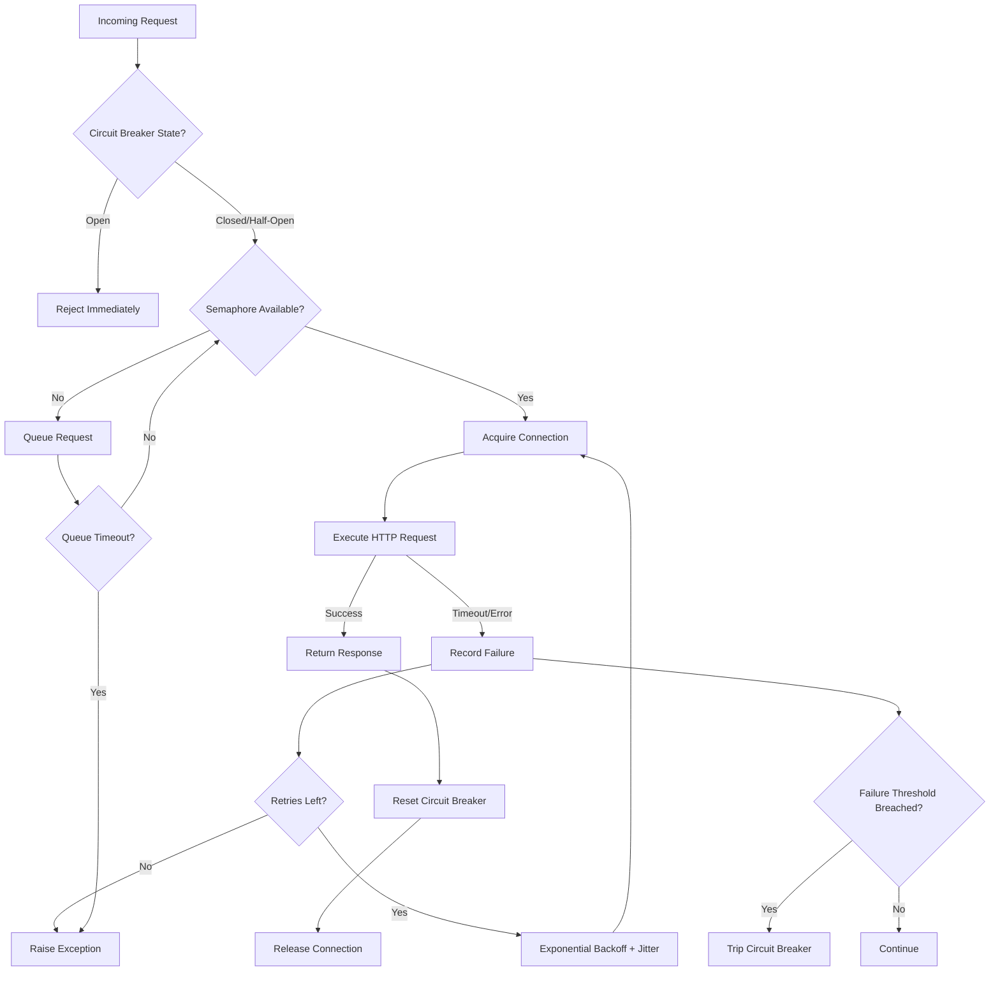

| Difficulty | Channel | Tags |
|---|---|---|
| advanced | backend | asyncio, aiohttp, concurrency |

Picture this: it's 2012, and Netflix's API is serving video to millions of devices across America. Then one backend service starts lagging. Within seconds, Tomcat threads saturate like a dam breaking, and the entire API goes dark — even though every other dependency is perfectly healthy [1]. That single incident rewrote how the industry thinks about connection pooling, and the lessons from it will change how you build every networked service from here on out.

---

> ### Real-World Case — Netflix
>
> In 2011-2012, the Netflix API faced an existential reliability problem: it streamed video to millions of devices while depending on dozens of backend services, and at ~20,000 requests/second peak it could be killed by one slow dependency. A single latency-spiking backend service would saturate all available Tomcat request threads within seconds and take down the entire API, even when every other dependency was healthy.
>
> | | |
> |---|---|
> | **Challenge** | With the API fanning out from ~1 billion incoming calls per day to several billion outgoing calls (a 1:6 ratio) across dozens of subsystems, and theoretical math showing that 30 dependencies at 99.99% uptime combine to 99.7% overall (2+ hours of downtime/month), Netflix needed a way to isolate failures, shed load, and fail fast instead of letting one bad dependency cascade into total outage. |
> | **Solution** | Netflix built the DependencyCommand resilience layer (later open-sourced as Hystrix) around every outbound call: per-dependency bounded thread pools and semaphores (tryAcquire, non-blocking) to cap concurrent connections and act as bulkheads, aggressive network timeouts plus retries and exponential backoff, and a circuit breaker that tracks errors in a rolling 10-second window and trips (~50% error rate) to short-circuit failing dependencies and serve fallbacks (stale cache, stubbed data, fail-silent, fail-fast). This is precisely the connection-pool-manager pattern the aiohttp question describes - semaphore limiting, timeouts, retry and circuit-breaker-based graceful degradation - proven in production at enormous scale. |
> | **Outcome** | The API grew from ~20 million requests/day in 2010 to over 2 billion/day while surviving real incidents gracefully - e.g., when a cache-population bug caused the shared database to throttle, 157 of 200 servers automatically tripped the database circuit and served fallbacks from a local query cache with minimal impact on video views. Hystrix matured to execute 10+ billion thread-isolated and 200+ billion semaphore-isolated calls per day across Netflix. |
> | **Lesson** | A connection/concurrency pool that limits concurrent calls is not just a throughput tool - it is the first line of defense against cascading failure. The key insight: fail fast and shed load (via tight timeouts, bounded queues, and circuit breakers) keeps request threads healthy so the system can recover in seconds when the downstream service returns, instead of everyone piling up waiting on timeouts. |

---

## The Night a Connection Pool Became a Weapon

It starts innocently enough. Your API handles 20,000 requests per second. Each request fans out to a dozen downstream services. You configured your connection pool to 100 — plenty of headroom, right? Then one service starts responding 200ms slower than usual. Suddenly your pool is full, new requests queue up, timeouts cascade, and your entire API collapses. Sound familiar? This is exactly the trap Netflix walked into, and it is a trap that every backend developer will eventually face unless they architect for it deliberately.

## The Problem — When Connections Become Chokepoints

At its core, the challenge is brutally simple: you have finite connections and infinite things trying to use them. Without a proper pool manager, you end up with connection leaks where sockets never return to the pool, uncapped concurrency that lets a single slow response starve every other request, and no circuit breaker so your system keeps hammering a dead service instead of failing fast. The real danger is not the failure itself — it is the cascade. One unhealthy service turns into a thread pool exhaustion, which turns into request timeouts across all endpoints, which turns into a full outage. You need a pool that degrades gracefully under load, not one that explodes.

## Real-World Case — Netflix and the Circuit Breaker Revolution

Netflix's API grew from roughly 20 million requests per day in 2010 to over 2 billion per day — a 100x increase in just two years. They depended on dozens of backend services, and a single latency-spiking dependency could take down the entire API [1]. The fix was Hystrix, their circuit breaker library that eventually executed over 10 billion thread-isolated and 200 billion semaphore-isolated calls daily. When a cache-population bug caused their shared database to throttle, 157 out of 200 servers automatically tripped the database circuit and served fallbacks from a local query cache — with minimal impact on video views [1]. The lesson is unambiguous: a well-designed circuit breaker does not just prevent outages, it transforms them into manageable degradation events.

## Deep Dive — The Three Pillars of Resilient Pool Management

Building on Netflix's experience, three patterns emerge as non-negotiable for any production connection pool: semaphores, exponential backoff, and circuit breakers.

**Semaphore-Based Connection Limiting** is the foundation. A semaphore restricts the number of concurrent connections to a configurable maximum, preventing resource exhaustion. Without it, a burst of 10,000 requests would attempt to open 10,000 sockets simultaneously — your OS will thank you for not doing that [2]. In Python's asyncio, a `Semaphore` gates access to a shared resource without blocking the event loop [3].

**Exponential Backoff with Jitter** handles transient failures. When a request times out, immediately retrying creates a thundering herd that makes the problem worse. Instead, each retry waits longer — 100ms, 200ms, 400ms — and adding jitter ensures retries from multiple clients do not synchronize and amplify the load [4]. This is not optional; it is a survival mechanism.

**Circuit Breakers** are the nuclear option, used wisely. They monitor failure rates and, when a threshold is breached, stop all requests to the failing service for a cooldown period. This prevents cascade failures and gives the downstream service time to recover. The pattern has three states: closed (normal operation), open (failing fast), and half-open (testing if recovery happened) [5].

Here is the counterintuitive insight many developers miss: the circuit breaker is not about the failing service. It is about protecting the healthy ones. Without it, your connection pool spends all its time waiting for a dead service, leaving nothing for the services that actually work.

## Workflow — Request Lifecycle Through the Pool Manager

Before writing any code, visualize the journey every request takes through the pool manager. The Mermaid diagram below maps this flow from the moment an HTTP request arrives to the moment it either succeeds, retries, or gets rejected by the circuit breaker. Understanding this lifecycle is critical because each decision point is a place where your pool can either recover gracefully or cascade into failure.

## Code Example — Building the Pool Manager

Here is a production-grade `ConnectionPoolManager` that implements all three pillars. Each section is annotated to explain not just what it does, but why it matters.

## Lessons Learned — What to Do Differently Tomorrow

After implementing this pattern across several production systems, here are the battle scars that matter most:

**Connection leaks are silent killers.** Always use `async with` for sessions and connections. A leaked socket does not crash your app — it slowly starves your pool until requests start queuing and timing out. Monitor your active connection count; if it trends upward over days, you have a leak [6].

**Timeouts are not one-size-fits-all.** A read timeout for a search endpoint should be shorter than a timeout for a video transcode endpoint. Configure per-request timeouts, not just global ones [7].

**SSL context validation matters more than you think.** Skipping `ssl=False` in development is fine. Doing it in production is a lawsuit waiting to happen. Always validate certificates in non-development environments [2].

**Graceful shutdown is not optional.** When your application stops, drain your connection pool properly. Cancel pending requests, close sockets cleanly, and wait for in-flight responses. A hard kill leaves orphaned connections that your load balancer still routes to a dead instance [8].

The takeaway: building a connection pool manager is not about the happy path. It is about the 3am pager, the slow downstream, the retry storm. Netflix learned this serving billions of requests daily, and the same patterns — semaphores, backoff, circuit breakers — apply whether you are building a weekend side project or a streaming platform [1]. Start with these three pillars, monitor relentlessly, and remember: graceful degradation is not a feature, it is survival.

---

## Request Lifecycle Through Connection Pool Manager

<strong>Original Interview Question</strong>

**Q:** How would you implement a connection pool manager for aiohttp that handles graceful degradation under high load and connection timeouts?

**A:** Implement a connection pool manager for aiohttp using a semaphore to limit concurrent connections, exponential backoff for retrying failed requests, and circuit breaker pattern to gracefully degrade under high load and connection timeouts.

## Conclusion

Netflix turned a catastrophic API outage into a masterclass on resilient connection management by building three pillars into their pool: semaphores to limit concurrency, exponential backoff to prevent retry storms, and circuit breakers to stop cascading failures before they start [1]. You do not need to build Hystrix from scratch — Python's asyncio and aiohttp give you the primitives. But you do need to wire them together deliberately. Start by adding a semaphore to your connection pool today. Then add circuit breaker logic. Monitor your connection counts. And when that 3am pager goes off, you will be the engineer who already prepared for it.

---

## References

1. [Making the Netflix API More Resilient](https://netflixtechblog.com/making-the-netflix-api-more-resilient-a8ec62159c2d) — blog
2. [Python asyncio — Managing connections and resources](https://docs.python.org/3/library/asyncio-sync.html) — documentation
3. [aiohttp — Asynchronous HTTP Client/Server](https://docs.aiohttp.org/en/stable/) — documentation
4. [Exponential Backoff and Jitter — AWS Architecture Blog](https://aws.amazon.com/blogs/architecture/exponential-backoff-and-jitter/) — blog
5. [Circuit Breaker Pattern — Microsoft Architecture Patterns](https://learn.microsoft.com/en-us/azure/architecture/patterns/circuit-breaker) — documentation
6. [Connection Pooling — PostgreSQL Documentation](https://www.postgresql.org/docs/current/runtime-connection.html) — documentation
7. [aiohttp Client Timeout Configuration](https://docs.aiohttp.org/en/stable/client_reference.html#aiohttp.ClientTimeout) — documentation
8. [Graceful Shutdown in Kubernetes](https://kubernetes.io/docs/concepts/workloads/pods/pod-lifecycle/) — documentation

---

**Author:** Satishkumar Dhule — [GitHub](https://github.com/satishkumar-dhule) · [LinkedIn](https://linkedin.com/in/satishkumar-dhule) · [Website](https://satishkumar-dhule.github.io)
