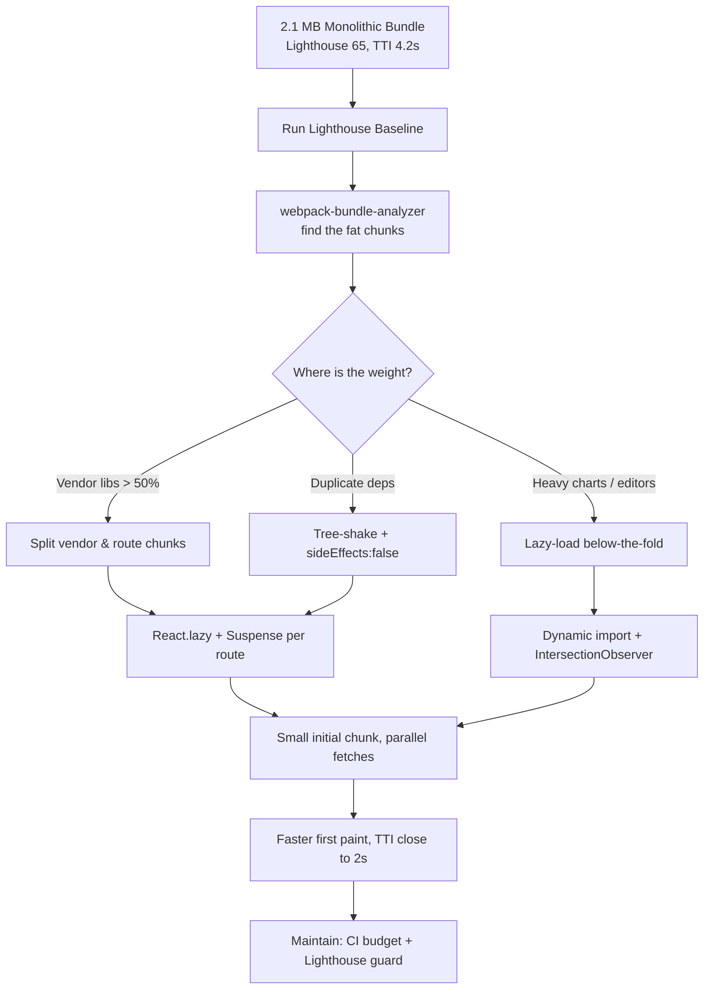

| Difficulty | Channel | Tags |
|---|---|---|
| intermediate | frontend | lighthouse, bundle, lazy-loading |

In 2017, Twitter made a bet that most engineers would have called impossible: rebuild the mobile web app so it could survive 2G networks, low-end Android phones, and data plans measured in megabytes. The result, Twitter Lite, took a React app that shipped as three monolithic JS files totaling over 1MB and cut time-to-interactive almost in half [1]. This is the story of the technique at the center of that turnaround — code splitting — and a battle plan you can use to stop your own Lighthouse score from living at 65.

---

> ### Real-World Case — Twitter
>
> In 2015-2017, Twitter rebuilt its mobile web experience as 'Twitter Lite' to serve emerging markets where users had expensive data plans, low-end devices, and 2G/3G networks. Mobile accounted for over 80% of usage, but their React frontend shipped as only three monolithic JS files totaling over 1MB (420KB gzipped), making initial load take 5+ seconds on 3G.
>
> | | |
> |---|---|
> | **Challenge** | A single massive JavaScript bundle was a bottleneck on slow networks and low-end Android devices — the app needed to fit under 600KB total and become interactive in seconds, while still delivering a full tweet timeline and feed experience. |
> | **Solution** | Twitter engineers refactored the React codebase to split the CommonsChunk into granular, route-based chunks following the PRPL pattern: roughly 40 on-demand, lazy-loaded code-split chunks amortized across the session instead of one eager bundle. They paired this with service worker caching of the app shell and static resources, granular image/media optimization, and React runtime optimizations (moving non-critical analytics work from componentWillMount to componentDidMount and embracing shouldComponentUpdate) to unblock the main thread. |
> | **Outcome** | After code splitting, Time to Interactive was reduced to almost half its previous value as measured by Chrome's Lighthouse. Initial load on 3G dropped from over 5 seconds to under 3 seconds, first loads clocked in under 5 seconds on most devices, logged-in users saw a 30% reduction in average load time, 99th percentile TTI latency dropped 50%, and the entire experience fits in 600KB over the wire versus 23.5MB for the native Android app. |
> | **Lesson** | Granular route-based split chunks can make an initial page load dramatically faster even if total application size grows — the cost is amortized across the session. Real bundle wins come from combining code splitting with service worker caching, PRPL-style resource hints, and React rendering optimizations rather than any single technique. |

---

## Hook — The 5-Second Ceiling

Ever noticed how the same headline feels different depending on where you read it? On a fiber connection, a poorly optimized app is a mild annoyance. On a 3G connection in an emerging market, it is the difference between using a product and abandoning it forever. That is the reality Twitter faced: over 80% of usage was mobile, yet the React frontend shipped as exactly three monolithic JavaScript files totaling more than 1MB — over 420KB of that gzipped. Initial loads took 5+ seconds on 3G [1]. Here is the uncomfortable question: if your Lighthouse score is 65 and your bundle is 2.1MB, you are already living in that world. The good news? The fix is not a rewrite. It is a set of deliberate, measurable steps — and this article walks through every one.

## Problem — One Bundle, One Bottleneck

The core problem is deceptively simple:

## Real-World Case — Twitter Lite

Building on that problem, consider what happened inside Twitter between 2015 and 2017. Teams noticed something troubling in the numbers: mobile already accounted for over 80% of usage, but users in emerging markets — on expensive data plans, low-end devices, and 2G/3G networks — simply could not afford the experience. A single load was eating their data allowance before they saw a single tweet. So Twitter rebuilt the mobile web experience as "Twitter Lite," and code splitting became its cornerstone. The impact was dramatic and public: time-to-interactive dropped to almost half its previous value per Chrome's Lighthouse. Initial load on 3G fell from over 5 seconds to under 3. First loads clocked in under 5 seconds on most devices. Logged-in users saw a 30% reduction in average load time, and 99th-percentile TTI latency fell 50% [1]. Perhaps the most astonishing number: the entire experience fits in just 600KB over the wire — versus 23.5MB for the native Android app. That is not a small optimization; that is a fundamental rethinking of what a web app must ship. The lesson transfers directly to your 2.1MB bundle: the size is not the problem — how you ship it is.

## Deep Dive — Splitting Isn't Shrinking

This leads to a plot twist that surprises many developers: code splitting does not make your code smaller. The total bytes are the same — you are just no longer forcing users to download everything upfront. Understanding this distinction changes how you approach the task. Specifically, there are two main strategies. Route-based splitting gives each route its own chunk, so a user navigating to the login page never pays for the analytics dashboard code [2]. Component-based splitting lazy-loads heavy pieces independently — a chart library used once, deep down a page, becomes a chunk fetched only when needed [6]. However, both rely on one underlying primitive: dynamic imports. Webpack and Vite both treat dynamic import() as a natural chunk boundary, splitting vendor code and shared modules into separate files that load in parallel [3]. Yet none of this works if the bundle is carrying dead weight. That is where tree shaking enters: with proper ES module configuration, bundlers can statically analyze imports and drop unused exports [5]. Combined, these three tools — dynamic imports, tree shaking, and bundle analysis — form the entire optimization stack. But there is a nuanced trap: every chunk you introduce is another round-trip, and on 2G networks, one big file can beat ten tiny ones. The trick is finding the right chunk granularity, not the smallest possible chunks.

## Workflow — The Five-Step Optimization Pipeline

So where do you start? The workflow below mirrors the journey teams at Twitter and countless others have taken, and it always begins with measurement. The pipeline flows like this: quantify the problem, find the culprits, eliminate dead weight, split intelligently, then bake it into the workflow so the score never regresses again. See the diagram below for the visual story of this pipeline. To make it concrete, here is the step-by-step process:

1. **Measure first.** Run Lighthouse and record the baseline: total bundle size, main-thread work, and TTI.
2. **Analyze the bundle.** Run `webpack-bundle-analyzer` and look for the largest chunks. Usually, 70-80% of the bytes come from a handful of vendor libraries [4].
3. **Eliminate dead weight.** Remove unused dependencies, replace heavy libraries with lighter alternatives, and confirm tree shaking is active via `sideEffects: false` in package.json [5].
4. **Split by route.** Make every route lazy with React.lazy and Suspense so navigation pulls chunks only when needed [2][6].
5. **Lazy-load the rest.** Use dynamic imports for below-the-fold components and trigger them with an IntersectionObserver so they load only when scrolled into view [8].

⚠️ **Watch Out:** A common failure is stopping at step 2. Analysis tells you where the fat is; it does not remove it. Teams that skip straight to lazy-loading keep the 2.1MB bundle and just shuffle it into smaller pieces.

## Code Example — Route and Component Splitting in Practice

Concretely, here is how step 4 and 5 translate into code. The pattern below uses route-based splitting for the whole page, component-based splitting for a heavy chart, and an error boundary so a failed chunk fetch doesn't white-screen the app. Each import creates its own chunk automatically — no extra config required beyond a working bundler setup [3].

## Lessons Learned — What to Do Differently Tomorrow

If this feels overwhelming, you are not alone — but the takeaways fit on a single note card. First, never optimize blind. Every team that ships a real performance fix starts with a baseline Lighthouse run and a bundle analyzer report, not a guess [4]. Second, treat code splitting as a budgeting rule, not a one-time event: decide what the initial chunk may weigh and enforce it in CI, because scores regress far faster than they improve. Third, remember the plot twist: splitting does not shrink the app; it changes when users pay for it. Finally, revisit the Twitter story whenever a stakeholder asks whether performance is worth the effort. The same technique that took a megabyte-heavy web app from 5 seconds to 3 on 3G is sitting in your import statement [1]. The tooling you need — webpack-bundle-analyzer, React.lazy, Suspense, tree shaking — is free, documented, and battle-tested [3][5][6]. So here is the challenge for tomorrow: run Lighthouse, open bundle analyzer, and find the first chunk worth cutting. The journey from 65 to 90+ is not a rewrite; it is a decision — and you now have the roadmap.

---

## Bundle Optimization Pipeline

<strong>Original Interview Question</strong>

**Q:** You're tasked with improving a React app's Lighthouse performance score from 65 to 90+. The bundle size is 2.1MB and Time to Interactive is 4.2s. What specific steps would you take to optimize the bundle and implement lazy loading?

**A:** Implement code splitting with React.lazy() and Suspense, analyze bundle composition with webpack-bundle-analyzer to identify largest chunks, remove unused dependencies and optimize imports, add dynamic imports for heavy components and third-party libraries, implement route-based splitting for better initial load times, and utilize tree shaking with proper ES module configuration.

## Conclusion

Twitter's turnaround proves that performance is not about rewriting your app — it is about deciding when users pay for its weight. Run Lighthouse today, open webpack-bundle-analyzer, and identify the first chunk worth cutting. The roadmap is short: measure, analyze, tree-shake, split by route, lazy-load the rest. Before long, that 65 becomes an 85, the 4.2s TTI becomes a memory, and users on expensive data plans can actually enjoy what you built. The memorable insight to share with your team: code splitting doesn't shrink your app — it stops making every user pay for features most of them never open.

---

## References

1. [Twitter incident report](https://medium.com/@paularmstrong/twitter-lite-and-high-performance-react-progressive-web-apps-at-scale-d28a00e780a3) — article
2. [Route-level code splitting in React](https://web.dev/articles/route-level-code-splitting-in-react) — blog
3. [Webpack guide: Code Splitting](https://webpack.js.org/guides/code-splitting/) — documentation
4. [webpack-bundle-analyzer](https://github.com/webpack-contrib/webpack-bundle-analyzer) — documentation
5. [Tree shaking - MDN Glossary](https://developer.mozilla.org/en-US/docs/Glossary/Tree_shaking) — documentation
6. [lazy (lazy loading components) - React Docs](https://react.dev/reference/react/lazy) — documentation
7. [Suspense - React Docs](https://react.dev/reference/react/Suspense) — documentation
8. [Intersection Observer API - MDN](https://developer.mozilla.org/en-US/docs/Web/API/Intersection_Observer_API) — documentation
9. [Lighthouse performance scoring - Chrome for Developers](https://developer.chrome.com/docs/lighthouse/performance/performance-scoring/) — documentation

---

**Author:** Satishkumar Dhule — [GitHub](https://github.com/satishkumar-dhule) · [LinkedIn](https://linkedin.com/in/satishkumar-dhule) · [Website](https://satishkumar-dhule.github.io)
