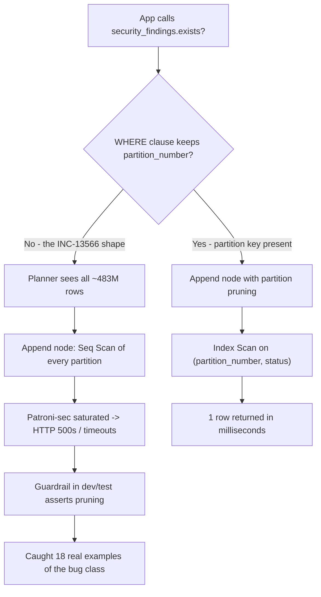

| Difficulty | Channel | Tags |
|---|---|---|
| intermediate | database | explain, query-plan, partitioning |

Somewhere inside GitLab's fleet, a routine existence check went rogue. `pipeline.security_findings.exists?` fired without the `partition_number` predicate that kept it in check, and PostgreSQL — loyal to a fault — decided to sequentially scan every single partition of a ~483M-row table to answer a question that should have touched one row [1]. Pipeline pages degraded into HTTP 500s and the security database (patroni-sec) hit its saturation point. All because the planner never got the chance to prune.

---

> ### Real-World Case — GitLab
>
> GitLab's `security_findings` table (partitioned, ~483M rows) hit a production incident when a routine `pipeline.security_findings.exists?` call ran without the `partition_number` partition-key predicate. PostgreSQL silently fanned out and sequentially scanned every partition, saturating the security database (patroni-sec) and causing HTTP 500s/timeouts on pipeline pages (INC-13566).
>
> | | |
> |---|---|
> | **Challenge** | Diagnosing why a query on a partitioned table with hundreds of millions of rows was still catastrophically slow: partition pruning had silently broken because one code path simply omitted the partition key from the WHERE clause, so the planner scanned all partitions instead of one. |
> | **Solution** | Fix the query paths to include the partition key (`partition_number`) via per-call-site fixes and association-level default pruning, and add a test-time query analyzer (`PreventUnpartitionedScan`) that detects any SELECT reading a partitioned table without constraining its partition key. The analyzer derives partition metadata live from `postgres_partitioned_tables`, so it covers list/range/hash strategies without a hand-maintained table list. |
> | **Outcome** | The existence check stopped scanning ~483M rows across all partitions; the guardrail caught this exact bug class in dev/test (18 examples including the INC-13566 EXISTS-subquery shape, plus a real-DB test confirming the partition key is derived from live metadata). Broader follow-up work (INC-8367/INC-8474) resolved LockManager LWLock saturation on CI replicas and fixed Sidekiq SLO violations caused by the same unpruned-query pattern. |
> | **Lesson** | A partitioned table with broken pruning is strictly worse than the unpartitioned original — every hot query must carry the partition key, and you need to verify pruning (via EXPLAIN or automated analyzers) rather than assume the DDL did the work. |

---

## Hook — The 3 a.m. pager that 483 million rows answered

Picture this: it's 3 a.m. and your phone is doing its best impression of a fire alarm. Pipeline pages are timing out, customers are refreshing, and the only clue buried in the log is a single routine line — something you wrote months ago and never thought about again.

That line was an existence check. The kind of query developers fire a hundred times a day. Cheap, invisible, harmless... until it isn't.

Here is the twist: the check didn't fail because of bad hardware or a misconfigured connection pool. The database executed it perfectly. It just executed it against all 483 million rows — because the query forgot to tell PostgreSQL which partition it wanted. And a database that follows instructions to the letter will happily chew through every one of them.

If that doesn't send a chill down your spine, keep reading. Because the same silent failure is lying dormant inside your own carefully partitioned tables.

## Problem — Your partitioned table fooled you

Chances are you reached for partitioning for all the right reasons. Tables grow. 100 million rows become 500 million. Writes slow down, bloat creeps in, and someone on the team reads a blog post promising date-based partitioning will make everything snappy. PostgreSQL's declarative partitioning is genuinely powerful [2], and for the right workload it delivers real gains: faster bulk deletes, incremental maintenance, and data that mostly touches the current hot partition.

But here is the uncomfortable truth: partitioning on its own is not an optimization. It is an *opportunity* for the planner to be smart. Whether that opportunity gets used depends on a single fragile moment — the instant your WHERE clause is turned into a plan. If the planner can't prove which partitions you need, it does the only safe thing: it treats the parent table as a giant Append node over every child. No pruning. No shortcut.

That's why the classic interview scenario — a table with 100M rows, partitioned by date, and a date-range query that is *still* slow — is so sneaky. The gotcha isn't SQL syntax. It's planner behavior. You might assume the date filter magically narrows the scan. PostgreSQL will happily prove you wrong [3][4].

Moreover, the failure mode is silent. Nothing logs "partition pruning failed." The query just runs slower — sometimes orders of magnitude slower — and the only witness is an EXPLAIN plan nobody bothered to read.

## Real-World Case — GitLab watched a missing predicate melt a database

This is exactly what happened to GitLab. Their `security_findings` table — partitioned, roughly 483 million rows spread across many partitions — was a well-architected workload. The partition key existed. Indexes existed. All the boxes were ticked.

Then a routine call, `pipeline.security_findings.exists?`, ran without its `partition_number` predicate, and the carefully built architecture collapsed. PostgreSQL's planner saw a query with no partition-key constraint and did precisely what an optimizer is designed to do: fan out and sequentially scan every partition. The security database, patroni-sec, saturated. Pipeline pages degraded into HTTP 500s and timeouts [1].

The incident, tracked as INC-13566, is a case study in how devastating an innocent-looking query can be. A single EXISTS that should have examined one partition instead walked roughly 483 million rows. Nobody changed a schema that day. Nobody dropped an index. One missing predicate, and a core product surface went down [1].

Here's the plot twist worth savoring: the lasting fix wasn't a bigger database. GitLab built a guardrail — a check in dev/test that asserts the partition key is actually present in high-risk query shapes. It immediately caught 18 real examples of this exact bug class, including the INC-13566 EXISTS shape, and a real-DB test confirmed the partition key is derived from live metadata. The follow-up work (INC-8367 and INC-8474) attacked the same unpruned-query pattern elsewhere, resolving LockManager LWLock saturation on CI replicas and fixing Sidekiq SLO violations [1].

That is what "optimizing partition pruning" looks like in production: not a clever trick, but a tripwire.

## Deep Dive — Reading the plan before the flames

Building on that story, let's decode what actually happens inside the planner, because the incident only makes sense if you can read the plan. When you `EXPLAIN` a query against a partitioned table, the structure you care about is the Append node: it lists the children the planner expects to touch. Right next to it sits the evidence of pruning — filters on the partition key and estimators that shrink with each partition discarded [3].

The key concept is that the planner keeps a child out of the Append only when it can mathematically rule it out from the constraints — often via range pruning on the partition key, what the docs call "min/max pruning" [2]. The moment a WHERE clause strips or obscures the partition key, every child survives the cut, and the Append grows to cover all partitions.

Then come the three things you audit in every slow plan:

- **Index utilization:** is the real work an Index Scan, or is PostgreSQL falling back to a Seq Scan? An Append of sequential scans on a partitioned parent is a neon sign that pruning failed [4].
- **Expensive operators:** watch for large `Sort:` nodes and `Hash Aggregate` steps. Sorts on a huge result set dominate everything else, and they're a hint that your index doesn't cover the ordering you asked for.
- **Row estimates vs reality:** if the planner guessed 1 row and found 4 million, your stats are stale (`ANALYZE` was skipped) or your query is non-prunable.

Once the plan is readable, the standard toolkit applies. A composite index on `(date, filtered_columns)` lets one index satisfy both the range predicate and the status filter — turning an index scan into an index-only scan [5]. For genuinely hot ranges, `CLUSTER` physically reorders the table along that index so related pages live together: fewer blocks touched, dramatically better cache hits [6].

But here's the trade-off table worth memorizing:

| Strategy | Wins when | Costs you |
| --- | --- | --- |
| Composite index `(date, status)` | Ad-hoc reads across many filters | Slower writes, index bloat, extra storage |
| `CLUSTER` on that index | One dominant hot access pattern | Full table lock; must be re-run as data grows |
| Parallel query | Big scans you can't avoid | Diminishing returns after pruning; resource contention [8] |
| Covering / index-only scans | Truly hot OLTP reads | Write amplification spikes [5] |

Notice something? Every option optimizes for the reads you wrote *yesterday*. The cheapest lever is the one GitLab chose: making it impossible to ship a query that can't prune in the first place.

🔥 **Hot Take:** composite indexes on wide tables are reactive medicine. The proactive cure is a query that never needs them.

## Workflow — The five-step triage that turns 'slow query' into 'fixed plan'

Translation: the diagnostic ritual that separates a good engineer from a 3 a.m. firefighter is repeatable and boring. Run it in this order, and you'll catch the GitLab-shaped bug before it ever reaches production:

1. **Reproduce with `EXPLAIN (ANALYZE, BUFFERS)`** — never debug a plan without buffer and timing numbers [3].
2. **Read the Append node first** — count the children, and look for pruning filters or a `Partitions: 5 of 40` line that proves pruning happened.
3. **Check scan types on the children** — Index Scan is healthy; Seq Scan across children means pruning failed. Note any `Sort:` or `Hash Aggregate` above them.
4. **Fix the predicate before the indexes** — add the partition key back into the WHERE clause first. Nine times out of ten, that alone collapses the plan.
5. **Index and cluster only after pruning is confirmed** — then lock the improvement in with an automated plan check so the regression can never quietly return.

Here is the workflow as a decision flow — the branch at the top is the entire difference between a millisecond and an outage:

[diagram]

The critical discipline to steal: the top branch is a *code review question*, not a tuning question. If your ORM generated the query, the ORM owns the partition key — and abstracting it away is a load-bearing sin waiting to snap while you sleep.

## Code Example — Make the check an automated tripwire, not a memory

The most valuable habit from GitLab's playbook is automating the inspection. Humans forget to pass partition keys; scripts don't. The tooling below wraps `EXPLAIN (ANALYZE, BUFFERS)` and fails the check if the plan doesn't prune — a lightweight, runnable version of the guardrail GitLab runs against every merge request after INC-13566 [1].

💡 **Insight:** notice that the fix is pipeline-shaped, not schema-shaped. The query is validated before it ships, so the 483M-row scan never gets a chance to run in the first place.

## Lessons Learned — The incident taught the whole industry, not just one database team

The journey ends where all good lessons do: at a simple, repeatable discipline. First, partition pruning only works when the partition key survives into the WHERE clause — every ORM abstraction and existence helper is a candidate to strip it. Second, `EXPLAIN` is a diagnostic, not a report card; run it with `ANALYZE` and `BUFFERS`, then read the Append node first [3]. Third, indexes on `(partition_key, filtered_columns)` are the workhorses and `CLUSTER` is a scalpel — and both are wasted if the planner never prunes [5][6]. Fourth, and this is the big one, make the check automated. GitLab's guardrail caught 18 real-world bugs in its first pass [1] and turned a 483M-row outage into a test that runs before code ever ships.

So what should you do tomorrow?

- Run `EXPLAIN (ANALYZE, BUFFERS)` on your slowest partitioned query this week and look at the Append node.
- Grep for EXISTS queries against partitioned tables — the exact shape that took GitLab down [1].
- Add a composite index on `(partition_key, filtered_columns)` and re-run the plan to confirm the improvement.
- Automate the validation, so a future version of you at 3 a.m. never meets the night GitLab's pipeline team lived through.

⚠️ **Watch Out:** `CLUSTER` takes a full table lock. Schedule it in a maintenance window or accept a brief write pause [6].

If this feels overwhelming, you are not alone — virtually every team that partitions a big table learns this lesson the hard way. The good news is you get to learn it from someone else's 483M-row mistake [1].

The memorable takeaway to share with your team: **the optimizer never punishes the query you wrote — it rewards the one that made pruning possible.**

---

## Partition Pruning Decision Flow

<strong>Original Interview Question</strong>

**Q:** You have a PostgreSQL table with 100M rows partitioned by date. A query filtering on a specific date range is still slow. What would you check in the EXPLAIN plan and how would you optimize it?

**A:** Check partition pruning effectiveness, index utilization patterns, and expensive sort operations. Create composite indexes on (date, filtered_columns) and evaluate clustering strategies for optimal data access.

## Conclusion

GitLab's 483-million-row incident wasn't a tale of failing hardware or a missing index. It was a single missing predicate that turned a routine existence check into a full-table catastrophe — and a guardrail that made the same mistake impossible to ship again [1]. The same transformation is available to you: learn to read the Append node, keep the partition key alive in your WHERE clauses, and let automated plan checks carry the burden. Your future self, staring at a pager at 3 a.m., will be profoundly grateful. Start with one query, one EXPLAIN, and one index — that is the entire journey.

---

## References

1. [GitLab incident report](https://gitlab.com/gitlab-org/gitlab/-/merge_requests/252823) — article
2. [PostgreSQL documentation: Partitioned Tables](https://www.postgresql.org/docs/current/ddl-partitioning.html) — documentation
3. [PostgreSQL documentation: Using EXPLAIN](https://www.postgresql.org/docs/current/using-explain.html) — documentation
4. [PostgreSQL documentation: The Planner and Optimizer](https://www.postgresql.org/docs/current/planner-optimizer.html) — documentation
5. [PostgreSQL documentation: CREATE INDEX](https://www.postgresql.org/docs/current/sql-createindex.html) — documentation
6. [PostgreSQL documentation: CLUSTER](https://www.postgresql.org/docs/current/sql-cluster.html) — documentation
7. [PostgreSQL documentation: auto_explain](https://www.postgresql.org/docs/current/auto-explain.html) — documentation
8. [PostgreSQL documentation: Parallel Query](https://www.postgresql.org/docs/current/parallel-query.html) — documentation
9. [Wikipedia: Partition (database)](https://en.wikipedia.org/wiki/Partition_(database)) — documentation
10. [GitLab documentation: Incident Management](https://docs.gitlab.com/ee/incident_management/) — documentation

---

**Author:** Satishkumar Dhule — [GitHub](https://github.com/satishkumar-dhule) · [LinkedIn](https://linkedin.com/in/satishkumar-dhule) · [Website](https://satishkumar-dhule.github.io)
