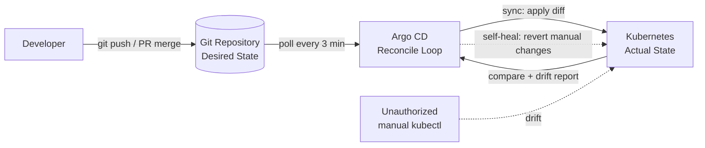

| Difficulty | Channel | Tags |
|---|---|---|
| beginner | devops | argocd, flux, declarative |

Every platform team eventually hits the same wall: Kubernetes is easy to spin up and nearly impossible to keep in sync. When Intuit set out to build its Modern SaaS platform, it needed to roll out Kubernetes across hundreds of services — and discovered that no enterprise-ready, Kubernetes-native continuous delivery tool existed on the market [1]. So the company did what almost no organization can: it founded the tool itself, creating Argo CD in 2018 [1]. Today that open-source project reconciles 1.7 million Kubernetes resources across 200 clusters and 8,000 applications in production — and the pattern powering it, GitOps, is available to any team, starting with yours.

---

> ### Real-World Case — Intuit
>
> After acquiring Applatix (the startup behind the Argo project) to build its 'Modern SaaS' platform, Intuit needed to roll out Kubernetes across hundreds of services. Unable to find an enterprise-ready, Kubernetes-native continuous delivery tool, they founded Argo CD in 2018 to deliver declarative, GitOps-based deployments and now run it in production at enormous scale — managing 1.7 million Kubernetes resources across 200 clusters with 8,000 applications.
>
> | | |
> |---|---|
> | **Challenge** | Deliver continuous deployment for thousands of microservices across 100-200+ Kubernetes clusters for a heavily regulated fintech company, where every change needs auditability, RBAC/SSO, and controlled promotion between environments — while eliminating the config drift caused by imperative CLI-based cluster management. |
> | **Solution** | Intuit adopted a fully declarative GitOps model: Git repos became the single source of truth for both application manifests (Kubernetes YAML, Kustomize, Helm) and, later, even cluster state itself (declarative cluster config files for upgrades and AWS account creation). They enabled Argo CD auto-sync where safe, but as a fintech they deliberately chose a controlled, push-based flow for app deployments — Jenkins CI promotes image tags into the deployment repo, Argo CD detects the resulting OutOfSync state, and an approval-gated pipeline (QA -> staging -> prod) drives the actual syncs. Cluster upgrades, by contrast, run fully automatically from Git. |
> | **Outcome** | Intuit manages 1.7 million Kubernetes resources across 200 clusters with 8,000 Argo CD applications, running thousands of production services. Cluster operations moved from manual CLI updates to fully GitOps-driven automatic upgrades. Scaling Argo CD itself became the next challenge — the tool's creators had to add app-list caching and the ApplicationSet controller to push past their own scaling limits. |
> | **Lesson** | Declarative GitOps doesn't require unconditional auto-sync: the right model depends on compliance. Even the company that invented Argo CD gates auto-sync behind an approval pipeline for regulated production environments while keeping Git as the immutable source of truth — and even they hit scaling walls, proving that GitOps adoption requires planning the tooling controls (caching, sharding, ApplicationSet) as much as the manifests. |

---

## Hook — The 11 p.m. kubectl You Will Regret

There is a moment every platform engineer recognizes: it is 11 p.m., a critical service is degrading, and the fastest known fix is one `kubectl scale --replicas=10` typed into a terminal. It works. Night saved, hero celebrated. Then, three weeks later, nobody can explain why that Deployment has 10 replicas in production and 3 everywhere else. Here's the uncomfortable truth: every manual command you run against a cluster is a small bet against your own future. Kubernetes happily applies whatever you tell it in the moment — it has no memory of what you intended. The toolchain that prevents this failure, GitOps, does not just feel cleaner; it is the reason a company running software for tens of millions of customers was willing to build its own continuous delivery platform rather than live without one [1]. That is the journey this article follows, from one late-night command to a fleet that manages itself.

## Problem — Kubernetes Remembers State, Not Intent

So why is this so hard? Because Kubernetes was designed as a control system with no built-in source of truth. Imperative workflows — `kubectl apply`, `kubectl delete`, `kubectl scale` — treat the cluster as a conversation: state changes the instant a command runs, with no audit trail, no review, and no rollback path unless someone was disciplined enough to think ahead [5]. For a three-person team, this is friction you can absorb. For an organization shipping hundreds of services, it becomes an existential threat. Deployments get overwritten by out-of-sync teammates. Environments drift until staging behaves nothing like production. Rollbacks turn into archaeology — digging through terminal history to reconstruct what changed. The stakes, in other words, are not just efficiency; they are reliability. Every undocumented change is a production incident waiting for a trigger. That is the pain GitOps exists to eliminate, and if you have felt even a fraction of it, the payoff of this pattern is enormous.

## Real-World Case — Intuit's 200-Cluster Origin Story

Here is where the story gets specific. When Intuit acquired Applatix — the startup behind the Argo project — the company had a clear mandate to accelerate its Modern SaaS platform and roll out Kubernetes across hundreds of services [1]. The obstacle, as the Intuit team later recounted, was that no enterprise-ready, Kubernetes-native continuous delivery tool existed on the market [1]. Not one. So in 2018 Intuit did the only thing that satisfied its standards: it founded Argo CD itself, delivering declarative, GitOps-based deployments on top of the Argo project [1]. The scale they reached is the part worth dwelling on. Intuit now manages roughly 1.7 million Kubernetes resources across 200 clusters, running about 8,000 Argo CD applications for thousands of production services [1]. Cluster operations went from manual CLI upgrades to fully GitOps-driven automation. But here is the plot twist that should give you hope: even the creators hit their own ceiling. Scaling Argo CD became the next challenge, and the team had to introduce app-list caching and the ApplicationSet controller to push past their own limits [1][8]. Translation: scale problems are not a sign you are doing GitOps wrong. They are a sign you have outgrown tools never designed for your ambition — and, as Intuit proved, the fixes get shipped back to everyone.

## Deep Dive — Declarative vs Imperative: A Control Perspective

At its core, GitOps is a disarmingly simple contract: the Git repository becomes the single source of truth for what your cluster should look like, and an operator reconciles reality with that declaration, over and over, forever [6]. The declarative approach means you describe the complete desired state — in YAML manifests, Helm charts, or Kustomize overlays — and version it like code [4]. Argo CD continuously compares the live cluster to the committed intent and drives them back into agreement [2]. The imperative approach, by contrast, is whatever kubectl did last [5]. Put them side by side and the tradeoffs tell the whole story:

| Dimension | Declarative (GitOps) | Imperative (kubectl) |
|---|---|---|
| Source of truth | Git, versioned and reviewed [4] | The cluster's current state |
| Change path | Pull request → merge → sync [6] | Whatever command runs last |
| Audit trail | Full history, blame-able [2] | Terminal scrollback at best |
| Rollback | `git revert`, instantly reproducible | Manual, memory-based guessing |
| Drift | Detected and healed automatically [2] | Undetected until an incident |

Now the counterintuitive part. Many developers assume automation means pushing — that deployment tooling shoves manifests at the cluster the way they used to. Actually, Argo CD pulls: the controller watches the repo and applies the diff, so a broken install or a missing controller means no deployment happens [2][3]. That inversion is what makes GitOps more than a rebrand of infrastructure-as-code — it is a pull-based control loop with three levers you get to tune: the sync interval (how often Argo CD checks, typically 1 to 5 minutes), self-healing (revert any manual drift back to the committed state), and pruning (delete resources you removed from Git) [2]. Tune them like a sound engineer, not a switch flipper, because each knob is loaded. ⚠️ Watch Out: enabling selfHeal and prune before your manifests are trustworthy is how teams wake up to deleted Ingresses. Git is now authoritative, and a bad commit becomes a bad reconciliation.

## Workflow — From Git Commit to Reconciled Cluster in 6 Steps

With the concepts in place, the path from fresh cluster to self-cleaning GitOps deployment is more mechanical than you might expect. Here is the six-step journey Argo CD takes you on — the loop captured in the diagram below:

1. **Consolidate intent** — put every manifest, Helm chart, or Kustomize overlay into a Git repo with environment branches or folders (dev/staging/prod).
2. **Install Argo CD** — deploy the controller into its own namespace; it becomes the agent that watches both Git and the cluster [2][3].
3. **Register the repository** — `argocd repo add` so the controller can reach your private source of truth.
4. **Declare an Application** — create an Application resource pointing at the repo path, target revision, and destination cluster or namespace [2].
5. **Set the sync policy** — choose automated sync with a health-check interval (typically 3 minutes), then layer in self-healing and pruning once you trust the output [2].
6. **Observe and delegate** — watch the Application's status, let Argo CD reconcile drift, and scale out with ApplicationSets when one template should generate hundreds of same-shaped Applications [8].

Specifically, every sync tick works like this: the controller compares desired vs actual, applies the delta, and reports health. When someone sneaks in a manual change, self-healing reverts it — the cluster becomes self-cleaning, and engineers stop being the source of truth [2][6]. 💡 Insight: the 3-minute health check interval is a sweet spot for most teams — fast enough to catch drift quickly, slow enough that the API server is not doing acrobatics every thirty seconds.

## Code Example — Wiring Auto-Sync and Self-Healing with an Application CRD

So what does this look like in practice? The fastest way to feel the difference is to commit this once and then watch the cluster chase the repository. The script below points Argo CD at a Git repo holding Kustomize overlays and asks for automated sync with self-healing:

```bash
#!/usr/bin/env bash
# gitops-bootstrap.sh
# Purpose: point Argo CD at your Git repo as the single source of truth.

set -euo pipefail

# 1. Install Argo CD into its own namespace (the reconciler lives here)
kubectl create namespace argocd || true
kubectl apply -n argocd -f https://raw.githubusercontent.com/argoproj/argo-cd/stable/manifests/install.yaml

# 2. Register your config repo so the controller can pull from it
argocd repo add https://github.com/acme/config.git \
  --username "$GIT_USER" \
  --password "$GIT_TOKEN"

# 3. Declare the desired state: an Application watches repo + path + destination
cat > payments-app.yaml <<'EOF'
apiVersion: argoproj.io/v1alpha1
kind: Application
metadata:
  name: payments-service
  namespace: argocd
spec:
  project: default                       # routes to RBAC policies
  source:
    repoURL: https://github.com/acme/config.git
    targetRevision: main                 # branch = the reviewed truth
    path: overlays/production            # Kustomize overlay for prod
  destination:
    server: https://kubernetes.default.svc
    namespace: payments
  syncPolicy:
    automated:
      prune: true                        # delete resources removed from Git
      selfHeal: true                     # revert manual drift automatically
    syncOptions:
      - CreateNamespace=true             # sync can bootstrap its own namespace
EOF

# 4. Ask the controller to pick it up
kubectl apply -n argocd -f payments-app.yaml

# 5. Watch the reconcile loop do its first pass
argocd app get payments-service   # status: Synced / Health: Healthy
```

Step by step: the install creates the control plane, `repo add` authenticates Git access, and the Application CRD declares the contract — repo, branch, overlay path, destination namespace, and the automated sync policy. `prune: true` tells Argo CD to delete anything that disappears from Git; `selfHeal: true` tells it to revert any manual drift. The final two commands verify the loop: `argocd app get` shows Sync status and health, so you can watch Git become the only voice your cluster listens to. Start with `prune` off if this is your first rodeo — flip it on once the diffs look boring.

## Lessons Learned — Ship Declarative First, Automate Second

After following Intuit's arc from founding Argo CD to wrangling 1.7 million resources, a few lessons stand out — some of them earned the hard way.

- **Declarative first, automation second.** Get the desired state locked in Git and reviewed before you enable self-healing; Git is only a safe source of truth if it reflects what you actually want [4].
- **Prune carefully.** `prune: true` means deleted manifests become deleted resources. Start with automated sync but manual pruning, then graduate [2].
- **Secrets are the trap.** Plain secrets in Git defeat the point of a reviewed source of truth. Use SealedSecrets, SOPS, or an External Secrets operator from day one.
- **ApplicationSets are your scaling lever.** Intuit did not create 8,000 YAML files by hand; generators produce thousands of Applications from one template [8].
- **GitOps is a pattern, not a vendor.** Flux runs the same pull-based reconcile loop as a CNCF-native operator, and knowing one makes the other learnable [7].
- **Expect the tool to become the bottleneck.** Intuit's own scaling story proves the reconciler itself gets hot at fleet scale [1]; watch controller metrics, use caching, and upstream your fixes [3].

🎯 Key Point: if a manual kubectl touch-up is faster than a pull request, your GitOps rollout is not set up yet — it is set up wrong. The whole point is that the slow path becomes the only path.

---

## GitOps Reconcile Loop



<details>
<summary><strong>Original Interview Question</strong></summary>

**Q:** You're setting up GitOps for a microservices deployment. How would you configure ArgoCD to automatically sync changes from your Git repository to Kubernetes, and what's the difference between declarative and imperative approaches in this context?

**A:** I'd configure ArgoCD by setting up a Git repository containing Kubernetes manifests or Helm charts, creating an Application CRD that points to the Git repository, enabling auto-sync with a health check interval of 3 minutes, and implementing self-healing to automatically revert any manual changes. The declarative approach involves defining the desired state in Git through YAML manifests, Helm charts, or Kustomize configurations, where ArgoCD continuously reconciles the actual state with the desired state. In contrast, the imperative approach uses kubectl commands to make direct changes to the cluster, bypassing the Git repository as the single source of truth.

</details>

## Conclusion

The thread running through everything is simple: don't tell the cluster what to do with one-off commands — declare the state you want and let something tireless enforce it. Intuit could not buy that tool, so it built the one you can install in an afternoon [1]. Start this week: export a service as a manifest, commit it, point Argo CD at it with a three-minute sync interval, and let the reconcile loop earn your trust. The insight worth sharing with your team: the only source of truth that scales is the one sitting in version control, and the cluster's job is to obey it — not negotiate with it.

---

## References

1. [Intuit incident report](https://www.heavybit.com/library/podcasts/the-kubelist-podcast/ep-2-gitops-at-scale-with-mukulika-kapas-of-intuit) — article
2. [Argo CD Documentation — Declarative GitOps CD for Kubernetes](https://argo-cd.readthedocs.io/en/stable/) — documentation
3. [argoproj/argo-cd — GitHub repository](https://github.com/argoproj/argo-cd) — documentation
4. [Kubernetes Docs — Declarative Management of Kubernetes Objects Using Configuration Files](https://kubernetes.io/docs/tasks/manage-kubernetes-objects/declarative-config/) — documentation
5. [Kubernetes Docs — Imperative Management of Kubernetes Objects Using kubectl](https://kubernetes.io/docs/tasks/manage-kubernetes-objects/imperative-command/) — documentation
6. [GitOps — Wikipedia](https://en.wikipedia.org/wiki/GitOps) — article
7. [Flux Documentation — CNCF GitOps operator](https://fluxcd.io/flux/) — documentation
8. [Argo CD Documentation — ApplicationSet](https://argo-cd.readthedocs.io/en/stable/operator-manual/applicationset/) — documentation

---

**Author:** Satishkumar Dhule — [GitHub](https://github.com/satishkumar-dhule) · [LinkedIn](https://linkedin.com/in/satishkumar-dhule) · [Website](https://satishkumar-dhule.github.io)
