| Difficulty | Channel | Tags |
|---|---|---|
| beginner | devops | mlops, deployment |

What if you could double the complexity of your ranking model and keep latency flat while conversions climb? That is exactly what Meta did with its LLM-scale ads ranking model, breaking what engineers call the 'inference trilemma' — the reality that model complexity, latency, and compute cost cannot all win with a one-size-fits-all server [1]. The breakthrough only happened after Meta's team stopped treating deployment and serving as the same job. By the end of this article, you will understand why those two words describe completely different layers of the ML stack — and why mixing them up is one of the most expensive mistakes a platform team can make.

---

> ### Real-World Case — Meta
>
> Meta's ads ranking models serve billions of users in real time, but scaling them to LLM-level complexity hit the 'inference trilemma': model complexity, latency, and compute cost can't all be satisfied with a one-size-fits-all server. Every ad request used to recompute the same user representation once per candidate ad, wasting compute on redundant work.
>
> | | |
> |---|---|
> | **Challenge** | Serve trillion-parameter (O(1T)) recommendation models to billions of users at sub-100ms latency with bounded cost, while keeping deployments and autoscaling reliable under fluctuating traffic — a workload envelope where classic LLM serving (multi-second responses) is unacceptable. |
> | **Solution** | Meta rebuilt the serving tier with three mechanisms: (1) intelligent request routing that assigns each request to a lighter or heavier model based on user context and intent instead of serving one model for everyone; (2) a request-centric architecture that computes high-density user signals once per request and broadcasts them across all ad candidates (in-kernel broadcast sharing embeddings directly on the GPU, turning scaling cost from linear to sub-linear); and (3) multi-card GPU sharding that splits terabyte-scale embedding tables across a cluster, plus accelerated model loading (multi-stream download + remote caching) to push new models to production in under 10 minutes and SM-utilization-based autoscaling to handle traffic spikes without over-provisioning. |
> | **Outcome** | On Instagram since Q4 2025, the model delivers a +3% increase in ad conversions and +5% in click-through rate for targeted users; it runs at O(10 GFLOPs) per token (LLM-level complexity) while holding O(100ms) latency, achieves 35% model FLOPs utilization across mixed hardware, and scales embeddings to a trillion parameters with multi-card parity to single-GPU performance. |
> | **Lesson** | In production ML, serving is where deployment strategy meets hardware reality: model/version rollout speed (10-min loads), autoscaling, and request routing are first-class engineering decisions, not afterthoughts — the win came from optimizing the serving path (decoupling user-signal computation from per-candidate scoring) rather than just buying more GPUs. |

---

## Hook — the notebook works, production burns

It is 2:47am. Your pager is screaming because the model you shipped yesterday is timing out on every third request. The model scored 0.94 on your offline eval set. It ran fine in your notebook. Your teammate even ran it under production traffic in staging and it held steady. Sound familiar? Here is the plot twist: the model was probably fine. The serving layer was not. Many developers discover that the gap between 'the model works' and 'the service works' is a chasm — and it is filled with request routing, model loading, cold starts, autoscaling, and version negotiation. The stakes are real: at Meta's scale, a ranking model that redoes redundant compute on every ad request was bleeding GPU cycles that bought nothing [1]. Before you can fix latency, you have to answer a deceptively simple question: what did you actually ship — a deployable artifact or a serving system?

## Problem — everyone says 'deploy' when they mean two different things

Here is the confusion that costs teams weeks: the word 'deployment' covers CI/CD pipelines, infrastructure provisioning, artifact registries, and monitoring — the machinery that gets a model from a training job into production. 'Serving' is what happens after: the runtime that loads the model into memory, exposes an inference API, routes requests, negotiates versions, and keeps latency under budget [1]. They overlap, but they fail differently. A deployment failure shows up as a stuck pipeline or a broken rollout. A serving failure shows up as p50 latency creeping past 200ms at 3pm on a Tuesday when traffic spikes. Consequently, if your team solves only the deployment side — building gorgeous pipelines and beautiful dashboards — you can still ship a model that nobody can call quickly enough. Conversely, a brilliant serving layer cannot rescue a rollout with no rollback path. The tension this creates for architects: deployment is about change management, serving is about instant performance. They demand different tools, different metrics, and ironically, different engineers. This distinction is the mental model behind every mature ML platform, from Kubernetes-based pipelines [2] to managed stacks like SageMaker [9].

## Real-World Case — Meta bends the inference scaling curve

Meta's ads ranking models serve billions of users in real time, but pushing them toward LLM-level complexity hit the 'inference trilemma' head-on: complexity, latency, and cost refuse to cooperate when you force them through one generic server [1]. Before the fix, every ad request recomputed the same user representation once per candidate ad — a mountain of redundant work that grew linearly with the number of ads under evaluation. The team's response was an adaptive ranking model that separates a single user representation from the per-ad scoring work, so the expensive part happens once and gets reused. The results are the kind of numbers you frame: since Q4 2025 on Instagram, +3% ad conversions and +5% click-through rate for targeted users, all while running at O(10 GFLOPs) per token — genuine LLM-level compute — while holding O(100ms) latency [1]. They also pushed model FLOPs utilization to 35% across mixed hardware and scaled embeddings to a trillion parameters with multi-card parity to single-GPU performance [6]. The wow factor: Meta did not magically buy better hardware. It re-architected the boundary between what the model computes once and what it computes per request — which is, at its core, a serving design decision, not a training one. That is the same insight your team can apply, whether your model has 12 million or 12 trillion parameters.

## Deep Dive — two stacks, one mental model

Building on that story, let's map the two layers to concrete technology. The deployment layer is a software-engineering problem: Kubernetes schedules your model as a container and handles rolling updates [2], MLflow tracks which artifact is 'current' and pins versions [3], and Terraform or Helm declares the infrastructure. The serving layer is a performance problem: TensorFlow Serving and TorchServe load the artifact and expose an optimized inference API [5][6], while tools like BentoML package model, code, and dependencies into one deployable service [7]. For high-throughput paths, gRPC over HTTP/2 beats JSON REST on serialization cost by a wide margin [8]. The trade-off table that interviewers — and architecture reviews — love:

| Concern | Deployment | Serving |
| --- | --- | --- |
| Primary job | Get the artifact into production safely | Answer requests within a latency budget |
| Core tooling | Kubernetes, Docker, Terraform, Helm [2] | TensorFlow Serving, TorchServe, BentoML, gRPC [5][6][7][8] |
| Registry & versioning | MLflow, SageMaker, Vertex AI [3][9] | Model version negotiation at the gateway |
| Failure mode | Stuck pipeline, broken rollout, no rollback | Cold start, queue build-up, p99 regression |
| Scaling question | How many replicas can I schedule? | How do I keep under 100ms per request while QPS climbs? |
| Key metric | Deploy-to-production time | Latency, throughput, GPU utilization [10] |

Now here is where the fun really starts — scaling. There are two dials on this machine, and teams constantly turn the wrong one. Horizontal scaling adds pod replicas, so you handle more concurrent requests; it is your first lever for QPS, and Kubernetes has been doing it forever [2][11]. Vertical scaling grows the resources inside one pod — more GPU memory, more CPU — which matters because model weights occupy VRAM in a way stateless web servers never did [4]. And the subtle one nobody warns you about: batch versus real-time inference is a genuine design fork, not a preference. Real-time paths need to land under roughly 100ms; batch jobs that write scores to a store can tolerate seconds [1]. Deliberately separate the two or the interactive traffic will starve exactly when your users show up. The same fork explains why A/B testing and canary rollouts live at the traffic-splitting layer rather than inside the model code: versioning is a deployment mechanic, but the observed outcome — a click-through lift or a regression — only shows up in the serving metrics [1][10].

## Workflow — from commit to 100ms, step by step

This leads to the question every platform team eventually answers: what does a healthy path from training run to live traffic actually look like? The flow that took Meta from redundant compute to reused representations is the same one your team can copy. First, the trained artifact lands in a registry like MLflow with a version tag [3]. Second, your CI pipeline — GitHub Actions, Jenkins, whatever you trust — runs offline validation and package checks. Third, the artifact is containerized with the exact serving framework it will run on [5][6]. Fourth, you roll out gradually: Kubernetes lets you shift 5% of traffic to the new revision while the old one keeps serving [2]. Fifth, and this is where serving takes over, the gateway routes requests by model version, the server loads the weights into memory, and autoscaling adjusts replicas as queries-per-second swing [11]. Finally, you monitor — and here is the part nobody tells you: latency is the trailing indicator. Watch request rate, GPU utilization, and prediction drift (Prometheus is the usual suspect for this [10]) because those move before the p50 does. The diagram below tells the whole story in one glance: the deploy arm of the loop (left) and the serving arm (right) are two sides of the same cassette, and rollback is the bridge between them.

## Code Example — a serving layer that respects the separation

Now that the workflow is clear, let's build the smallest serving layer that honors the deploy-versus-serve boundary: load the model once, batch aggressively, and negotiate versions at the edge. This is a real production pattern, not a toy. The FastAPI service below implements the exact idea Meta exploited — compute once (model load at boot), reuse per request (async batching), and keep version routing in the request path.

## Lessons Learned — what actually moves the latency needle

After this journey from a 3am pager to Meta's trillion-parameter serving stack, the takeaways are simple to state and brutal to learn. First, deployment is about change, serving is about speed — separate the plumbing from the hot path. Second, cold starts are a deployment problem disguised as a serving problem: if your p50 is fine but your p99 is shameful, hunt for the slow model load, not the model. Third, batch is your friend: async batching can multiply throughput by an order of magnitude with zero regression in median latency, because modern accelerators are throughput machines [4]. Fourth, version everything and treat rollback as a traffic shift, not a redeploy [1][3]. And finally, do not measure what makes you look good — measure what breaks first: request rate and utilization whisper before latency screams [10]. Here is what to do tomorrow: pick one model, wrap it in a server that loads once and batches, tag its version, and route a canary 5% through [2]. That is the entire gap between deploying a model and serving it well.

---

## Model Lifecycle: Deploy to Serve to Rollback

```mermaid
flowchart LR
    A[Train & register artifact] --> B[CI: validate + package]
    B --> C[Registry tag: version pinned]
    C --> D[Deploy: Helm / Kubernetes rollout]
    D --> E{Canary 5%?}
    E -->|yes| F[Shadow traffic to new version]
    E -->|no| G[Roll out 100%]
    F --> G
    G --> H[Serving gateway: route by version]
    H --> I[Model server: load weights once]
    I --> J[Async batching: reuse compute]
    J --> K[HPA autoscale on QPS]
    K --> L[Monitor: RPS, utilization, drift]
    L -->|drift or latency spike| M[Rollback: shift traffic back]
    M --> H
```

<strong>Original Interview Question</strong>

**Q:** Explain the key differences between model serving and model deployment in ML systems, including specific technologies, scaling considerations, and real-world implementation patterns?

**A:** Deployment encompasses CI/CD pipelines, infrastructure setup, and monitoring using tools like Kubernetes, MLflow, and SageMaker. Serving focuses on runtime inference APIs with frameworks like TensorFlow Serving, TorchServe, or BentoML, handling request routing, model versioning, and autoscaling. Key trade-offs include latency vs throughput, batch vs real-time inference, and cold start optimization.

## Conclusion

Meta's trillion-parameter ranking model is not a magic hardware story — it is a design decision about where compute happens once and where it happens per request [1]. The same logic, at a fraction of the scale, explains why deployment and serving must be treated as separate disciplines: one manages change, the other manages milliseconds. So the 'so what?' is this: tomorrow, wrap your model in a server that loads once, batches eagerly, and negotiates versions at the edge. Your training pipeline will keep being your best teammate, but your serving layer is what your users actually feel. The memorable insight to share with your team: you do not deploy latency, you serve it — and the two verbs demand very different crafts.

---

## References

1. [Meta incident report](https://engineering.fb.com/2026/03/31/ml-applications/meta-adaptive-ranking-model-bending-the-inference-scaling-curve-to-serve-llm-scale-models-for-ads/) — article
2. [Kubernetes Overview and Concepts](https://kubernetes.io/docs/concepts/overview/) — documentation
3. [MLflow Documentation](https://www.mlflow.org/docs/latest/index.html) — documentation
4. [Efficient Memory Management for Large Language Model Serving with PagedAttention (vLLM)](https://arxiv.org/abs/2309.06180) — paper
5. [TensorFlow Serving](https://github.com/tensorflow/serving) — documentation
6. [TorchServe](https://github.com/pytorch/serve) — documentation
7. [BentoML](https://github.com/bentoml/BentoML) — documentation
8. [gRPC Documentation](https://grpc.io/docs/) — documentation
9. [Amazon SageMaker Documentation](https://docs.aws.amazon.com/sagemaker/latest/dg/whatis.html) — documentation
10. [Prometheus Overview](https://prometheus.io/docs/introduction/overview/) — documentation
11. [Amazon EC2 Auto Scaling Documentation](https://docs.aws.amazon.com/autoscaling/ec2/userguide/what-is-amazon-ec2-auto-scaling.html) — documentation

---

**Author:** Satishkumar Dhule — [GitHub](https://github.com/satishkumar-dhule) · [LinkedIn](https://linkedin.com/in/satishkumar-dhule) · [Website](https://satishkumar-dhule.github.io)
