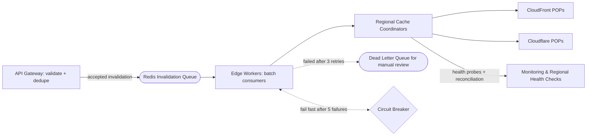

| Difficulty | Channel | Tags |
|---|---|---|
| intermediate | system-design | edge, caching, purging |

Every cache eventually has to forget something. In 2018, Fastly discovered the hard way that its purge pipeline — the system its customers use to make content disappear from edge nodes globally in ~150 milliseconds — was colliding with the limits of its own network architecture [1]. Today, that network handles roughly 60,000 purges per second, and the lessons it learned about queues, batching, and retries are the exact playbook any team needs to design a purge system that meets a 5-second SLA under 10,000 concurrent invalidations per second. This is that story.

---

> ### Real-World Case — Fastly
>
> Fastly has offered 'Instant Purge' since 2011 — globally invalidating cache across every edge node in ~150ms, a service customers depend on for breaking news, live events, and e-commerce price/inventory changes. As their network grew and customers began purging during normal business (not just emergency rollbacks), purge traffic exploded from 2-3k purges/second in 2018 to ~60k purges/second today, and the distributed delivery system started hitting scale and reliability limits.
>
> | | |
> |---|---|
> | **Challenge** | How to purge objects simultaneously across dozens of global points of presence in milliseconds, at tens of thousands of purges per second, while tolerating the inevitable internet weather: packet loss between POPs (typically <0.1%), network partitions, and no single point of failure. The speed-of-light floor for a global round trip is ~65ms, leaving almost no budget for a centralized queue, confirmation handshakes, or retry logic. |
> | **Solution** | A decentralized system (codename Powderhorn) instead of a centralized purge queue: purge requests are intercepted at the nearest edge, then broadcast to every cache node via UDP using a Bimodal Multicast gossip protocol. Acks were deliberately skipped (cutting latency up to half), lost messages are recovered by periodic gossip summaries, and purges are 'double-delivered' to at least two healthy nodes per POP so one dropped UDP packet can't lose a purge. Later optimizations included hierarchy within POPs and true batch purging so a single purge-all-by-surrogate-key lands as one operation rather than a storm of individual purges that flooded the system and forced manual rate limiting. |
> | **Outcome** | Purge propagation completes in ~150ms globally — within the ~65ms speed-of-light limit plus processing overhead — an order of magnitude faster than the 5-second SLA in this question. Throughput scaled from 2-3k purges/sec (2018) to ~60k purges/sec today, and after the true batch-purging rework they report confidence in scaling to hundreds of thousands of purges per second with the elimination of alert fires and manual rate limiting. |
> | **Lesson** | For global cache invalidation, a decentralized broadcast/gossip design beats a centralized command-and-control queue: it removes the single point of failure, drops latency to the physical limit, and scales naturally — but it requires engineering for the failure modes (packet loss from 0.1% to malicious floods) and for load amplification (batching purges into single operations). It also reframes purging as a normal part of the content lifecycle, not just an error-recovery mechanism, which is what made the volume explode in the first place. |

---

## Hook — The moment your cache refuses to forget

Ever wondered why your CDN won't forget the thing you already told millions of people to stop looking at? A last-minute price correction, a JavaScript bundle with a critical security patch, a breaking-news story that contained wrong data — every one of these turns into a race between your invalidation request and your users' clicks, and your cache is the only player in that race rooting for the wrong side. Here is the tension that makes the whole problem spicy: a CDN's entire job is to serve cached content fast, yet that very speed is what makes stale content so dangerously sticky. Invalidation is the price of admission for caching, and most teams only think about this trade-off while staring at an incident dashboard at 2am, watching a wrong price serve to reader number 2,000,000 [1].

## Problem — Why firing a purge request into the void doesn't work

The naive answer every team tries first looks innocent enough: call the provider's purge API, log a message, and move on. Fire-and-forget. Then reality arrives in three hard lessons. First, invalidation is not instantaneous — your content sits on dozens of edge points of presence across many regions, and each node needs its own separate update, so a single API call doesn't mean a single global timestamp [2]. Second, throughput bites: once webhooks, CI pipelines, and emergency rollbacks all start purging during normal business hours rather than just incident rollbacks, your request rate can spike by orders of magnitude. Third, and worst of all, purging is infamously not atomic — a partial failure leaves a few regions serving stale data while the rest of the world sees the fresh version. At stake is not just correctness but money: in e-commerce, every millisecond of stale pricing is a drift between what the catalog claims and what the checkout charges.

## Real-World Case — Fastly's journey from 3K to 60K purges per second

Fastly introduced Instant Purge back in 2011, a service that globally invalidates cache across every edge node in roughly 150 milliseconds — a number uncomfortably close to the physical speed-of-light limit for a round trip around the planet [1]. Customers came to depend on it for breaking news, live events, and e-commerce price changes, but the very success created the problem. Between 2018 and today, purge traffic exploded from 2,000–3,000 purges per second to roughly 60,000 per second, and the distributed delivery system began hitting scale and reliability limits that no amount of vertical tuning could fix. The plot twist: the bottleneck wasn't raw bandwidth, it was the request model itself. Fastly's engineering team responded not by buying faster hardware but by reworking purging around true batch operations, which collapsed API call volume, eliminated alert fires, and gave the team confidence they could scale to hundreds of thousands of purges per second [1]. That reframe — from "try to make one purge faster" to "make purges cheaper and batchable" — is the single most transferable lesson in this entire article.

## Deep Dive — The anatomy of a purge pipeline that hits a 5-second SLA

Building on Fastly's insight, a modern invalidation architecture treats purging as a distributed system problem, not an API call problem. The core components form a pipeline: requests enter through an API gateway, get validated, and drop into a durable invalidation queue; edge workers consume that queue and coordinate with regional cache coordinators; those coordinators fan out to the actual CDN providers. For a 5-second global SLA, every hop has to be measured, and the two levers you control are batching and TTL. Batching merges many URLs into fewer provider calls — 100 invalidations per request, in the original design — which cuts provider API cost by up to 90% while keeping propagation latency flat [1]. TTL is the secret second lever: instead of trusting a purge to also overwrite every cached copy, set your dynamic content to a TTL of 2 seconds with the header Cache-Control: max-age=2, must-revalidate, so a missed purge becomes a self-healing incident rather than a permanent one [3][4]. The RFC that governs all of this — RFC 7234 — explicitly allows caches to reuse responses under defined conditions, which is exactly why combining short TTLs with explicit invalidation is the robust pattern rather than the coward's way out [4]. But here is where most designs come apart: availability. Without a circuit breaker, one flaky provider region can cause a retry storm that amplifies into a full outage; without a dead-letter queue, failures are silently lost to logs [5][8]. The healthy systems fail fast after consecutive errors, park failed invalidations for manual review, and treat network partitions as an eventual-consistency reconciliation problem rather than pretending the partition never happened [10][8].

## Workflow — Purging the Fastly way, step by step

This leads to a clean, repeatable workflow that maps directly onto the diagram below. First, validate and normalize the incoming purge request at the gateway — reject malformed patterns and deduplicate overlapping paths before they ever touch the queue. Second, push accepted invalidations into a durable queue; Redis Streams with consumer groups work well here because they give you ordered delivery, at-least-once semantics, and per-consumer checkpoints that survive restarts [7]. Third, have edge workers pull batches from the stream and resolve them into regional coordinator tasks — this is the layer that decides which regions actually hold the affected content, so you only purge where it matters [6]. Fourth, the coordinators fan out to providers like CloudFront and Cloudflare using pattern-based purging with wildcards, collapsing hundreds of URLs into a handful of API calls [5][6]. Fifth, sink anything that failed after three exponential-backoff retries into a dead-letter queue for manual review, and let a circuit breaker fail fast when a provider region shows repeated 5xx responses [8][9]. The flow is deliberately boring: queue, coordinate, batch, retry, reconcile — and boring is exactly what you want at 2am.

## Code Example — Batch purge with exponential backoff and a safety net

Here is the production-shaped core of that workflow: a small JavaScript module that batches purge requests, retries with exponential backoff and jitter on transient failures, and routes the hopeless cases toward a dead-letter queue instead of losing them in a retry loop.

## Lessons Learned — What you should change tomorrow

If this feels overwhelming, you are not alone. But the pattern distills into a few hard-won rules. First, batch everything: per-URL purge calls are the #1 preventable cost and a self-inflicted throughput ceiling, and Fastly proved the batch-first model scales an order of magnitude beyond the naive one [1]. Second, treat the queue as non-negotiable: a durable queue with consumer groups is what turns a burst of 10,000 invalidations per second into a smooth, backpressured stream instead of a retry storm [7]. Third, pair short TTLs with explicit invalidation: the Cache-Control: max-age=2, must-revalidate header means that even an entirely missed purge heals within 2 seconds — a massive insurance policy when provider APIs flake [3][4]. Fourth, plan to be partially wrong: circuit breakers for fail-fast behavior, dead-letter queues for manual review, and eventual-consistency reconciliation for network partitions keep you operational when everything else breaks [8][10]. And finally, always keep a health-check endpoint per region pushing synthetic refresh probes, because you cannot monitor propagation you never measured. The common mistakes teams make are the opposite of all of these: no jitter in retries (amplifying outages), unbounded queues (trading latency for memory), and ignoring rate-limit headers (letting the provider throttle you into a backlog) [9].

---

## Cache Invalidation Pipeline Flow

<strong>Original Interview Question</strong>

**Q:** How would you design a multi-region CDN cache purging system that guarantees content propagation within 5 seconds while handling 10,000 concurrent invalidations per second?

**A:** Implement Cloudflare API + AWS CloudFront with distributed invalidation queue, edge compute coordination, and 2-second TTL. Use batch invalidation, exponential backoff, and regional cache headers for 5-second SLA.

## Conclusion

The story that begins with a 2am pager ends with a system that forgets on purpose. Fastly proved that the frontier of cache invalidation is not speed — it is elegance: batch the work, queue the pressure, cover every failure, and let a tiny TTL be the final safety net [1]. Tomorrow, apply one rule before touching anything else: instrument your propagation. Measure how long a purge actually takes to reach every region you serve, and if it misses your SLA, lean on the pipeline, not on hope — durable queue, batch purging, exponential backoff with jitter, a circuit breaker, and a dead-letter queue for the things that just will not leave. Do that, and the next breaking-news incident becomes a story you tell at the office instead of the one that follows you home. The memorable line to share with your team: caching is about serving fast, but purging is about forgetting fast — and forgetting fast is a distributed systems problem you can win.

---

## References

1. [Fastly incident report](https://www.fastly.com/blog/over-a-decade-later-evolution-of-instant-purge) — article
2. [Content delivery network](https://en.wikipedia.org/wiki/Content_delivery_network) — article
3. [HTTP caching — MDN Web Docs](https://developer.mozilla.org/en-US/docs/Web/HTTP/Caching) — documentation
4. [RFC 7234 — Hypertext Transfer Protocol (HTTP/1.1): Caching](https://datatracker.ietf.org/doc/html/rfc7234) — documentation
5. [Invalidating files — Amazon CloudFront](https://docs.aws.amazon.com/AmazonCloudFront/latest/DeveloperGuide/Invalidation.html) — documentation
6. [Purge cached content — Cloudflare](https://developers.cloudflare.com/cache/how-to/purge-cache/) — documentation
7. [Redis Streams tutorial](https://redis.io/docs/data-types/streams-tutorial/) — documentation
8. [CircuitBreaker — martinfowler.com](https://martinfowler.com/bliki/CircuitBreaker.html) — article
9. [Error retries and exponential backoff — AWS General Reference](https://docs.aws.amazon.com/general/latest/gr/api-retries.html) — documentation
10. [Eventual consistency](https://en.wikipedia.org/wiki/Eventual_consistency) — article

---

**Author:** Satishkumar Dhule — [GitHub](https://github.com/satishkumar-dhule) · [LinkedIn](https://linkedin.com/in/satishkumar-dhule) · [Website](https://satishkumar-dhule.github.io)
