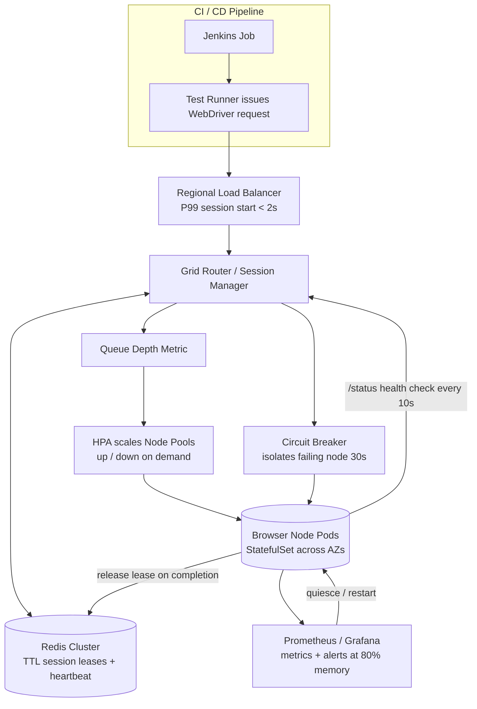

| Difficulty | Channel | Tags |
|---|---|---|
| advanced | system-design | selenium, webdriver, grid |

Late in 2014, Expedia found itself buried under its own test suite: roughly 9,000 UI automation tests running across 350+ Jenkins jobs, with real browsers spawning directly on build executors [1]. The release pipeline crawled, and every new microservice made the backlog worse. This is the story of how that team rebuilt the mess into a distributed grid running 150,000+ tests a day — and the blueprint you need when your own grid must hit 10,000 concurrent sessions with 99.9% uptime, zero memory leaks, and node failures that fix themselves.

---

> ### Real-World Case — Expedia Group
>
> Until late 2014, Expedia ran ~9,000 UI automation tests across 350+ Jenkins jobs, executing browsers directly on Jenkins executors. Test suites took hours to complete, choking the release pipeline and growing worse as microservices multiplied the number of apps and CI/CD pipelines each needing their own test runs.
>
> | | |
> |---|---|
> | **Challenge** | They needed to scale Selenium Grid to run thousands of concurrent UI test sessions across many teams' pipelines, while keeping costs under control and avoiding flaky tests under load. The goal was to complete an entire test run in roughly the time of the slowest single test case. |
> | **Solution** | They built SeleniumGridScaler, a Selenium Grid plugin that talks to the AWS EC2 API to auto-provision and terminate browser nodes on demand. The hub spins up c5.xlarge node instances (15 Chrome/Firefox sessions each) when tests queue up, terminates them at billing-boundary-aligned moments when idle, and shuts itself down after runs — with a reaper thread recycling orphaned nodes. Running 90+ hubs in AWS, tests finish in the time of the slowest test, and teams pay only for what they use. They later migrated to DA-Kube (Selenium Grid on EKS with Helm, KEDA-style scaling, and Traefik) for the same fleet. |
> | **Outcome** | 90+ SeleniumGridScaler hubs running 150,000+ tests daily and creating/terminating ~4,500 AWS nodes per day. Cross-browser vendor licensing for 1,000 parallel connections would cost ~$2.41 million, but the internal distributed automation runs everything for about $80,000/year — a ~97% cost saving while getting full parallel scale. |
> | **Lesson** | Autoscaling ephemeral browser infrastructure is the deciding factor for Selenium Grid at scale: pay-per-use node lifecycle management (spin up on demand, terminate at billing boundaries, reaper for orphans) delivers massive cost savings over per-connection vendor licensing, but only if the test infrastructure is scaled to match test concurrency — otherwise you just get expensive flaky tests. |

---

## Hook — A Friday afternoon in 2014: your pipeline is the bottleneck

Picture the scene: it is late 2014, and every deploy at Expedia has to wait for a UI test suite that takes hours to finish. Nine thousand tests, spread across 350+ Jenkins jobs, each one chewing through real browser instances on shared build executors [1]. The tests were not just slow — they were eating the machines alive, leaking memory and crashing the very executors that shipped the code. The stakes could not be higher: every hour your tests run is an hour your product is not live. And the problem was compounding, because every new microservice added another app, another pipeline, and another queue of tests. Something had to give. What the Expedia team did next turned into one of the most instructive automation infrastructure stories in the industry — and it holds the blueprint for a question that trips up thousands of engineering interviews: how do you design a Selenium Grid that can handle 10,000 concurrent sessions, survive node death gracefully, and never leak memory?

## Problem — The CI executor is slowly killing your suite

Before you can appreciate the fix, you need to feel the pain of the naive approach — and there is a good chance you are living it right now. Running browsers directly on CI executors is the default starting point for almost every team. Jenkins kicks off a job, the job fires up a real Chrome or Firefox window, runs a handful of tests, and tears it down. It works... until it does not. Each browser process can demand anywhere from 400MB to over 1GB of RAM, so a typical 8GB executor tops out at a handful of parallel sessions before the machine starts thrashing. The moment you share that executor with other jobs, you inherit every flaky test, every OOM-killed build, and every orphaned chromedriver process those jobs leave behind. That is where the memory leaks come from: crashed or forgotten sessions that never get cleaned up, piling up week after week [2]. You might think the answer is simply more executors. You might also think the answer is telling developers to write better teardown code. Both are traps — because neither gives you isolation, automatic recovery, or any visibility into what is actually leaking. The real problem is architectural, not behavioral: nobody built a lifetime, a lease, and a heartbeat for your test sessions. Keep that framing in the back of your mind, because it is the key to the whole chapter.

## Real-World Case — Expedia Group: 4,500 nodes a day

Building on the pain in the previous section, here is what a real engineering organization did when the naive approach stopped scaling. Expedia's team decided to stop babysitting static executors and instead treat every test run as a short-lived, disposable workload. They built a distributed automation platform with 90+ SeleniumGridScaler hubs that now execute 150,000+ tests every day, creating and terminating roughly 4,500 AWS nodes per day to match demand [1]. The scale is staggering: on peak, they could run 1,000 UI tests in about five minutes. Now for the plot twist that should make every CFO pay attention. Licensing cross-browser vendor infrastructure for 1,000 parallel connections would have cost roughly $2.41 million, while the internal distributed automation platform runs the entire test load for about $80,000 per year — a ~97% cost saving at full parallel scale [1]. The deeper lesson here is not "cloud is cheap." It is that ephemeral infrastructure, reclaimed automatically, completely changes the economics of testing — and it changes the availability math too. When nodes die, you do not mourn them; you spawn replacements. But here is the catch you have to confront before you copy this: with 4,500 nodes churned every day, session leaks and node failures are no longer rare events. They are the baseline. Consequently, your grid needs to treat cleanup and recovery as features, not afterthoughts.

## Deep Dive — The anatomy of a leak-proof, self-healing grid

With that baseline in mind, here is the architecture that makes 10,000 concurrent sessions with 99.9% availability actually achievable — and the math that proves it. The classic shape is a hub-and-node pattern, but running on Kubernetes instead of hardcoded servers. The hub routes traffic to browser nodes that live in StatefulSets spread across multiple availability zones, so a single region outage cannot take your grid down [4]. Session state does not live in the hub's memory — it lives in a Redis cluster with TTL-based expiration, connection pooling, and automatic cleanup [5]. Every session is a lease with an expiry, exactly the pattern Redis was built for [5]. The capacity math is refreshingly simple: at roughly 50 sessions per node and 2GB RAM per pod, 10,000 concurrent sessions means 200 nodes minimum and about 520GB of cluster memory once you add a 30% headroom buffer. Horizontal pod autoscaling then grows and shrinks that pool based on queue depth, so you never pay for idle capacity and you never hit a wall at peak demand [3]. Availability follows the same logic: Pod Disruption Budgets enforce a minimum 85% capacity even during maintenance [6], and health checks hit a /status endpoint every 10 seconds, instantly removing any node that fails three consecutive probes. Circuit breakers take that further by isolating a flaky node for a 30-second recovery window before it is allowed back into rotation [7]. Then come the edge cases that separate solid systems from legendary ones: leader election to prevent split-brain during network partitions, canary deployments with traffic splitting so a bad node release can never take down all 200 nodes at once, and init containers that scrub stale volumes before a pod is reused. Monitoring ties it together: Prometheus scrapes memory trends and session durations, and Grafana surfaces alerts before 80% memory becomes a crash [8][9]. You might assume memory leaks are a browser problem. The plot twist is that they are almost always an orchestration problem — a session that was never told to die, a driver that was never reaped, a volume that was never cleaned. Structure your platform so no component is ever reused without being washed first.

## Workflow — From request to reclaimed node: the session lifecycle

Armed with that architecture, here is the full journey of a single test session — the sequence this entire design exists to protect. The diagram below shows the flow visually. Step 1: the test runner in your CI pipeline issues a WebDriver request to the nearest regional load balancer, keeping P99 session initiation under 2 seconds. Step 2: the balancer forwards to a hub whose session manager checks Redis — if a lease slot is free, it claims it; if the queue is deep, the metric feeds the autoscaler. Step 3: horizontal pod autoscaling observes queue depth and scales node pods up or down accordingly [3]. Step 4: the session manager chooses the healthiest node using weighted round-robin, favoring nodes with capacity and fast response times. Step 5: the node starts a fresh browser, and a heartbeat begins renewing the session's TTL lease so long-running tests are never killed mid-run. Step 6: when the test finishes, an idempotent release deletes the lease, quiesces the browser, and returns the node to the pool; an init container wipes stale volumes before the next reuse. Step 7: if the node fails, the circuit breaker isolates it for 30 seconds, health checks eject it after three consecutive failures, and the Pod Disruption Budget holds 85% capacity while replacements spawn [6][7]. Step 8: new node images roll out via canary, a small slice of traffic at a time, so zero-day bugs never cascade. Notice what never appears in this flow: a human. Everything — scaling, cleaning, failing over — is automatic, which is exactly what a 99.9% target demands.

## Code Example — TTL leases in Python: the heartbeat that prevents leaks

The pattern that does the most work in that flow — and the one most interview answers gloss over — is the TTL lease. Here is a production-style implementation in Python that ties Selenium sessions to Redis leases, so a crashed runner can never leak a node forever.

```python
import threading
import time
import uuid

import redis
from selenium import webdriver
from selenium.webdriver.chrome.options import Options

LEASES = "grid:leases"  # sorted set: score = live sessions on each node
TTL_SECONDS = 30 * 60   # lease lifetime; a heartbeat renews it while alive

r = redis.Redis(host="session-store", port=6379, decode_responses=True)

class SessionLease:
    """A TTL-backed lease so a crashed runner can never leak a node forever."""

    def __init__(self, node: str, session_id: str):
        self.node = node
        self.session_id = session_id
        self.driver = None
        self._heartbeat = threading.Thread(target=self._renew, daemon=True)

    def _renew(self):
        # Refresh expiry at 60% of the TTL so long tests survive the grace period
        while True:
            r.expire(f"lease:{self.session_id}", TTL_SECONDS)
            time.sleep(TTL_SECONDS * 0.6)

    def start(self):
        options = Options()
        options.add_argument("--headless=new")
        self.driver = webdriver.Remote(
            command_executor=f"http://{self.node}:4444", options=options
        )
        self._heartbeat.start()
        return self.driver

    def release(self):
        # Idempotent teardown: safe to call twice, never double-reaps
        if self.driver is not None:
            self.driver.quit()
        r.zincrby(LEASES, -1, self.node)
        r.delete(f"lease:{self.session_id}")

def acquire(timeout_sec: int = 60):
    """Claim the lowest-load node; scale the pool instead of waiting forever."""
    deadline = time.monotonic() + timeout_sec
    while time.monotonic() < deadline:
        node = r.zrange(LEASES, 0, 0)  # lowest load first
        if node:
            lease = SessionLease(node[0], str(uuid.uuid4()))
            # nx=True guarantees only one runner wins the lease
            if r.set(f"lease:{lease.session_id}", "active", nx=True, ex=TTL_SECONDS):
                load = r.zscore(LEASES, lease.node) or 0
                r.zadd(LEASES, {lease.node: load + 1})
                return lease
        time.sleep(0.5)
    raise TimeoutError("No capacity - trigger the Kubernetes autoscaler")
```

Walk through the pieces one by one. The `acquire()` loop performs an atomic `SET ... NX EX` — the `nx=True` flag guarantees exactly one runner wins the lease, while `ex=TTL_SECONDS` gives Redis sole authority to evict the key if the owner disappears [5]. That single call is your entire memory-leak defense: no matter how badly a test crashes, the lease expires and the scheduler treats the node as available again. The heartbeat thread then renews that expiry at 60% of the TTL, so legitimate long-running tests are not murdered mid-assertion — a classic battle scar for teams that add TTLs without hearbets. The sorted set tracks live load per node, so the next `acquire()` picks the least-loaded worker, and `release()` is idempotent, meaning it is safe to run twice without double-reaping a driver. There is one honest caveat: the lease claim and the load increment are two separate commands, so a production system should wrap them in a small Lua script or Redis transaction to keep them atomic — a subtle race that only shows up under heavy concurrency.

## Lessons Learned — What the 97% cost saving actually teaches you

Bringing it all back to Expedia, what does a ~97% cost saving [1] really teach you? First, capacity and hygiene are the same problem. In a grid where 4,500 nodes churn daily, an orphaned session is not a bug — it is a business cost — because every node you leak is a node you pay for. Second, design lifecycle before load. Nobody got 99.9% uptime by writing a better try/finally block; they got it by making TTLs, heartbeats, and circuit breakers first-class citizens of the platform [7]. Third, availability is plural. One giant hub handling everything is a single point of failure; a multi-AZ mesh of disposable pods is not [4][6]. And fourth, watch the battlefield scars: teams forget the heartbeat and long tests get murdered mid-run; they update load and lease in two operations without a transaction and oversubscribe nodes; they reboot all nodes at once for "weekly cleanup" and drop to 0% availability; they set memory alerts at 95% and find out when the guest is already gone. If this feels overwhelming, you are not alone — but you do not need 4,500 nodes to start. Start small: put a TTL on your session store, add a /status heartbeat, isolate one bad node, and let your autoscaler get its first workout during a load test, not a production incident.

---

## Grid Session Lifecycle and Auto-scaling Flow



<details>
<summary><strong>Original Interview Question</strong></summary>

**Q:** Design a scalable Selenium Grid architecture to handle 10,000 concurrent test sessions with 99.9% uptime, ensuring zero memory leaks through automatic session lifecycle management, real-time monitoring, and graceful node failure recovery across multiple data centers?

**A:** Deploy Kubernetes cluster with auto-scaling node pools, Redis session store with TTL policies, Prometheus metrics for memory monitoring, circuit breakers for node isolation, and sidecar containers for session cleanup. Implement health checks, resource quotas, and rolling updates.

</details>

## Conclusion

The journey ends where it began: seven years ago Expedia's release pipeline was suffocating under 9,000 tests running on shared executors [1]. Today, the same class of architecture runs a leak-proof, self-healing grid that recycles thousands of nodes every day while holding the 99.9% line. The thread that connects both endpoints is one idea: treat every test session like a rental car with a return time, a heartbeat, and a trusted mechanic standing by. Apply that one insight tomorrow — put an expiry on your sessions, kill the node that fails three times, and let the platform clean up after itself. That is the difference between a grid you babysit and a grid that babysits itself.

---

## References

1. [Expedia Group incident report](https://medium.com/expedia-group-tech/distributed-automation-how-to-run-1000-ui-automation-tests-in-5mins-cf9a84ca32d1) — article
2. [Selenium Grid documentation](https://www.selenium.dev/documentation/grid/) — documentation
3. [Kubernetes Horizontal Pod Autoscaling](https://kubernetes.io/docs/tasks/run-application/horizontal-pod-autoscale/) — documentation
4. [Kubernetes StatefulSets](https://kubernetes.io/docs/concepts/workloads/controllers/statefulset/) — documentation
5. [How to Manage Keys and Values in Redis](https://www.digitalocean.com/community/tutorials/how-to-manage-keys-values-in-redis) — documentation
6. [Kubernetes Pod Disruptions and Pod Disruption Budgets](https://kubernetes.io/docs/concepts/workloads/pods/disruptions/) — documentation
7. [Circuit breaker design pattern](https://en.wikipedia.org/wiki/Circuit_breaker_design_pattern) — documentation
8. [Prometheus overview](https://prometheus.io/docs/introduction/overview/) — documentation
9. [Grafana documentation](https://grafana.com/docs/) — documentation

---

**Author:** Satishkumar Dhule — [GitHub](https://github.com/satishkumar-dhule) · [LinkedIn](https://linkedin.com/in/satishkumar-dhule) · [Website](https://satishkumar-dhule.github.io)
