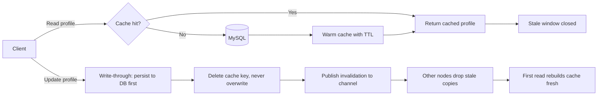

| Difficulty | Channel | Tags |
|---|---|---|
| beginner | backend | redis, memcached, cache-invalidation |

In 2005, Facebook's engineers were watching their MySQL fleet buckle under the weight of ordinary page loads — every timeline render was pulling thousands of key-value pairs from the database [1]. Their fix was a cache layer that grew into the largest distributed Memcached deployment in the world, serving billions of requests per second for over a billion users [1]. Now picture your own profile service, and ask the question every team eventually faces: when a user updates their profile, how do you keep the cache honest? This is the story of that single decision — and the trade-offs hiding inside it.

---

> ### Real-World Case — Meta (Facebook)
>
> Facebook's read-heavy application layer (user profiles, timelines, page composition) was hammering the MySQL infrastructure with everyday page loads routinely fetching thousands of key-value pairs. Starting in 2005 with Memcached installed on Apache web servers, Facebook built the largest distributed Memcached deployment in the world to keep pages fast.
>
> | | |
> |---|---|
> | **Challenge** | Keep cached profile data consistent with the database when users update their profiles. Two failure modes threatened correctness and availability: stale sets (an older client's write racing in after a delete and overwriting fresh data) and thundering herds (a delete on a hot key causing thousands of concurrent reads to collapse onto the database), plus read amplification from the simple delete-key invalidation strategy. |
> | **Solution** | Facebook used write-through 'delete on write' invalidation (invalidate the cache key immediately after the DB write commits, then lazily re-populate on read) rather than trying to keep cache and DB in synchronous lock-step. To make this safe they added a lease mechanism to Memcached: a cache miss returns a 64-bit token bound to the key, and Memcached only accepts the set if the key hasn't been invalidated since, blocking stale sets. Servers also rate-limit lease tokens to one per key every 10 seconds, so after a delete only a single client refills a hot key while others briefly wait, killing the thundering herd. They deliberately chose bare Memcached for simplicity over richer alternatives. |
> | **Outcome** | The system now serves billions of requests per second and stores trillions of items for over a billion users. For a set of thundering-herd-prone keys, the lease mechanism cut peak database query rate from 17K/s to 1.3K/s (a ~92% reduction), translating directly into smaller database provisioning and real cost savings. |
> | **Lesson** | You don't need strong transactional semantics to run a massive cache consistently — the plot twist is that Facebook chose the simplest tool (Memcached) and added a tiny lease primitive instead of pub/sub or complex invalidation graphs. Delete-on-write invalidation followed by lazy re-population is workable at extreme scale once you solve the race conditions (stale sets and thundering herds) at the cache layer itself. |

---

## Hook — a stale profile is a time machine you didn't build

Ever wondered why the profile picture you updated an hour ago still shows the old one on your friend's screen? It is not a conspiracy. It is stale cache — the quietest, most annoying failure mode you will ever debug. Here is the thing about caching: it hands you breathtaking performance right up until the moment truth and the cache disagree. Then every 'it worked in testing' confidence evaporates, and you are left standing at a whiteboard explaining why users see a version of themselves that no longer exists. Caching is a deal with the devil, and this article is the fine print.

## Problem — the read-heavy wall and the three-way disagreement

Every read-heavy service hits this wall eventually. A user profile service fields millions of reads per second and only a sprinkle of writes, so the instinct is to park hot profiles in a cache and save the database. But that instinct trades consistency for speed, and the invoice arrives the moment a user edits their profile. Suddenly three layers disagree: the database holds the new truth, the cache still carries yesterday, and the user stares at a ghost. Worse, when a popular profile is edited, the invalidation itself creates a stampede — every concurrent read sees a miss, and a thundering herd of queries collapses onto the database all at once [1]. Sound familiar? You are not alone.

## Real-World Case — Meta (Facebook)

Facebook didn't stumble into caching — it was dragged there by its own popularity. As the team documented in their NSDI '13 paper, the read-heavy application layer (user profiles, timelines, page composition) was hammering MySQL so hard that routine page loads fetched thousands of key-value pairs from the database [1]. Starting in 2005 with Memcached installed directly onto Apache web servers, Facebook built the largest distributed Memcached deployment in the world, eventually serving billions of requests per second and storing trillions of items for over a billion users [1]. But here is the number that should stop you mid-sip of your coffee: for a set of thundering-herd-prone keys, their lease mechanism cut peak database query rate from 17,000 queries per second to 1,300 — a roughly 92% reduction that translated directly into smaller database provisioning and real cost savings [1]. Caching decisions at scale are not academic; they literally print (or burn) infrastructure budgets.

## Deep Dive — choosing your consistency poison

Building on that story, the real question becomes: which invalidation strategy keeps the cache honest without melting the database? The two classic patterns are cache-aside and write-through. With cache-aside, reads check the cache first, fall through to the database on a miss, and warm the cache with a TTL — lazy loading that keeps cold data out of memory. With write-through, every update writes to both the database and the cache together, trading per-request write cost for fewer stale reads [6]. Many developers pick one side and stop thinking; production systems actually blend both. The pragmatic recipe for a profile service: cache-aside for reads, and on update, delete the cache key and write new data to the database and cache. Why delete instead of overwrite? Race conditions — an overwrite lets an old write land after a fresh one, while a delete forces the next read to rebuild from the database and closes the window. Then the TTL decision: too short and you rediscover cache misses, too long and users see ghosts all afternoon. Five to thirty minutes for profiles balances freshness against database pressure, but TTL is a safety ceiling, not a replacement for invalidation. That platform choice, however, is where the discussion gets interesting.

## Workflow — from write to world-consistent

Here is the end-to-end flow that survives a production day, shown in the Cache Invalidation Flow diagram below. The read path: check the cache, return on a hit, fall through to the database on a miss, then warm the cache with a TTL. The update path is where discipline matters: (1) persist the new profile in the database first, (2) delete the cache key — never overwrite in place, (3) broadcast an invalidation message so every node drops its stale copy, and (4) let the first read after the delete rebuild the cache fresh. And when a popular profile triggers a herd of simultaneous misses, add a lease-style stampede blocker — the exact technique Facebook's team perfected at scale to slash peak query rates by 92% [1]. Two subtleties save your weekend: deletes must always happen after the database write completes, and on Redis the invalidation publish should ride the same connection path as the write so no node misses the message.

## Code Example — write-through invalidation with redis-py

This implementation puts it all together: a cache-aside read, a single-writer lock that stands in for Facebook's lease mechanism, and a write-through update that deletes and broadcasts. Note the order — database first, delete second, publish third. Reverse it and you reintroduce the very staleness you are trying to kill.

## Lessons Learned — what tomorrow looks like

Pull back and the pattern is unmistakable. Delete, don't overwrite — in-place updates invite stale-write races, while deletes let the next read rebuild cleanly. TTL is insurance, not the strategy — it bounds how long a mistake survives, it does not forgive the mistake. Match the tool to the pattern — Redis earns its extra memory overhead when invalidation must coordinate across nodes via pub/sub and when persistence matters [2][4]; Memcached wins on pure key-value speed with lower memory overhead when nothing needs coordinating [3][5]. And the plot twist that keeps catching teams off guard: the cheap fix at small scale (invalidate-and-pray) is exactly the system that spirals into thundering herds at Facebook scale, so build the lease or a distributed lock in from day one [1][8]. If any of this felt overwhelming, you are not alone — every team writing their first cache believes it is trivial until it is 3am and profiles are wrong in seven places.

---

## Cache Invalidation Flow

<strong>Original Interview Question</strong>

**Q:** You're building a user profile service that caches frequently accessed profiles. How would you implement cache invalidation when a user updates their profile, and what trade-offs would you consider between Redis and Memcached?

**A:** Implement write-through caching with TTL-based expiration. On profile update, invalidate the cache by deleting the key and writing new data to both the database and cache. Redis offers pub/sub for automatic distributed invalidation, while Memcached requires manual coordination across nodes.

## Conclusion

Facebook's war story ends with a 92% cut in peak database query rate — not from cleverer hardware, but from the unglamorous discipline of deleting keys, ordering writes, and taming stampedes [1]. That is the takeaway to carry into tomorrow: your cache's consistency is decided in the order you put DB-write, key-delete, and broadcast, and by the tool you honestly chose for the job. So before you ship that profile service, go delete a key by hand, watch what your pub/sub does, and ask the question this whole journey has been building toward — what happens when every node misses at once? Start with cache-aside reads, write-through updates, and a lease to stop the herd, and you will have built the boring, battle-tested system Facebook took a decade to perfect.

---

## References

1. [Meta (Facebook) incident report](https://www.usenix.org/conference/nsdi13/technical-sessions/presentation/nishtala) — paper
2. [Redis](https://en.wikipedia.org/wiki/Redis) — documentation
3. [Memcached](https://en.wikipedia.org/wiki/Memcached) — documentation
4. [redis/redis — official repository](https://github.com/redis/redis) — documentation
5. [memcached/memcached — official repository](https://github.com/memcached/memcached) — documentation
6. [Amazon ElastiCache — caching strategies and best practices](https://docs.aws.amazon.com/AmazonElastiCache/latest/red-ug/Strategies.html) — documentation
7. [MDN — HTTP caching](https://developer.mozilla.org/en-US/docs/Web/HTTP/Caching) — documentation
8. [DigitalOcean — how to implement caching in Node.js using Redis](https://www.digitalocean.com/community/tutorials/how-to-implement-caching-in-node-js-using-redis) — documentation
9. [RFC 9111 — HTTP caching](https://datatracker.ietf.org/doc/html/rfc9111) — paper

---

**Author:** Satishkumar Dhule — [GitHub](https://github.com/satishkumar-dhule) · [LinkedIn](https://linkedin.com/in/satishkumar-dhule) · [Website](https://satishkumar-dhule.github.io)
