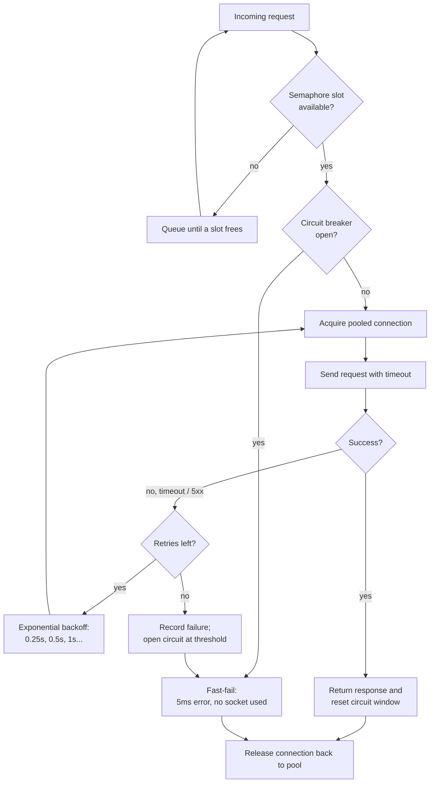

| Difficulty | Channel | Tags |
|---|---|---|
| advanced | backend | asyncio, aiohttp, concurrency |

The most underappreciated fact about Netflix's 2011 API troubles is not the scale — it is the trigger. Around 2011, Netflix's API aggregated hundreds of backend services and handled over a billion requests per day, and yet a single obscure dependency turning slow could drag the entire subscriber experience down with it [1]. Hung connections, thread-starvation, cascading failure. That is what happens when shared resources have no guardrails — and it is precisely the situation your aiohttp client creates whenever you hold connections open and let one slow upstream take the whole process down with it.

---

> ### Real-World Case — Netflix
>
> Around 2011, Netflix's API aggregated hundreds of backend services, processing over a billion requests per day. When one dependency—even an obscure one—became slow or failed, its hung connections and thread-starved request handling could trigger cascading failures that degraded the entire API for every subscriber.
>
> | | |
> |---|---|
> | **Challenge** | Prevent a single failing or latent downstream dependency from cascading failure across the whole API. They needed to bound concurrent in-flight calls per dependency (a pool/semaphore), fail fast on timeouts instead of retrying into a dying service, and keep serving via graceful degradation while the dependency recovered. |
> | **Solution** | Netflix built and open-sourced Hystrix, the influential fault-tolerance library. It wrapped each remote call with per-dependency thread pools and semaphore isolation to cap concurrent connections, explicit timeouts, exponential-backoff-aware fail-fast behavior, and a circuit breaker that trips after ~50% errors over a rolling window and lets the system shed load so the failing service can recover instead of being pounded by retry loops. |
> | **Outcome** | At production scale, tens of billions of thread-isolated and hundreds of billions of semaphore-isolated command executions ran through Hystrix every day, with Netflix reporting a dramatic improvement in uptime and resilience. A single-latency incident that previously cascaded across the whole API was reduced to one tripped circuit dropping its share of traffic while every other circuit stayed healthy. |
> | **Lesson** | When a connection pool is saturated or a circuit trips, do the opposite of 'giving it more room'—increasing timeouts and pool sizes amplifies load into a failing service. Let the pool reject, the circuit short-circuit, and the client fail fast with a fallback; that sheds pressure and lets the underlying system recover. |

---

## Hook — When One Slow Dependency Takes Down Everything

It is the story that should be framed in every backend office. Around 2011, Netflix ran its API over a web of hundreds of backend services and handled over a billion requests per day [1]. The terrifying part about outages at that scale is the trigger: they rarely start with the service you would predict. They start with an obscure dependency nobody on-call has ever read the code of. One moment it is fine. The next, every subscriber's session is degraded because a single service decided to be slow [1].\n\nNow zoom out. You are running a tiny Netflix. Your Python service leans on a handful of upstreams — a database, a payment provider, an external API. And your aiohttp client? It is doing exactly what 2011-Netflix did: holding connections open, waiting on slow responses, and letting failure bleed sideways.\n\nHere is the stakes-setting thought: every request you send through a shared aiohttp.ClientSession is a promise to every other request sharing that event loop — if one hangs, they hang. Sound familiar? It happens when the pager goes off at 2am and the dashboard is all red.

## Problem — The Slow Dependency Tax

Here is the core problem stated bluntly: a shared connection pool is a communal resource, and communal resources fail badly when one tenant misbehaves. When a single API call hangs, it takes a slot in the pool. Enough hung calls and the pool is exhausted — now perfectly healthy calls queue behind ghost connections that will never return. The service keeps accepting requests, the event loop keeps spinning, and throughput collapses in slow motion. This is called connection-exhaustion in an async world, and it is the most common way a slow dependency turns into a full outage [5].\n\nThree things make the pain worse, and most developers skip each one in turn:\n\n- **Connection leaks** — sockets opened, never released, the pool slowly drowning in dead weight.\n- **No timeouts** — requests with an infinite default wait that block a slot indefinitely (HTTP semantics do not save you here) [8].\n- **Retry stampedes** — after the first timeout, every process retries at once, multiplying load on the already-suffering upstream until it tips over. This is how a small incident goes nuclear [4].\n\nIf that list hits home, here is the good news: the fix is not exotic. It is four patterns that compose into one resilient pool — a semaphore, exponential backoff, health checks, and the circuit breaker you are about to meet.

## Real-World Case — Netflix vs. Cascading Failure

Fast-forward to 2012, and Netflix published the post-mortem that became the blueprint for resilient services. At production scale, tens of billions of thread-isolated command executions and hundreds of billions of semaphore-isolated executions ran through Hystrix every day [1]. The framework existed for one reason: make single points of failure impossible to turn into platform-wide outages.\n\nThe pattern everyone remembers is the circuit breaker, borrowed from home electrical wiring. When a dependency crossed its failure threshold, Hystrix tripped that dependency's circuit and dropped its traffic fast, letting the faulty service cool down instead of being hammered. Every other circuit on the platform stayed healthy [1][3]. Martin Fowler later documented and popularized the pattern, and it remains the reference implementation teams still copy today [2].\n\nThe measured impact is the plot twist: a single-latency incident that previously cascaded across the entire API was reduced to exactly one tripped circuit dropping its share of traffic while every other circuit kept serving [1]. Not a rewrite. Not a pause-the-world maintenance window. An architecture with guardrails.\n\nHere is what teams get wrong when they try to replicate this: they reach for a multi-thousand-line framework. But the patterns at the heart of Hystrix — bounded concurrency, timeouts, circuit breaking, health checks — fit inside a few hundred lines for a single async client. Netflix's fix was built at its scale; the discipline behind the fix scales down to your service.

## Deep Dive — Four Patterns, One Resilient Pool

This leads to the real question: what does each pattern contribute, and where does it break?\n\n**The semaphore: concurrency, with an eject seat.** A Semaphore caps how many coroutines run at once [6]. The moment in-flight work hits the limit, new callers wait in a queue. The nuance most people miss: the semaphore protects the *caller*, not the upstream. It guarantees your process can never be reduced to unlimited concurrent hangs — with bounded concurrency, the damage of a slow dependency is bounded too [6].\n\n**Exponential backoff: retries as a decision where the worst possible answer is 'now'.** After a failure, retrying immediately is how stampedes start [4]. Backoff doubles the delay each attempt (0.25s → 0.5s → 1s), spreading retries apart and giving the upstream time to recover [4]. Pair it with a small retry budget — three attempts, not twenty — or you have invented a denial-of-service attack against your own dependency.\n\n**The circuit breaker: the plot twist.** When a service is failing, the last thing it needs is more traffic. A circuit breaker counts failures over a rolling window; breach the threshold, and the circuit opens — every new call fast-fails in milliseconds, with zero sockets wasted [2][3]. After a recovery window it half-opens to let one probe through: success closes the circuit, failure re-opens it [3].\n\n**Keepalive and warm pools: the free lunch.** aiohttp's TCPConnector reuses sockets, which cuts out the TCP+TLS handshake cost on every request — but only if the app holds one long-lived ClientSession and reuses it [7]. Recreating sessions per request is the quiet performance killer nobody profiles for.\n\nHere is the trade-off table that never makes it onto the whiteboard:\n\n| Pattern | Solves | Costs |\n| --- | --- | --- |\n| Semaphore | Unbounded concurrency inside the process [6] | Queuing; callers wait when saturated |\n| Timeout | Hung connections that never return [8] | Slow-but-valid requests get abandoned |\n| Backoff | Retry stampedes [4] | Added latency on the recovery path |\n| Circuit breaker | Cascade failures across the platform [2] | Some traffic intentionally receives errors |\n\nThe insight that ties it together: resilience is not about preventing failure — it is about shrinking the blast radius and controlling the speed of recovery. Every pattern above is a knob on one of those two dials.

## Workflow — Six Steps to a Pool That Degrades Gracefully

Theory alone never survives contact with production. Here is the six-step workflow that turns the theory into behavior your service can actually follow [5].\n\n1. **Bound the pool.** Size the connection pool to realistic concurrency and guard in-flight work with a semaphore so saturation cannot spin out of control [6].\n2. **Put a timeout on everything.** Set a client-level total timeout for every request; no timeout means a hung connection owns its slot forever [7][8].\n3. **Retry with a plan.** On timeout or a 5xx, back off exponentially and cap the attempt count [4].\n4. **Add the circuit breaker.** Track failures in rolling windows and walk the closed → open → half-open → closed cycle [2][3].\n5. **Health-check and prune.** Verify pooled connections periodically, drop dead sockets, and reuse one session so keepalive stays warm [7].\n6. **Shut down cleanly.** On application shutdown, drain in-flight requests and close the session — a leaked ClientSession is a sleepless night for the next on-call engineer [5].\n\nThe diagram in Figure 1 shows how these compose at request time. Watch the fast-fail path: when the breaker is open, a request dies instantly instead of queueing behind a service that is already down. That single arrow is the difference between a 30-second hang and a 5-millisecond error.

## Code Example — A Production-Flavored ConnectionPoolManager

Time to make all of this concrete. The class below is a production-flavored ConnectionPoolManager: it ties the semaphore to the connector limit, wraps every request in a timeout, retries with exponential backoff, tracks failures through a circuit breaker, and shuts down cleanly. It is deliberately dependency-free beyond aiohttp, so the patterns stay visible.\n\nA few design decisions worth calling out before the walkthrough:\n\n- The **semaphore value is the pool size** — one source of truth instead of two values that drift apart.\n- The **circuit breaker returns a fast error** instead of retrying silently, so the failure surfaces quickly and honestly [2][3].\n- **record_success() resets the window**, preventing an old failure from haunting a healthy service.\n- The **retry budget is small** (default 3 attempts) — enough to ride out a blip, not enough to start a stampede [4].\n\nNow the code, with commentary in the comments.

## Lessons Learned — What to Do on Monday Morning

This brings the journey full circle. That one slow dependency in 2011 that cost Netflix its platform-wide stability? The fix was not faster hardware or a bigger pool — it was a set of small guardrails that shrank the blast radius of any single failure [1]. You can adopt the same discipline for a single aiohttp client, and the compounding effect in any shared service is real.\n\nThe takeaways, in one breath:\n\n- **Timeouts first.** Nothing else matters if a hung request owns a pool slot forever [8].\n- **Bound concurrency.** A semaphore makes the worst-case damage of any dependency finite [6].\n- **Retry like a human.** Back off, cap attempts, and never retry an open circuit [4].\n- **Fail fast when you should.** A 5ms error beats a 30s hang every time [3].\n- **Isolate with bulkheads.** Give critical dependencies their own pools so one exhausted service never starves another [9].\n- **Close what you open.** Clean shutdown of the session prevents leaks that show up as tomorrow's mystery bugs [5].\n\nWatch out for the classic battle scars: disabling SSL verification on your connector to dodge a certificate error, sizing the pool in the tens of thousands without metrics to justify it, and — the most common one — measuring only happy-path latency while ignoring the tail that kills the pool.\n\nPick one pattern from this list and ship it this week. Most teams find **timeouts plus a semaphore** is the 80/20 fix; the circuit breaker is the upgrade that turns a stable service into a resilient one.

---

## Request Flow with Resilience Guardrails

<strong>Original Interview Question</strong>

**Q:** How would you implement a connection pool manager for aiohttp that handles graceful degradation under high load and connection timeouts?

**A:** Implement a connection pool manager for aiohttp using a semaphore to limit concurrent connections, exponential backoff for retrying failed requests, and circuit breaker pattern to gracefully degrade under high load and connection timeouts.

## Conclusion

So, back to that pager at 2am. The dashboard is red because one dependency got slow and your pool is drowning in connections that will never come back. It does not have to be that way. Netflix proved at a billion requests a day that the answer to 'what happens when a service fails' is not better luck — it is a semaphore, a timeout, exponential backoff, and a circuit breaker wired into the connection pool [1]. You do not need a framework: you need the discipline, and about one hundred lines of Python.\n\nThe one insight to share with your team tomorrow: **resilience is not about making services fail less — it is about making them fail small.** Build a pool that degrades gracefully, and the pager stays silent.

---

## References

1. [Netflix: Making the Netflix API More Resilient (Hystrix)](https://techblog.netflix.com/2012/11/hystrix.html) — blog
2. [Martin Fowler: CircuitBreaker](https://martinfowler.com/bliki/CircuitBreaker.html) — blog
3. [Circuit breaker design pattern - Wikipedia](https://en.wikipedia.org/wiki/Circuit_breaker_design_pattern) — documentation
4. [Exponential backoff - Wikipedia](https://en.wikipedia.org/wiki/Exponential_backoff) — documentation
5. [Python asyncio: Coroutines and Tasks](https://docs.python.org/3/library/asyncio-task.html) — documentation
6. [Python asyncio: Synchronization Primitives (Semaphore)](https://docs.python.org/3/library/asyncio-sync.html) — documentation
7. [aiohttp Client Reference: ClientSession and TCPConnector](https://docs.aiohttp.org/en/stable/client_reference.html) — documentation
8. [RFC 9110: HTTP Semantics](https://datatracker.ietf.org/doc/html/rfc9110) — documentation
9. [Bulkhead pattern - Wikipedia](https://en.wikipedia.org/wiki/Bulkhead_pattern) — documentation

---

**Author:** Satishkumar Dhule — [GitHub](https://github.com/satishkumar-dhule) · [LinkedIn](https://linkedin.com/in/satishkumar-dhule) · [Website](https://satishkumar-dhule.github.io)
