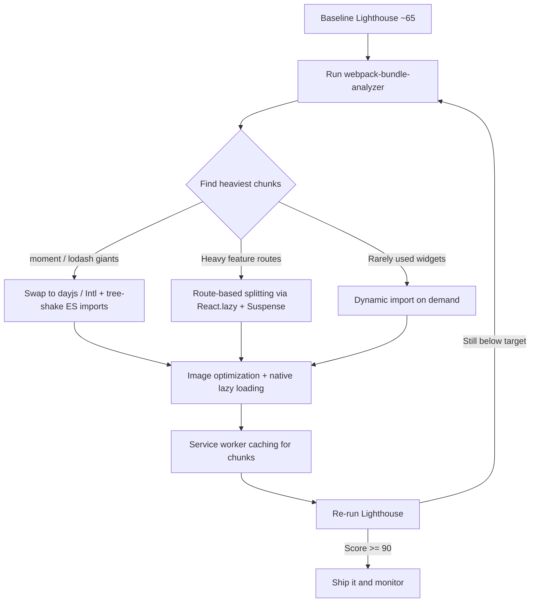

| Difficulty | Channel | Tags |
|---|---|---|
| intermediate | frontend | lighthouse, bundle, lazy-loading |

It looked like a perfectly normal React app. Then WeWork's engineers pointed a bundle analyzer at it during their Engineering Excellence Days and discovered that just three libraries — moment, moment-timezone, and lodash — accounted for more than half of the entire bundle, even though the apps only touched a tiny fraction of that code [1]. Swapping moment for dayjs delivered a 97-99% size reduction, and deleting moment-timezone in favor of three lines of the native Intl API eliminated over 100kB gzipped. The result: bundles roughly halved, page loads dramatically faster, and a blueprint for every developer staring at a Lighthouse score sitting around 65.

---

> ### Real-World Case — WeWork
>
> WeWork's internal React web apps were suffering from slow page load times, and the engineering team decided to dig into why during their quarterly Engineering Excellence Days. Running bundle analysis on their repositories, they discovered that just three libraries - moment, moment-timezone, and lodash - accounted for more than half of the entire bundle size, even though their apps only used a tiny fraction of those packages.
>
> | | |
> |---|---|
> | **Challenge** | HorSystematically reduce the JavaScript bundle size of their React apps to cut page load times, when the biggest offenders were ubiquitous 'standard' libraries that developers kept installing out of habit (moment for dates, lodash for utilities). |
> | **Solution** | They attacked the bundle in three surgical moves: (1) replaced moment (290.4kB minified, 72.1kB gzipped) with dayjs (6.5kB minified, 2.9kB gzipped) and date-fns for date formatting; (2) deleted moment-timezone entirely - roughly 1MB minified / 111.4kB gzipped - by using the native browser Intl API (Intl.DateTimeFormat().resolvedOptions().timeZone) to autofill the user's timezone, since it was being used for nothing else; and (3) discovered lodash tree-shaking was silently failing because their named imports (import { map, times } from 'lodash') still bundled the whole library, so they switched to per-function imports like import map from 'lodash/map'. |
> | **Outcome** | The React apps' bundle size was roughly halved, directly decreasing page load times. Individual wins: a 97-99% size reduction swapping moment for dayjs, and over 100kB gzipped eliminated by removing moment-timezone in favor of the three-line Intl API - without dropping any functionality. |
> | **Lesson** | The biggest bundle wins come from auditing dependencies, not clever webpack config - the 'bloat' in most React apps is a small number of heavy, over-imported libraries serving only a fraction of their features. Also, tree-shaking is not guaranteed by named imports alone; verify bundle composition with analyzer tools, and prefer small, focused libraries (or native browser APIs) over kitchen-sink packages. |

---

## Hook — The moment a bundle showed its true size

Picture the scene: a calm quarterly engineering week, no fires burning, time finally set aside for the technical debt everyone keeps postponing. WeWork's team pointed webpack-bundle-analyzer at their internal React apps and watched the report render like a slow-motion horror movie [1]. Three bars dwarfed everything else — moment, moment-timezone, lodash — swallowing more than half of the total bundle weight. Here is the uncomfortable part: the apps used maybe 2% of what those libraries shipped. Sound familiar? Most developers have that one dependency in package.json they are scared to touch because 'removing it feels risky.' The plot twist is that keeping it is the real risk. For a benchmark reference point: a scoring tool like Google Lighthouse calls this kind of payload an opportunity — not an inconvenience [9].

## Problem — The silent tax of the import-everything habit

Here is the thing about modern bundlers: they are obedient. You import what you need, and they pack what you asked for — including every byte your imports transitively drag along. A 2.1MB JavaScript bundle with a 4.2-second Time to Interactive is not a mysterious act of God; it is the accumulated consequence of hundreds of small decisions. `import moment from 'moment'` instead of the three-line Intl call. `import _ from 'lodash'` for a single `_.get`. No route-based splitting, no lazy loading, everything eagerly hydrated on first paint. The stakes are concrete. Time to Interactive is the moment your app is actually usable, and every 100ms of delay measurably erodes engagement, conversions, and even how authoritative your site feels. Nevertheless, the tragedy is that none of this is visible in day-to-day development — your dev server is local, your network is fast, and your machine is warmed up. The bundle grows quietly while you ship features, and the bill arrives later, on a slow phone, over LTE, on a Tuesday.

## Real-World Case — WeWork

WeWork's engineering team did not set out to write a legendary blog post; they set out to make their internal apps feel fast. During their Engineering Excellence Days, they ran bundle analysis across repositories and confronted the numbers: moment, moment-timezone, and lodash together outweighed everything else their apps actually needed [1]. Einsteining their way through it, they replaced moment with dayjs — a drop-in, date-frozen, 2kB library — and realized a 97-99% reduction in that single area with zero functionality lost. They then deleted moment-timezone entirely, replacing it with the native Intl API, which killed over 100kB gzipped. Before long, bundle sizes were roughly halved and page load times fell accordingly. Industry peers have repeated this lesson with different flavors: Stripe, GitHub, and Shopify engineering teams have all written about removing heavy date and utility libraries in favor of leaner equivalents. This is a story you can reproduce within a single sprint, because the static analysis that drives it is cheap and the fixes are surgical.

## Deep Dive — Analysis first, surgery second

Before writing a single line of lazy-loading code, get the ground truth. webpack-bundle-analyzer renders your boxed bundle as an interactive treemap, showing which dependencies are the real monsters [6]. This changes the whole conversation: instead of guessing, you now know whether your problem is a heavyweight dependency (moment), a code-duplication problem (lodash imported whole), or a structural issue (an entire dashboard hydrated eagerly). You then have four levers, and picking the right combination matters:

- Tree shaking: enable ES module imports (`import { get } from 'lodash-es'`) so bundlers can drop unused exports [7].
- Route-based splitting: break the app into chunks per route so users only pay for the screen they visit [2].
- Dynamic imports: load non-critical features — charts, editors, rich modals — on demand using the `import()` syntax [4].
- Dependency swaps: replace giants with tiny equivalents, the WeWork playbook.

Many developers think lazy loading is the whole answer, but the real trade-off is a ratio: split too granularly and you multiply network round-trips; split too coarsely and you never get below your biggest page weight. The sweet spot usually lands around 100-250kB per chunk for fast-loading pages on typical mobile connections.

## Workflow — From Lighthouse 65 to 90+ in five steps

You do not need a week off or a rewrite to move the needle. This is a repeatable loop, and the honest secret is that step one is measurement, not meditation:

1. **Baseline**: run Lighthouse, note the current score and Time to Interactive [9].
2. **Analyze**: run webpack-bundle-analyzer; rank the top offenders by gzipped weight [6].
3. **Split**: wrap routes and heavy components in React.lazy + Suspense [2].
4. **Trim**: swap or remove the giants — moment→dayjs, moment-timezone→Intl, lodash→native methods [7].
5. **Verify**: re-run Lighthouse, compare, and ship only if the new score holds.

That feedback loop is exactly what the diagram below describes — and it is the same loop WeWork ran, with the same payoffs [1].

## Code Example — Splitting the monolith, one lazy route at a time

Concretely, this is what the transformation looks like in a real React app. Start with route-based splitting so each screen downloads on demand [2], wrap everything in Suspense so the UX never flashes empty [3], and isolate heavy widgets with an error boundary so a failed dynamic import does not white-screen the app [4]. Notice the deliberate choices: `default` exports everywhere (React.lazy requires them), a named export for utilities, and an array-based lazyMap so growing the app stays boring and predictable. Adding a new route should take one line, not a refactor.

## Lessons Learned — What every optimization journey teaches

If one idea deserves to be carved into the team's README, it is this: measure before you guess. Developers are consistently wrong about where their bundle weight lives, and the analyzer costs nothing to run [6]. Second, lazy loading is a multiplier, not a silver bullet — splitting a 2MB app that is actually 1.9MB of moment is theatre. Kill the giants first, then split what remains [1]. Third, watch out for the classic battle scars: forgetting that React.lazy needs default exports, splitting so aggressively that you create waterfall requests, or leaving non-critical features eagerly imported and quietly undoing your work. And remember that today's trade-offs are not permanent; revisit the workflow every few quarters as dependencies evolve. The pattern that wins in production is the loop itself: baseline, analyze, split, trim, verify. Run it once and your app gets faster; run it on a schedule and it stays fast.

---

## Performance Optimization Workflow

<strong>Original Interview Question</strong>

**Q:** You're tasked with improving a React app's Lighthouse performance score from 65 to 90+. The bundle size is 2.1MB and Time to Interactive is 4.2s. What specific steps would you take to optimize the bundle and implement lazy loading?

**A:** Implement code splitting with React.lazy() and Suspense, analyze bundle composition with webpack-bundle-analyzer to identify largest chunks, remove unused dependencies and optimize imports, add dynamic imports for heavy components and third-party libraries, implement route-based splitting for better initial load times, and utilize tree shaking with proper ES module configuration.

## Conclusion

The moral of the story is deceptively simple: the fastest code is the code you never ship. WeWork proved that a bundle halved is a very achievable Tuesday, not a quarter-long initiative — analyze first, kill the giants, then split what remains [1]. Tomorrow morning, run the workflow once: baseline Lighthouse, open bundle-analyzer, pick the single heaviest chunk, and replace, trim, or defer it. Repeat weekly and your Lighthouse 65 becomes a 90 you can actually defend. Share that one insight with your team: measure before you guess — because in performance, intuition is the first thing you should ship without.

---

## References

1. [WeWork incident report](https://engineering.wework.com/how-we-halved-the-bundle-size-of-our-react-apps-to-decrease-page-load-times-2c33310bb99) — article
2. [React.lazy — React documentation](https://react.dev/reference/react/lazy) — documentation
3. [Suspense — React documentation](https://react.dev/reference/react/Suspense) — documentation
4. [Dynamic import() — MDN JavaScript reference](https://developer.mozilla.org/en-US/docs/Web/JavaScript/Reference/Operators/import) — documentation
5. [Code Splitting — webpack documentation](https://webpack.js.org/guides/code-splitting/) — documentation
6. [webpack-bundle-analyzer — GitHub](https://github.com/webpack-contrib/webpack-bundle-analyzer) — documentation
7. [Tree shaking — MDN Web Docs glossary](https://developer.mozilla.org/en-US/docs/Glossary/Tree_shaking) — documentation
8. [Lazy loading — MDN web performance guide](https://developer.mozilla.org/en-US/docs/Web/Performance/Lazy_loading) — documentation
9. [Lighthouse — Chrome for Developers](https://developer.chrome.com/docs/lighthouse/) — documentation
10. [Intl — MDN JavaScript reference](https://developer.mozilla.org/en-US/docs/Web/JavaScript/Reference/Global_Objects/Intl) — documentation

---

**Author:** Satishkumar Dhule — [GitHub](https://github.com/satishkumar-dhule) · [LinkedIn](https://linkedin.com/in/satishkumar-dhule) · [Website](https://satishkumar-dhule.github.io)
