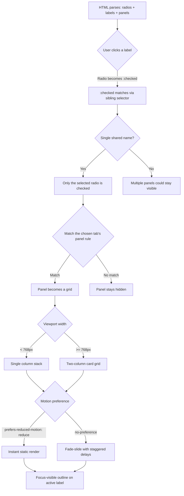

| Difficulty | Channel | Tags |
|---|---|---|
| beginner | frontend | css, flexbox, grid, animations |

In 2012, BBC News looked at its own front page and saw the problem hiding in plain sight: around 700 kilobytes and 113 requests reaching a chaos of devices — feature phones, aging BlackBerries, text browsers, and Internet Explorer versions older than some of the engineers on the team [1]. The rebuild that followed, built on a philosophy the team called 'cutting the mustard', delivered the core experience in roughly 7 requests and 21 kilobytes to every visitor — a 97% payload reduction [1]. Here is the twist that matters for you today: the lesson was never about abandoning features, it was about making core experiences work with fewer moving parts. And one of the most useful places you can apply that thinking is a tiny, forgotten corner of CSS: the humble radio button.

---

> ### Real-World Case — BBC
>
> In 2012, BBC News rebuilt its site responsively and discovered a bewildering range of browsers and devices they had to serve — feature phones, old BlackBerries, JS-disabled users, ancient IE, even text browsers. Supporting all of them with the existing 'shoehorn everything into every browser' approach was making the site slow and unmaintainable.
>
> | | |
> |---|---|
> | **Challenge** | They needed a content-complete news experience on every device/browser without shipping polyfills, huge JavaScript libraries, or giant payloads — and without resorting to fragile user-agent sniffing. |
> | **Solution** | Tom Maslen's 'cutting the mustard' pattern: a single line of JavaScript that checks `querySelector`, `localStorage`, and `addEventListener`. Every user first got a pure HTML+CSS 'core experience' (no JS at all), and only browsers that passed the three feature checks got the enhanced JavaScript UI layered on top — the exact progressive-enhancement philosophy that underpins CSS-only interactive components like radio-input tabs, where content and basic interactivity work with zero JavaScript and JS just adds polish. |
> | **Outcome** | The core experience delivered the front page in ~7 requests and ~21kb to every visitor, versus the old desktop site at ~500kb/77 requests without JS and ~700kb/113 requests with JS — a ~97% payload reduction. The technique freed the team from jQuery and polyfills, and later scaled to a single codebase serving 30 languages. |
> | **Lesson** | Build the HTML+CSS-only experience first and treat JavaScript as an enhancement, not a dependency — the fastest page is the one that never downloads a script, and cutting unneeded JS is the cheapest performance and resilience win available. |

---

## Hook — The build that worked on your machine, and nowhere else

Picture the scene: weeks of polish, a design-system docs page that looks flawless on your retina display, and then a stakeholder opens it on a locked-down office iPad. The tabs render. The tabs do nothing. The JavaScript bundle either never arrived or arrived too late, and the whole component is just... dead. Sound familiar? This is the moment every frontend developer eventually meets — the realization that a page is a contract with every browser and device you cannot see, from feature phones and aging corporate BlackBerries to screen readers and text browsers.

Many developers responded to that chaos by piling on more tooling. The BBC responded differently. In 2012, after rebuilding its news site for the responsive era, the team faced the same bewildering device zoo and decided that the old 'shoehorn everything into every browser' approach was the disease, not the cure [1]. They built a core experience that shipped to everyone and layered enhancements on top — and at the heart of that philosophy is a trick so small you may have already typed it a thousand times without noticing: the HTML radio button.

## Problem — The dependency trap hiding inside your components library

Tabs are the workhorse of documentation. Pattern libraries, API references, version pickers — they all run on tab strips, and the default instinct is to reach for a component library the moment interactivity appears in the spec. Here is the thing though: every dependency you add is payload, startup time, and one more place to break. Articles on progressive enhancement have been making this exact argument for years [8], yet most tab panels still ship a runtime along with the layout.

The challenge for this article is specific and revealing: build a tab panel for a design-system docs page using only HTML and CSS. Radio inputs switch the tabs. Desktop shows a 2×2 grid of cards under each tab; mobile collapses to a single column. Every card needs a fixed 16:9 image area, a title, and a short meta line. Add a subtle entrance animation with a stagger, keep focus-visible outlines, and make sure prefers-reduced-motion is respected.

Why would anyone want that? Because docs pages are visited from the strangest browsers on the internet — locked-down corporate machines, CI environments, in-app webviews, and accessibility tools. When the site behind your docs is slow, every team that depends on it slows down with it. The stakes are quiet but real, and they are the exact stakes BBC News confronted at page scale in 2012 [1]. So the real question is not 'can CSS do this?'. It is 'what can you ship when the browser does the work?'

## Real-World Case — BBC News cuts the mustard against the device zoo

In 2012, BBC News rebuilt its site responsively and discovered a problem hiding in plain sight: a bewildering range of browsers and devices that all had to be served — feature phones, old BlackBerries, JS-disabled users, ancient Internet Explorer, even text browsers [1]. The existing approach, best described as shoehorning everything into every browser, had made the site slow and deeply unmaintainable.

The team's answer was a philosophy they called cutting the mustard. Instead of serving identical richness to everyone, they defined a small capability test — a handful of modern baseline features — and split traffic into buckets. Browsers that passed got the full experience. Browsers that failed got a well-designed core rather than a broken page [1].

The quantified impact still holds up today. The old desktop site weighed roughly 700kb across about 113 requests with JavaScript enabled, or around 500kb across 77 requests without it. After the rebuild, the core experience delivered the front page in roughly 7 requests and about 21kb to every visitor — a payload reduction of around 97% [1]. The technique freed the team from jQuery and a pile of polyfills, and it eventually scaled to a single codebase serving content in 30 languages [1].

Notice what was not in that release: a list of clever new widgets. The win came from defining what 'core' means and protecting it fiercely — the same discipline responsive design has preached since its earliest days [9]. So how does a news site's 97% payload cut translate into your design system's docs page? The answer is a component-level version of the same philosophy: interactivity that lives inside the browser's own machinery instead of inside your bundle.

## Deep Dive — A radio button is secretly a state machine

The mechanism is a state machine hiding in plain sight. A set of radio inputs shares one name attribute, which guarantees that only one can be :checked at a time [2]. Because inputs and labels are siblings, a click anywhere on a label checks its radio — and CSS can reach forward from that input using the general sibling combinator (~) to reveal the matching panel [7]. The interaction state lives in the browser, not in a JavaScript object, so it survives slow loads, blocked scripts, and text browsers alike.

Layout is where CSS Grid earns its keep. A panel becomes a grid with grid-template-columns: repeat(2, 1fr), which reads like plain English: two equal columns that fill the container [3]. A max-width media query swaps that for a single column under 768px, and each card's image area stays rock solid with aspect-ratio: 16 / 9 [4]. That single property replaces the padding-top percentage hacks developers wrestled with for years.

Many developers discover the real trade-off only after building both versions. Here is the honest comparison:

| Consideration | JavaScript tab component | CSS-only radio panel |
|---|---|---|
| New payload for the docs page | Framework + component JS | ~0 bytes |
| Behavior when JavaScript is blocked | Nothing renders | Fully interactive |
| Keyboard support | Depends on the library | Focusable radios, outlined labels |
| True ARIA tab semantics | Available | Needs extra JS for full parity |
| Animations | Component config | CSS-only, reduced-motion guarded |

Motion is the part teams usually get wrong. The subtle entrance animation uses a fadeSlideIn keyframe with staggered animation-delay values on the second, third, and fourth cards, so content resolves in a gentle cascade rather than a wall of text [10]. The clever part is the guard: the whole animation block sits inside @media (prefers-reduced-motion: no-preference), so users who ask for less movement get an instant, static render [5]. No feature detection required — the operating system already told the browser.

Here is the plot twist: visibility does not equal accessibility. Visually hiding the radio inputs while keeping them focusable is easy — position absolute, opacity 0. Keyboard users land focus on the input, which means the focus-visible outline has to be drawn on the associated label instead, via selectors like #tab-overview:focus-visible ~ label[for='tab-overview'] [6]. And one honest limitation: CSS-only radios are not a drop-in replacement for the full ARIA tab pattern, which expects role='tablist' and arrow-key navigation. For simple content switching on a docs page, the trade is worth it; for a complex widget, JavaScript remains the right tool.

⚠️ Watch Out for the classic selector trap: a blunt rule like .tabs input:not(:checked) ~ .panel { display: none; } hides too much once you have more than two panels, because every unchecked input's sibling selector applies to all subsequent panels. Keep your show rules explicit and per-panel.

💡 Insight: every ~0 bytes of runtime you avoid shipping is a small inheritance for every visitor on a slow connection or an old device. BBC's math at page scale was 97%; the component-scale version compounds on every page of your docs.

## Workflow — Six steps from rough mockup to keyboard-safe tabs

With the mechanism clear, the build becomes a tidy six-step process. Figure 1 below shows the full decision flow from label click to painted cards.

1. Skeleton — write the radios, labels, and panels as siblings inside one wrapper, with every radio sharing the same name attribute.
2. Hide, don't remove — visually hide the radio inputs but leave them focusable, so keyboard and screen-reader users still reach them.
3. Wire the state machine — one explicit rule per tab, like #tab-overview:checked ~ .panel-overview { display: grid; }, with panels hidden by default.
4. Build the grid — repeat(2, 1fr) on desktop, a single column under 768px, and aspect-ratio: 16 / 9 locked onto each card's image area.
5. Add guarded motion — wrap the fade and stagger in prefers-reduced-motion: no-preference so the animation never runs against a user's wishes.
6. Verify by keyboard — tab through with the :focus-visible outline visible, then run one screen-reader pass to confirm the radios announce correctly.

The decision-flow diagram below maps precisely onto those steps and onto the code in the next section: label activation flips the :checked state, the sibling selector exposes exactly one panel, grid decides the density, and the media queries shape the final render.

Figure 1 — see the diagram in the diagram field, rendered below the section.

## Code Example — The working tab panel, line by line

Now for the moment of truth — the complete pattern. The core deliverable is the HTML and CSS below, which ship to visitors with no JavaScript at all. The small JavaScript block is only the design system's demo harness: it injects the example markup and styles into the docs page so writers can preview the component without hand-maintaining a giant HTML file. That harness is build-time tooling — visitors never download it.

Walk through the five phases in order: hide the native controls, wire the state machine with explicit per-panel rules, build the responsive grid, guard the motion, and finish with visible keyboard focus.

## Lessons Learned — Ship the core, then add the mustard

Here is what BBC's 97% figure and a pack of radio buttons have in common: the most effective complexity-reduction strategy is not to duplicate effort, but to delete it at the source [1]. The component-scale version of that idea is choosing interactivity that lives in the browser rather than in your bundle.

🎯 Key Points to take back to your team:
- A set of radios with a shared name is a dependency-free state machine; :checked plus the sibling combinator gives you working panels with zero JavaScript [2][7].
- CSS Grid's repeat(2, 1fr) with a 768px fallback handles the responsive density, and aspect-ratio: 16 / 9 replaces the old image-ratio hacks [3][4].
- Motion is a preference, not a decoration — gates like prefers-reduced-motion: no-preference and :focus-visible are how you respect users instead of guessing [5][6].
- Know the limit: the full ARIA tabs pattern still wants JavaScript. Use the CSS-only approach where content switching is simple, and be honest about it.

Battle scars to avoid: blunt :not(:checked) sibling rules that hide more panels than intended, hiding inputs with display: none and silently breaking keyboard focus, and shipping entrance animations that ignore reduced-motion entirely.

Tomorrow morning, pick the most-visited interactive component in your design system and rebuild it without a single dependency. Measure payload before and after; the gap will be your argument. That is cutting the mustard at component scale — and the one insight to share with your team is this: the best feature you can add to an interface is the one you did not have to ship.

---

## CSS-only tab panel decision flow

<strong>Original Interview Question</strong>

**Q:** Build a CSS-only tab panel for a design-system docs page. Use radio inputs to switch tabs (no JavaScript). Desktop: a 2x2 grid of cards under each tab; mobile: single column. Each card has a fixed 16:9 image area, a title, and a short meta line. Add a subtle entrance animation with a stagger and keep focus-visible outlines; ensure prefers-reduced-motion is respected?

**A:** Use a set of radio inputs with a shared `name` attribute and corresponding `` elements for each tab section. The `:checked` state of each radio controls visibility of its associated panel via adjacent sibling selectors. Each panel renders a 2×2 card grid on desktop and collapses to a single column on mobile. Cards use `aspect-ratio: 16/9` for fixed image containers, with a title and meta line below.

## Conclusion

BBC News started with a front page drowning in 77 to 113 requests and hundreds of kilobytes, then landed on a 7-request, 21kb core that worked everywhere — because the team protected the core instead of over-engineering the edge cases [1]. Your design system can do the same at component scale. Start tonight with one tab panel rebuilt in pure CSS: radio inputs for state, the sibling combinator for visibility, CSS Grid for the layout, and reduced-motion-safe animation for delight. Install it, measure the payload delta, and let the numbers make the pitch for you. The browser already gave you the machinery — stop paying to ship a copy of it.

---

## References

1. [BBC incident report](https://responsivenews.co.uk/post/18948466399/cutting-the-mustard) — article
2. [:checked pseudo-class - CSS | MDN](https://developer.mozilla.org/en-US/docs/Web/CSS/:checked) — documentation
3. [CSS grid layout - CSS | MDN](https://developer.mozilla.org/en-US/docs/Web/CSS/CSS_grid_layout) — documentation
4. [aspect-ratio - CSS | MDN](https://developer.mozilla.org/en-US/docs/Web/CSS/aspect-ratio) — documentation
5. [prefers-reduced-motion - CSS | MDN](https://developer.mozilla.org/en-US/docs/Web/CSS/@media/prefers-reduced-motion) — documentation
6. [:focus-visible - CSS | MDN](https://developer.mozilla.org/en-US/docs/Web/CSS/:focus-visible) — documentation
7. [General sibling combinator - CSS | MDN](https://developer.mozilla.org/en-US/docs/Web/CSS/General_sibling_combinator) — documentation
8. [Progressive enhancement](https://en.wikipedia.org/wiki/Progressive_enhancement) — article
9. [Responsive web design](https://en.wikipedia.org/wiki/Responsive_web_design) — article
10. [CSS animations - CSS | MDN](https://developer.mozilla.org/en-US/docs/Web/CSS/CSS_animations) — documentation

---

**Author:** Satishkumar Dhule — [GitHub](https://github.com/satishkumar-dhule) · [LinkedIn](https://linkedin.com/in/satishkumar-dhule) · [Website](https://satishkumar-dhule.github.io)
