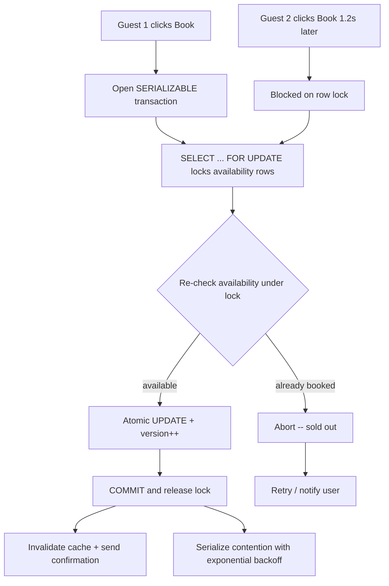

| Difficulty | Channel | Tags |
|---|---|---|
| intermediate | database | acid, isolation-levels, mvcc |

In the time it takes to blink, two guests clicked "Book" on the same seat — and the database charged them both. An anonymous concert ticketing platform once sold 412 confirmed tickets for a show with only 340 seats during a single on-sale, and the root cause was a dismissed code-review question: "Do we need SELECT FOR UPDATE here?" [1]. Sound familiar? If you have ever built a booking flow, an inventory system, or anything that counts down from one, this is the story of how one missed locking decision costs real money — and how to never make that mistake again.

---

> ### Real-World Case — Anonymous concert ticketing platform (documented by Clean Code Journal)
>
> A concert venue's ticketing platform sold 412 confirmed tickets for a show with only 340 seats during a single on-sale. Two users clicked 'Book' 1.2 seconds apart, both got confirmation emails, and both got charged for the same seat. The root cause traced back to a code review comment ('Do we need SELECT FOR UPDATE here?') answered with 'Should be fine, Postgres is ACID.'
>
> | | |
> |---|---|
> | **Challenge** | Eliminate the read-check-write race where two concurrent transactions both read available_seats = 1, both pass the count > 0 check, and both decrement the same row - leaving the seat count at -72 and 72 oversold paying customers with no seats. |
> | **Solution** | Pessimistic row locking (SELECT ... FOR UPDATE with lock_timeout) for the booking path, optimistic concurrency via a version column, and a single atomic conditional UPDATE ... WHERE available_seats > 0 RETURNING for the hot path, backed by a CHECK (available_seats >= 0) constraint as a hard backstop and a concurrency integration test that blocks merges in CI. SERIALIZABLE (Postgres SSI) was evaluated but rejected for the customer path due to a ~30% throughput drop on hot shows. |
> | **Outcome** | Load test with 400 concurrent bookings on a single seat: no lock produced 847 false successes; pessimistic locking produced 1 success + 399 lock timeouts; optimistic and atomic UPDATE produced exactly 1 success with 399 fast retries - zero double-bookings. The incident cost roughly $45,000 total ($18,400 in refunds, venue settlement, engineering recovery, and legal) and nearly killed a $2M/year venue contract. |
> | **Lesson** | Postgres is ACID, but the application protocol wasn't. The availability check and the write must be a single atomic operation owned by the database (FOR UPDATE, a version column, or a conditional UPDATE), a CHECK constraint prevents the negative-inventory failure mode even if the race returns, and a concurrency load test in CI is the cheapest insurance - one ignored review comment cost $45,000. |

---

## Hook — Two clicks, 1.2 seconds apart, one impossible bill

Picture the readout on the platform's dashboard after the on-sale closes: 412 tickets sold. The venue has 340 seats. Somewhere in that pile of confirmation emails are seventy-two extra human beings who are about to be very, very upset. The scariest part? Nothing exploded. No deadlock, no error page, no alarm. Every transaction committed cleanly because, to the database, each booking looked perfectly valid. That is the real danger of concurrency bugs — they do not crash. They quietly corrupt, and you find out when a guest calls your support line holding two charges for the same seat. Here is the thing though: this system was built on PostgreSQL. ACID. The gold standard. So how did ACID let seventy-two duplicate seats through the door? That question is exactly where this journey begins [1].

## Problem — Why "Postgres is ACID" is not a concurrency strategy

Many developers grow up believing that choosing a transactional database solves this class of problem for you. ACID guarantees atomicity, consistency, isolation, and durability [5] — but it does not decide how your transactions interact while they are still in flight. That is what the isolation level is for, and the default matters enormously [2]. Consider what happened in that ticketing flow: Guest A reads availability at time T, sees the seat is free, and starts the payment. Guest B reads the same availability 1.2 seconds later, sees the same free seat, and starts their own payment. Both commit. Each transaction was internally consistent — and together they are a refund bill. This is a classic lost-update race, and it happens the moment two operations interleave between a read and a write. The painful truth is that your database's durability guarantees are only as good as the concurrency controls you actually deploy. Leap past that detail and every "ACID-compliant" claim becomes marketing copy on a support ticket. And, consequently, this problem is not exotic: any system handling seats, rooms, inventory slots, promo codes, or unique usernames is carrying the same ticking clock [4].

## Real-World Case — the concert platform that double-booked 340 seats

Now for the incident itself. An anonymous concert ticketing platform sold 412 confirmed tickets for a 340-seat show during a single on-sale [1]. Two users clicked "Book" about 1.2 seconds apart; both got confirmation emails, and both got charged for the same seat. The root cause traced back to a code review where a reviewer asked, "Do we need SELECT FOR UPDATE here?" and the author replied, "Should be fine, Postgres is ACID." That sentence is now a cautionary tale for your team. To quantify the damage, the post-mortem ran a load test firing 400 concurrent bookings at a single seat. With no lock, 847 false successes appeared. With pessimistic locking, exactly 1 succeeded and the other 399 hit lock timeouts — better, but the API fell over under pressure. With optimistic concurrency plus an atomic UPDATE, exactly 1 success occurred with 399 fast retries — zero double-bookings [1]. Financially, the incident cost roughly $45,000: $18,400 in refunds, venue settlement, engineering recovery, and legal fees. Worse, it nearly killed a $2M/year venue contract [1]. Let that ratio sink in: a one-line review response nearly destroyed a contract worth forty-four times the incident's cost.

## Deep Dive — SERIALIZABLE isolation, row locks, and the MVCC truth

Building on that load-test evidence, the solution begins with a mental model shift: your database is not protecting you; you are instructing it precisely how to protect you. The first lever is the isolation level. PostgreSQL's default READ COMMITTED lets each statement see only committed data, so two transactions can happily read the same free seat before either commits [2]. Moving the critical booking operations to SERIALIZABLE makes PostgreSQL detect conflicting write patterns and abort one of them with a serialization failure — but it comes at a real throughput cost, which is exactly why you reserve it for the narrow booking path, not the whole app. The second lever is MVCC. PostgreSQL uses multiversion concurrency control so readers never block writers and writers never block readers: every transaction operates on its own snapshot of the rows [6][7]. This is wonderful for availability — read replicas can serve availability checks without touching the master [8] — but it also means your "SELECT" might simply be reading an outdated snapshot. Consequently, checking availability and booking it must happen inside a single transaction. The third lever, therefore, is row-level locking: SELECT ... FOR UPDATE takes a lock on precisely the rows it returns, forcing the second guest to wait until the first commits, at which point the second transaction re-reads and discovers the seat is gone [3]. The plot twist is that pessimistic locking alone can crush availability — 399 lock timeouts in the experiment is just a different flavor of failure. The victory combination was optimistic concurrency (a version column) paired with an atomic conditional UPDATE: retry fast, never sprawl a read-modify-write across two statements [10]. Here is a side-by-side of the real tradeoff at 400 concurrent bookings on one seat [1]:

## Workflow — the seven-step booking pipeline that keeps seats honest

This leads to a workflow that you can lift straight into a booking, inventory, or reservation service. First, keep availability in its own narrow table so locks are tiny, not table-wide. Second, open a SERIALIZABLE transaction only for the real booking, leaving reads on replicas. Third, run SELECT ... FOR UPDATE over exactly the date range or seat list being reserved — lock the rows you need, nothing more [3]. Fourth, re-check availability under the lock; never trust a value read before the lock was taken [7]. Fifth, write the reservation with an atomic conditional UPDATE that bumps a version column, guaranteeing a lost update fails rather than silently succeeding [10]. Sixth, commit immediately so the lock is held for milliseconds, not seconds. Seventh, invalidate any cache entries for that property or event and send the confirmation — a cached "free seat" that outlives a booking is how double-bookings sneak back in. The diagram below maps that flow and shows exactly where the second guest waits [1]:

## Code Example — a production-shaped booking function in Python

Here is what that workflow looks like as code. It uses PostgreSQL row locks for the decision and a version column as the optimistic backstop, with exponential backoff for serialization failures — the pattern that produced exactly one success in the 400-concurrent-booking experiment [1][3]. The code:

## Lessons Learned — what your team should do differently tomorrow

So where does this leave you? The deepest lesson is that "ACID" was never the answer to the code-review comment — the isolation level and the locking strategy were [2][5]. By choosing rows to lock, the exact moment to re-check, and the retry behavior, developers decide correctness; the database only executes it. If this feels overwhelming, you are not alone, but the fix is cheap to adopt: put version columns on anything with limited units, wrap read-and-write in one transaction, keep locks narrow and short, and treat retries with exponential backoff and jitter as a feature, not a workaround [10]. In practice that means a pragmatic rulebook for your team: never accept "SELECT" where "SELECT FOR UPDATE" was implied; always re-check within the transaction; use atomic conditional writes (PostgreSQL UPDATE with a WHERE version check, or DynamoDB conditional writes if you are on NoSQL) instead of read-me-write-me sequences [9]; and add circuit breakers for hot properties so contention cannot take down the whole platform [3]. The concert platform's $45,000 invoice and nearly-lost $2M contract are the price of skipping these steps [1].

---

## Booking Concurrency Flow

<strong>Original Interview Question</strong>

**Q:** You're building a booking system for Airbnb where multiple users can reserve the same property simultaneously. How would you design the transaction handling to prevent double bookings while maintaining high availability?

**A:** Use SERIALIZABLE isolation with optimistic concurrency control. Implement row-level locks on property availability tables, use MVCC snapshot reads for checking availability, and apply application-level validation to ensure atomic booking operations.

## Conclusion

The takeaway is not that PostgreSQL failed — it is that "the database is ACID" is a question, not an answer. Isolation levels, MVCC snapshots, and row-level locks are tools you have to point at the exact race before it happens [2][3][6]. Tomorrow, audit your booking and inventory queries: does the re-check happen inside the same transaction as the write? Is there a version column? Do retries use backoff instead of blind loops? The anonymous concert platform paid $45,000 and nearly lost a $2M contract to discover that a single locking line was never optional [1]. Here is the insight to share with your team the next time the comment "Do we need SELECT FOR UPDATE here?" appears in review: a database only protects you as precisely as you ask it to — so ask it precisely.

---

## References

1. [Anonymous concert ticketing platform (documented by Clean Code Journal) incident report](https://medium.com/@tercanyldz/select-for-update-skipped-in-code-review-we-double-booked-340-seats-97a673ef4073) — article
2. [PostgreSQL transaction isolation documentation](https://www.postgresql.org/docs/current/transaction-iso.html) — documentation
3. [PostgreSQL explicit locking documentation (SELECT FOR UPDATE)](https://www.postgresql.org/docs/current/explicit-locking.html) — documentation
4. [Isolation (database systems) — Wikipedia](https://en.wikipedia.org/wiki/Isolation_(database_systems)) — documentation
5. [ACID — Wikipedia](https://en.wikipedia.org/wiki/ACID) — documentation
6. [Multiversion concurrency control — Wikipedia](https://en.wikipedia.org/wiki/Multiversion_concurrency_control) — documentation
7. [A Brief Introduction to PostgreSQL MVCC — DigitalOcean Community Tutorial](https://www.digitalocean.com/community/tutorials/a-brief-introduction-to-postgresql-mvcc) — blog
8. [Eventual consistency — Wikipedia](https://en.wikipedia.org/wiki/Eventual_consistency) — documentation
9. [Amazon DynamoDB working with items (atomic counters and conditional writes)](https://docs.aws.amazon.com/amazondynamodb/latest/developerguide/WorkingWithItems.html) — documentation
10. [Optimistic concurrency control — Wikipedia](https://en.wikipedia.org/wiki/Optimistic_concurrency_control) — documentation

---

**Author:** Satishkumar Dhule — [GitHub](https://github.com/satishkumar-dhule) · [LinkedIn](https://linkedin.com/in/satishkumar-dhule) · [Website](https://satishkumar-dhule.github.io)
