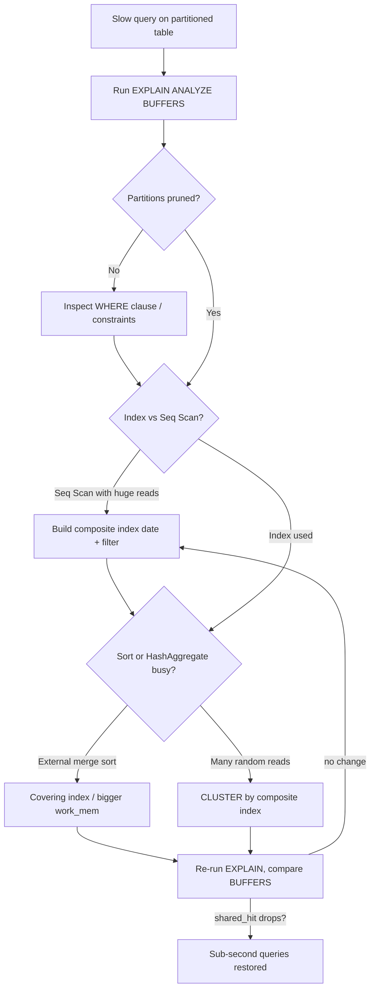

| Difficulty | Channel | Tags |
|---|---|---|
| intermediate | database | explain, query-plan, partitioning |

Windows engineers stare at a dashboard that must answer in milliseconds what lives in petabytes of telemetry — Microsoft's VeniceDB serves more than 6 million queries a day at sub-second p95 latency, and every one of them leans on the humble EXPLAIN plan [1]. Yet here is the darker truth hiding behind that success: partitioning alone never made any of those queries fast. When your 100M-row partitioned table turns a date-range filter into a minutes-long ordeal, the fix is rarely obvious. This is that story — starting exactly where Microsoft's did, inside the query plan.

---

> ### Real-World Case — Microsoft
>
> Microsoft's Windows telemetry flows in from hundreds of millions of devices, producing tens of terabytes of measure data daily. The 'Release Quality View' (RQV) dashboard - a critical daily tool for Windows engineers, PMs, and executives - needs sub-second answers over that data, and the backend (code-named VeniceDB) kept struggling to serve range queries as the store grew.
>
> | | |
> |---|---|
> | **Challenge** | Keep date/time-range queries sub-second over >1PB of time-series telemetry while ingesting ~10TB/day, serving >6M queries/day (p95 under 1s), and cleaning/aggregating bad raw measure data - all on PostgreSQL. Naive single-node Postgres with one giant time-series table couldn't prun or index its way out of petabytes. |
> | **Solution** | VeniceDB runs two >1000-core Citus (Postgres extension) clusters on Azure. Raw measures are stored in a table distributed by device ID AND partitioned by time on disk using Postgres' built-in partitioning, so date-range queries prune to only the relevant time partitions (planner proves them out via partition bounds) instead of scanning everything. Distributed INSERT..SELECT pre-aggregates incoming data by device into rollup/report tables carrying purpose-built indexes, and the team kept iterating on data model + indexing and even migrated Postgres 10->11 to cut cluster cost by 30%. |
> | **Outcome** | Petabyte-scale Postgres: >6M queries/day at sub-second p95 latency, ~10TB of new data ingested per day, tens of thousands of rollup tables with specialized indexes, and a 30% cost reduction from the Postgres 10->11 migration - replacing both a MapReduce cubing pipeline and a columnar cluster. |
> | **Lesson** | Time partitioning + partition pruning only gets you so far - at petabyte scale you must combine it with a distribution key that co-locates the hot data, pre-aggregation (rollups) so range queries hit tiny indexed tables instead of raw rows, and EXPLAIN-confirmed index choices per access pattern. '100M rows partitioned by date' is kindergarten; the same EXPLAIN checks (pruning, index vs seq scan, sorts/aggregates) scale to petabyte stores. |

---

## Hook — It Starts With One Slow Query

It starts the way every database horror story does: a dashboard that once felt instant starts to hang. One query — a simple `event_date BETWEEN '2024-01-01' AND '2024-01-31' AND status = 'completed'` — has ballooned into a 40-second coffee break on a 100M-row table you partitioned specifically so this would never happen.

Here is the twist nobody puts in the docs: partitioning only helps if the planner actually performs the pruning you think you configured [2]. When the pruning works and the query is still slow, the villain is rarely the partitions — it is everything that happens after the cut: the indexes, the sorts, the physical reads. More often than not, the real culprit wears a convincing disguise — a plan that looks healthy while quietly reading ten times more data than it needs.

## Problem — The Partitioning Promise and Its Fine Print

Partitioning is sold as a performance superpower, and at its best it is one. Thanks to partition pruning, the planner can skip entire tables, so a month-long range scan touches a single partition instead of all 100M rows [8]. But here is the fine print every migration guide forgets to mention: pruning is a *necessary* condition for speed, never a *sufficient* one.

Teams can prune perfectly and still surrender to one of three ambushes: a sequential scan where a bitmap-heap scan should have won, a sort spilling to disk under a tight work_mem budget, or an index that exists yet is useless because its column order never matches the query's filter shape. Moreover, this is not an ivory-tower concern. Sub-second latency is political: CEOs refresh dashboards mid-earnings-call, and on-call engineers burn 2am hunts when production crawls. That is the stakes — and the reason methodical plan-reading, not cargo-cult indexing, is the actual skill being tested.

## Real-World Case — Microsoft's VeniceDB

Now scale that pressure to world class. Microsoft runs a petabyte-scale PostgreSQL estate, code-named VeniceDB, powering the Release Quality View (RQV) dashboard — the daily ritual for Windows engineers, PMs, and executives tracking release health [1].

The pipeline is merciless: tracking telemetry from hundreds of millions of devices, ingesting roughly 10TB of new data every single day, and serving more than 6 million queries a day at sub-second p95 latency [1]. Range queries are the lifeblood of that dashboard, and as the store grew, the backend kept struggling to answer them.

The team's response reads like a masterclass in the discipline this article is about: tens of thousands of rollup tables with specialized indexes, relentless query-plan tuning, and a 30% cost reduction from the Postgres 10-to-11 migration that let them retire both a MapReduce cubing pipeline and a separate columnar cluster [1]. The through-line is unmistakable — every win came from understanding exactly how the planner would execute each query. If that mindset carries Microsoft's telemetry, it can save your dashboard too.

## Deep Dive — Reading the EXPLAIN Obfuscator

Building on that playbook, the next step is knowing precisely what to look for. Run `EXPLAIN (ANALYZE, BUFFERS)` — never bare EXPLAIN — because BUFFERS reveals how much data the query physically touched [3]. Then interrogate the plan top-down.

First, confirm pruning: a healthy plan shows an Append node whose children are January's partitions, not all sixty monthly tables; a full list means your WHERE ranges or constraints are leaking [2]. Second, inspect scan types: a `Seq Scan` across a fat partition is a standing invitation for an index — but the column order has to mirror the filter. Since range-plus-equality is the classic shape here, build `(event_date, status)`, range column first, selectivity second; an order mismatch is the number-one pointless-index mistake in production [4]. Third, hunt the expensive nodes: a `Sort` listed as `external merge` has spilled to disk, and a `HashAggregate` over a giant scan is a story in itself.

Here is where the counterintuitive insight lands — clustering, not another index, is often the missing move. Rewriting the table's physical order with `CLUSTER` converts scattered random reads into sequential I/O that Postgres simply eats for breakfast [5]. The tradeoff table makes the choice concrete.

| Strategy | Key column first | When it wins | The real tradeoff |
| --- | --- | --- | --- |
| Date-first composite | (event_date, status) | Narrow date range + semi-selective status | Prunes partitions first; the dashboard default [4] |
| Status-first composite | (status, event_date) | Status matches under 1% of rows | Range pruning weakens; scans many partitions |
| No index, seq scan | — | Never, at 100M rows | Predictable, and glacially slow |

## Workflow — The Five-Step Diagnosis You Can Run in Ten Minutes

Now that the enemies have names, here is a five-step battle plan any developer can finish in ten minutes.

1) Capture the plan — run `EXPLAIN (ANALYZE, BUFFERS)` against the exact production query [3].

2) Verify pruning — only the intended partitions may appear in the Append list, and if they don't, fix the WHERE shape, not the index [2].

3) Classify the scan — note whether every node reports `Seq Scan`, `Bitmap`, or `Index Scan`, and watch the rows-returned estimates as you walk down the tree.

4) Isolate the expensive node — the largest buffer consumer, the disk-spilling sort, the bloated hash aggregate — because that is your true bottleneck.

5) Apply the cheapest fix first — add the composite index, re-read the plan, and only reach for CLUSTER when physical reads still dominate [5].

The diagram below distills the loop you will live in, and it mirrors the discipline Microsoft's engineers codified at petabyte scale: measure, diagnose, index, and measure again [1]. Follow the arrows, because the loop does end — exactly at the moment your plan becomes boring.

## Code Example — The Fix, Line by Line

This is the moment of truth — the exact sequence a developer runs when a 100M-row table finally talks. The script below walks the complete fix: capture the baseline plan, build the composite index without blocking writes, optionally cluster for physical order, and prove the improvement with buffer numbers. Each step is a checkpoint; do not skip the final EXPLAIN, because a fix you cannot measure is a guess.

## Lessons Learned — What 100M Rows Taught Your Future Self

Every journey ends with a moral, and this one has five.

First, partition pruning is the floor, not the ceiling — celebrate that Append node shrinking, then keep digging [2]. Second, index column order is destiny: `(event_date, status)` and `(status, event_date)` are different animals, and the planner knows exactly which one you gave it [4]. Third, tooling is discipline: run `EXPLAIN (ANALYZE, BUFFERS)` before *and* after every change, and if `shared_hit` does not climb, your change did not land [3].

Fourth, clustering is the forgotten weapon — it turns scattered random scans into ~400ms sequential sweeps, and it costs nothing in maintenance beyond an off-peak moment [5]. Fifth, and most importantly, automation is the multiplier: at Microsoft's scale, partition management is not a manual ritual but a lifecycle with tooling like pg_partman keeping thousands of tables healthy [6].

The battle scar to avoid? Treating `CREATE INDEX CONCURRENTLY` as free — every extra index taxes inserts, and a 100M-row table makes you feel that tax on day one [4]. Keep the plan boring and the index count honest, and lean on the PostgreSQL community's performance checklist to stay sharp [7].

---

## Query Diagnosis Flow

<strong>Original Interview Question</strong>

**Q:** You have a PostgreSQL table with 100M rows partitioned by date. A query filtering on a specific date range is still slow. What would you check in the EXPLAIN plan and how would you optimize it?

**A:** Check partition pruning effectiveness, index utilization patterns, and expensive sort operations. Create composite indexes on (date, filtered_columns) and evaluate clustering strategies for optimal data access.

## Conclusion

Microsoft's VeniceDB proves the ceiling is high: 6 million sub-second queries a day over petabytes that no single mind could grasp [1]. The daily-change discipline that gets you there is brutally simple — run the plan, read the buffers, and let the data tell you where to strike next.

Tomorrow, when a slow partitioned query lands in your lap, run EXPLAIN (ANALYZE, BUFFERS) before you touch a single line of code, and check pruned partitions, scan types, and sorts in that order. That one insight — the planner never lies, but it only talks when you ask nicely — will save you more late nights than any ORM setting ever will. So go make your EXPLAIN boring. Boring plans mean fast programs.

---

## References

1. [Microsoft incident report](https://dl.acm.org/doi/pdf/10.1145/3448016.3457551) — article
2. [PostgreSQL Documentation: Partitioning](https://www.postgresql.org/docs/current/ddl-partitioning.html) — documentation
3. [PostgreSQL Documentation: EXPLAIN](https://www.postgresql.org/docs/current/using-explain.html) — documentation
4. [PostgreSQL Documentation: Index Types](https://www.postgresql.org/docs/current/indexes-types.html) — documentation
5. [PostgreSQL Documentation: CLUSTER](https://www.postgresql.org/docs/current/sql-cluster.html) — documentation
6. [pg_partman — PostgreSQL Partition Manager](https://github.com/pgpartman/pg_partman) — documentation
7. [PostgreSQL Wiki: Performance Optimization](https://wiki.postgresql.org/wiki/Performance_Optimization) — blog
8. [Wikipedia: Partition (database)](https://en.wikipedia.org/wiki/Partition_(database)) — documentation

---

**Author:** Satishkumar Dhule — [GitHub](https://github.com/satishkumar-dhule) · [LinkedIn](https://linkedin.com/in/satishkumar-dhule) · [Website](https://satishkumar-dhule.github.io)
