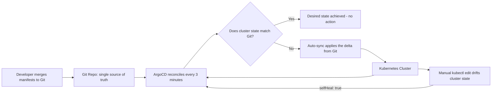

| Difficulty | Channel | Tags |
|---|---|---|
| beginner | devops | argocd, flux, declarative |

Roll back the clock to the day Okta's platform team looked at their cluster inventory and saw a number that made them blink twice: roughly 1,000 Kubernetes clusters - one ArgoCD Application per customer - managed by a single ArgoCD instance reconciling 800 to 2,000 Applications and more than 2 million resources [1]. That is not a typo. A dozen clusters inherited from Auth0 became a thousand, and the only thing holding it together was a 3-minute reconciliation loop. This article unpacks how declarative GitOps makes that kind of scale possible, why the imperative kubectl habits you learned early are quietly working against you, and exactly how to configure ArgoCD so the same pattern works whether you have one cluster or one thousand.

---

> ### Real-World Case — Okta
>
> When Okta inherited Auth0's identity platform, it took on a multi-tenant SaaS business where each customer gets its own Kubernetes environment. The platform exploded from a dozen clusters to roughly 1,000 (one ArgoCD Application per customer cluster), and a single ArgoCD instance now manages 800-2,000 ArgoCD Applications and 2+ million Kubernetes resources, with Argo Workflows orchestrating every release.
>
> | | |
> |---|---|
> | **Challenge** | Vanilla ArgoCD auto-sync broke down at this scale. Each release is a bundle of an entire Auth0 software stack (a 'release manifest'), configuration depends on live infrastructure state, and customers require customized deployment windows - so ArgoCD syncing 'anytime' was impossible and dangerous. Unregulated auto-sync caused application-controller crashes, long/expensive reconciliation cycles, stuck syncs, and misleading UI statuses across the fleet. |
> | **Solution** | They stayed fully declarative (Git repos + Kustomize as the single source of truth) but deliberately replaced blind auto-sync with a homegrown scheduler that initiates ArgoCD syncs with retry semantics, flexible prioritization, and blast-radius control. A CLI wrapper classifies sync failures as retryable vs. non-retryable and performs hard refreshes; they patched sync-wave ordering, disabled hard/soft refreshes so the controller only reconciles when needed, scaled to 32 app-controller pods + 24 repo-server pods on one instance, and contributed fixes upstream (a controller race condition and ignore-resource updates). |
> | **Outcome** | One ArgoCD instance sustains 800-2,000 Applications and 2+ million Kubernetes resources across ~1,000 customer clusters, keeping zero-downtime, scheduled releases intact while shrinking upgrade blast radius - without abandoning GitOps or the 3-minute reconciliation model. |
> | **Lesson** | Auto-sync + self-healing is the right default for ordinary fleets, but at extreme multi-tenant scale the pull model is inverted: the plot twist is that the industry's biggest ArgoCD users replace always-on auto-sync with a controlled scheduling layer - proving declarative GitOps (Git as the only source of truth) and imperative-style control (when/manual sync) are complementary, not opposites. |

---

## Hook — It was never about the thousand clusters

Sound familiar? Your team is five services deep, deployments are rolling fine, and then the 2 a.m. hotfix happens. Someone runs `kubectl scale` in prod, the outage clears, and nobody thinks twice - until three weeks later, when the next release silently breaks because the cluster no longer matches anything you can point to. Now multiply that pain by a thousand. Okta inherited Auth0's multi-tenant platform and watched its cluster count explode from a dozen to roughly 1,000, with one ArgoCD instance juggling 800 to 2,000 Applications and over 2 million Kubernetes resources [1]. The takeaway is uncomfortable: at some scale, kubectl stops being a tool and becomes a liability. This story is about what replaced it - and why you are probably two bad deployments away from needing the same answer.

## Problem — The quiet sabotage of configuration drift

Here is the core tension every platform team hits: Kubernetes is stateful, but human changes are unrecorded. The declarative-versus-imperative debate is really a fight over who the source of truth is [4]. Imperatively, you run `kubectl apply` or `kubectl scale` and the cluster changes - instantly, silently, and without a changelog. Imperative workflows feel fast precisely because they skip bookkeeping, yet they breed configuration drift, the slow leak that turns clusters into snowflakes: this one has 8 replicas, that one carries an extra ConfigMap, and staging sits three versions behind production [5]. The stakes escalate fast. When a rollout fails, you cannot git-revert to the last known good state because there is no Git history for what is actually running - only whatever people remember typing. Rollbacks become archaeology, escalated to the engineers who built the cluster months ago, and audit requests get answered with trust me instead of evidence. Ever SSHed into a prod cluster wondering who changed what? If that sounds familiar, you already understand why Okta bet its entire platform on a different model.

## Real-World Case — Okta and the one-dozen-to-one-thousand journey

Enter Okta, post-Auth0 acquisition, running a multi-tenant SaaS identity business where every customer gets their own isolated Kubernetes environment [1]. The platform scaled from twelve clusters to roughly one thousand - and rather than standing up a thousand ArgoCD instances, Okta concentrated the control plane. One ArgoCD instance now manages 800 to 2,000 Applications and 2+ million Kubernetes resources, while Argo Workflows orchestrates every release [1]. The most remarkable detail is what they refused to trade away: zero-downtime, scheduled releases remained intact, the 3-minute reconciliation model was preserved, and the upgrade blast radius shrank. That last point deserves a second read. Most engineers assume that adding a self-healing reconciler means giving up control over when changes land. Okta's experience proves the opposite - automation did not make the platform fragile; it made failure cheaper [1]. A bad change touched one application instead of the whole shop, and Git was always the backstop.

## Deep Dive — Declarative vs imperative: a tale of two philosophies

Okta's story only makes sense once you frame declarative versus imperative as a philosophy, not a syntax preference. The declarative approach says: the desired state lives in Git as YAML manifests, Helm charts, or Kustomize overlays, and a controller continuously reconciles the live cluster against that declared intent [5]. ArgoCD is exactly this controller - it polls your repository (by default every three minutes), diffs actual versus desired, and applies the delta through auto-sync [2]. The imperative approach says: the desired state is whatever you last typed into kubectl [6]. Both work on a Tuesday; the difference reveals itself under pressure. Therefore, the comparison that matters looks like this:

| Reality of the tradeoff | Declarative (GitOps) | Imperative (kubectl) |
|---|---|---|
| Source of truth | Git history - browsable, revertible | Whatever someone last ran |
| Drift handling | Auto-sync + self-heal reconcile it instantly | Drift accumulates silently |
| Rollback | git revert + sync; minutes | Re-applying assumed state; hours, sometimes never |
| Audit trail | Every change is a commit with an author | Screenshots and memories |
| Learning curve | Higher - YAML, Helm, Kustomize investment | Low - instant gratification |
| Fits best at | Multi-cluster platforms, regulated systems | Local experiments, debugging sprints |

Here is the plot twist: imperative is not evil. `kubectl exec` and `kubectl scale` remain the right tools for ad-hoc debugging, and plenty of teams use them daily [6]. The ruinous habit is making imperative changes your deployment mechanism, bypassing the repository that everyone else treats as truth. The nuance seasoned teams internalize? Automate the declarative path, keep the imperative toolbox for emergencies, and let self-healing enforce the boundary [7].

## Workflow — From git commit to running cluster in five steps

With the philosophy settled, here is the five-step path from we deploy by hand to Git is the only door into the cluster - the same loop that kept a thousand Okta clusters honest [1]. Step 1: put your manifests, Helm charts, or Kustomize overlays in a dedicated Git repository and declare it the system of record. Step 2: register that repository with ArgoCD via `argocd repo add`. Step 3: create one Application CRD per service, pointing at a repo, a path, and a destination cluster [2]. Step 4: enable automated sync with self-healing and pruning so the controller owns reconciliation entirely [2]. Step 5: deploy only by merging pull requests - never by typing. Teams that follow this faithfully earn a charming side effect: Git becomes a time machine, and every environment from dev to prod becomes a reproducible expression of commits. The diagram below traces the continuous loop that makes it all work - the reconcile check never sleeps, and neither does the drift detector.

## Code Example — Wiring an Application CRD that heals itself

Time to make this concrete. Below is the exact shape of an ArgoCD setup for a payments microservice - from registering the repository to the self-healing Application CRD, with the imperative traps annotated in the final step. Follow along in a test cluster first; nothing here is destructive. After you see the sync loop kick in for the first time - watching a manual kubectl change roll itself back inside three minutes - it clicks why Okta never relinquished this model [1].

## Lessons Learned — Battle scars from a thousand clusters

After watching the pattern scale from one cluster to a thousand, here are the battle scars worth collecting:

- Start declarative before the pain starts: introducing GitOps after a drift incident means migrating live state, which is always messier than adopting it early.
- Let self-heal be opinionated: `selfHeal` and `prune` together keep drift at zero, but test them in staging first - an aggressive prune policy can delete more than you expected [2].
- Keep the imperative toolbox short: debugging with `kubectl exec` is fine; deploying with it is not [6].
- Choose your reconcile cadence intentionally: Okta kept the 3-minute model at massive scale, but you can tune the interval per application if your CI demands tighter feedback [1].
- Design Application boundaries carefully: Okta runs one Application per customer cluster; you should run one per logical app - too coarse and the blast radius grows, too fine and you drown in CRDs [1].
- Treat Git review as the release gate: every merge is a deployment candidate, so your pull-request review becomes your change control.

The metric that matters is time-to-revert. With GitOps, a bad deploy is a revert PR plus a sync - measured in minutes, not incident post-mortems.

---

## ArgoCD GitOps Sync Loop

<strong>Original Interview Question</strong>

**Q:** You're setting up GitOps for a microservices deployment. How would you configure ArgoCD to automatically sync changes from your Git repository to Kubernetes, and what's the difference between declarative and imperative approaches in this context?

**A:** I'd configure ArgoCD by setting up a Git repository containing Kubernetes manifests or Helm charts, creating an Application CRD that points to the Git repository, enabling auto-sync with a health check interval of 3 minutes, and implementing self-healing to automatically revert any manual changes. The declarative approach involves defining the desired state in Git through YAML manifests, Helm charts, or Kustomize configurations, where ArgoCD continuously reconciles the actual state with the desired state. In contrast, the imperative approach uses kubectl commands to make direct changes to the cluster, bypassing the Git repository as the single source of truth.

## Conclusion

The journey started with a number that felt absurd - eleven clusters becoming roughly a thousand, kept alive by a single ArgoCD instance and a stubborn 3-minute reconciliation loop [1]. But the real lesson was never about scale; it is about who holds the truth. Declarative GitOps moves that truth into Git, where it can be reviewed, reverted, and trusted, while ArgoCD becomes the tireless clerk making sure reality agrees [2][3]. So here is the action plan: pick one service, commit its manifests today, wire up an Application CRD, and merge your next change through a pull request instead of a terminal. Do that once and the habit will stick - because after a few weeks of never asking who changed that, you will not want to go back. Only commit. Never command.

---

## References

1. [One Dozen to One Thousand Clusters: How Argo Kept Up As We Scaled (Okta, KubeCon NA 2025)](https://hosted-files.sched.co/kccncna2025/b0/One%20Dozen%20to%20One%20Thousand%20Clusters_%20How%20Argo%20Kept%20Up%20As%20We%20Scaled.pdf) — article
2. [Argo CD Documentation](https://argo-cd.readthedocs.io/en/stable/) — documentation
3. [GitOps - Wikipedia](https://en.wikipedia.org/wiki/GitOps) — blog
4. [Kubernetes Object Management](https://kubernetes.io/docs/concepts/overview/working-with-objects/object-management/) — documentation
5. [Declarative Management of Kubernetes Objects Using Configuration Files](https://kubernetes.io/docs/tasks/manage-kubernetes-objects/declarative-config/) — documentation
6. [Imperative Management of Kubernetes Objects Using Configuration Files](https://kubernetes.io/docs/tasks/manage-kubernetes-objects/imperative-config/) — documentation
7. [argoproj/argo-cd on GitHub](https://github.com/argoproj/argo-cd) — blog
8. [Argo CD Project - CNCF](https://www.cncf.io/projects/argo-cd/) — documentation
9. [Flux Documentation](https://fluxcd.io/) — documentation

---

**Author:** Satishkumar Dhule — [GitHub](https://github.com/satishkumar-dhule) · [LinkedIn](https://linkedin.com/in/satishkumar-dhule) · [Website](https://satishkumar-dhule.github.io)
