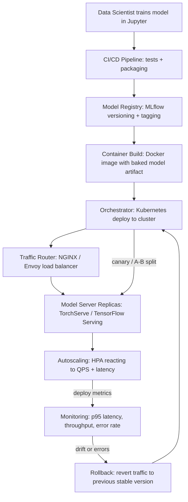

| Difficulty | Channel | Tags |
|---|---|---|
| beginner | devops | mlops, deployment |

It was 2015, and Uber had a scaling problem hiding in plain sight: data scientists were training world-class models in Jupyter notebooks, but every one of those models was doomed the moment it tried to grow up. There was no standard way to ship them to production, each team hand-built its own bespoke serving container, and nothing could scale past a desktop machine [1]. The company's own ML was the bottleneck of its marketplace. This is the story of how Uber built Michelangelo to fix it — and what that saga teaches every developer about the difference between ML deployment and ML serving. By 2024, that same platform was powering more than 5,000 production models and roughly 10 million real-time predictions per second at peak [1].

---

> ### Real-World Case — Uber
>
> By 2015, Uber's ML was fragmented: data scientists trained models in Jupyter notebooks, but there was no standard way to deploy them to production — each team hand-built its own bespoke serving container, models couldn't scale past a desktop machine, and there was no pipeline for retraining or rollback. Uber built Michelangelo, an end-to-end ML platform, to solve this, and it grew into the backbone of the company's marketplace.
>
> | | |
> |---|---|
> | **Challenge** | Separating model deployment (reproducible pipelines, staged rollouts, monitoring) from model serving (low-latency request-response inference, model loading/versioning, autoscaling) at hypergrowth scale — with some models needing >250K predictions/sec while the serving path stayed under 10ms. |
> | **Solution** | Michelangelo split the lifecycle explicitly: a deployment layer (Spark-based training pipelines, model packaging into versioned artifacts, CI/CD with canary tests, staged/rolling rollouts, auto-retirement, model health checks) and a serving layer (stateless Java-based prediction service containers behind load balancers with APIfeaturing online/offline/library deployment modes, a Cassandra feature store for low-latency features, and a routing tier that picks the right model per request). They even decoupled model deploys from server releases via dynamic model loading, and later introduced an 'OnlineTransformer' interface with a lightweight scoreInstance() path that bypasses Spark's heavy Catalyst optimizer on the hot path. |
> | **Outcome** | P95 online serving latency of 250,000 predictions per second (by 2018: thousands of models and millions of predictions per second; by 2024: 5K+ production models and ~10M real-time predictions/sec at peak). On the deployment side, tuning the model-load path cut Spark native model load time from 8x-44x slower than their custom representation to only 2x-3x slower (a 4x-15x speedup), making standardized pipelines viable for real-time serving. |
> | **Lesson** | Deployment and serving are genuinely different engineering problems. A representation optimized for training (Spark pipelines) can be disastrous on the serving hot path (8-44x load latency), so you need explicit abstractions between the CI/CD/rollout lifecycle and the low-latency runtime — while ensuring the same pipeline/preprocessing runs identically in both to avoid training-serving skew. |

---

## Hook — The model that never made it to production

Every machine learning project faces the same quiet tragedy. Teams pour weeks into training a model that crushes the validation set, then watch it die an undignified death at the deployment stage. The trained weights sit in a notebook. The notebook sits on a laptop. And somewhere, a stakeholder sighs: "so, when can we actually use this?" You have probably felt this tension yourself — the gap between a model that works in a sandbox and a model that works at 2 a.m. under real traffic. Here is the uncomfortable truth hiding at the bottom of that gap: training is only the beginning of the journey. The real battle is between the two words no one talks about enough — deployment and serving. Sound familiar? Buckle in, because this journey starts in the most chaotic ML environment of the 2010s.

## Problem — The two words everyone conflates

Many developers use "deployment" and "serving" as if they were synonyms. They are not. Deployment is the “get it out there” problem: CI/CD pipelines that test and package the model, infrastructure provisioning, registry versioning, monitoring, and rollback strategies [2]. Serving is the “keep it fast out there” problem: the live runtime that loads model weights into memory, exposes an inference API, routes requests, and squeezes every millisecond out of the response path [3]. Conflating the two is how teams end up with a perfectly deployed model that takes four seconds to answer a single request. The stakes are real: real-time inference demands sub-100ms responses, batch pipelines get away with under a second, and the architecture you choose for one will actively fight you if you use it for the other. This leads directly to the question that shaped Uber's entire platform strategy: what happens when models can't reliably make that transition at all?

## Real-World Case — Uber's fragmented ML wreckage

By 2015, Uber's ML was a beautiful catastrophe [1]. Data scientists trained models in Jupyter notebooks, but there was no standard path to production — each team hand-built its own bespoke serving container, models couldn't scale past a single desktop machine, and there was no pipeline for retraining or rolling back. Every ride-matching experiment required reinventing the wheel. Uber's response was Michelangelo, an end-to-end ML platform designed to standardize both the deployment and serving sides of the equation [1]. The results were staggering: P95 online serving latency of under 5ms without feature-store lookups and under 10ms with Cassandra-backed features; top models served more than 250,000 predictions per second, growing to thousands of models and millions of predictions per second by 2018 [1]. Specifically, the model-load path stands out as a deployment lesson: Spark's native model loading ran 8x-44x slower than Uber's custom representation, and tuning it to a 2x-3x gap — a 4x-15x speedup — is what made standardized real-time pipelines viable at all [1]. By 2024, Michelangelo carried over 5,000 production models and peaked near 10 million real-time predictions per second [1][4]. One insight sits at the heart of all of this: deployment got them to the starting line, but serving is what won the race.

## Deep Dive — Deployment vs. serving: the real trade-offs

Let's break down this distinction the way a production engineer would. Deployment is an infrastructure discipline: Docker images, Kubernetes orchestration, Terraform provisioning, MLflow for experiment tracking and the model registry, and pipeline runners such as GitHub Actions or Jenkins [2][5]. Serving is a runtime discipline: model servers like TensorFlow Serving, TorchServe, or BentoML that handle request routing, model versioning, and response optimization; API layers like FastAPI, Flask, or gRPC; and load balancers such as NGINX or Envoy sitting in front [3][6][7]. The trade-offs are where the plot twists begin. Latency versus throughput: real-time serving overseas the latency of every single request, while batch inference chases aggregate throughput across thousands of examples at once. Batch versus real-time: a nightly scoring job can afford to be slow and cheap, but a live ad-ranking model has milliseconds to decide. And cold start — the silent killer: loading a model's weights into memory can take seconds, so every replica needs warm-up strategies before you route traffic to it [8]. Moreover, scaling considerations split into two families: horizontal scaling through replicated pods and load balancing, and vertical scaling through GPU memory and CPU allocation for the individual inference job [9]. You might think autoscaling is the hardest part here. Actually, the hardest part is deciding which trade-offs your product tolerates before you write a single line of serving code.

## Workflow — From notebook to production, step by step

Building on the trade-offs above, here is the end-to-end journey every production model should take. First, a data scientist trains and logs a model to a registry like MLflow, tagging it with a version [5]. Next, a CI/CD pipeline runs tests, packages the model artifact, and bakes it into a container image. Then, an orchestrator like Kubernetes deploys the image and registers it with a service mesh or load balancer [2]. After that, traffic routing begins: a small canary slice of requests validates the new version against the old one using A/B testing and traffic splitting. Finally, autoscaling and monitoring take over, with metrics like p95 latency and QPS feeding back into the loop — and a rollback path ready to revert traffic the moment the pager goes off. The diagram below tells this visual story end to end.

## Code Example — A battle-tested model server in FastAPI

This is where the theory becomes code. Here's a focused, production-minded FastAPI server that treats model versioning as a first-class citizen — the serving half of the story, with the deployment half handled by whatever orchestrator you choose.

## Lessons Learned — What three years of serving pain teaches you

So what should you actually take away from this journey? First, treat deployment and serving as two different problems with two different performance budgets — a deployed-but-slow model is not a success, it is an incident waiting to happen. Second, standardize your pipelines early: Uber's bespoke-container chaos was not a data science problem, it was a missing-platform problem, and the fix was boring, repeatable infrastructure [1]. Third, measure serving health with the right metrics, because p50 latency can look great while p95 is melting [3]. Fourth, design for rollback from day one, since every model you ship will eventually need to be unscrambled. Finally, the counterintuitive gem: model loading time is quietly one of the most important deployment numbers you will ever tune — Uber's 4x-15x speedup on the model-load path is proof that this boring detail can unlock an entire tier of real-time serving performance [1]. If this feels overwhelming, you are not alone — but you don't need Uber's scale to adopt the discipline.

---

## ML Deployment and Serving Pipeline

<strong>Original Interview Question</strong>

**Q:** Explain the key differences between model serving and model deployment in ML systems, including specific technologies, scaling considerations, and real-world implementation patterns?

**A:** Deployment encompasses CI/CD pipelines, infrastructure setup, and monitoring using tools like Kubernetes, MLflow, and SageMaker. Serving focuses on runtime inference APIs with frameworks like TensorFlow Serving, TorchServe, or BentoML, handling request routing, model versioning, and autoscaling. Key trade-offs include latency vs throughput, batch vs real-time inference, and cold start optimization.

## Conclusion

The Uber story is not about a taxi company — it is about what happens when brilliant model work collides with a system that cannot carry it to production. Deployment and serving are not interchangeable words; they are two disciplines with different tools, different budgets, and different failure modes, and the teams that treat them separately are the ones that scale [1]. Tomorrow, audit your own stack: where is your model-load path, how long does it take, and could you roll back a bad version right now? The most memorable lesson to carry back to your team is this one — deployment gets your model to the starting line, but serving is the entire race. Build both with the same intensity and your models will finally do what they were trained to do: work, at scale, when it counts.

---

## References

1. [Uber incident report](https://www.uber.com/us/en/blog/michelangelo-machine-learning-platform/) — article
2. [Kubernetes Documentation](https://kubernetes.io/docs/concepts/overview/) — documentation
3. [TensorFlow Serving](https://github.com/tensorflow/serving) — documentation
4. [From Predictive to Generative — How Michelangelo Accelerates Uber's AI Journey](https://www.uber.com/us/en/blog/from-predictive-to-generative-ai/) — article
5. [MLflow](https://github.com/mlflow/mlflow) — documentation
6. [TorchServe — PyTorch Model Serving](https://github.com/pytorch/serve) — documentation
7. [gRPC Documentation](https://grpc.io/docs/what-is-grpc/) — documentation
8. [Docker Documentation](https://docs.docker.com/get-started/) — documentation
9. [Container Orchestration — Wikipedia](https://en.wikipedia.org/wiki/Container_orchestration) — article
10. [Amazon SageMaker Documentation](https://docs.aws.amazon.com/sagemaker/latest/dg/whatis.html) — documentation

---

**Author:** Satishkumar Dhule — [GitHub](https://github.com/satishkumar-dhule) · [LinkedIn](https://linkedin.com/in/satishkumar-dhule) · [Website](https://satishkumar-dhule.github.io)
