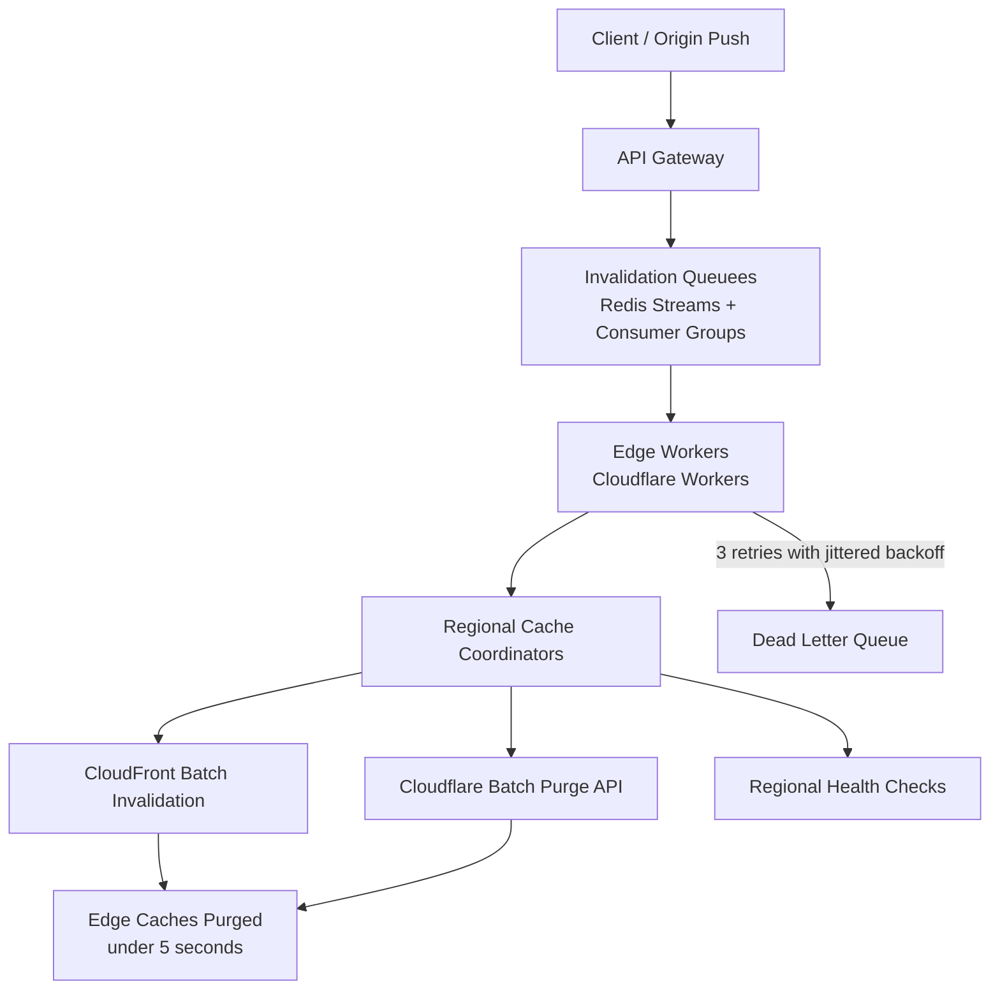

| Difficulty | Channel | Tags |
|---|---|---|
| intermediate | system-design | edge, caching, purging |

Fastly spent over a decade proving the industry wrong: cache purging is not a rare emergency rollback tool — it is a routine part of app publishing [1]. While most teams were resigned to waiting out multi-minute TTLs, Fastly's instant purge was shipping content updates worldwide in roughly 150 milliseconds, brushing up against the physical speed-of-light limit [1]. Yet stale content, slow propagation, and cost blowups are exactly what most developers still wrestle with today. This article walks through how to design a multi-region purging system that propagates updates within five seconds while absorbing 10,000 concurrent invalidations per second — and the survivor's guide to the failure modes that will try to sink it.

---

> ### Real-World Case — Fastly
>
> Fastly needed a way for customers to purge cached content across its globally distributed CDN in near-real-time, so that content updates (news, inventory, stock tickers, API responses) propagate instantly instead of waiting for TTL expiry. The traditional industry view was that purging was a rare emergency rollback tool, but Fastly believed it should be a routine part of normal application publishing.
>
> | | |
> |---|---|
> | **Challenge** | Designing a cache invalidation system that could reach every cache server on the planet fast enough to make dynamic content reliably cacheable: a centralized 'tell the head office, it fans out' model was too slow and created a single point of failure. Purge requests needed to propagate to all PoPs within milliseconds while surviving packet loss, network partitions, and growing scale - a distributed messaging/broadcast problem rather than a cache problem. |
> | **Solution** | Fastly adopted a decentralized architecture called Powderhorn based on the Bimodal Multicast gossip protocol. Any cache server can ingest a purge request and immediately UDP-broadcast it to all other servers, eliminating the central coordinator and cutting latency by roughly half since no acknowledgments are required. Purges are broadcast everywhere rather than routed, and each PoP uses a cache-generation version number (for purge-all) with lazy/invasive tracking so stale objects become unreachable even before being physically deleted. The coreless fan-out design played directly into edge compute, and later work added true batch purge grouping to handle scale. |
> | **Outcome** | Purge propagation begins within 5ms and completes worldwide in ~150ms (nearly always under 250ms) - hitting the physical speed-of-light limit of ~65ms for global round trips. Purge throughput scaled from 2-3k purges/second in 2018 to ~60k purges/second today, and after moving from slice-and-dice batching to true batch purging, Fastly projects the system can handle hundreds of thousands of purges per second. The system famously survived a real firewall-misconfiguration network partition where the 95th percentile purge latency spiked two orders of magnitude yet purges still completed within ~10 seconds. |
> | **Lesson** | The fastest way to guarantee cache propagation is not a better queue or more retries - it is removing the central coordinator entirely. Treating invalidation as a decentralized broadcast problem (gossip/multicast) means you are bounded only by the speed of light, and skipping acknowledgment overhead roughly halves latency. Batching (grouping many invalidations into one operation) is what unlocks order-of-magnitude throughput gains, and a 5-second purge SLA is actually conservative: with the right architecture, ~150ms is achievable. |

---

## Hook — the cache that serves yesterday's truth

Here is the thing about caches: they are brilliant right up until they betray you. Every developer has hit save, refreshed the page, and watched yesterday's data stare back — the classic "it works on my machine, why won't it work in prod" moment, except now "prod" means a fleet of edge nodes scattered across the globe [2]. The stakes feel small in a demo but compound fast in production: a stale stock price trips an automated trading bot, a phantom inventory count kills a checkout flow, an outdated API response hands a banned user a welcome mat. For years the standard answer was simple: wait out the TTL. And for years that answer quietly cost companies customers, money, and trust. The real question lurking behind every CDN dashboard is uncomfortable — what happens when your brokest, most critical piece of content changes and the world must know in five seconds or less?

## Problem — stale content at planetary scale

Now picture the requirement every team eventually hits: an update must be visible worldwide in under five seconds, all while the system absorbs 10,000 concurrent invalidations per second without flinching. Sound extreme? It is not. Black Friday inventory tables, live scoring apps, breaking news sites, and multi-region APIs produce exactly this pressure — and the moment you scale past one datacenter, the naive approach collapses. That naive approach is the full purge: nuke everything on the CDN on every change. It is a shotgun — effective at point-blank range, catastrophic at scale, and brutally expensive. Purge one URL per API call instead and you are firing 100,000 requests at your provider for the same 10,000 updates, which turns your cost report into something that resembles a car loan. Moreover, there is a deeper tension beneath the surface: caches exist precisely because fetching from origin is slow, yet strong consistency demands that a change be visible everywhere instantly [3]. You cannot have both at full strength — network latency is physics, not a bug you can fix with a bigger server. So the real design question is not whether to purge, but how to purge with precision, velocity, and a safety net for the moment half the world's network decides to take the afternoon off.

## Real-World Case — Fastly

Let's look at the system that rewrote the rules. When Fastly began championing instant purge, the industry consensus was that cache invalidation was a rare emergency tool — something you fire off after a botched deploy and then try to forget [1]. Fastly rejected that framing outright. Their team argued that purging is a routine part of normal application publishing: when your editors publish a breaking story, the old article must vanish with the same urgency as an accidental rollback [1]. The results are the kind of numbers that make your jaw drop. Purge propagation begins within 5ms of the API call and completes worldwide in roughly 150ms — nearly always under 250ms — which grazes the ~65ms physical round-trip limit imposed by the speed of light [1]. Then there is throughput: the system scaled from 2-3k purges per second in 2018 to roughly 60k purges per second today, and after moving from slice-and-dice batching to true batch purging, Fastly projects it can soak hundreds of thousands of purges per second [1]. And yet the most impressive part is the failure story. A real firewall misconfiguration caused a network partition that spiked the 95th percentile purge latency by two orders of magnitude — and purges still completed within about ten seconds [1]. That is what resilience under fire actually looks like: the system degraded without collapsing.

## Deep Dive — queues, batching, and the art of the safety net

Building on those real-world numbers, let's dissect the machinery that backs the five-second promise. The beating heart is a distributed invalidation queue — for example, Redis Streams with consumer groups, which lets multiple edge workers consume the same stream without double-processing, a pattern proven at enormous scale in production [7]. But the queue alone is not enough; the next layer is coordination. Regional cache coordinators (think edge compute workers) turn a human-friendly batch of patterns into provider-specific API calls. That batching is the cost lever: grouping 100 invalidations into a single API request cuts provider API costs by roughly 90% compared to one-request-per-file. It also enables smart invalidation — pattern-based purging with wildcards like /path/* that targets only the regions that actually served the content, instead of spraying the entire planet [6]. Now for the counterintuitive twist: teams often believe strong consistency is a hard requirement you can just assert into existence. In practice, at global scale, strong consistency is a mirage — the latency budget simply cannot absorb cross-continental round trips on every read. The pragmatic answer is near-real-time eventual consistency enforced by reconciliation: periodic walks that compare what should be purged against what the edges still serve, quietly fixing anything the pipeline missed. That is why the 2-second TTL (Cache-Control: max-age=2, must-revalidate) matters — it is a self-healing parachute, so even a fully dropped purge corrects itself within two seconds [4][5]. Finally, assume machines will lie to you. Circuit breakers that trip after five consecutive failures force the system to fail fast instead of hammering a dead provider [8], exponential backoff with jitter (capped at three retries) prevents the thundering-herd restarts that turn one outage into a corpus event [9], and a dead-letter queue gives humans a place to review the unruly ones. Fire the whole pipeline into an unreliable network without those three, and one bad regional provider will take down your five-second promise everywhere.

## Workflow — from publish to planet-wide purge

This leads to a repeatable workflow you can steal. The flow, visualized in the Purge Propagation System Flow diagram below, moves in eight predictable steps. First, the origin service publishes content and emits an invalidation event. Second, the API Gateway accepts the request — batched, up to 100 patterns at once. Third, events land in the invalidation queue (Redis Streams), ordered and durable. Fourth, edge workers read the stream in consumer groups, each worker claiming a slice of work. Fifth, regional cache coordinators expand patterns and decide which providers and regions actually need action — smart invalidation in action. Sixth, equivalent to Fastly's now-mainstream approach, batched purge calls fire at provider APIs such as CloudFront or Cloudflare [6]. Seventh, any failure rolls through jittered exponential backoff and the circuit breaker; exhausted retries land in the dead-letter queue for manual review. Eighth and finally, health checks monitor regional endpoints while the 2-second TTL reconciles anything that slipped through [4]. What makes the whole design resilient rather than merely fast is the safety net woven into steps seven and eight — every layer knows its failure mode and has a designated place to fail.

## Code Example — a resilient edge purge coordinator

The code below is a miniature version of the coordination layer: it drains the invalidation queue, fans out pattern-based batches to multiple providers, and enforces retry, backoff, and dead-letter discipline along the way. `worker()` is the main loop — it reads from the queue in batches, then dispatches those batches to the region coordinator for Cloudflare and CloudFront in parallel. `purgeWithRetry()` applies the circuit breaker (fail fast after five consecutive failures), jittered exponential backoff capped at three retries, and hands genuinely stuck batches to the dead-letter queue for human review. `postToProvider()` shows the key cost lever: a single API call carries the whole batch — 100 patterns in one request instead of 100 requests. Many developers discover the hard way that skipping these guardrails works beautifully in a load test and then fails in exactly the way that wakes you up at 2am. This is not a toy — you can transplant the breaker, backoff, and DLQ pattern into the production purge worker within weeks.

## Lessons Learned — battle scars, best practices, and the roadmap

So what separates teams that survive a purge wave from those that rebuild the cache by hand at 3am? First and biggest scar: full purge on every deploy is a cost explosion and a rate-limit minefield — always batch and always prefer wildcard patterns over exhaustive URL lists. Second, no jitter in your backoff is a self-inflicted stampede: when a provider recovers, every worker retries simultaneously and the flood restarts the outage [9]. Third, a TTL of days is a guarantee of stale content; a two-second TTL changes your entire risk profile because worst case self-heals instead of festering [4]. Fourth, a dead-letter queue is not bureaucracy — it is your audit trail and your apology generator when a pattern was fatally malformed. And fifth, the hardest lesson of all: measure your 95th percentile purge latency continuously, because the average will lie to you. If this feels like a lot, you are not alone — but the starting kit is small: adopt must-revalidate with a short TTL this week, batch your invalidation calls next week, add a circuit breaker before the quarter ends. The punchline to the whole journey is that Fastly is not magic — Fastly is a design philosophy: treat purge as a routine publishing step, assume partial failure everywhere, and build reconciliation so the system forgives itself [1]. Your users will never applaud a purge that worked. But they will absolutely riot over one that didn't — and now you know exactly how to keep that riot from ever starting.

---

## Purge Propagation System Flow

<strong>Original Interview Question</strong>

**Q:** How would you design a multi-region CDN cache purging system that guarantees content propagation within 5 seconds while handling 10,000 concurrent invalidations per second?

**A:** Implement Cloudflare API + AWS CloudFront with distributed invalidation queue, edge compute coordination, and 2-second TTL. Use batch invalidation, exponential backoff, and regional cache headers for 5-second SLA.

## Conclusion

The moral of the Fastly story is that purging is an everyday publishing operation, not a panic button — and every layer of your system should be built on that assumption [1]. The path forward is concrete: set Cache-Control to max-age=2 plus must-revalidate this week, batch your invalidation API calls next week, add a circuit breaker and a dead-letter queue before the quarter ends, and instrument your 95th percentile purge latency the moment it goes to production. Leave your teammates with this one line: a cache is a promise of speed, and a purge system is the promise that speed never turns into staleness — design for the failure you can't yet imagine, and the rest is just latency.

---

## References

1. [Fastly incident report](https://www.fastly.com/blog/over-a-decade-later-evolution-of-instant-purge) — blog
2. [Content delivery network](https://en.wikipedia.org/wiki/Content_delivery_network) — documentation
3. [HTTP caching](https://developer.mozilla.org/en-US/docs/Web/HTTP/Caching) — documentation
4. [RFC 9111 - HTTP caching semantics](https://datatracker.ietf.org/doc/html/rfc9111) — documentation
5. [Cache-Control header reference](https://developer.mozilla.org/en-US/docs/Web/HTTP/Headers/Cache-Control) — documentation
6. [Invalidating files with CloudFront](https://docs.aws.amazon.com/AmazonCloudFront/latest/DeveloperGuide/Invalidation.html) — documentation
7. [Redis](https://en.wikipedia.org/wiki/Redis) — documentation
8. [Circuit breaker design pattern](https://en.wikipedia.org/wiki/Circuit_breaker_design_pattern) — documentation
9. [Exponential backoff](https://en.wikipedia.org/wiki/Exponential_backoff) — documentation
10. [Apache Kafka](https://en.wikipedia.org/wiki/Apache_Kafka) — documentation

---

**Author:** Satishkumar Dhule — [GitHub](https://github.com/satishkumar-dhule) · [LinkedIn](https://linkedin.com/in/satishkumar-dhule) · [Website](https://satishkumar-dhule.github.io)
