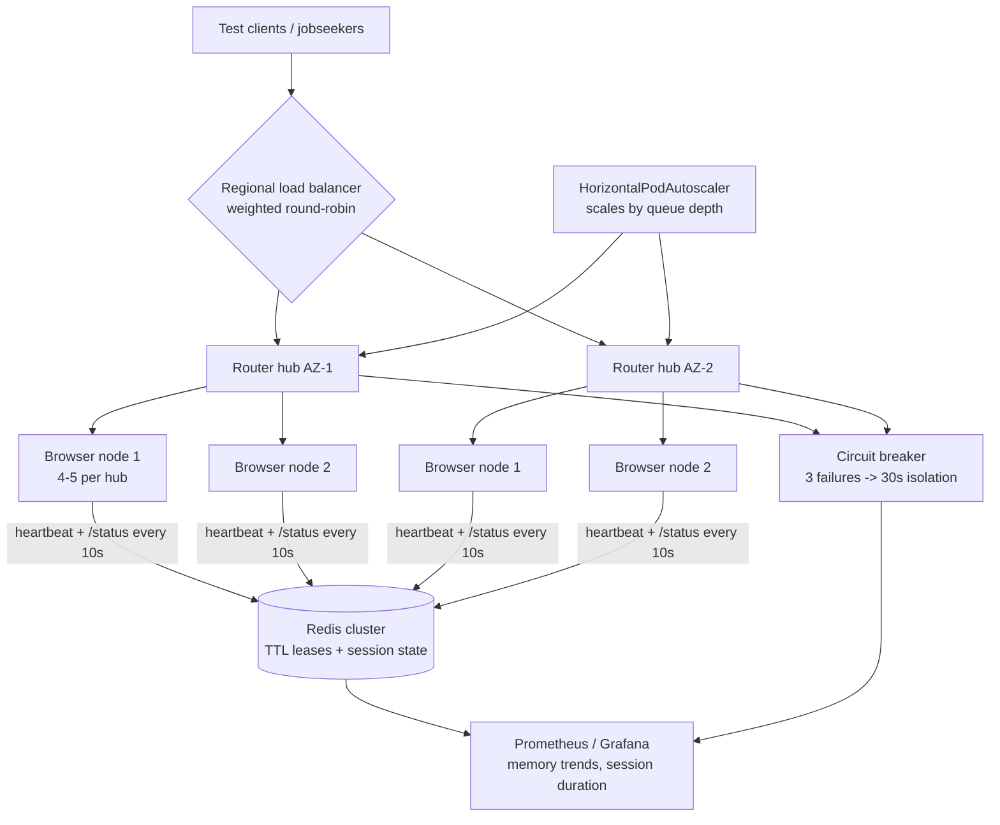

| Difficulty | Channel | Tags |
|---|---|---|
| advanced | system-design | selenium, webdriver, grid |

Every graceful scale-up story starts somewhere uncomfortable, and this one starts with a job board. Indeed built a system where Selenium wasn't a test harness — it was the product itself, quietly submitting applications to 650+ employers and spinning up more than 5 million browser sessions over a year and a half [1]. Then the out-of-the-box grid buckled: the single hub became a bottleneck, and browser nodes leaked memory until they died. What kept the pipeline alive was a full rethink of grid architecture — and that rethink is exactly the blueprint you need for 10,000 concurrent sessions with 99.9% uptime.

---

> ### Real-World Case — Indeed
>
> Indeed used Selenium not just for CI testing but as a production business system that automatically submitted job applications on behalf of jobseekers to 650+ employers. As this scaled up, their out-of-the-box Selenium Grid buckled at scale - the single hub became a bottleneck and single point of failure, and browser nodes leaked memory until they died.
>
> | | |
> |---|---|
> | **Challenge** | Run millions of Selenium WebDriver sessions reliably in production. The stock Selenium Grid failed key requirements: no high availability (one hub = single point of failure), hubs became unresponsive past roughly 20-30 nodes, no health monitoring or auto-scaling, and long-lived nodes accumulated memory leaks that caused flaky failures and session loss. |
> | **Solution** | Indeed re-architected the grid based on the RemoteWebDriver protocol: dozens of small hubs distributed across multiple data centers and regions, fronted by their open-source Grid Router proxy. The router load-balances sessions across hubs, isolates failures per region (if one datacenter/region is down it retries on another), monitors unhealthy nodes/removes them, recycles nodes to fight memory leaks, and runs multiple router instances behind a load balancer for HA. |
> | **Outcome** | Served 1000+ concurrent browsers across multiple data centers, created 5M+ Selenium sessions over ~1.5 years, and progressively drove down failure rates. Their own experience showed standard hubs can only reliably handle 20-30 nodes each, while small 4-5-node hubs behind a router scaled almost linearly - turning an unsolvable single-hub bottleneck into an HA, per-region-failover architecture. |
> | **Lesson** | A monolithic hub-and-node grid doesn't scale or tolerate failure; the fix is many small distributed hubs behind an intelligent router with per-region failover, plus forced node lifecycle recycling because WebDriver/browser processes leak memory over time and cannot be trusted to run indefinitely. |

---

## Hook — the 3am hub collapse nobody scheduled

It starts the way all good infrastructure horror stories do: 3 a.m., a pager, and a hub that stopped answering. The job-application pipeline at Indeed had been humming for months, and then the Selenium Grid powering it started behaving like a finite resource — because it was [1]. Browser nodes leaked memory until they quietly starved, while the single hub that was supposed to route 1,000+ concurrent browsers became the bottleneck every request had to queue behind. Nobody planned for Selenium to become a business-critical system. Sound familiar? Then here is the twist: the fix that finally worked had almost nothing to do with adding RAM, and everything to do with changing how you think about failure.

## Problem — hub saturation, memory leaks, and the 99.9% uptime trap

Every team that outgrows a demo grid hits the same five walls, usually in this order. First, the hub: one process, one queue, one point of failure. Standard hubs can only reliably shepherd 20–30 nodes before routing degrades, so your scale-out strategy stalls the moment you add node number 31 [1]. Second, the memory leak: WebDriver browser processes are famously leaky, and without forced recycling a node will eat RAM until the kernel OOM-killer intervenes. Third, orphaned sessions: a crashed client leaves a browser running and a lease held forever. Fourth, zero observability — you find out about node failures from users, not metrics. And fifth, the uptime paradox: 99.9% sounds achievable until you realize it's roughly 43 minutes of downtime per month, and one un-replicated hub burns that budget in a single bad afternoon. The ironic part is that the answer to all five walls is one sentence: treat your grid like the rest of your infrastructure. Kubernetes runs the nodes, Redis owns the state, Prometheus tells the truth — but as Indeed discovered, making those pieces cooperate is where the real work begins.

## Real-World Case — Indeed's Selenium-that-wasn't-a-test

Here is what most people miss about this story: at Indeed, Selenium was never a testing tool. It was a production business system that automatically submitted job applications on behalf of jobseekers to more than 650 employers, orchestrating 1,000+ concurrent browsers across multiple data centers [1]. Over roughly 1.5 years, that pipeline created more than 5 million Selenium sessions. And it worked — right up until it didn't. The out-of-the-box grid buckled at scale: the single hub became both bottleneck and single point of failure, per-session memory leaks slowly strangled the browser nodes, and every incident was an emergency because there was no redundancy to hide behind [1]. But here is the plot twist. When the team started experimenting with hub sizes, they found something counterintuitive: piling 50 nodes behind one big hub made everything worse, while small hubs of just 4–5 nodes behind a router scaled almost linearly [1]. That one observation — a fleet of tiny hubs instead of one giant one — converted an unsolvable single-hub bottleneck into a horizontally scalable, high-availability architecture with per-region failover. The lesson before any diagram is drawn: the monolithic hub is the enemy, no matter how much memory you throw at it.

## Deep Dive — the anatomy of a 10,000-session grid

Building on that small-hub insight, the target architecture comes into focus: a hub-node pattern where Kubernetes StatefulSets manage browser nodes across multiple availability zones [2][4], a Redis cluster for session state with TTL-based expiration [5], and horizontal pod autoscaling driven by queue depth [3]. Each pod gets hard limits — say 2GB RAM and 1 CPU per browser node — so one leaky browser can't starve its neighbor. Now the math you should do before the first deployment. Ten thousand sessions at 50 sessions per node means 200 nodes minimum [3]. Two hundred nodes at 2GB each is a 400GB baseline, and with a 30% headroom buffer you are budgeting for roughly 520GB of cluster memory — a number you want on a spreadsheet, not discovered during an OOM storm. P99 session initiation should stay under 2 seconds, which regional load balancing with weighted round-robin makes realistic [4]. Memory management is where most grids die, so the playbook has three layers: prevention (weekly rolling restarts, alerts at 80% memory, garbage-collection tuning), cleanup (init containers that scrub stale Docker volumes, Redis expiration scans every 5 minutes) [5], and monitoring (Prometheus-backed Grafana dashboards for memory trends and session durations) [6]. Health checks follow the 10-second rule: probe /status every 10s, and after 3 consecutive failures, pull the node immediately [7]. When a node is flaky rather than dead, circuit-breaker logic isolates it for a 30-second recovery window so one slow browser can't drag response times for everything behind it [7]. Consequently, the hub-sizing tradeoff is the single decision that shapes everything else: | Hub model | Max viable nodes | Failure blast radius | Scaling behavior | |---|---|---|---| | Single large hub | 20–30 | Entire grid | Sub-linear — collapses past ~30 nodes [1] | | Small hubs behind a router | 4–5 per hub, dozens of hubs | One region | Almost linear [1] | | Small hubs + K8s + Redis | 200+ across AZs | One pod | Linear with autoscaling [3][4] | Edge cases are where this architecture earns its keep: Pod Disruption Budgets guarantee at least 85% capacity during upgrades [8], canary deployments with traffic splitting validate new node images before full rollout [9], and leader election prevents split-brain when a network partition splits your regions.

## Workflow — from session request to graceful shutdown

This leads to a workflow that looks almost boring — which is exactly the point of a self-healing system. 1) A client hits the regional load balancer, which uses weighted round-robin based on node capacity and response time. 2) The router hub consults Redis for the current set of healthy nodes. 3) Every node's sidecar container heartbeats into Redis every 10 seconds, so silent nodes expire automatically [5]. 4) The router assigns a session to the best available node, but only if its circuit breaker is closed and its reservation count is below the 50-session quota [7]. 5) The session lease is written to Redis with a 30-minute TTL — orphaned sessions self-delete instead of leaking forever [5]. 6) If three consecutive /status probes fail, the breaker flips open and the node is isolated for 30 seconds [7]. 7) The HorizontalPodAutoscaler watches pending reservations and scales the node pool up or down, and Prometheus records everything for the Grafana dashboards [3][6]. 8) Weekly rolling restarts and canary deployments keep memory trends flat over time [9]. Figure 1 puts the whole loop on one page.

## Code Example — a session manager in 40 lines of Python

Here is the pragmatic heart of the system: a tiny session manager that codifies the TTL leases, the heartbeat liveness check, and the circuit-breaker trip — the three rules that prevent 99% of grid failures [5][7]. The full flow is visualized in Figure 1 above, and the code below is the part you can actually take home.

## Lessons Learned — five battle scars and the blueprint

If this feels like a lot, you are not alone — but these five scars are the ones that matter. First, small hubs beat one giant hub every time; the counterintuitive 4–5 node sweet spot that Indeed found is the difference between linear and collapsing scaling [1]. Second, never let a session exist without a TTL; Redis key expiration is your cheapest garbage collector, and orphans are the silent killer of memory budgets [5]. Third, alert at 80% memory, not 100% — by the time a node reports 100%, it is already dead to the scheduler [6]. Fourth, circuit breakers turn slow failures into fast isolation; a 30-second recovery window costs you less than one timeout-storm across the fleet [7]. Fifth, autoscaling only behaves if pod quotas exist first — scaling a pool of unbounded allocators just scales the leak [3]. Every one of these rules was learned the expensive way by a team running a real production grid, which means you get to skip the tuition. The workflow above is your operational checklist; the code example is your first implementation; the diagram is the architecture you are building toward.

---

## Scalable Selenium Grid Architecture

<strong>Original Interview Question</strong>

**Q:** Design a scalable Selenium Grid architecture to handle 10,000 concurrent test sessions with 99.9% uptime, ensuring zero memory leaks through automatic session lifecycle management, real-time monitoring, and graceful node failure recovery across multiple data centers?

**A:** Deploy Kubernetes cluster with auto-scaling node pools, Redis session store with TTL policies, Prometheus metrics for memory monitoring, circuit breakers for node isolation, and sidecar containers for session cleanup. Implement health checks, resource quotas, and rolling updates.

## Conclusion

Back at Indeed, what started as a job-application pipeline that leaked memory and paged engineers at 3 a.m. became the quiet backbone that drove failure rates down across more than 5 million sessions [1]. The same move is available to you: keep hubs small, keep state external, keep memory bounded, and make failure loud instead of silent. Start tomorrow by putting TTLs on every session, adding a heartbeat to every node registration, and answering one question honestly: if one of your hubs died right now, would anyone notice before the users did? Scale isn't about bigger machines — it's about smaller blast radii.

---

## References

1. [Indeed incident report](https://confengine.com/conferences/selenium-conf-2016/proposal/2527/how-indeed-used-selenium-to-submit-job-applications) — article
2. [Selenium Grid documentation](https://www.selenium.dev/documentation/grid/) — documentation
3. [Kubernetes HorizontalPodAutoscaler](https://kubernetes.io/docs/tasks/run-application/horizontal-pod-autoscale/) — documentation
4. [Kubernetes StatefulSets](https://kubernetes.io/docs/concepts/workloads/controllers/statefulset/) — documentation
5. [Redis EXPIRE command](https://redis.io/docs/latest/commands/expire/) — documentation
6. [Prometheus overview](https://prometheus.io/docs/introduction/overview/) — documentation
7. [Circuit breaker design pattern](https://en.wikipedia.org/wiki/Circuit_breaker_design_pattern) — documentation
8. [Kubernetes Pod Disruption Budgets (configure-pdb)](https://kubernetes.io/docs/tasks/run-application/configure-pdb/) — documentation
9. [Kubernetes Deployments — rolling updates and canary strategies](https://kubernetes.io/docs/concepts/workloads/controllers/deployment/) — documentation

---

**Author:** Satishkumar Dhule — [GitHub](https://github.com/satishkumar-dhule) · [LinkedIn](https://linkedin.com/in/satishkumar-dhule) · [Website](https://satishkumar-dhule.github.io)
