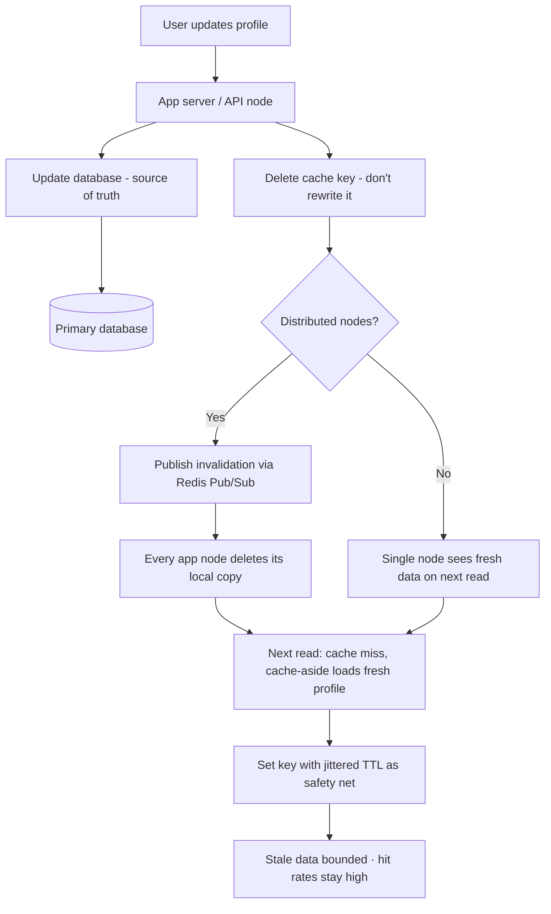

| Difficulty | Channel | Tags |
|---|---|---|
| beginner | backend | redis, memcached, cache-invalidation |

Sometime in 2005, every new user signing up for a little college social network made its database queries a little heavier and its page loads a little slower. The engineering team's fix for that creeping slowdown would grow into the largest distributed cache ever built — holding trillions of items and serving billions of reads a second [1]. That story contains every lesson you need about cache invalidation — and it reveals something surprising about the Redis versus Memcached debate that most tutorials get wrong.

---

> ### Real-World Case — Meta (Facebook)
>
> Starting in August 2005, Facebook ran increasingly heavy database queries on every page load, and page load times were climbing. Zac, as the cache for the world's largest social network, grew from one memcached install on an Apache server into the largest memcached deployment ever built — handling single-user profile reads and updates that traverse hundreds of memcached servers per request.
>
> | | |
> |---|---|
> | **Challenge** | When a user updates their profile, the freshly written database row must invalidate cached copies across thousands of memcached servers in many clusters. Facebook had to prevent 'stale sets' (an outdated value being written back to cache after a newer one exists), survive thundering herds on hot keys, and keep invalidation reliable with no pub/sub in memcached — all while serving a billion users. |
> | **Solution** | Facebook explicitly rejected write-through in favor of delete-based invalidation (deletes are idempotent and demand-filled). Apps embed the memcache keys to delete in each SQL write; a daemon named 'mcsqueal' tails the MySQL commit log on every database and broadcasts deletes to all frontend clusters, batched through mcrouter to cut packets 18x. To close the stale-set race, they added 64-bit 'leases' issued on cache miss and invalidated on delete, so a stale set can't overwrite newer data; leases also throttled to one per 10s per key to collapse thundering herds. |
> | **Outcome** | The system serves billions of requests per second and holds trillions of items with 81-99.8% hit rates across pools (USR pool hit rates reach 99.8% after weeks of uptime). Leases cut peak database query rate on herd-susceptible keys from 17K/s to 1.3K/s (~13x), and 99.8% of reads are served from cache; in-region delete invalidations hit four 9s of reliability within 1 second and five 9s within an hour; the 'gutter' fallback pool reduces client-visible failures by 99%. |
> | **Lesson** | Deletion beats setting for invalidation — it's idempotent and avoids the write-back race entirely. Also, real-world cache invalidation cannot rely on a single node's pub/sub: Facebook proved that tailing the database's own commit log is the authoritative way to fan invalidation out to every cluster, and that correctness comes not from strong cache semantics but from client-side arbitration (leases) and measured, retried deletes. |

---

## Hook — The profile that refuses to update

Ever changed your avatar, refreshed the page, and watched the *old* one stare back at you? Not hours later. Not after a hard reload. Just... the old one. Sound familiar? Every developer has hit this moment: the code is right, the database is right, and yet the user is looking at a ghost of the past.

That ghost has a name: stale data. And it is the price you pay for speed. Caching is the turbocharger of backend engineering — nothing else turns milliseconds of database latency into microseconds of memory access. But a turbocharger without a governing system simply explodes. In a user profile service, a stale cache doesn't just annoy people; it breaks trust in the most personal place an app has — how a person sees themselves.

Here is the tension beneath it all: the cache exists to make you fast, and the cache is also what makes you wrong. The entire craft of cache invalidation is balancing those two forces without melting down your database in the process.

## Problem — Fast is easy. Correct is the hard part.

Put a cache in front of anything and the numbers look amazing on day one. Reads stop hitting the database entirely, p95 latency craters, and your team celebrates. Then a user updates their profile and every request on every server keeps serving the stale copy. That is the real problem: caches don't have a built-in sense of time or change.

So you reach for the simplest tool you know — a TTL. You set your profile keys to expire in fifteen minutes. Problem solved, right? Not quite. You have simply traded one failure mode for three:

- **The stale window** — users see outdated profiles for up to the full TTL.
- **The thundering herd** — when a popular key expires, suddenly every request races to the database at once, recreating the exact load spike you built the cache to avoid [1].
- **The cache stampede on writes** — invalidation spreads across nodes unevenly, so some servers clear a key instantly while others cling to stale data.

Moreover, this gets dramatically worse in a distributed world. A single app server with a cache is manageable. But your profile service runs on fifty servers, all holding copies of the same key. How do you tell fifty machines to drop one key and stay consistent? That is where the design choices begin — and where the industry's biggest company already paid the tuition.

Many developers discover the hard way that cache invalidation is the second-most-difficult things in computer science — right after naming things. But it doesn't have to be a mystery. Let's look at how one company turned this exact problem into an engineering legend.

## Real-World Case — Meta (Facebook), the world's largest cache

Starting in August 2005, Facebook's pages were getting heavier with every feature launch, and every page load ran increasingly expensive database queries. Response times were climbing, and the classic fix — cache the hot data — became an obsession that would span a decade of engineering [1].

The system, named after the memcached open-source project [4], grew from a single installation on an Apache server into the largest memcached deployment ever built — so large that a single profile read and update can traverse hundreds of memcached servers. To put the scale in perspective:

- The cache pools serve **billions of requests per second** and hold **trillions of items**.
- Hit rates run between **81% and 99.8%** across pools, with the USR pool reaching **99.8%** after weeks of uptime.
- **99.8% of all reads** are served from cache — only a tiny sliver ever touches the database.

But the most instructive numbers are about failure handling. When a cache miss created a stampede on "herd-susceptible" keys, Facebook introduced **leases** — a token mechanism letting one client wait and rebuild the value while others back off. That single change cut the peak database query rate on those keys from **17,000 per second to 1,300 per second — roughly a 13x reduction** [1].

And the invalidation story? In-region delete invalidations reach **four 9s of reliability within 1 second** and **five 9s within an hour**. When a server did fail, a fallback pool called the **gutter** reduced client-visible failures by **99%** [1].

Meta didn't invent cache invalidation — they operationalized it at a scale where a single mistimed key eviction would have taken down a social network. The lesson is that consistency, at scale, is a systems problem, not a single-server feature.

## Deep Dive — Redis vs Memcached and the strategies around them

Building on the Meta story, the practical question every profile service faces surfaces: which cache do you actually deploy? The classic interview answer — "Redis is better because it does more" — is a trap. The real trade-off is about what kind of failure you can tolerate.

**First, the invalidation strategies themselves.** The two canonical patterns are:

- **Cache-aside (lazy loading):** reads check the cache first, and on a miss, load from the database and write back. Writes go to the database, and the cache entry is deleted. It is simple, but the first read after a write pays a full database round trip.
- **Write-through:** every write updates the database *and* the cache atomically. Reads are always fast, but write latency goes up and you must decide whether to update the cached value or delete it [6].

For profile data, most teams land on a hybrid: **cache-aside for reads, delete-on-update for writes, plus a TTL as a safety net**. The delete (rather than the update) is the plot twist here. Updating the cached value on write *sounds* cleaner, but it invites mutation races — two requests can overwrite each other's cached half-updates. Deleting the key forces the next read to fetch one consistent, fresh version. Simple beats clever in caching.

**Then there is the expiration question — and this is where the debate gets interesting.** TTLs are both your shield and your weakness. Long TTLs maximize hit rates but prolong staleness; short TTLs keep data fresh but invite stampedes, exactly the herd problem Meta attacked with leases [1]. Meta's own data shows they run deliberately long TTLs (hours to days, in some cases) and lean on aggressive invalidation rather than short expirations — a counterintuitive insight: **invalidation, not expiration, is the primary consistency mechanism at scale** [7].

**Now the head-to-head. Here is the real trade-off table:**

| Consideration | Redis | Memcached |
| --- | --- | --- |
| Distributed invalidation | Keyspace notifications / Pub/Sub broadcast changes to all nodes [2] | No pub/sub — requires manual app-level coordination |
| Persistence | RDB snapshots and AOF append-only file [3] | None — pure ephemeral memory |
| Data structures | Strings, hashes, lists, sets, sorted sets | Simple key-value strings only |
| Concurrency model | Single-threaded event loop | Multi-threaded, scales per-CPU |
| Memory overhead | Higher per item | Lower per item |
| Use case fit | Complex invalidation, durability, queues | Pure high-throughput caching [4] |

So which one wins? It depends on your consistency appetite. If a stale profile for ten seconds is acceptable and you want maximum raw reads per second on commodity hardware, Memcached's simplicity shines. If you want atomic invalidation messages, durable recovery from a restart, and richer querying, Redis earns its overhead [3].

Here is the dirty secret though: **99% of the time, your bottleneck is the invalidation design, not the cache server.** Painful experience shows the classic mistakes repeat themselves:

- ⚠️ **Watch Out — negative caching:** caching a "user not found" result. Profiles get deleted and mysteriously resurrected from cache forever. Never cache misses without a short TTL.
- ⚠️ **Watch Out — TTL storms:** every key set to expire at the same minute creates periodic database spikes. Jitter your TTLs [8].
- ⚠️ **Watch Out — updating instead of deleting:** as discussed, cached updates allow interleaved race conditions that delete would have prevented.

🔥 **Hot Take:** many developers believe Redis's pub/sub exists to broadcast user-facing events. In practice its superpower is precisely this — automatic distributed cache invalidation that turns a fifty-node consistency nightmare into a one-line publish [2].

## Workflow — The invalidation pipeline, step by step

This leads to the workflow that ties everything together. The clean architecture looks like the flow in the diagram **Figure 1 — Cache Invalidation Flow**, and it has six steps:

1. **Read path (cache-aside):** the app server checks the cache first; on a miss it reads the database and sets the key with a TTL between 5 and 30 minutes for profile data.
2. **Write path (write-through semantics):** the database is updated first — it stays the source of truth.
3. **Delete, don't write:** the cache key is deleted so the next read fetches a single fresh copy.
4. **Broadcast invalidation:** if your app runs multiple nodes, publish the invalidation event so every replica drops the key — Redis keyspace notifications handle this out of the box [2].
5. **Staggered TTL as a safety net:** even if a node misses the message, the TTL caps how long staleness can survive.
6. **Measure everything:** track cache hit ratio, command latency, and eviction count. When hit rate dips below ~90%, stale reads cease to be the rare case and become the common one — that is when you know your invalidation is leaking [6].

Every step exists to close one leak in the consistency story. Delete handles the common case, pub/sub handles the distributed case, TTL handles the catastrophic-outage case, and metrics tell you which case you are actually in. No single mechanism is sufficient — the reliability of the whole chain depends on all of them running together, exactly as Meta's five-9s inbound invalidation reliability demonstrates [1].

## Code Example — Write-through invalidation in 40 lines

Time to make it concrete. Building on the workflow above, here is a production-shaped profile service that combines cache-aside reads, delete-on-update writes, TTL safety, and pub/sub broadcast, using the Redis Python client.

## Lessons Learned — Battle scars, takeaways, and what to do Monday

After this journey through the world's largest cache, the takeaways collapse into a handful of principles that apply whether your profile service serves a hundred users or a hundred million:

- 🎯 **Key Point — Delete beats update.** Deleting a cache key on write is simpler and safer than trying to write the fresh value into it. Let the next read build the value in one consistent gulp.
- 🎯 **Key Point — Invalidation is the primary mechanism, TTL is the backup.** Meta proves this at planetary scale: reliable, sub-second invalidation lets you run *long* TTLs with high hit rates instead of shrinking TTLs into stampedes [1][8].
- 🎯 **Key Point — Redis vs Memcached is a consistency question, not a feature-count question.** Choose Memcached for pure, low-overhead throughput at toy scale [4]; choose Redis when you need durable recovery, richer structures, or pub/sub to coordinate many nodes [2][3].
- ⚠️ **Watch Out — the herd.** When a hot key expires, every server races to the database at once. Add jittered TTLs, single-flight requests, or a lease mechanism so only one client rebuilds the value — exactly Meta's 13x query-rate reduction [1].
- ⚠️ **Watch Out — negative caching.** Don't cache misses without a short TTL, or deleted profiles rise from the grave.
- ⚠️ **Watch Out — parking-lot metrics.** A 99% hit rate that crashes to 60% after every deploy is your invalidation silently leaking. Instrument hit ratio, evictions, and replication lag from day one [6].

💡 **Insight — if this feels like a lot, you are not alone.** Cache invalidation has broken more senior engineers than most interview guides admit. The good news is that the pattern here — cache-aside reads, delete-on-write, pub/sub, TTL insurance, constant measurement — is boring, boring in the best possible way. Boring is what runs at billions of requests per second.

---

## Cache Invalidation Flow

<strong>Original Interview Question</strong>

**Q:** You're building a user profile service that caches frequently accessed profiles. How would you implement cache invalidation when a user updates their profile, and what trade-offs would you consider between Redis and Memcached?

**A:** Implement write-through caching with TTL-based expiration. On profile update, invalidate the cache by deleting the key and writing new data to both the database and cache. Redis offers pub/sub for automatic distributed invalidation, while Memcached requires manual coordination across nodes.

## Conclusion

The moment your profile data stops being instantly fresh is the moment a cache stops being a performance win and starts being a liability. Facebook built the largest cache in history not because they found a magic server, but because they built consistent, observable, boring invalidation pipelines — delete-on-write, pub/sub coordination, TTL insurance, and constant hit-rate monitoring [1]. On Monday, do three things: delete instead of update on writes, jitter your TTLs so your database doesn't take a beating at the same second each hour, and add a hit-rate metric to your dashboard before you add another cache server. The memorable insight to share with your team: **invalidation drives consistency, expiration merely limits its damage.** Get the first right, and Redis versus Memcached becomes a footnote.

---

## References

1. [Meta (Facebook) incident report](https://www.usenix.org/conference/nsdi13/technical-sessions/presentation/nishtala) — paper
2. [Redis keyspace notifications documentation](https://redis.io/docs/latest/develop/use/keyspace-notifications/) — documentation
3. [Redis persistence (RDB and AOF) documentation](https://redis.io/docs/latest/operate/oss_and_stack/management/persistence/) — documentation
4. [What is Memcached? — Memcached GitHub wiki](https://github.com/memcached/memcached/wiki/What-is-memcached%3F) — documentation
5. [MDN — HTTP caching](https://developer.mozilla.org/en-US/docs/Web/HTTP/Caching) — documentation
6. [AWS ElastiCache — Caching strategies and cache-aside](https://docs.aws.amazon.com/AmazonElastiCache/latest/mem-ug/Strategies.html) — documentation
7. [RFC 5861 — HTTP Cache-Control extensions for stale content](https://datatracker.ietf.org/doc/html/rfc5861) — documentation
8. [DigitalOcean — Understanding database caching for performance](https://www.digitalocean.com/community/tutorials/understanding-database-caching) — blog

---

**Author:** Satishkumar Dhule — [GitHub](https://github.com/satishkumar-dhule) · [LinkedIn](https://linkedin.com/in/satishkumar-dhule) · [Website](https://satishkumar-dhule.github.io)
